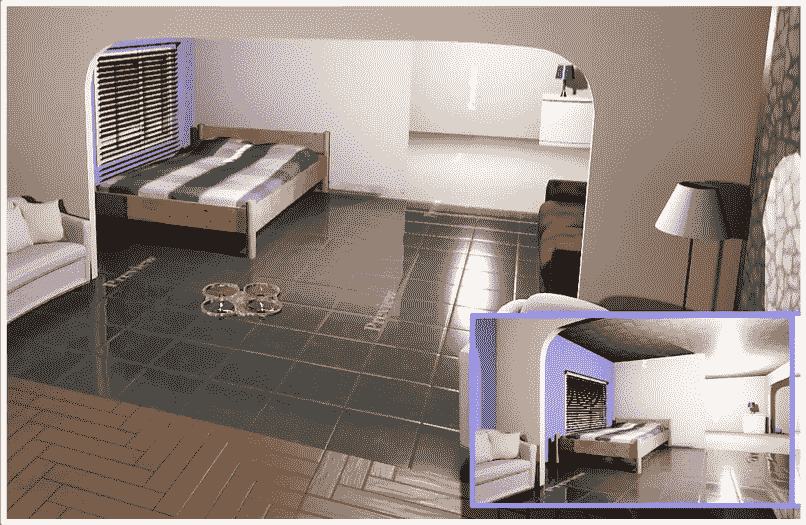
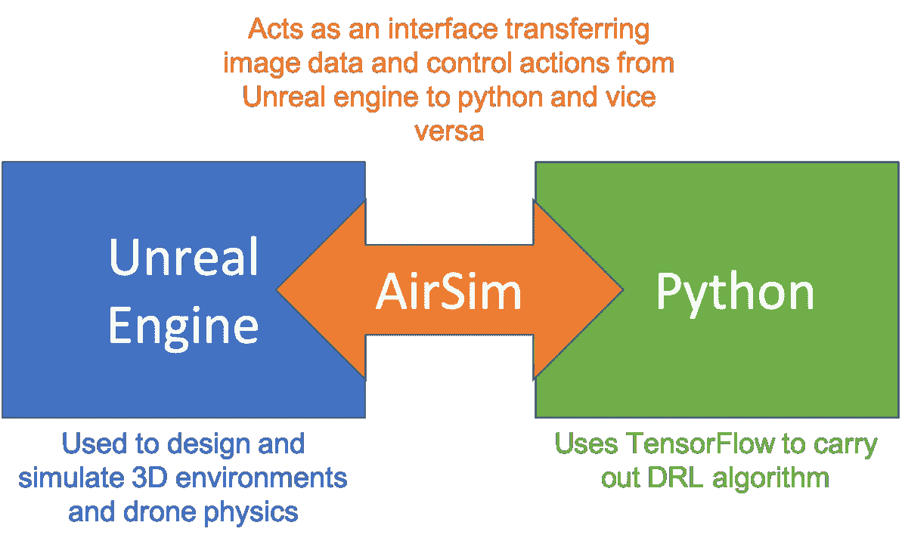
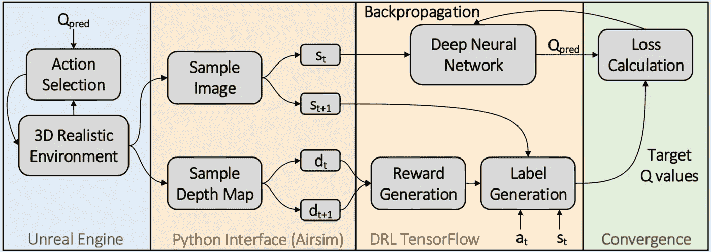
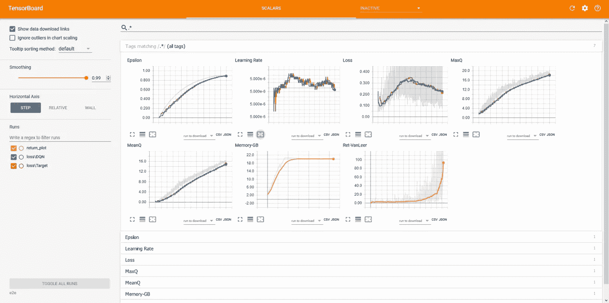
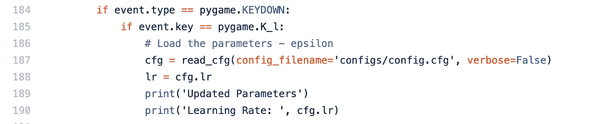
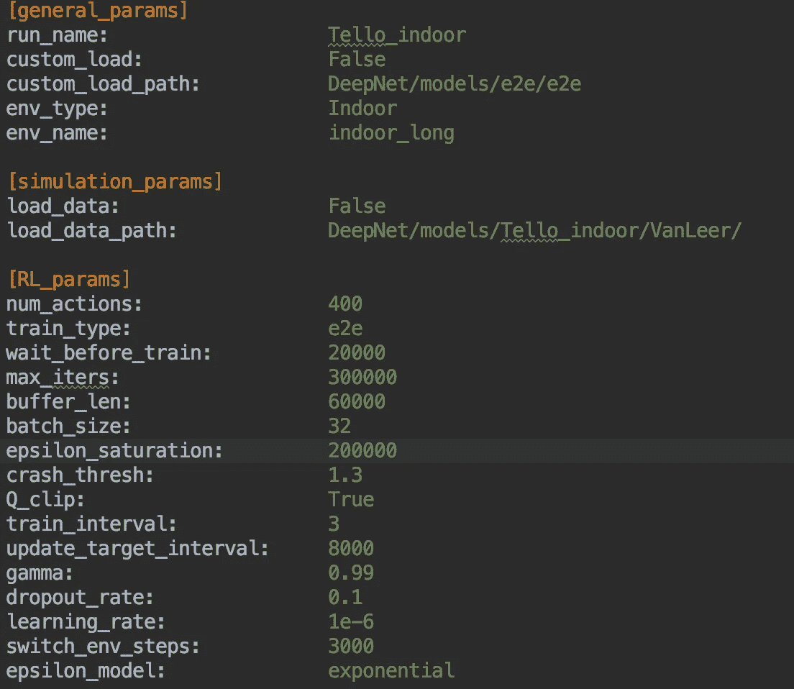
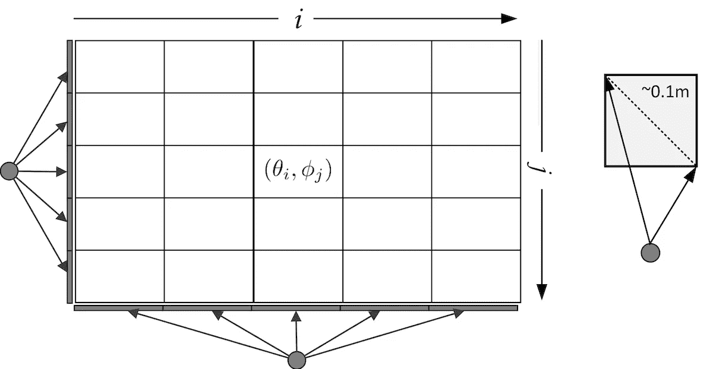

# 3D 现实环境中无人机的深度强化学习

> 原文：<https://towardsdatascience.com/deep-reinforcement-learning-for-drones-in-3d-realistic-environments-36821b6ee077?source=collection_archive---------6----------------------->

一个完整的代码，让您开始使用虚幻游戏引擎和 Python 在逼真的环境中实现深度强化学习。

> **注 1:** 文中提到的 Github 资源库 DRLwithTL 已经过时。请使用以下更详细的存储库，而不是 https://github.com/aqeelanwar/PEDRA 的
> 
> **注 2:** 关于无人机强化学习更详细的文章可以在[这里](/pedra-programmable-engine-for-drone-reinforcement-learning-applications-5b04423a42dd)找到

# 概述:

上周，我公开了一个 GitHub 知识库，其中包含一个独立的详细 python 代码，使用虚幻游戏引擎在 3D 模拟环境中的无人机上实现深度强化学习。我决定在本文中介绍一个详细的文档。3D 环境在 Epic Unreal 游戏引擎上制作，Python 用于与环境交互，并使用 TensorFlow 进行深度强化学习。



Drone navigating in a 3D indoor environment.[4]

在本文结束时，您的机器上将拥有一个工作平台，能够在逼真的无人机环境中实现深度强化学习。你将能够

*   设计您的定制环境
*   将它与您的 Python 代码连接起来
*   使用/修改 DRL 的现有 Python 代码

对于本文，基本目标将是无人机自主导航。没有开始或结束位置，而是无人机必须尽可能长时间地导航，而不会撞到障碍物。代码可以修改为任何用户定义的目标。

完整的模拟包括三个主要部分

*   **3D 模拟平台** —创建并运行模拟环境
*   **接口平台** —模拟无人机物理以及虚幻和 Python 之间的接口
*   **DRL python 代码平台** —包含基于 TensorFlow 的 DRL 代码

这三个平台有多种选择。但是对于本文，我们将选择以下内容

*   3D 仿真平台— **虚幻引擎【1】**
*   接口平台— **AirSim [2]**
*   DRL python 代码平台— **DRLwithTL GitHub 库[3]**



本文的其余部分将分为三个步骤

*   步骤 1 —安装平台
*   步骤 2-运行 python 代码
*   步骤 3 —控制/修改代码参数

# 步骤 1 —安装三个平台:

建议[为这个项目创建一个新的虚拟环境](/setting-up-python-platform-for-machine-learning-projects-cfd85682c54b)并安装依赖项。可以采取以下步骤来下载这些平台的入门指南。

1.  **克隆存储库:**包含 DRL 代码的存储库可以使用

```
git clone https://github.com/aqeelanwar/DRLwithTL.git
```

2.**下载 Alexnet 的 Imagenet 权重:**DNN 在初始化时使用 AlexNet 的 Imagenet 学习权重，而不是随机权重。这给了 DNN 一个更好的训练起点，并有助于趋同。

以下链接可用于下载 imagenet.npy 文件。

[下载 imagenet.npy](https://drive.google.com/open?id=1Ei4mCzjfLY5ql6ILIUHaCtAR2XF6BtAM)

下载完成后，在 DRLwithTL 根文件夹中创建一个文件夹*‘models’*，将下载的文件放在那里。

```
models/imagenet.py
```

2.**安装需要的包:**提供的 requirements.txt 文件可以用来安装所有需要的包。使用以下命令

```
cd DRLwithTL
pip install -r requirements.txt
```

这将在激活的 python 环境中安装所需的包。

3.**安装 Epic 虚幻引擎:**您可以按照下面链接中的指南在您的平台上安装虚幻引擎

[安装虚幻引擎的说明](https://docs.unrealengine.com/en-US/GettingStarted/Installation/index.html)

4.**安装 AirSim:** AirSim 是微软为代理(无人机和汽车)开发的虚幻引擎开源插件，具有物理和视觉上的逼真模拟。为了在 Python 和模拟环境之间建立接口，需要安装 AirSim。可以从下面的链接下载

[安装 AirSim 的说明](https://github.com/microsoft/airsim)

一旦一切安装妥当，我们就可以进入运行代码的下一步了。

# 步骤 2 —运行 DRLwithTL-Sim 代码:

一旦下载并运行了所需的包和软件，就可以采取以下步骤来运行代码

## 创建/下载模拟环境

您可以使用虚幻引擎手动[创建您的环境](https://docs.unrealengine.com/en-US/Resources/index.html)，也可以从下面的链接下载一个示例环境并运行它。

[下载环境](https://drive.google.com/open?id=1u5teth6l4JW2IXAkZAg1CbDGR6zE-v6Z)

以下环境可通过上面的链接下载

*   室内长环境
*   室内扭转环境
*   室内通风环境
*   室内技术环境
*   室内金字塔环境
*   室内冰箱环境

上面的链接将帮助您下载 64 位 windows 环境的打包版本。运行可执行文件(。exe)来启动环境。如果您在运行环境时遇到问题，请确保 Documents/AirSim 中的 ***settings.json*** 文件已经被[正确配置](https://github.com/microsoft/AirSim/blob/master/docs/settings.md)。您可以尝试使用 F、M 和反斜杠键来更改环境中的相机视图。此外，键 1、2、3 和 0 可用于查看 FPV、分割图、深度图和切换子窗口视图。

## 编辑配置文件(可选)

DRL 模拟的 RL 参数可以使用提供的配置文件进行设置，并在最后一节进行说明。

```
cd DRLwithTL\configs
notepad config.cfg                **(# for Windows)**
```

## 运行 Python 代码

可以使用以下命令启动 DRL 代码

```
cd DRLwithTL
python main.py
```

运行 ***main.py*** 执行以下步骤

1.  尝试加载配置文件
2.  尝试连接虚幻引擎(*室内 _ 长*环境必须运行，python 才能与环境连接，否则将出现连接拒绝警告——除非建立连接，否则代码不会继续运行)
3.  尝试创建 DNN 的两个实例(使用双 DQN)并用选定的权重初始化它们。
4.  尝试为用户界面初始化 Pygame 屏幕
5.  启动 DRL 算法

此时，可以看到无人机在环境中四处移动，收集数据点。下面的框图显示了所使用的 DRL 算法。



Block diagram of DRL Training and associated segments

## 使用 tensorboard 查看学习参数

在模拟过程中，可以在 tensorboard 上查看 RL 参数，如ε、学习率、平均 Q 值、损耗和返回。张量板日志文件的路径取决于配置文件中设置的*环境类型*、*环境名称、*和*训练类型*，由下式给出

```
models/trained/<env_type>/<env_name>/Imagenet/   **# Generic path**
models/trained/Indoor/indoor_long/Imagenet/      **# Example path**
```

一旦确定了日志文件的存储位置，就可以在终端上使用以下命令来激活 tensorboard。

```
cd models/trained/Indoor/indoor_long/Imagenet/
tensorboard --logdir <train_type>                **# Generic**
tensorboard --logdir e2e                         **# Example**
```

终端将显示可以在任何浏览器上打开的本地 URL，并且 tensorboard 显示器将在运行时显示 DRL 参数。



## 使用 PyGame 屏幕的运行时控件

众所周知，DRL 渴望数据。对于复杂的任务，如仅使用前置摄像头在逼真的环境中进行无人机自主导航，在 DRL 收敛之前，模拟可能需要数小时的训练(通常在 GTX1080 GPU 上需要 8 到 12 小时)。在模拟过程中，如果您觉得需要更改一些 DRL 参数，可以使用模拟过程中出现的 PyGame 屏幕来完成。这可以通过以下步骤完成

1.  更改配置文件以反映修改(例如降低学习率)并保存。
2.  选择 Pygame 屏幕，点击 ***【退格】*** 。这将暂停模拟。
3.  按下 **' *L'*** 键。这将加载更新的参数，并将其打印在终端上。
4.  点击 ***【退格】*** 键恢复模拟。

现在模拟只更新了学习率。其他变量也可以通过编辑模块 check_user_input 的 aux_function.py 文件进行更新。



Editing check_user_input module to update other parameters too

第 187 行的 cfg 变量有所有更新的参数，你只需要把它赋给相应的变量并返回值就可以激活它了。

# 步骤 3 —控制/修改 DRLwithTL-Sim 中的参数:

该代码使您能够控制

1.  更改 DRL 配置
2.  改变深度神经网络(DNN)
3.  修改无人机行动空间

## 1.更改 DRL 配置:

提供的配置文件可用于在开始模拟之前设置 DRL 参数。



Config file used for DRL and sample values

*   **num_actions:** 动作空间中动作的数量。该代码通过将摄像机帧划分为 sqrt(num _ actions)* sqrt(num _ actions)的网格来使用基于感知的动作空间[4]。
*   **train_type:** 决定在 DNN 训练的层数。支持的值为 e2e、最后 4 个、最后 3 个和最后 2 个。更多的值可以被删除
*   **wait_before_train:** 该参数用于设置训练应该开始的迭代。模拟在开始训练阶段之前收集了这么多的数据点。
*   **最大迭代次数:**确定用于 DRL 的最大迭代次数。当这些迭代完成后，模拟停止。
*   **buffer_len:** 用于设置体验回放缓冲区的大小。模拟继续收集数据点，并开始将它们存储在重放缓冲区中。从该重放缓冲器中采样数据点并用于训练。
*   **batch_size:** 决定一次训练迭代的批量大小。
*   **ε_ saturation:**ε贪心法用于从勘探阶段过渡到开采阶段。当迭代次数接近该值时，ε接近 0.9，即 90%的动作是通过 DNN(利用)预测的，只有 10%是随机的(探索)
*   **crash_threshold** :该值与深度图一起使用，确定无人机何时被视为虚拟坠毁。当到深度图上中心动态窗口中最近障碍物的平均深度低于该值时，奖励-1 被分配给数据元组。
*   **Q_clip:** 如果设置为真，Q 值在超出某个值时会被剪切。有助于 DRL 的融合。
*   **train_interval:** 该值决定训练的频率。例如，如果设置为 3，则每 3 次迭代后进行训练。
*   **update_target_interval:** 模拟使用双 DQN 方法来帮助收敛 DRL 损失。update_target_interval 确定模拟在两个 Q 网络之间转换的频率。
*   **dropout_rate:** 确定连接被丢弃的频率，以避免过度拟合。
*   **switch_env_steps:** 决定无人机改变其初始位置的频率。这些初始位置设置在相应环境名称下的 environments/initial _ positions . py 中。
*   **ε_ 模型:**线性或指数

## 2.更改 DNN 拓扑:

可在以下 python 文件中修改用于将 Q 值映射到其状态的 DNN。

```
network/network.py       #Location of DNN
```

不同的 DNN 拓扑可以在这个 python 文件中定义为一个类。代码带有三个不同版本的修改后的 AlexNet 网络。如果需要，可以根据用户需要定义更多的网络。一旦定义了一个新的网络，可以修改***net owork/agent . py***文件，在第 30 行使用所需的网络，如下所示

## 3.修改无人机行动空间:

当前版本的代码支持基于感知的动作空间。更改配置文件中的 num_actions 参数会更改前置摄像头被分成的箱数。



Perception-based action space — Default action space used in the DRLwithTL code [4]

如果需要使用完全不同类型的动作空间，用户可以通过修改以下模块来定义它

```
**Module:**    take_action
**Location: ** network/agent.py
```

如果修改，这个模块应该能够将动作号(比如 0，1，2，…，num_actions)映射到无人机的相应偏航和俯仰值。

# 总结:

本文旨在让您在真实的 3D 环境中开始使用深度强化学习平台的工作平台。文章还提到了可以根据用户需求修改的代码部分。工作中的完整代码可以在文献[4]中看到。

## 参考资料:

1.  [https://www.unrealengine.com](https://www.unrealengine.com)
2.  [https://github.com/microsoft/airsim](https://github.com/microsoft/airsim)
3.  [https://github.com/aqeelanwar/DRLwithTL.git](https://github.com/aqeelanwar/DRLwithTL.git)
4.  [http://arxiv.org/abs/1910.05547](http://arxiv.org/abs/1910.05547)

如果这篇文章对你有帮助，欢迎鼓掌、分享和回复。如果想了解更多关于机器学习和数据科学的知识，请关注我@[**Aqeel an war**](https://medium.com/u/a7cc4f201fb5?source=post_page-----36821b6ee077--------------------------------)**或者在**[***LinkedIn***](https://www.linkedin.com/in/aqeelanwarmalik/)***上与我联系。***