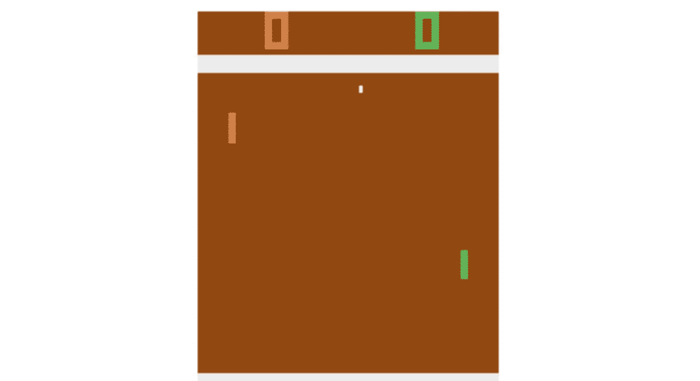
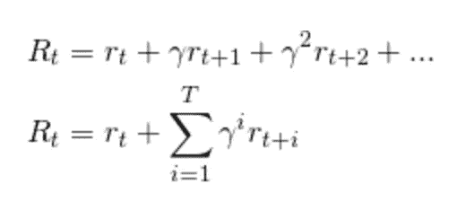

# 深度强化学习

> 原文：<https://towardsdatascience.com/deep-reinforcement-learning-pong-from-pixels-keras-version-bf8a0860689f?source=collection_archive---------10----------------------->

## 像素乒乓:Keras 版本



这是 Andrej Karpathy 关于强化学习的博客文章的后续。我希望这篇文章能简化 Karpathy 的文章，去掉数学运算(感谢 Keras)。这篇文章应该是独立的，即使你还没有看过其他的博客。

这里的博客是为了配合更深入的视频教程(YouTube 视频描述中的代码):

## 什么是强化学习

与机器学习/深度学习中的其他问题不同，强化学习的问题在于我们没有一个合适的“y”变量。然而，输入“X”也没有什么不同。例如，在这个特定的例子中，我们将使用 openAI 中的 pong 环境。输入将是游戏当前状态的图像。输出是要播放的移动。

## 奖励函数

RL 中的任务给定游戏/环境的当前状态(X ),以采取将最大化**未来* *预期折扣奖励的行动。一个替代方法是，我们将游戏玩到最后，用一个折扣变量 gamma(数字在 0 到 1 之间)将当前时间点的所有奖励相加，如下所示:



R variable

为什么不简单的当前奖励 r_t？这是由于延迟奖励。当一个动作被采取时，它的影响不仅影响当前状态，还影响随后的状态，但是以衰减的速率。因此，当前行动负责当前奖励**和**未来奖励，但是越来越少的责任移动到未来。

## 模型

该模型用于生成动作。因此，在我们的例子中，我们使用图像作为输入，通过 sigmoid 输出来决定是向上还是向下。

关于上面提到的 R 变量，请注意我们的模型所产生的行动是如何导致奖励的。这很大程度上是一个盲人领盲人的例子。但是随着更多的迭代完成，我们收敛到更好的输出。

我们将使用的模型不同于 AK 博客中使用的模型，因为我们使用了卷积神经网络(CNN ),如下所述。使用 CNN 的优势在于我们需要处理的参数数量明显减少。具有 100 个神经元的 1 个隐藏层的密集网络将产生大约 640000 个参数(因为我们有 6400 = 80×80 像素)。然而在下面显示的模型中我们只有 3100 个参数。

另请注意，最后一层有一个 sigmoid 输出。这是为了让模型预测桨向上或向下移动的概率。

```
model = Sequential()
model.add(Conv2D(4, kernel_size=(3,3), padding='same', activation='relu', input_shape = (80,80,1)))
model.add(MaxPool2D(pool_size=(2, 2)))
model.add(Conv2D(8, kernel_size=(3,3), padding='same', activation='relu'))
model.add(MaxPool2D(pool_size=(2, 2)))
model.add(Conv2D(16, kernel_size=(3,3), padding='same', activation='relu'))
model.add(MaxPool2D(pool_size=(2, 2)))
model.add(Flatten())
model.add(Dense(2, activation='softmax'))
```

## 预处理

我们裁剪图像的顶部和底部，并在水平和垂直方向上每隔一个像素进行二次采样。我们将球拍和球的值设置为 1，而背景设置为 0。然而，输入到 DL 算法中的是两个连续帧的差。这导致输入图像的大小为 80x80。

## 损失函数

拼图的最后一块是损失函数。我们有自己的输入，也就是上面提到的 X 变量，但是，目标 y 变量是在那个时间步采取的动作。即向上将是 1，向下将是 0。

但是等等，y 变量不是模型规定的吗？是的，你完全正确。因此，我们不能简单地使用通常的交叉熵损失，因为概率 p(X)和 y 是由同一模型生成的。相反，我们所做的是用在那个时间点的预期未来回报来衡量。

因此，在每集结束时，我们运行以下代码进行训练:

```
model.fit(x, y, sample_weight=R, epochs=1)
```

然而，实际损失函数保持不变，

```
model.compile(optimizer='rmsprop',loss='sparse_categorical_crossentropy')
```

关键是，如果这一步棋走得好，我们使用上面的`sample_weight`功能来衡量他们。

## 摘要

总而言之，当你不关心实际的梯度计算时，政策梯度更容易理解。所有当前的深度学习框架都考虑到了你可能需要的任何衍生品。

策略梯度是更基本的强化学习问题之一。如果你想了解更多关于强化学习的知识，请订阅我的 YouTube 频道。[该播放列表](https://www.youtube.com/playlist?list=PLIx9QCwIhuRQnQVejhNrN62s46KDyFRnX)包含更高级 RL 算法的教程，如 Q-learning。

看这里是我关于机器学习和深度学习的[课程](https://www.udemy.com/course/machine-learning-and-data-science-2021/?referralCode=E79228C7436D74315787)(使用代码 DEEPSCHOOL-MARCH 到 85 折)。