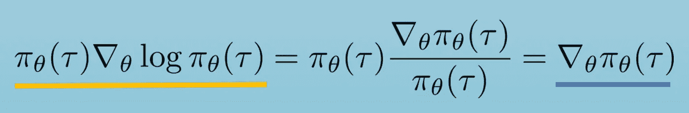
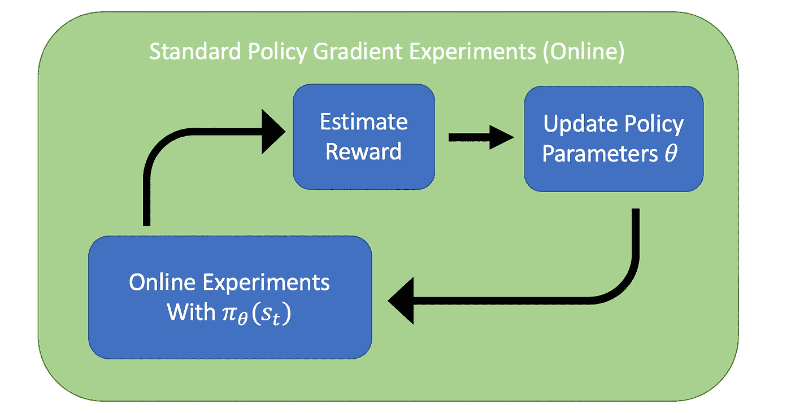

# 深度 RL 案例研究:混沌梯度

> 原文：<https://towardsdatascience.com/deep-rl-case-study-policy-based-vs-model-conditioned-gradients-in-rl-4546434c84b0?source=collection_archive---------22----------------------->

## 为什么一些 RL 算法有臭名昭著的不可靠的梯度，最近的研究对此做了什么，以及替代方案的有效性如何？

策略梯度是 RL 中的经典算法。普通政策梯度(VPG)归结为试图增加产生高回报的行动的可能性。估计更新规则需要一些假设，但是它在实践中已经被证明是可行的。本文将假设 RL 中的一个简短背景，所以如果像[马尔可夫决策过程](https://en.wikipedia.org/wiki/Markov_decision_process)、[重要性抽样](https://en.wikipedia.org/wiki/Importance_sampling)、梯度、似然性等词。我建议回到一些机器学习的基础知识。本文底部的一些资源可能会有所帮助。*本文回顾了标准策略梯度，介绍了修改后的策略更新规则，并解释了为什么这种变化可能意味着更有用的学习算法。*

最终，VPG 使用了一种仅基于行动概率和通过轨迹的回报的策略估计器，但 RL 的一篇新论文 PIPPS 建议通过学习动力学模型传播粒子来估计梯度，以显著减少方差，从而潜在地实现了 RL 策略生成的新的基于模型的方法的收敛。

Gif of policy gradient enabled cart pole, directly from [source](https://medium.freecodecamp.org/an-introduction-to-policy-gradients-with-cartpole-and-doom-495b5ef2207f) tutorial.

## RL 复习工具

这里有一些你会在这篇文章中看到的符号。

RL 问题的大背景是观察在部分观察的世界中采用 RL 策略的代理所采取的行动。这些反馈循环是代理采取的动作以及它如何更新其策略参数。

Big picture of an RL problem. Source: [Berkeley’s Deep RL Course](http://rail.eecs.berkeley.edu/deeprlcourse/static/slides/lec-4.pdf)

# 审查:普通政策梯度

在 VPG，梯度是在没有任何动力学模型知识假设的情况下估计的。首先，我们有一个 RL 问题的总体公式——优化参数以根据某个代理的进化最大化回报。

General formulation of any RL algorithm — maximize expected reward. [Source: Berkeley Deep RL Course](http://rail.eecs.berkeley.edu/deeprlcourse/static/slides/lec-5.pdf)

这里需要注意的一点是，状态转换和动作概率是如何结合起来生成轨迹概率的。*读者的一个练习是考虑在给定初始状态和转移概率的情况下，如何表达当前时间 T 的动作概率。*

Trajectory evolution probability subject to a probabilistic policy. [Source: Berkeley Deep RL Course](http://rail.eecs.berkeley.edu/deeprlcourse/static/slides/lec-5.pdf)

在政策梯度中，我们希望估计价值函数的梯度，并使我们的政策逐步达到最优。下面是关于轨迹演变的回报预期的扩展(稍后将更多地讨论状态转换的省略)。蓝色部分是一个叫做重要性抽样的关系——ML 中改变积分和期望形式的一个常用技巧。

The formulation of a standard policy gradient. Arrive at this from expanding the expectation with respect to the transition probabilities. [Source: Berkeley Deep RL Course](http://rail.eecs.berkeley.edu/deeprlcourse/static/slides/lec-5.pdf)

Aside showing the relation for importance sampling. This comes from the derivative of the logarithm. [Source: Berkeley Deep RL Course](http://rail.eecs.berkeley.edu/deeprlcourse/static/slides/lec-5.pdf)

具体来说，让我们看看构成一个策略的对数概率的项。如果我们将对数概率展开，得到一个带初始项的和(这个等式是我前面提到的练习的结果)，我们会看到有两个相关项 1)政策概率和 2)转移概率。在这种情况下，转移概率不依赖于模型参数，并趋向于 0。如果我们可以用这种进化来通知我们的梯度呢？

[Source: Berkeley Deep RL Course](http://rail.eecs.berkeley.edu/deeprlcourse/static/slides/lec-5.pdf)

[Source: Berkeley Deep RL Course](http://rail.eecs.berkeley.edu/deeprlcourse/static/slides/lec-5.pdf)

有了这些公式和几个步骤，下面的政策梯度更新就出现了。这里，我们包括给定状态和动作的估计优势，这是一个状态的当前值和给定当前动作的当前状态的估计回报之间的差。这是您将在许多教程中找到的标准策略渐变。

[Source: Spinning Up in RL](https://spinningup.openai.com/en/latest/algorithms/vpg.html)

[Source: Spinning Up in RL](https://spinningup.openai.com/en/latest/algorithms/vpg.html)

策略梯度使用在确定性状态转换空间中采样的随机策略作为其轨迹。这不需要了解系统的演变，但假设一个确定性的模型。这就是经典的*无模型*强化学习。

这里有一段摘自 [scholarpedia](http://www.scholarpedia.org/article/Policy_gradient_methods) 的摘录，我发现它对于总结普通政策梯度中的估计假设特别有用:

Direct capture from source: [http://www.scholarpedia.org/article/Policy_gradient_methods](http://www.scholarpedia.org/article/Policy_gradient_methods)

*注意，当在 RL 中使用成本函数时，我们通常镜像传播奖励梯度的设置，但是现在相对于一些函数 c(s)的负值最小化。这个负号经常被忽略，但是你可以思考一下为什么负成本函数最大化反映了回报。没有这种对偶，成本函数公式将会不同。*

## 混沌诅咒和其他渐变谜题

这里有一些需要解决的政策梯度方法分歧的原因。

1.  VPG 历史上有很高的方差。这种差异是由用于生成梯度的所有样本都是从政策轨迹生成的这一事实引起的。如同在任何实验中一样，这些轨迹通常包括产生噪声梯度的不同数据集。大多数先进的政策梯度技术都是建立在核心理念之上的，即在减少差异的同时，将梯度推向具有更高回报的行动，如基线或改变抽样方法。
2.  合成任何高度非线性的函数经常会导致数值发散。神经网络动力学模型已经显示出对于简单的实验很好地收敛，但是当在有噪声的数据上训练时，导数信息通常变得高度敏感。使用高斯过程动力学模型可以通过解析梯度缓解这一问题，但 GPs 缺乏神经网络的规模和效率。
3.  混沌的**诅咒**:在下面的论文中，PIPPS 在基于模型的 RL 中模拟渐变时引入了这个想法。想法是用于初始化的神经网络策略，当通过任何类型的学习的动力学模型传播梯度时，对初始条件的小变化有很强的敏感性。对于一致且稳定的算法，初始条件的微小变化会导致结果的微小变化，PIPPS 开始着手解决这一问题。

# PIPPS:灵活的基于模型的策略搜索，对混乱的诅咒具有鲁棒性

Illustration of methods for calculating gradients. PIPPS uses particle methods to estimate the true underlying distribution rather than attempting to analytically derive the underlying distribution. Source: [PIPPS](https://arxiv.org/abs/1902.01240).

PIPPs 是我研究领域的一篇最新论文，以基于文章的政策研究的 **P** 机器人学 **I** 会议命名，解决基于模型的 RL 的政策研究中的正则化梯度问题。本文使用基于模型的 RL 在已知系统动力学的背景下计算政策梯度，在上文讨论的更典型的无模型变体之上构建基于模型的框架。在 PIPPS 的第 3.2 节中，作者**使用带有随机动力学模型**的确定性策略，通过动力学模型将基于粒子的梯度直接传播到策略中。回想一下 VPG 框架中对政策梯度的估计，但是由于确定性政策和随机模型，现在我们有不同的项趋向于 0。

Note, with a probabilistic state evolution, and deterministic policy, the action at time t is a result of the policy parameters, and the probability of an action given a state goes to 0 because the logarithm of 1 is 0 (deterministic policy).

策略参数梯度的这一新结果为我们提供了策略梯度更新规则的新的总表达式！此更新规则通过动力学模型对一组运行策略的粒子进行采样。这是一个基于**粒子的动力学模型调节的**渐变。

The gradient estimator based on particle based estimation with a deterministic policy and stochastic dynamics model. Source: PIPPS. This is the new policy gradient equation.

上面要注意的主要项目是状态转移的概率代替梯度估计中的动作概率。在 PIPPS 中，期望是跨越模拟粒子的，而在 VPG 中，期望是跨越实验轨迹的。PIPPS 设计用于学习动力学模型，而不仅仅是通过实验学习。**该梯度方程使用已知的模型导数和似然比来减少方差。**他们的基础实验结果显示了梯度方差的数量级减少。核心是*动力学模型导数比神经网络策略导数更可靠。*

如果您更详细地阅读论文中的[，您将会看到更深入的方程，解释该估计器(似然比梯度)与重新参数化梯度*和*批处理模式并行计算的组合。这种直接梯度计算的激动人心的部分在结果中，第 4.1 节，图 3，其中这种 LR 梯度与它们的*总传播算法*具有相同的方差数量级。](https://arxiv.org/abs/1902.01240)

# 与我的研究有关

PIPPS 为我们提供了一种工具，可以在传播梯度和进行“无模型 RL like”策略更新时使用学习到的动力学模型(我可能会添加一篇总结基于模型的实验 RL 最新进展的文章的链接)。由于估计量的高方差，仅基于随机策略的标准策略梯度估计在实验中有规律地发散。加上组成神经网络动力学模型的高方差，普通策略梯度需要一些增强来收敛。 **PIPPS 允许我们使用基于粒子的方法调整基于 VPG 轨迹的梯度的方差，利用潜在的动力学模型。**

Standard policy gradient learning process. All online experiments aimed to maximize a reward signal of on policy rollouts.

关于这种正则化技术在我们的情况下是否有效的最终问题是 PIPPS 梯度和轨迹估计是否可以处理实验学习的动力学模型的高认知不确定性(认知方差是由实验中的噪声引起的，该噪声可以被模型捕获，但不能，与重复过程中的随机性或方差相比，它是任意的不确定性)。我们的模拟使用了一个动力学模型，该模型被训练成用方差上的正则化项来匹配状态的变化，作为基本事实。策略梯度通常被认为是一种基于策略的算法，因此我们通过将我们学到的动态作为基础事实来欺骗这一标准，这在策略学习中存在明显的风险，以利用模型中的不准确性。

**假设从动态模型引入的方差明显小于改变梯度传播方式所获得的减少量。**我们正在使用实验数据来学习动态模型，并制定不同类型的政策。希望 PIPPS 能够通过依赖一个训练有素的动态模型而不是实验中的部署来实现更加高效的离线策略生成。我们将基于 PIPPS 的政策梯度作为基线的其他方法有:MBRL+MPC、模仿 MPC 和 ME-SAC(模型集合软演员评论家)。PIPPS 是以下问题答案的一部分:给定一组来自机器人的初始实验数据，我们对系统动力学没有基本的了解，那么生成控制策略的最佳方式是什么？

Our experimental sketch. We will use the regularization of PIPPS to enable offline model-based policy generation on purely experimental data. We can now use experimental data from any run to generate a dynamics, create a simulation environment, and train a policy.

梯度架构中的这种微妙变化可以利用我们已经或可以学习的知识，这就是为什么我对基于模型的 RL 的实际使用感到兴奋。通过使用我们拥有的背景，我们应该能够做出更可靠的梯度估计和政策改进。我希望在未来几年看到越来越多基于模型的强化学习的应用，但我确实看到无模型学习的总体目标在试图理解人类大脑如何运作方面更令人信服和有趣。

## 其他链接

我正在进行使用 PIPPS 在已学习的动力学模型上训练政策的实验，你可以在这里跟随并试验代码:[https://github . com/NATO Lambert/dynamics-learn/blob/master/PIPPS _ psuedocode . py](https://github.com/natolambert/dynamics-learn/blob/master/pipps_psuedocode.py)。我可能会创建一个关于实验的后续帖子，但在发表之前不会发布完整的细节。向 nol@berkeley.edu 提出问题。

## 参考

1.  来自[的方程式 OpenAI 在 RL](https://spinningup.openai.com/en/latest/algorithms/vpg.html) 上关于政策梯度的旋转。他们的文档并没有包含所有的算法，但是质量是一流的。
2.  [伯克利的深度 RL 课程。](http://rail.eecs.berkeley.edu/deeprlcourse/\)我在 2018 年秋季上了这门课——很棒的东西。我很幸运能与谢尔盖·莱文的研究小组中多名极其聪明的学生合作。
3.  [Scholarpedia 关于政策梯度的注释。](http://www.scholarpedia.org/article/Policy_gradient_methods)本资源的新内容，但它们为理解本主题提供了很好的范围&细节。
4.  皮普斯论文:[帕尔马斯，p .，拉斯姆森，C.E .，彼得斯，J. &多亚，K..(2018).PIPPS:灵活的基于模型的策略搜索，对混乱的诅咒具有鲁棒性。第 35 届机器学习国际会议论文集，PMLR 80:4065–4074。](http://proceedings.mlr.press/v80/parmas18a.html)