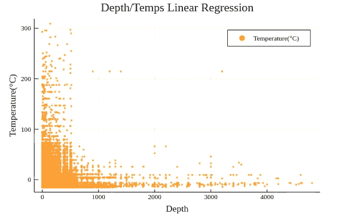

# 深海对比

> 原文：<https://towardsdatascience.com/deep-sea-correlation-27245959ccfa?source=collection_archive---------30----------------------->


Depth’s correlation with temperature

> “世纪发现”

当我在互联网的黑暗深处搜寻数据时，我偶然发现了*“世纪发现”*数据集不仅非常有趣，而且相当大。这对于测试我的机器学习模块[车床](http://lathe.emmettboudreau.com/)的可用性来说非常棒，我即将为它发布一个新的稳定版本(0.0.3)，这个版本确实增加了可用性，所以如果你对 Julia 感兴趣，但不想被困在 GitHub read-me 文档中，现在是时候做出改变了。此外，凭借高达 864，863 次的观察和 74 个功能，我正式指出，我肯定想要一个巨大的深度学习桌面。还有，[笔记本在这里。](https://github.com/emmettgb/Emmetts-DS-NoteBooks/blob/master/Julia/Water%20Salinity%20versus%20water%20temperature.ipynb)

应该指出的是，这个问题与车床或 Julia 中的机器学习毫无关系，而是:我的个人电脑内存不足。此外，没有一个性能问题来自执行测试或获得预测，这仅需要 1-6 秒，而是绘制了 200，000 个点。增加性能问题的是我过时的 R9–290 4GB，带有 AMDGPU Mesa 驱动程序(通过重新编译 Grub 实现。)对于像我一样好奇的硬件爱好者来说，我只有 8GB 的单通道 DDR3，股票时钟是 2666 MhZ，但我不认为它会以那个频率运行，这可能是影响最大的(Jupyter 不断返回说它的内存不足。)

# 阅读和清洁

首先，我们必须使用 CSV.jl 读入我们的数据帧

```
using CSV
df = CSV.read("bottle.csv")
```

为了更好地查看数据，我喜欢这样做:

```
show(df, allcols = true)
```

我拿出了几个看起来很有趣的连续特性，我想对它们进行测试，当然这是一种标准做法，但我也要注意，用 dataframes.jl 分析数据并不像我希望的那样好:

```
using DataFrames
df = DataFrame(:TempC => df.T_degC, :Salinity => df.R_SALINITY, :Depth => df.Depthm)
```

该数据帧包含大量缺失值，但是在删除之前将我们的要素删除是不可或缺的，这样我们就不会删除多余的内容。为了删除数据，我使用了:

```
df = dropmissing(df)
```

# 主意

我想我们应该从我们所拥有的开始，或者更确切地说，是我决定在这个特定的时间里保留的东西。我们有三个特征，深度，温度和盐度。利用这个我可以做一点基于物理学的科学推断，并提出以下假设:

## 假设 1

如果水的深度更低，那么温度应该更低，因为水应该更重，离太阳更远。

## 假设 2

如果水的深度较低，那么水的盐度应该较高，因为含盐量少的水应该比含盐量多的水浮力大。

## 假设 3

如果水的盐度更高，那么水的温度应该更低，因为更高的盐度将导致更高的深度，以及相同质量的更密集的分子。

构成盐的两种元素是钠和氯。)Na 有 11 个质子，Cl 有 17 个。每个分子加起来有 28 个质子。另一方面，H2O 是两个氢原子，都有一个质子，而氧原子有八个质子，加起来每个原子只有 10 个质子。快速浏览周期表可以发现，氢的原子质量是 1.0079，氧的原子质量是 15.9994。至于氯化钠，钠的原子量是 22.9897，氯的原子量更高，为 35.453，我们当然可以把这个代入朱莉娅:

```
function molecular_weight(atomm1,n1,atomm2,n2)
    res = (atomm1 * n1) + (atomm2 * n2)
    return(res)
end
```

然后我们可以输入我们的数字:


所以，当然，水中的氯化钠越少，水的浮力就越小。

但是现在化学已经足够了，因为我是数据科学家，不是化学家…

# 预处理

预测建模最重要的部分之一是预处理。幸运的是，车床已经为我们覆盖了这一部分。这就是我们在 Julia 使用车床时需要做的:

```
using Lathe.preprocess: StandardScalar, TrainTestSplit
```

现在，我们需要将数据放入测试集和训练集。车床使这变得非常简单，只需做:

```
train,test = TrainTestSplit(df)
```

很简单，对吧？现在，我们必须选择我们的目标和功能。我们将会看到我已经进行了统计实验的数据。我也将在这里应用标准标量。

对于我们的功能，我们将从预测深度对温度开始，看看我们有什么。

```
trainX = StandardScalar(train.TempC)
trainy = train.Depth
testX = StandardScalar(test.TempC)
testy = test.Depth
```

***简单！*** 现在让我们做一些机器学习。

# 获取基线

为了快速获得基线，我们将:

```
using Lathe.models: MeanBaseline
bs = MeanBaseline(trainy)
```

请注意，我们不必拟合 x。然后，我们可以用以下公式预测我们的 train-x:

```
baser = predict(bs,testX)
```

## 确认

为了验证我们的回归模型和基线，我们将使用平均绝对误差和 R。当然，R 并不是对平均基线预测的真正验证，所以我们将使用 MAE。

```
using Lathe.validate: mae,r2
mae(testy,baser)
```

我们的回报是:

```
211.39011214882413
```

我选择研究 TestX 和 TestY 的平均值，鉴于这里有如此多的数据，我可能会考虑回去调整更大的训练集和更小的测试集，因为测试是在大约 250，000 个观察值的基础上进行的，这是非常巨大的，只会使验证和模型探索无法进行。


嗯，结果是不幸的…至少，老实说，我需要双重通灵。我不会担心，因为我们可以很快重启内核…

我能够将数据分割成大约 95 %,仍然有大约 40，000 个观察值的训练集，在我(和我的计算机)看来，这已经足够了。

# 线性回归

首先，像往常一样，我们拟合我们的数据:

```
linrmod = LinearRegression(trainX,trainy)
```

然后我们将构建的模型类型放入 predict()方法中。

```
preds.LinearRegression = predict(linrmod,testX)
```

# 那么模型做的怎么样呢？

***嗯……很复杂。***


我们的平均绝对误差低得离谱，远低于 1 的一半。然而，我认为考虑我们的模型和数据是很重要的。首先，我们需要数据的平均值，以便很好地了解一个大的误差会产生多大的影响。

```
using Lathe.stats: mean
mean(testy)
```

返回了:

```
10.864412863141867
```

虽然，在某种程度上，平均值为 11，平均绝对误差为 0.00550，这并不坏，但当我们得到回归的相关系数(r)时，问题就来了


那么:这告诉了我们什么？线性回归不是预测该数据的最佳模型。这当然是逻辑回归的工作，但我还没有为此编写模型，至少现在还没有，所以让我们尝试一些其他的回归模型，但首先，让我们看看这里发生了什么。


上面我们看到的是实际数据，它显然有一个负斜率，但是非常非线性。换句话说，假设方差在低深度和高深度基本不存在，线性模型可以给出我们可以预期的想法，但实际上不能精确建模。这是我们模型的样子:


为了给出一个更好的想法，我认为在 GNU 图像处理程序中用 alpha 覆盖这两个可视化效果会产生一些思考:


另外，如果你在 Julia 工作，并且想使用 Plots.jl 快速深入地了解 GR，你可能会发现[这篇小文章](/spruce-up-your-gr-visualizations-in-julia-88a964450a7)很有用。

该模型实际上在这里找到了相关性，然而，问题在于相关性并不是真正线性的。这当然是任何线性模型的弱点，即一条线在它的整个行程中以一定的斜率延伸。所以看这个，很明显我们需要一个不同的模型来预测这个。我们也看到了为什么我们有这么低的平均绝对误差，同时也有这么低的 R 值，模型预测是负面的。因此，由于我们还没有在车床 0.0.3 逻辑回归，我想我们会尝试一些其他模型，只是为了好玩，每当我编程逻辑回归，和一些更多的模型，我们将重新访问这些数据。

# 安装一个方形模型(上帝保佑我的电脑)

```
using Lathe.models: FourSquare
m = FourSquare(trainX,trainy)
```

与之前相同的过程，我们将获得一个预测，并验证它。但是在*的意思是*时间(明白吗？)如果你想了解更多关于 FourSquare 模型的信息，我有一篇关于它的文章[在这里](/introducing-the-four-square-model-for-more-accurate-linear-regression-24c3192b5022)，尽管现在它是基于 LinearLeastSquare(回归)，(将来可能会有 LLSQ 类型参数。)

仅仅是并排看这两个模型就可以很好地看出，FourSquare 模型在这里确实做得很好。我很好奇将来进入车床的新型号将如何处理这样的测试。



Left: FourSquare | Right: Original Data

# 我们学到了什么

我认为这对我来说是一次非常宝贵的学习经历，我希望对你也是如此。我总是说可视化可以真正帮助我们理解我们的数据到底发生了什么，但永远不要把它等同于任何事情。我认为这个建议的有效性在这里明确地显示出来。

我期待将这个数据集用于其他模型(并获得更好的准确性)。)我觉得这里的相关性还不足以证明一个模型的合理性。不管怎样，我的目的是测试我的软件包，这就是我所做的，并且从中获得了很多乐趣。