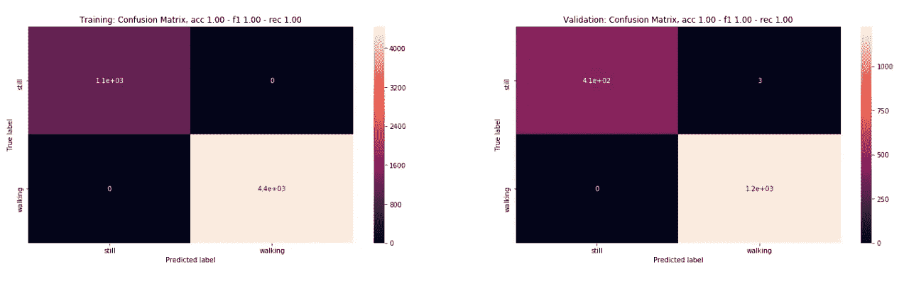
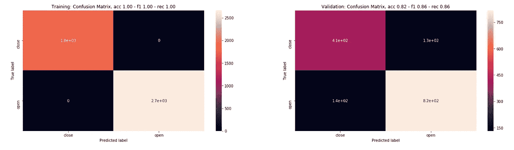

# 深拉链:一个打开的拉链探测器

> 原文：<https://towardsdatascience.com/deep-zip-83eb78f9963e?source=collection_archive---------14----------------------->

## 用你手机的磁强计来探测一个打开的传单。

Photo by [Alex Holyoake](https://unsplash.com/@stairhopper?utm_source=medium&utm_medium=referral) on [Unsplash](https://unsplash.com?utm_source=medium&utm_medium=referral)

拉链:1851 年获得专利，从 20 年代开始被广泛采用，直到今天仍然让我们失望。在这个飞行汽车的时代，科技能帮助我们吗？当你的传单被打开而不应该被打开的时候，除了一个被逗乐的同事之外，我们能得到一个提醒吗？

# 金属

我们信任的智能手机上布满了传感器，其中一个就是磁力计。如果你的拉链是由金属制成的，当拉链形成的金属环在打开和关闭状态之间改变形状时，其附近(如你的口袋中)的磁力计捕捉到的磁场应该受到干扰。

很可能，磁场的绝对值无法追溯到一个国家。然而，动态变化，如行走时捕捉到的变化(触发拉链两侧之间的距离变化)，应该会给你一个可识别的信号。

在这篇文章中，我用这个想法描述了我的实验。从捕捉和处理信号到拟合和优化 3 种不同的模型:梯度推进机、卷积神经网络(ZipNet)和 RNN。

# 捕捉信号

一个小的 iOS 应用程序将捕获磁力计和加速计数据，并将其导出到 csv 进行分析。这里可以找到[。](https://github.com/jeanfredericplante/lowflyer)

为了验证最初的假设，我在打开和关闭拉链时取样。我也做了同样的手势，但没有碰到拉链，以确保这不是我扭曲了磁场。乍一看，好像有信号(见下文)。

Left moving the hands only not the zipper. Right opening and closing the zipper and corresponding x axis signal

生成真实生活数据是一件令人兴奋的事情。我会掩饰这一点，但我为 4 个象限生成了 60 集，分别是行走时或不行走时，以及开放时或不开放时，总共 95K 长的时间序列。

以下是 4 象限信号的一个例子([笔记本](https://www.kaggle.com/blocks/zipper-data-exploration-and-processing))。行走(左)与不行走(右)应该很容易察觉。如果磁信号上的频率模式差异(分别为 x、y 和 z 轴的橙色、蓝色和绿色线条)是一致的，则行走时的打开与关闭(左)看起来似乎是合理的。特别是在不同的样品上，mz 在峰值后出现小的隆起，闭合时比打开时更明显。

mx (orange), my(blue), mz(green). More high frequency in mz when closed?

# 机器学习拯救世界

在检测磁信号形状变化的前提下，我们希望连续检测用户是静止还是运动——然后，只有在运动的情况下，才评估拉链打开时磁信号是否像一个信号。

model serialization

raw data from the app

## 为培训准备时间序列

除了设置验证集和规范化数据之外，还有一个额外的预处理步骤来为时间序列分类准备数据。我们使用一个滑动时间窗口来分块数据，该窗口涉及两个超参数:窗口大小和每个训练样本之间的步长增量。

直觉上，我们希望窗口大小足够大以捕捉几个周期，但又足够小以使检测器快速反应。根据这些数据，我测试了各种窗口，在 128 个样本之外，没有发现太大的差异。对于步骤，我选择了 10。

*数据扩充:*让我们添加“窗口扭曲”来挤压或扩展时间序列(人工创建样本，其中你会走得更快或更慢)。让我们也添加噪声到输入信号(高斯)，帮助模型区分噪声和信号。

Left: window slicing Xn and Xn+1 input training tensors. Right: window warping

*特征工程*:为了帮助我们的分类器，让我们用傅立叶变换处理输入数据，并将其添加到输入中。我们去除 0 频率，这是已经在原始数据中捕获的平均值。

Left, ‘mx’ normalized signal. Right, FFT of normalized ‘mx’. 0 freq is indeed removed on the right.

如果我们考虑加速度计和磁信号，这将为我们提供总共 12 个维度的输入特征。

*避免验证数据污染*:对于经过上述预处理的数据，我们不能按照 80%，20%的规则在训练和验证之间随意分割。如果其中一个采样片段被分割，由于窗口重叠，训练将会看到一些验证数据。因此，训练和验证首先按集分开，试图保持类的平衡，然后进行处理。

# 梯度推进

我们先测试一下现在流行的 LGBM 算法([笔记本](https://www.kaggle.com/blocks/zipper-training))。为此，我们需要用形状的训练张量(样本数、特征数)来整形。

## 行走还是静止

如前所述，我们可以观察行走和站立发作之间的差异，我们的分类器也是如此。使用默认分类器，我们获得了接近 100%的准确率(下图的标题显示了准确率、f1 分数和召回率)。

Confusion matrices, Left: training, Right validation (with accuracy, f1 and recall scores in the title)

## 行走时，打开还是关闭

这更具挑战性，在这种情况下，对时间序列进行仔细的预处理对于获得良好的结果至关重要。使用默认的 LGBM 设置，并根据剧集的采样，我们通常可以获得 80%的准确率(见下面的 dist)。

accuracy and recall distribution over different sampling of the episodes

下面是一个相当典型的性能样本，分类器预测 86%的拉链是打开的(回忆)，准确率为 82%。

Confusion matrices: Left training, Right validation (accuracy 82%, recall 86%)

这是在添加了加速度和磁场之后，磁场似乎提高了性能，可能允许模型区分行走和拉链的磁场变化。

数据增强似乎也有所帮助，下面是在标准化信号上添加 5%的时间变量和 2%的高斯噪声。

After data augmentation: 2% boost on scores

另一个 1-2%的增量改进来自超参数优化(请查看 [Will Koerhsen 关于该主题的精彩文章](https://www.kaggle.com/willkoehrsen/automated-model-tuning)，我在笔记本中大量复制了该文章)。

With hyper-parameters optimization, getting to 90% recall, 85% accuracy

# ZipNet

让我们尝试一个卷积神经网络作为分类器。我将使用 PyTorch 和非常棒的 fast.ai 库进行训练([笔记本](https://www.kaggle.com/blocks/zipper-training))。该自定义 convnet 仅对时序输入使用卷积，并将 fft 输入直接旁路至密集层。

对于与 LGBM(和增强版)相同的剧集样本，这里是比较性能。准确率低，召回率高。

Zipnet overfit: validation accuracy 73%, recall 95%

虽然我在创建 ZipNet 时很开心，但 LGBM 在大多数情况下表现得更好。让我们检查一个香草 LSTM。

# LSTM

This vanilla LSTM performed worst than LGBM

香草 LSTM 也一样，LGBM 在这个小数据集上胜出，尽管可以说我没有花太多时间优化它。

组装三个模型没有帮助。你可以在附带的[笔记本](https://www.kaggle.com/blocks/zipper-training/)中找到尝试。

# 最后

你的手机变得更私人了。在(笔记本)纸上，在我测试的环境中，用我的手机，用我的牛仔裤，用你手机的磁力计来检测一个打开的传单似乎工作得不错(80%的准确率)。我怀疑它会用我收集的少量数据来概括，所以这里是一个新的众包数据集和 Kaggle 竞争。

感谢阅读。