# 通过 Spotify 的 airy、Tensorflow 和 Pytorch 更深入地寻找相似的面孔

> 原文：<https://towardsdatascience.com/deeper-dive-into-finding-similar-faces-with-spotifys-annoy-tensorflow-and-pytorch-c434897bd627?source=collection_archive---------26----------------------->

在我之前的[帖子](/finding-familiar-faces-with-a-tensorflow-object-detector-pytorch-feature-extractor-and-spotifys-3e78858a8148)中，我开玩笑说我跳进了一个兔子洞，试图改善我的命运大阶面部相似度管道，我在那里使用了 Tensorflow 对象检测器、Pytorch 特征提取器和 Spotify 的近似最近邻居库([惹恼了](https://github.com/spotify/annoy))。我的总体想法是，我想对角色面部特征(寻找相似的角色)和背景信息(返回具有相似颜色/感觉的图像)进行编码。

我想我能做的就是把从预训练的 Resnet101 中提取的特征向量连接起来，用于基础图像和头像。然而，这种方法证明是相当令人失望的。

作为一个快速回顾，这里是一个示例图像和使用版本 1 模型的类似配对，该模型使用整个图像。

## 版本 1 模型输出

V1 full image sample output: Left image is the original and the next four are the four most similar

输出正常，但是 4 个相似图像中的 2 个具有不同的字符。

接下来回顾一下第二版基于头像的管道，我使用了一个定制的 Tensorflow 对象检测器来裁剪图像中的人物头像，并使用它们来建立烦人的索引和查找相似的图像。

## 版本 2 头像模型

V2 headshot model output

这条管道似乎相当成功，在所有图像中返回相同角色的图像，但我想看看我是否能得到更接近原始的“感觉”。这就是为什么我试图结合 Resnet 101 输出向量，并将其输入到 annoy 中，以制作一个新的模型版本 3。

# 版本 3:结合前两个

我的下一个测试是从头像和基本图像中提取特征向量，并将它们组合在一起，并将新的长度为 2000 的数组输入到 aroy 中。希望向量的第一部分可以帮助找到相似的人脸，第二部分可以对图像整体的相似信息进行编码。

## 第 3 版组合头像和基本图像

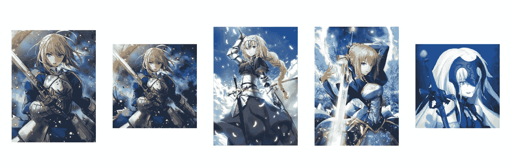

V3 combined feature array sample output

所以这个管道的第三个版本不是我所希望的…虽然这些字符有相似的面孔，但 4 个输出中的 2 个与基础图像中的字符不同。

这对我来说很有趣，因为我的第一个想法是，这是我根据图像构建的要素表示的质量问题。我甚至用更大的 Resnet 152 进行了测试，但结果基本相同。

下一步是检查我是否认为我在管道的其余部分做错了什么……就像我在从原始稀疏 3D 像素表示构建图像的 1D 表示时做错了什么。然而，这是非常可靠和真实的…

这一次，我意识到重新阅读恼人的 git 回购页面，并看到了这一说明。

> 如果您没有太多的维度(比如< 100)，效果会更好，但即使达到 1000 个维度，效果似乎也令人惊讶

对于该管道的基础图像和头部特写版本，特征向量是来自 Resnet 101 的标准 1000 个特征。并且将这两个向量连接在一起会将其推到长度为 2000 的向量，这大大超出了推荐的维数。

# 版本 4:哑吧？

虽然选择使用功能较弱的网络进行深度学习并不常见，但任何事情都有时间和地点。

考虑到这一点，我实际上将该管道版本 4 的特征提取器 Resnet 从 101 降级为 Resnet 34。这是因为在 Resnet 101 中最后 1000 个完全连接的层之前的层的大小是 2048，而 Resnet 34 只有 512。我的想法是，通过使用这个较小的层，我可以连接两个 512 层，以获得长度为 1024 而不是 2000 的最终向量。希望这能减少维度的数量，让 annoy 更好地发挥作用。

我认为这一改变提高了我的产出质量。

## 版本 4 Resnet 34

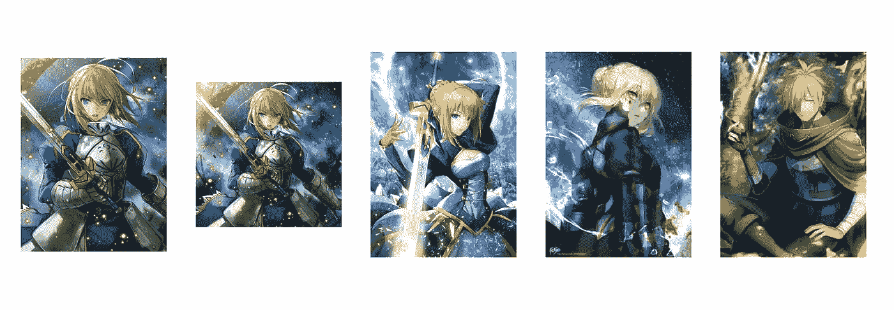

V4 Resnet34 headshot and base image model output

因此，运行我之前展示的相同示例图像，这个 Resnet 34 模型看起来比使用更大的 Resnet 101 的初始头像+基础图像模型更好。四个图像中的两个与角色匹配。第三个图像只是原始角色的邪恶版本，所以我认为它很重要。然而，最终的图像似乎很不相关…所以有进步要做。

这里是另一个显示 Resnet 34 模型输出与前三个版本的比较的例子。我对图像标题中的输出进行评论。

## 版本 1 基础映像

V1 Original full image model. no correct characters, similarly colored (sort of)

## 版本 2 头像

V2 model based on just the headshot. 3 similar characters but images arn’t that similar to the base image.

## 第 3 版结合了头像和基本图像

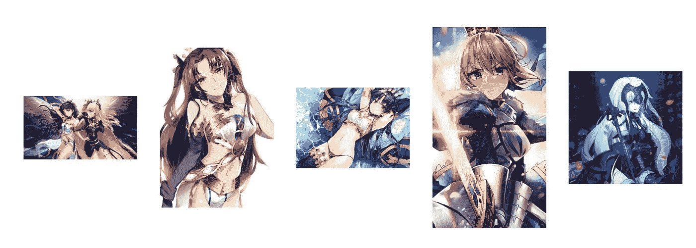

v3 headshot + base image Resnet 101 length 2000 vector. This version of the pipeline seems to just combine the first two versions

## 版本 4 Resnet 34

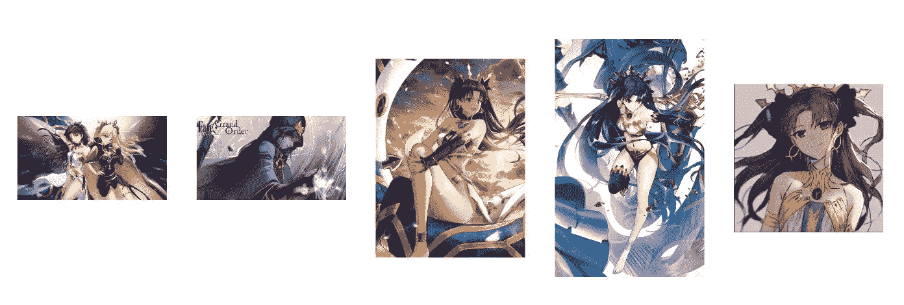

V4 Resnet 34 length 1024 vectors. It produces decent looking output, but in looking through the outputs I usually find odd images included like the second image in this list

因此，尽管 Resnet 34 相对于该管道的 Resnet 101 版本是一个改进，但它仍然表现不佳…我仍然相信我可以改进它，问题只是，如何改进？

# 版本 5:从 1024 维减少到 52 维

在思考了如何获得比 Resnet 34 的 512 输出更小的最终特征表示并绘制了一段时间的空白之后…我感觉自己像个白痴，因为在我起草的另一个帖子中，我一直在这个相同的数据集上训练基于 Pytorch 的多任务模型，以执行跨 5 个类别和 26 个不同目标变量的多标签分类。

这个网络是 Pytorch Resnet 50，其中我修改了最后几层来处理 5 个任务，我试图同时优化它们。我有一个草稿模式的帖子，但我太懒了，没有完成它…但在这种情况下，这个网络非常方便，因为它给了我一个微调网络，它已经成为区分命运大订单图像的技能。这里的好处是，不必使用 512 或 1000 个输出节点，这个特定的网络在这个问题空间中是熟练的，并且只有 26 个输出节点，这意味着我可以用 52 维而不是 1024 或 2000 维的向量来表示人脸和基础图像。这些图像的这种更密集的表示应该允许更好地区分这些图像。

因此，在交换后端特征提取器并测试输出后，使用我的多任务模型进行特征提取的 V5 模型表现得相当好。

请看下面我在这篇文章中强调的两个例子。其他型号在某些方面表现不错，但在其他方面有所欠缺。我认为这个第 5 版模型确实获得了我在上一篇文章中提到的两个世界的最佳效果。

## 第 5 版微调多任务模型

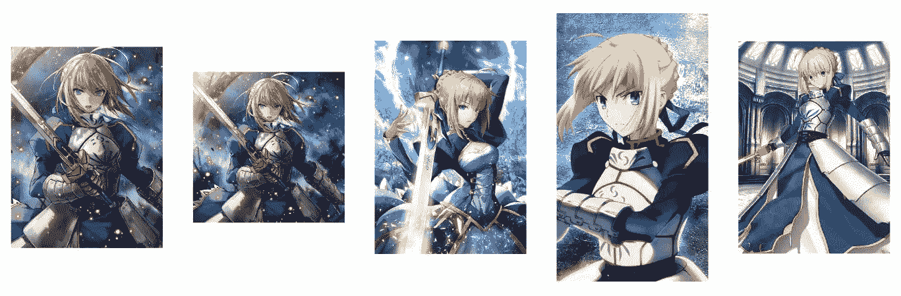

All of the output is of the correct character, and the images style/background seem more similar than just the v2 headshot model

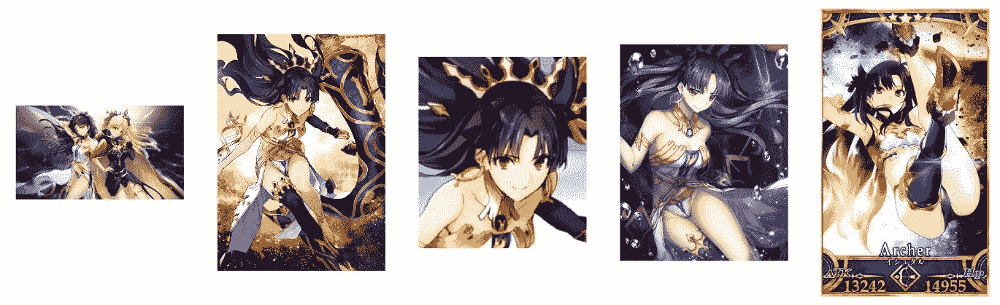

Once again all the output is of the correct character

总体而言，这一变化显著提高了管道输出的质量。我想这凸显了获得良好要素制图表达的重要性，并且使它们更密集通常会更好。

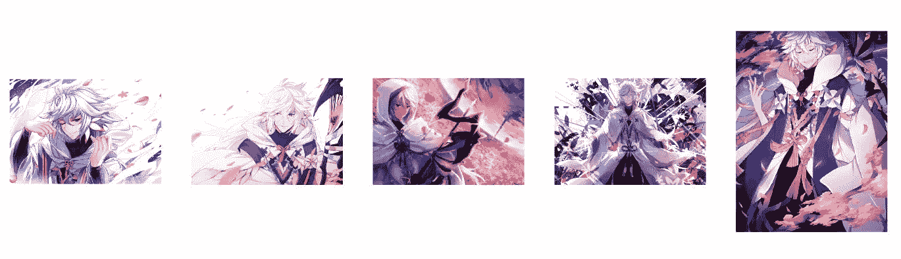

V5 sample output, same character in all images

# 结束语

这两篇文章很好地提醒了我们降低数据维度以获得更好结果的重要性。

每个图像都以 150，528 像素(224x224x3 宽、高、rgb 颜色)开始，然后使用标准的预训练 imagenet 网络可以压缩到只有 1000 个特征。我认为这本身就很酷。

然而，对于这个特定的问题，当我添加第二个图像时，我的最终特征向量是 2000 个特征。这又一次是太稀疏的信息，使我无法产生好的结果，所以我不得不去寻找一种方法来进一步减少我的数据的维度。

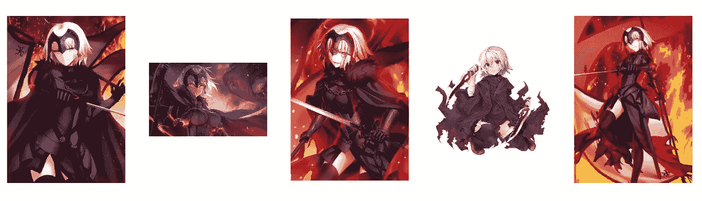

V5 output, 3 out of 4 images have the correct character and decent style matches. hair color in the odd image is a close match

为了进一步减少我的图像表示的维数，我使用了一个较小的 Resnet 34，并看到了一些改进，但该模型会输出奇怪的相似图像。由于这不起作用，我想我可以尝试制作更密集的数据表示，最终我能够使用我在类似问题空间中微调的网络，将原始的 150，528 像素原始表示降低到 26 像素。

这是一个类似于特征选择或主成分分析的过程，其目标是将一些原始水平的输入降低到一组有意义的特征。这对于我自己来说也是一个有用的注释，当我使用对象检测器或其他输入来添加更多额外的上下文时，我会尝试进一步关注特定网络学习的细节。

> 请随意查看 [github repo](https://github.com/sugi-chan/fgo_face_similarity) 中的代码示例。

> 因为我很兴奋，这似乎是工作得很好，这里有一堆更多的图像示例如下。

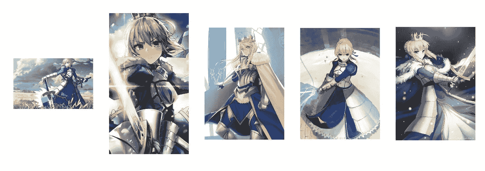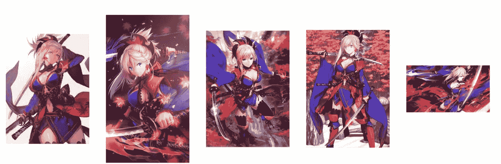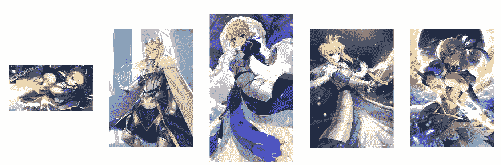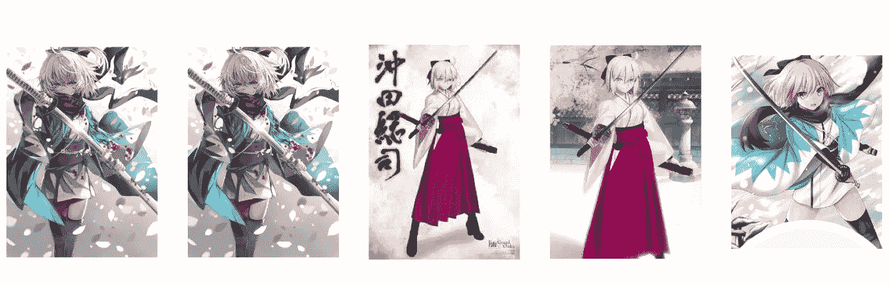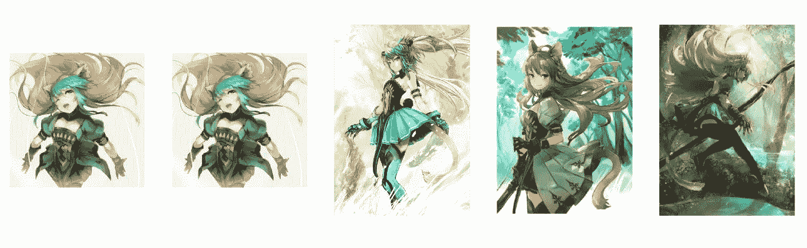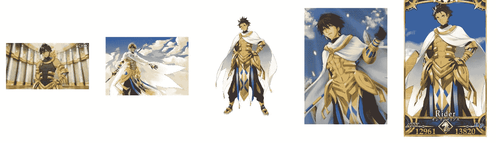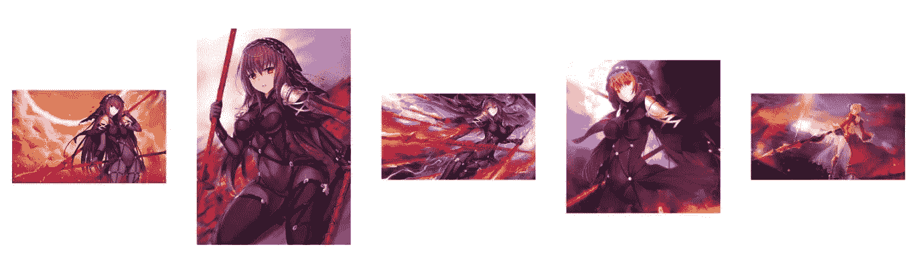