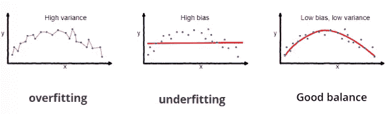

# 深入到 DCGANs

> 原文：<https://towardsdatascience.com/deeper-into-dcgans-2556dbd0baac?source=collection_archive---------7----------------------->

我上一篇关于 DCGANs 的文章主要集中在用卷积替换全连接层和用 Keras 实现上采样卷积的想法上。本文将进一步解释 Raford 等人[1]提到的架构指南，以及论文中提到的其他主题，如使用 GAN 的无监督特征学习、GAN 过拟合和潜在空间插值。

DCGAN architecture used by Radford et al. [1] to generate 64x64 RGB bedroom images from the LSUN dataset

与 LAPGAN 或渐进增长 GAN 等多尺度架构相比，或者与最新的 BigGAN 相比，BigGAN 使用了许多辅助技术，如自我关注、频谱归一化和鉴别器投影等 DCGAN 是一个更容易完全理解的系统。

DCGAN 无法实现与 BigGAN 模型相当的图像质量，也不具备与 StyleGAN 几乎相同的潜在空间控制能力。然而，仍然值得考虑将 DCGAN 作为 GAN 研究的基础支柱。DCGAN 模型的基本组件是用这些上采样卷积层替换生成器中的全连接层。在设计这个架构时，作者引用了三个灵感来源。

1.  全卷积网络→用空间下采样卷积代替汇集操作
2.  消除卷积后的完全连接层
3.  批量标准化→标准化激活以帮助梯度流动

考虑到这些进步，作者寻找了一种稳定的 DC-GAN 架构，并采用了以下架构准则:

*   用鉴别器中的步长卷积和生成器中的分数步长卷积替换任何池层
*   在生成器和鉴别器中使用批处理规范化
*   为更深层次的架构移除完全连接的隐藏层
*   在发生器中对除 Tanh 外的所有层使用 ReLU 激活输出*(这些图像在[-1，1]而不是[0，1]之间标准化，因此 Tanh 在 sigmoid 上)*
*   在所有层的鉴别器中使用 LeakyReLU 激活

这些建筑方针后来在现代甘文学中得到了扩展。例如，创成式模型中的批处理规范化有新出现的表亲，如虚拟批处理规范化、实例规范化和自适应实例规范化。Salimans 等人[2]提出了进一步的架构指导方针，并且[在这篇文章中做了很好的解释。](/gan-ways-to-improve-gan-performance-acf37f9f59b)

除了模型架构，本文还讨论了许多与 GAN 相关的有趣想法，如无监督学习、GAN 过拟合、GAN 特征可视化和潜在空间插值。

# 基于 GANs 的无监督学习

已经探索了 GANs 的许多应用，并且大部分研究试图实现更高质量的图像合成。许多实现高质量图像合成的方法实际上是监督学习技术，因为它们需要类别标签进行调节。

这里的主要思想是使用由鉴别器学习的特征作为分类模型的特征提取器。具体来说，拉德福德等人探索了结合 L2 + SVM 分类模型的无监督 GAN 特征提取器的使用。SVM 模型使用损失函数和高维超平面，该损失函数旨在基于每个类中最近点之间的差值来最大化类间距离。SVM 模型是一个很好的分类器，然而，它不是一个特征提取器，将 SVM 应用于图像会导致大量的局部极小值，本质上使问题变得难以处理。因此，DC-甘充当特征提取器，其以语义保留的方式减少图像的维度，使得 SVM 可以学习辨别模型。

# **甘过拟合**

重读这篇论文，我觉得甘过度拟合的想法特别有趣。监督学习环境中的过拟合非常直观:

Common picture showing overfitting on a supervised learning task

上图是回归任务中过度拟合的常见图示。过度参数化模型会自我调整，使其与训练数据完全匹配，并且没有错误。抛开偏差-方差权衡的统计数据，我们可以直观地将过度拟合想象为模型的泛化能力，即与测试数据相比，它在训练数据上的表现如何。

在 GANs 的背景下，这是一个非常有趣的想法。生成器的任务是产生鉴别器预测为“真实”的数据，这意味着它非常类似于训练数据集。看起来，如果生成器放弃任何向数据点添加随机变化的尝试，而只是精确模拟训练数据，那么它将是最成功的。拉德福德等人讨论了三种有趣的方法来证明他们的 DC-甘模型没有做到这一点。

1.  启发式近似:快速学习的模型概括得很好
2.  自动编码器哈希冲突(训练 a 3072–128–3072 自动编码器对生成数据和原始数据进行编码，并查看生成数据和原始数据之间的低维(128)表示有多少相似之处。
3.  潜在空间的平滑度(急剧过渡=过度拟合)

本文中没有使用的另一种探索 GANs 过度拟合的有趣技术是使用 L1 或 L2 距离(甚至可能是 VGG-19 特征距离)进行最近邻搜索，从训练数据集中抓取与给定生成图像最相似的图像。

# **甘特征可视化**

CNN 中的特征可视化如下实现。通过梯度下降来训练生成器网络，以产生导致给定特征的最大激活的图像。拉德福德等人在 LSUN bedroom 数据集上使用他们的鉴别器模型对此进行了测试，并展示了下图:

有趣的是，这些是鉴别器用来辨别图像真假的特征。

# **潜在空间插值**

潜在空间插值是 GAN 研究中最有趣的课题之一，因为它能够控制发生器。例如，GANs 最终可能被用于设计网站。您希望能够控制设计的特征或在设计之间进行插值。除了这个轶事，潜在空间插值在 Word2Vec 中有非常普遍的描述，其中向量“国王”-“男人”+“女人”=“女王”。拉德福德等人用他们生成的图像探索了这种插值方法。

本文中讨论的潜在空间插值的一个有趣的细节是，它们不使用单个点的 Z 向量，这是我最初没有注意到的。例如，他们不只是用一个微笑的女人的 Z 向量减去一个中性女人的 Z 向量，然后加上一个中性男人的 Z 向量来获得一个微笑的男人图像。相反，它们取一系列显示外部特征(如“微笑的女人”)的生成图像的平均 Z 向量。

感谢您阅读本文！我发现这篇论文对我研究 GANs 非常有用。每次我回到这篇论文，我都会对论文的细节有所欣赏。这篇文章是关于 GANs 的基础工作之一，我强烈推荐你去看看，特别是如果你对图像生成感兴趣的话。

# 参考

[1]亚历克·拉德福德，卢克·梅斯，苏密特·钦塔拉。深度卷积生成对抗网络的无监督表示学习。2015.

[2]蒂姆·萨利曼斯、伊恩·古德菲勒、沃伊切赫·扎伦巴、张维基、亚历克·拉德福德、陈曦。训练 GANs 的改良技术。2016.