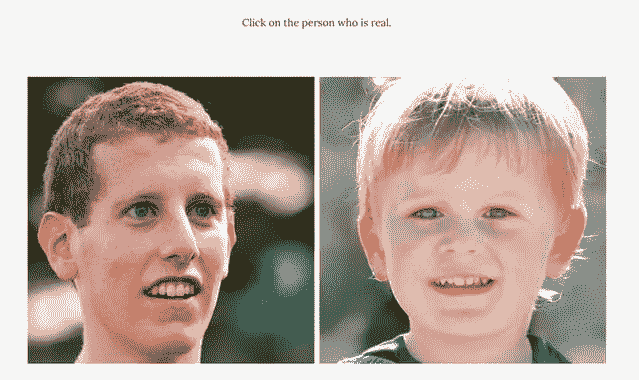
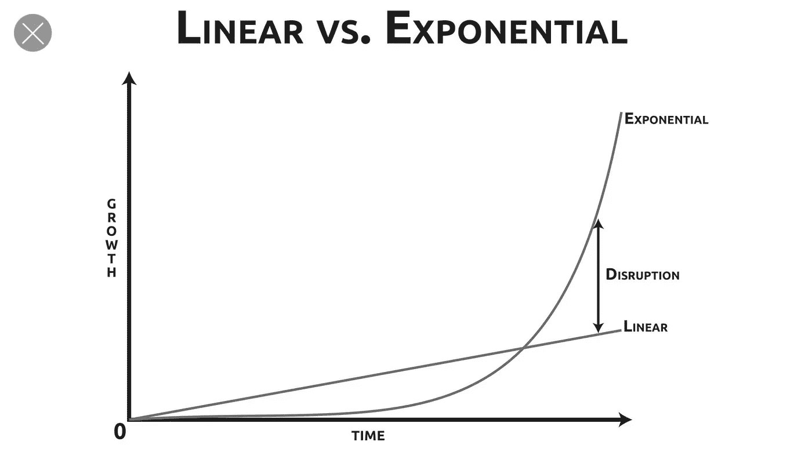
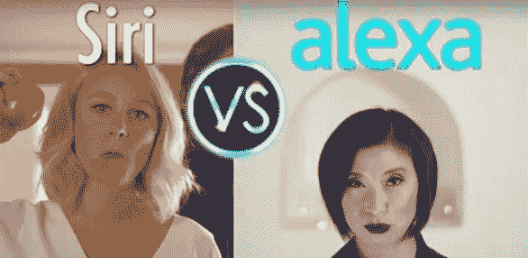
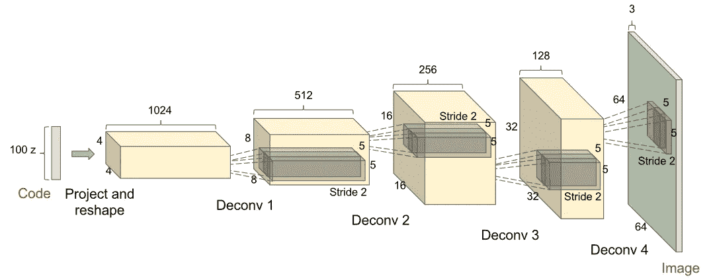
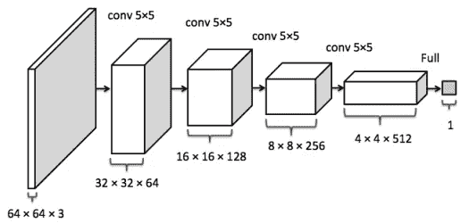
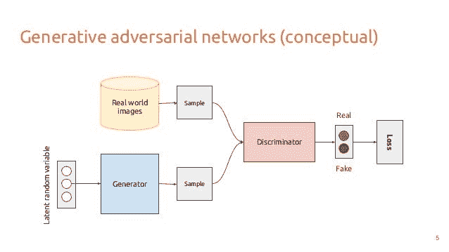
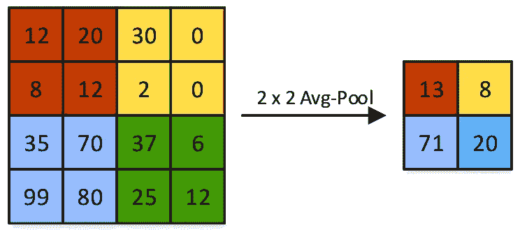
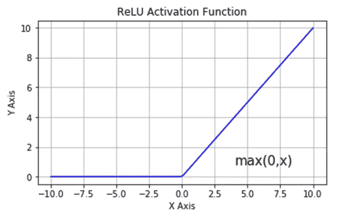
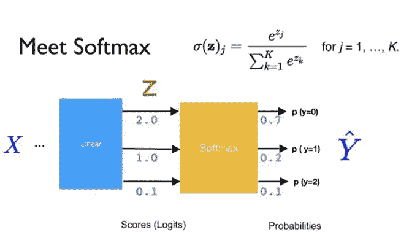
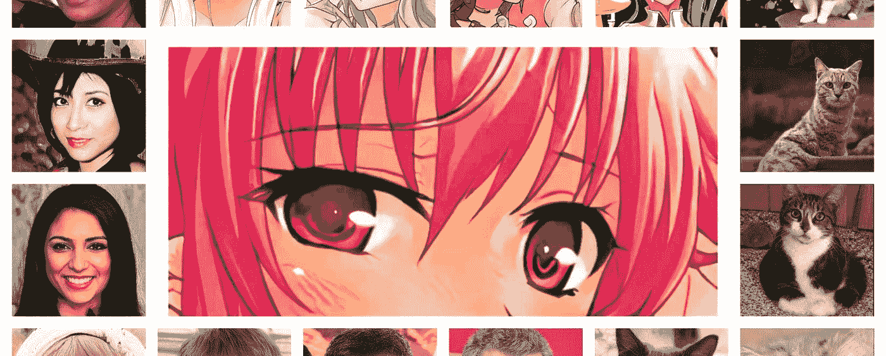

# Deepfakes:丑陋与美好

> 原文：<https://towardsdatascience.com/deepfakes-the-ugly-and-the-good-49115643d8dd?source=collection_archive---------8----------------------->

## 我们的工作是确保我们开发的技术被善用。

昨天，我的朋友让我玩这个游戏，它叫做[哪张脸是真实的](http://www.whichfaceisreal.com/index.php)。是的，我知道这听起来很扯，但是我每次都猜错了😐。

Which face is real? Well, I actually don’t know. ❓

这让我意识到一件事。我意识到人类只是一个非常愚蠢的物种，我不是指冒犯的方式，无论如何都是冒犯的(抱歉！)😅。

> “我们首先应该假设自己很笨。我们绝对可以让东西比我们自己更聪明。”—埃隆·马斯克*😶*

这不是人工智能是否会比人类聪明的问题，它已经在几个领域聪明了，但真正的问题是我们如何才能善用这种智能？

在过去的几年里，人工智能的进步已经走上了**指数曲线。**

That’s right, AI is disrupting almost every single field. 💪

仅仅 10 年前，像 Siri 和 Alexa 这样的东西甚至还不存在。

Siri vs Alexa Rap Battle, that’s how good AI has become! 😂

今天，我们能够利用人工智能从医学图像中检测癌症，谷歌助手可以通过模仿人的声音在电话上为你预约，开发与真实图像几乎完美相似的假图像从未像现在这样简单。

对隐私和错误信息的广泛关注避开了对 deepfakes 的关注，deep fakes 是使用自动编码器和**生成对抗网络**等算法制作的虚假媒体。

在错误的人手中，这种技术可以用于*诈骗*。例如，最近，**一个伪造的声音被用来诈骗一家英国公司的首席执行官 244，000 美元**🤯**。**

# Deepfakes 背后的技术:生成对抗模型

**生成对抗网络(GANs)** *的出现，打乱了假像的发展。*

以前，我们一直使用像 photoshop 这样的手动方法，但有了生成式对抗网络，这一过程正在自动化，结果通常明显更好。

生成对抗网络是一种相对较新的神经网络，由 Ian Goodfellow 在 2014 年首次介绍。GANs 的目标是制作尽可能真实的假图像。

GAN 包含两个组件:

1.  **生成器** —生成图像
2.  **鉴别器** —对生成的图像是假图像还是真图像进行分类

发生器接受一个*潜在*样本，一个随机噪声向量作为输入。通过利用**解卷积层**，其本质上是卷积层的逆，产生图像。

De-convolutional layers

卷积层负责从输入中提取特征，解卷积层执行相反的操作，将特征作为输入，并产生图像作为输出。

假设你在和朋友玩猜字谜游戏。表演这个短语的人在表演“去卷积”，而其他猜这个短语的人在表演“卷积”。“表演”类似于形象，“猜测”类似于形象的特征。

Charades — reminds me of the fun times

本质上，卷积层识别图像的特征，而去卷积层根据图像的特征构建图像。

Convolutional layers

另一方面，**鉴别器利用卷积层进行图像分类**，因为它的工作是预测生成器生成的图像是*真实(1)* 还是*虚假(0)* 。生成器的目标是生成尽可能真实的图像，并成功地欺骗鉴别器，使其认为生成的图像是真实的。

鉴别器的工作对生成器的成功至关重要。为了帮助生成器生成更真实的图像，鉴别器必须非常擅长区分真实图像和虚假图像。鉴别器越好，发生器就越好。

每次迭代后，生成器的可学习参数、权重和偏差都根据鉴别器给出的建议进行调整。

网络通过*反向传播*关于生成图像的鉴别器输出梯度来更新可学习参数。本质上，**鉴别器告诉生成器应该如何调整每个像素，以使图像更加真实。**

假设生成器创建了一个图像，鉴别器认为该图像有 0.29 (29%)的概率是真实图像。生成器的工作是更新其可学习的参数，以便在计算反向传播后，概率增加到例如 30%。

**然而，生成器依赖于鉴别器才能成功。**

一种更直观的思考方式是，想象发生器类似于学生，鉴别器类似于老师。

Does this spark any memories from grade school? 📝

还记得你写测试的时候，你对自己的结果感到非常紧张，因为你不知道自己做得有多好。

学生不知道他们犯了什么错误，直到老师给他们打分并给他们反馈。学生的工作是从老师给他们的反馈中学习，以提高他们的考试成绩。

老师教得越好，学生的学习成绩就越好。

从理论上讲，生成器在创建几乎完美无缺的真实图像方面做得越好，鉴别器在区分真实图像和虚假图像方面就做得越好。反之亦然，鉴别器对图像分类越好，生成器就越好。

# 利用 MobileNetV2 检测伪造图像

为了对真假图像进行分类，我使用了一个预先训练好的卷积神经网络，称为 **MobileNetV2** ，它是在 1400 万图像数据集 ImageNet 上训练的。

我利用 MobileNet 2.0 版本 MobileNetV2 而不是构建自己的卷积神经网络的主要原因是，MobileNetV2 旨在对移动设备友好，这意味着它需要**明显更少的计算能力**。

通过在 MobileNetV2 上添加几个额外的层，并根据[真实与虚假图像数据集](https://www.kaggle.com/ciplab/real-and-fake-face-detection) t 对其进行训练，我的模型能够以 75%的准确率区分虚假图像和真实图像。

## 我的神经网络结构看起来像这样:

**1。MobileNetV2**

**2。平均池层** —该层负责通过执行向下采样来降低数据的维度。例如，假设我们有一个 4x4 的输入矩阵，并且应用了一个 2x2 的平均池层。实际上，对于输入矩阵中的每个 2×2 块，取这些值的平均值**，从而降低维数。**

****

**Average pooling layer**

****3。密集层** —密集层只是一个常规的全连接层，其中每层中的每个节点都连接到下一层中的每个节点。激活函数 ReLU ( **R(z) = max (0，z)** )应用于该层，主要负责将范围限制为正值。**

****

**ReLU function**

****4。** **批量标准化层** —该层负责标准化通过该层的输入，以增强神经网络的稳定性。**

****5。丢弃层** —该层负责通过将某些随机节点的激活设置为 0 来防止过拟合。在辍学层，没有可学习的参数(即。这不是像其他层那样的训练层)。**

****6。输出层** —这实际上是一个应用了 softmax 激活功能的规则密集层。softmax 函数产生 0-1 之间的输出，表示最终预测输出类的概率分布。**

****

**Softmax function**

**这个模型的准确性可以通过拥有更大的数据集来容易地增强。我在 2041 张图像的数据集上训练了模型，但想象一下，如果我们在 100 万张图像上训练它，模型的准确性可以明显更高！**

# **氮化镓的应用**

**GANs 的应用不仅仅局限于负面目的，比如制造错误信息，它实际上可以以积极的方式应用于许多行业！**

**甘的一些非常有趣的用法:**

*   **生成艺术😍—是的，谁说机器不能做创造性的事情，我想它可以！**
*   **创作音乐🎵—人们实际上喜欢人工智能音乐！**
*   **创造虚假的人类形象**
*   **生成虚假的动漫图像——我不是一个超级动漫爱好者，但如果你是，那就太棒了！**

****

**Fake images generated by GANs**

****更多实际应用:🚀****

**通过利用 GANs，我们有可能加速机器学习本身的进步！**

**我们可以利用 GANs 来解决小数据集的问题，通过生成与数据集中的真实数据相似的新数据，这是机器学习的主要瓶颈之一。**

**拥有更大的数据集是增强基于分类的机器学习程序的性能的最可靠的方法之一。**

**🖼️潜在的应用之一可能是利用 GANs 生成合成的大脑 MRI 图像，以提高对神经胶质瘤(一种脑癌)的检测。**

**💊最令人兴奋的应用是利用 GANs 合成新的分子或候选药物，这些分子或候选药物针对引起疾病的特定蛋白质或生物标志物。**

**为了做到这一点，生成器负责生成新的分子，然后鉴别器预测分子的作用，看它是否可以抑制或兴奋某种蛋白质。我们可以用 gan 来推进和加速药物发现的进程。**

**🎥在电影和漫画行业，GANs 可用于文本到图像的合成。**

**GANs 的实际应用多了去了！这项技术有可能颠覆许多行业，从医疗保健到电影！我们有责任确保这项技术用于正确的目的，并补充人类。**

## **关键要点:**

*   **GANs 是一种用于创建合成数据的技术，包括两个组件:生成器和鉴别器。**
*   **通过利用卷积神经网络，我的机器学习程序能够以 75%的准确率检测出 GANs 生成的假图像**。****
*   **GANs 的应用有好有坏。虽然 GANs 可以制造假介质，但是它也可以用于合成新药研发的新分子。**

## **不要忘记:**

*   **在 LinkedIn 上与我联系**
*   **访问我的[网站](http://www.joeymach.com)来一窥我的全部作品集！**