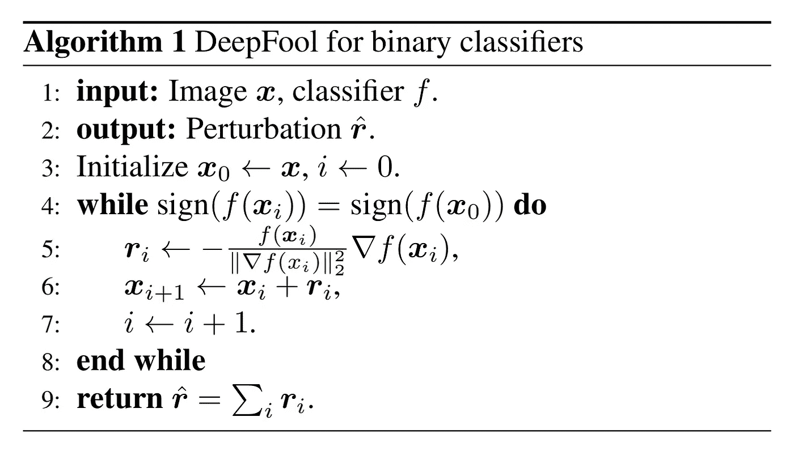
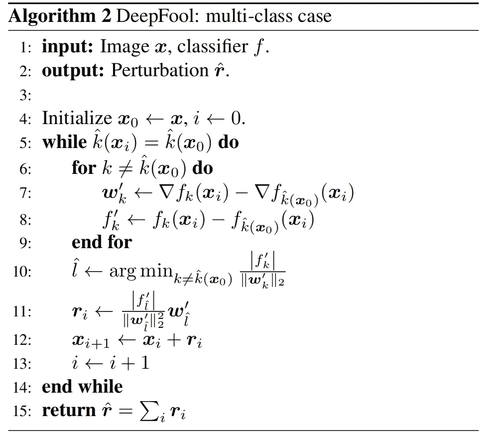

# Deep fool——欺骗深度神经网络的简单而准确的方法。

> 原文：<https://towardsdatascience.com/deepfool-a-simple-and-accurate-method-to-fool-deep-neural-networks-17e0d0910ac0?source=collection_archive---------7----------------------->

## 敌对的攻击


**Fig 1\. Its not a fish, its a bird :)** [Confidences shown are the values of logits and not passed through softmax]

*论文摘要* ***DeepFool:一种简单准确的愚弄深度神经网络的方法*** *由* ***赛义德-穆赫森·穆沙维-德兹夫利、阿尔侯赛因·法齐、帕斯卡尔·弗罗萨德*** *论文链接:*[https://arxiv.org/pdf/1511.04599.pdf](https://arxiv.org/pdf/1511.04599.pdf)

# 概观

深度神经网络在许多任务中实现了最先进的性能，但在轻微扰动的图像上惨败，以有意义的方式(而不是随机地)扰动。

DeepFool 论文有以下主要贡献:

1.  计算不同分类器对敌对扰动的鲁棒性的简单而精确的方法。
2.  实验表明
    - DeepFool 计算出更优的对抗性扰动
    -对抗性训练显著增加了鲁棒性。

# 二元分类器的 DeepFool


**FIg 2\. Simple Image with Linear model to explain what DeepFool does.**

使用线性二进制分类器可以容易地看出，对于输入`x_{0}`的模型的鲁棒性(` f `)等于`x_{0}`到超参数平面的距离(其将两个类别分开)。

改变分类器决策的最小扰动对应于`x_{0}`在超参数平面上的正交投影。给出者:


**Fig 3\. Equation to calculate the minimal perturbation.**

以下是 DeepFool 针对二元分类器的算法:



**Fig 4\. Algorithm to calculate the Adversarial Image for Binary Classifiers.**

***我们来过一遍算法:***
1。该算法采用一个输入`x`和一个分类器`f`。
2。输出对图像进行微分类所需的最小扰动。
3。用原始输入初始化对立图像。并将循环变量设置为 1。
4。开始并继续循环，而真实标签和对抗扰动图像的标签是相同的。
5。计算输入到最近超平面的投影。
(最小扰动)6。将扰动添加到图像中并进行测试。
7–8。增量循环变量；结束循环
9。返回最小扰动

# 多类分类器的 DeepFool

对于多类分类器，假设输入是`x`,每个类都有一个超平面(将一个类与其他类分开的直平面),并根据`x`在空间中的位置将其分类到一个类中。现在，这种算法所做的就是，找到最近的超平面，然后将`x`投影到该超平面上，并将其推得更远一点，从而尽可能以最小的扰动将其错误分类。就是这样。(浏览论文中的第 3 节以深入了解)

让我们来看看算法



**Fig 5\. Algorithm to calculate the Adversarial Image for Multiclass Classifiers.**

***让我们快速预排一下算法的每一步:***
1。输入是一个图像`x`和模型分类器`f`。
2。扰动
3 的输出。【空白】
4。我们用原始图像和循环变量初始化扰动的图像。
5。我们开始迭代并继续进行，直到原始标签和扰动标签不相等。
6–9。我们考虑在原始类之后具有最大概率的`n`类，并且我们存储原始梯度和这些类中的每一个的梯度之间的最小差异(w_{k})以及标签中的差异(f_{k})。10。内部循环存储最小值 w_{k}和 f_{k}，并使用它计算输入`x`的最近超平面(见图 6)。对于最近超平面的计算公式)
11。我们计算将`x`投影到我们在 10 中计算的最近超平面上的最小向量。12。我们将最小扰动添加到图像中，并检查它是否被微分类。13 至 14 岁。循环变量增加；端环
15。返回总扰动，它是所有计算扰动的总和。

下面是计算最近超平面的公式:


**Fig 6\. Equation to calculate the closest hyperplane.**

其中，以`f`开头的
变量为类别标签
以`w`开头的变量为梯度
其中，以`k`为下标的变量为真实类别之后概率最大的类别，以`\hat{k}(x+{0})`为下标的变量为真实类别。

下面是计算最小扰动(将输入投影到最近超平面的向量)的等式


**Fig 7\. Equation to calculate the minimal perturbation for multiclass classifiers.**

## 模型的对抗性稳健性

DeepFool 算法还提供了一种度量算法的对抗性鲁棒性的方法。它由提供

```
# For images with a batch size of 1
num_images = len(tloader))
adversarial_robustness = (1 / num_images) * ((torch.norm(rt.flatten()) / (torch.norm(x.flatten()))
```

# 实验


**Fig 8\. Table demonstrating the test error rates and robustness of the models using each attack and the time to generate one adversarial example with each attack.**

其中，
4 —是快速梯度符号法。
18 —攻击来自 Szegedy 等人题为《神经网络的有趣特性》的论文。


使用通过快速梯度符号方法和 DeepFool 生成的对抗图像显示对抗训练效果的图表。这些图表证明了用最小扰动(而不是像快速梯度符号方法那样过度扰动)的对立例子进行训练的重要性。)


该图证明用过度扰动的图像进行训练降低了模型的稳健性。在这个实验中，作者仅使用α值逐渐增加的 DeepFool(其中α是与产生的扰动相乘的值)


该表显示了使用不同方法微调网络后的测试错误率。该表显示，用过度扰动的图像调整网络导致更高的测试错误率(由快速梯度符号方法产生的对立图像)。)


图表显示了使用精确指标计算模型的对抗性稳健性的重要性。在这个实验中，他们使用 FGM 攻击和 DeepFool 攻击的`p_adv`来计算 NIN(网络中的网络)模型的鲁棒性。该图显示了使用 FGM 攻击计算的鲁棒性如何给出错误的度量，因为它实际上并不像前面的示例所示的那样鲁棒(以及使用 DeepFool 攻击计算的鲁棒性的蓝线)。此外，请注意，在第一个额外时期(在用正常图像进行原始训练后，用相反扰动的图像对网络进行 5 个额外时期的训练)，红线(FGM)不够敏感，不足以证明鲁棒性的损失。

# 参考

1.  ***赛义德-穆赫辛-穆沙维-德兹夫利、阿尔侯赛因-法齐、帕斯卡尔-弗罗萨德***；IEEE 计算机视觉和模式识别会议(CVPR)，2016 年，第 2574–2582 页

希望这篇文章足够清晰，能让你很好地理解 DeepFool 算法是什么以及它是如何工作的。如果我发现更直观的解释或需要更多关注的地方，我希望将来更新这篇文章。请务必阅读这篇论文，以便更好地理解。感谢阅读！