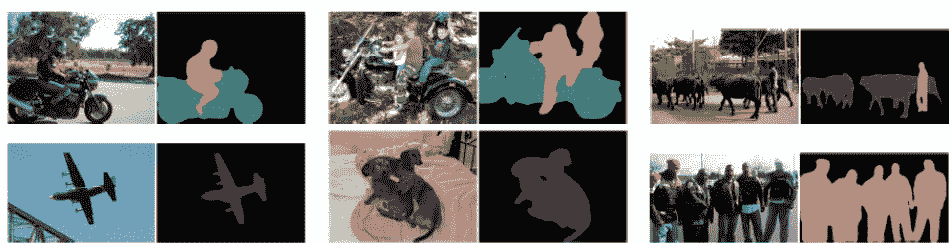

# DeepLabv3:语义图像分割

> 原文：<https://towardsdatascience.com/deeplabv3-c5c749322ffa?source=collection_archive---------18----------------------->

*来自谷歌的作者扩展了先前的研究，使用最先进的卷积方法来处理不同尺度图像中的对象[1]，在语义分割基准上击败了最先进的模型。*

From Chen, L.-C., Papandreou, G., Schroff, F., & Adam, H., 2017 [1]

# 介绍

使用深度卷积神经网络(DCNNs)分割图像中的对象的一个挑战是，随着输入特征图通过网络变得越来越小，关于更小尺度的对象的信息可能会丢失。

Figure 1\. The repeated combination of pooling and striding reduces the spatial resolution of the feature maps as the input traverses through the DCNN.

DeepLab 的贡献在于引入了 *atrous 卷积、*或 expanded 卷积，以提取更密集的特征，从而更好地保留给定不同尺度对象的信息【2–3】。Atruos 卷积还有一个额外的参数 *r* ，称为 ATR uos 速率，它对应于输入信号的采样步幅。在图 2 中，这相当于沿着每个空间维度在两个连续的滤波器值之间插入 *r* -1 个零。在这种情况下， *r=2* ，因此每个滤波器值之间的零值数量为 1。这种方法的目的是灵活地修改滤波器的视野，并修改计算特征的密度，所有这些都通过改变 *r* 来实现，而不是学习额外的参数。

Equation 1\. The formulation for the location *i in the output feature map y, or in other words, one of the squares in the green matrix in Figure 2\. x is the input signal, r is the atrous rate, w is the filter and k is the kernel.*

Figure 2\. A atruous 2D convolution using a 3 kernel with a atrous rate of 2 and no padding. From “[An Introduction to Different Types of Convolutions in Deep Learning](/types-of-convolutions-in-deep-learning-717013397f4d)” by [Paul-Louis Pröve](https://towardsdatascience.com/@pietz?source=post_page-----717013397f4d----------------------)

作者调整了一个名为 *output_stride，*的值，它是输入图像分辨率和输出分辨率之间的比率。他们比较并结合了三种方法来创建他们的最终方法:**阿特鲁空间金字塔池(ASPP)** 。第一种是级联卷积，它是简单的相互进行的卷积。当这些卷积为 *r* =1 时，这是现成的卷积，详细信息被抽取，使分割变得困难。作者发现，使用 atrous 卷积通过允许在 DCNN 的更深块中捕获远程信息来改善这一点。图 3 示出了“普通”DCNN 与级联 DCNN 的比较，级联 DCNN 具有*r*1 个卷积。

Figure 3\. The top (a) is a regular CNN while the second uses atrous convolutions with *r>1 in a cascading manner and with an output_stride of 16.*

第二种是多重网格方法，不同大小的网格层次结构(见图 4)。他们将多网格参数定义为一组 atrous rates ( *r₁，r* ₂， *r* ₃)，按顺序应用于三个区块。最终速率等于单位速率和相应速率的乘积。例如，在 output_stride 为 16，multi_grid 为(1，2，4)的情况下，块 4(见图 3)将有三个速率为 2 ⋅ (1，2，4) = (2，4，8)的卷积，

Figure 4\. A multi-grid CNN architecture. From Ke, T., Maire, M., & Yu, S.X., 2016 [4]

作者的主要贡献是从[5]修改阿特鲁空间金字塔池(ASPP)，它在空间“金字塔”池方法中使用 Atrous 卷积，以包括**批量归一化**和包括**图像级特征**。如图 5 (b)所示，他们通过在最后一个特征图上应用全局平均池来实现这一点。然后，它们将结果馈送到具有 256 个滤波器的 1x1 卷积。他们最终将该特征双线性上采样到期望的空间维度。图 5 中的例子提供了两个输出。输出(a)是具有 multi_grid rates = (6，12，18)的 3×3 卷积。输出(b)是图像级特征。然后，网络连接这些输出，并在生成 logit 类输出的最终 1x1 卷积之前，通过 1x1 卷积传递它们。

Figure 5\. Parallel modules with atrous convolutions. From Chen, L.-C., Papandreou, G., Schroff, F., & Adam, H., 2017 [1].

# 实验

为了给他们的方法提供支持，他们将级联和多重网格网络与 ASPP 进行了比较。结果是:

*   **输出步幅:**他们发现，较大的分辨率，或较小的 output_stride，比没有 atrous 卷积或较大的 Output _ Stride 表现明显更好。他们还发现，当在比较 output_stride 为 8(更大的分辨率)和 output_stride 为 16 的验证集上测试这些网络时，output_stride 为 8 的网络性能更好。
*   **级联**:与常规卷积相比，级联 atrous 卷积的结果提高了性能。然而，他们发现添加的块越多，改善的幅度就越小。
*   **多网格**:相对于“普通”网络，他们的多网格架构结果确实有所改善，并且在第 7 块的( *r₁，r* ₂， *r* ₃) = (1，2，1)处表现最佳。
*   **ASPP +多重网格+图像池**:多重网格速率为( *r₁，r* ₂， *r* ₃) = (1，2，4)，使得 ASPP (6，12，18)模型在 7721 万时表现最佳。在具有多尺度输入的 COCO 数据集上，当 output_stride = 8 时，模型在 82.70 处测试，显示通过将 output_stride 从 16 改变为 8 而进一步改善。

# 结论

作者提出了一种方法，通过向空间“金字塔”池 atrous 卷积层添加批处理和图像特征来更新 DeepLab 以前的版本。结果是，网络可以提取密集的特征图来捕捉长范围的上下文，从而提高分割任务的性能。他们提出的模型的结果在 PASCAL VOC 2012 语义图像分割基准上优于最先进的模型。

From Chen, L.-C., Papandreou, G., Schroff, F., & Adam, H., 2017 [1].

更多信息请访问他们的 GitHub:[https://GitHub . com/tensor flow/models/tree/master/research/deep lab](https://github.com/tensorflow/models/tree/master/research/deeplab)

# 参考

[1]陈，L.-C .，帕潘德里欧，g .，施罗夫，f .，&亚当，H. (2017)。语义图像分割中阿特鲁卷积的再思考。从[http://arxiv.org/abs/1706.05587](http://arxiv.org/abs/1706.05587)取回

[2] Holschneider，Matthias & Kronland-Martinet，Richard & Morlet，j .和 Tchamitchian，Ph. (1989 年)。一种基于小波变换的实时信号分析算法。小波、时频方法和相空间。-1.286.10.1007/978–3–642–75988–8_28.

[3] Giusti，a .，Cireş an，D. C .，Masci，j .，Gambardella，L. M .，& Schmidhuber，J. (2013 年 9 月)。深度最大池卷积神经网络的快速图像扫描。在 *2013 IEEE 国际图像处理会议*(第 4034–4038 页)。IEEE。

[4]柯，t .梅尔，m .，，余，S.X. (2016)。多重网格神经结构。 *2017 年 IEEE 计算机视觉与模式识别大会(CVPR)* ，4067–4075。

[5]陈、帕潘德里欧、科基诺斯、墨菲和尤耶。Deeplab:使用深度卷积网络、atrous 卷积和全连接 CRF 的语义图像分割。arXiv:1606.00915，2016。