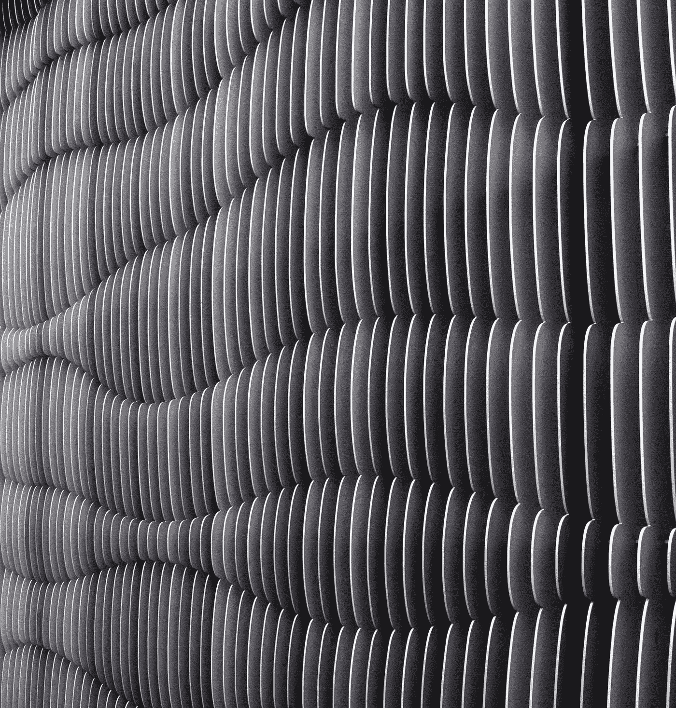
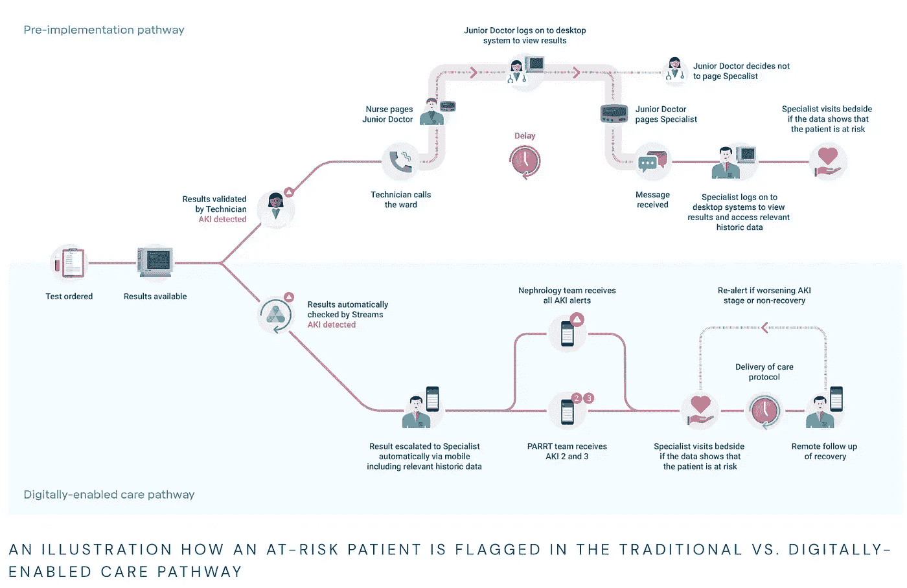

# DeepMind 联合创始人的休假

> 原文：<https://towardsdatascience.com/deepmind-co-founders-leave-of-absence-59730259f2a4?source=collection_archive---------14----------------------->

Photo by [@heysupersimi](https://unsplash.com/@heysupersimi)

## 为什么会发生，有什么信息？

我决定调查 DeepMind 的联合创始人穆斯塔法·苏莱曼的休假，并浏览一下 DeepMind 的历史。

## 深度思维简介

**DeepMind Technologies** 是一家成立于 2010 年 9 月的英国公司，目前归 Alphabet 所有，公司总部位于伦敦，在加拿大、法国和美国设有研究中心。该公司由戴密斯·哈萨比斯、穆斯塔法·苏莱曼和沙恩·莱格于 2010 年创立。它在 2014 年以 4 亿英镑或当时的 6.5 亿美元[购得。](https://www.theguardian.com/technology/2014/jan/27/google-acquires-uk-artificial-intelligence-startup-deepmind)

谷歌收购该公司后，他们建立了一个人工智能道德委员会，但人工智能研究的道德委员会仍然是一个谜，我们真的不知道谁在委员会中。DeepMind 与亚马逊、谷歌、脸书、IBM 和微软一起，是致力于*“社会-人工智能界面”*的组织 Partnership on AI 的创始成员。

DeepMind 有一个名为 [DeepMind 伦理与社会](https://deepmind.com/safety-and-ethics)的部门，专注于伦理和社会问题。2017 年 10 月，DeepMind 启动了一个新的研究团队，调查 AI 伦理。

[最近提交给英国公司注册处的文件](https://www.forbes.com/sites/samshead/2019/08/07/deepmind-losses-soared-to-570-million-in-2018/#669823fa3504)显示，2018 年 DeepMind 的税前亏损增长至 5.7 亿美元，收入为 1.25 亿美元。据说这是由于它努力获得最好的人工智能人才。

## 新闻说什么？

来自不同新闻出版物的一些标题或关键论点:

*   *“穆斯塔法·苏莱曼的撤退表明艾集团的自主权已被其母公司剥夺”* —英国《金融时报》2019 年 8 月 23 日
*   一位发言人向《福布斯》证实，谷歌广受好评的人工智能实验室 DeepMind 的联合创始人穆斯塔法·苏莱曼正在休假。该公司说，在忙碌了十年之后，穆斯塔法现在要休假一段时间，并称休假是双方的决定，并补充说该公司预计他将在年底前回来。——《福布斯》特约撰稿人 [吉利安·德昂弗罗](https://www.forbes.com/sites/jilliandonfro/)，在 2019 年 8 月 21 日的[一篇文章中](https://www.forbes.com/sites/jilliandonfro/2019/08/21/mustafa-suleyman-cofounder-of-google-ai-lab-deepmind-on-leave/#3378044d6277)
*   谷歌旗下备受瞩目的人工智能实验室 DeepMind 的联合创始人因其领导的一些项目引发争议而被停职。穆斯塔法·苏莱曼管理着 DeepMind 的“应用”部门，该部门为实验室在健康、能源和其他领域的研究寻求实际用途。苏莱曼也是 DeepMind 的一个关键公众形象，他在官员和活动中谈论人工智能的承诺以及限制恶意使用该技术所需的道德护栏。”–彭博，2019 年 8 月 21 日

## 穆斯塔法·苏莱曼

然而，在这件事上我们必须考虑穆斯塔法本人。8 月 22 日，穆斯塔法在推特上写道:

这位伊斯灵顿本地人 19 岁从牛津大学辍学，帮助建立了一个名为穆斯林青年帮助热线的电话咨询服务，这是英国同类服务中最大的心理健康服务之一。他在 22 岁时离开该组织，共同创立了 DeepMind。

在 DeepMind，他最近领导了一个专注于人工智能和健康的项目。

> 7 月，DeepMind 宣布，其技术现在可以在急性肾损伤发生前两天进行预测。

穆斯塔法在 2018 年的 [a *Wired* 专栏中写道:“我们需要做艰苦、实际和混乱的工作，找出伦理人工智能的真正含义。”他预测人工智能的安全和社会影响的研究将是“最紧迫的调查领域之一。”](https://www.wired.co.uk/article/mustafa-suleyman-deepmind-ai-morals-ethics)

穆斯塔法和哈萨比斯要求，作为谷歌收购 DeepMind 的一部分，该公司需要建立一个内部道德委员会，以监督所有部门的人工智能工作。2019 年初，谷歌试图创建一个外部人工智能伦理委员会，但在内部和外部对其成员的抗议之后，很快解散了该项目[。](https://www.forbes.com/sites/jilliandonfro/2019/04/04/google-cancels-its-ai-ethics-board-less-than-two-weeks-after-launch-in-the-wake-of-employee-protest/#40a08e3b6e28)

## 名为 Streams 的应用程序

苏莱曼一直在运营该集团的[“应用人工智能”部门](https://www.linkedin.com/in/mustafa-suleyman-54543a72/?originalSubdomain=uk)，该部门旨在为其科学研究找到现实世界的用途，并在此前领导了该集团的健康工作，包括与英国国家医疗服务系统的广泛批评的 2016 年合作。这项合作让 DeepMind 获得了一款名为 Streams 的肾脏监测应用程序的 160 万份患者记录，其数据共享做法最终在 2017 年被[视为非法](https://www.businessinsider.com/ico-deepmind-first-nhs-deal-illegal-2017-6?r=UK)，促使苏莱曼和该公司道歉。去年年底，谷歌宣布 Streams 及其团队将[并入谷歌旗下](https://deepmind.com/blog/announcements/scaling-streams-google)，实质上解散了 DeepMind Health group。

我从英国广播公司找到了几个报道这一过程的链接:

*   [**谷歌 DeepMind NHS 应用测试触犯英国隐私法**](https://www.bbc.co.uk/news/technology-40483202)

*   [**NHS 成立国家人工智能实验室**](https://www.bbc.co.uk/news/health-49270325)

从那以后，这款应用受到了医院管理者的高度赞扬，被认为大大加快了诊断速度**。皇家自由医院的玛丽·埃默森在本月早些时候接受英国广播公司采访时说:“能够在医院的任何地方接收病人的警报，这是一个巨大的变化。”。**

## **2019 年 7 月 31 日的一篇博文**

**我决定回过头来看看由[穆斯塔法·苏莱曼](https://deepmind.com/research?filters=%7B%22authors%22:%5B%226666259235602432%22%5D%7D)和[多米尼克·金](https://deepmind.com/research?filters=%7B%22authors%22:%5B%225792430976139264%22%5D%7D)写的一篇关于使用人工智能让医生在危及生命的疾病面前领先 48 小时的博文。**

***“人工智能现在可以在可避免的患者伤害发生前两天预测其主要原因之一，正如我们在《自然》* *上发表的最新研究* [*所证明的那样。我们与美国退伍军人事务部(VA)的专家一起工作，开发了一种技术，在未来，这种技术可以让医生在治疗急性肾损伤(AKI)时提前 48 小时开始，这种疾病与英国每年超过 10 万人有关。这些发现与我们针对临床医生的移动助手 Streams 的同行评审服务评估相一致，该评估表明，通过使用数字工具，可以改善患者护理，降低医疗保健成本。它们共同构成了医学变革性进步的基础，有助于从反应性护理模式转向预防性护理模式。”*](https://nature.com/articles/s41586-019-1390-1)**

****

**Screenshot of post from [DeepMind blog published the 31st of July](https://deepmind.com/blog/article/predicting-patient-deterioration) and retrieved on the 26th of August**

**后来在博文中说:**

***“这对 DeepMind 健康团队来说是一个重要的里程碑，他们将在大卫·范伯格博士的领导下，作为谷歌健康的一部分推进这项工作。正如我们在 2018 年 11 月* [*宣布的*](https://deepmind.com/blog/announcements/scaling-streams-google) *一样，Streams 团队和从事医疗转化研究的同事将加入谷歌，以便在全球范围内产生积极影响。DeepMind Health 团队与谷歌团队的经验、基础设施和专业知识相结合，将帮助我们继续开发移动工具，为更多临床医生提供支持，解决关键的患者安全问题，我们希望能够拯救全球成千上万人的生命。”***

## **最后**

**由于我妻子的父亲患有肾病，这是他早逝的一个主要原因，在这种情况下，我很难保持中立。然而，我能说的是，我们必须阅读眼前的新闻之外的东西，试图更好地理解穆斯塔法·苏莱曼暂时离开的情况是很有趣的。**

**这是#500daysofAI 每天写关于人工智能的第 83 天。**