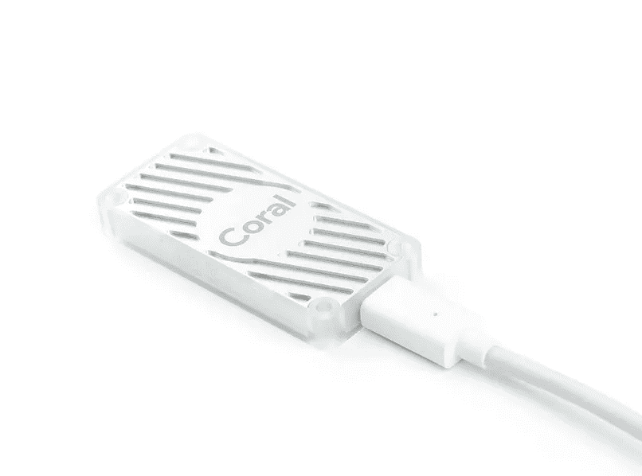

# DeepPiCar 第 1 部分:如何在预算有限的情况下建造深度学习、自动驾驶的机器人汽车

> 原文：<https://towardsdatascience.com/deeppicar-part-1-102e03c83f2c?source=collection_archive---------0----------------------->

## [DeepPiCar 系列](https://towardsdatascience.com/tagged/deep-pi-car)

## 概述如何建立一个树莓 Pi 和 TensorFlow 供电的自动驾驶机器人汽车

# 介绍

今天，特斯拉、谷歌、优步和通用汽车都在试图创造自己的自动驾驶汽车，可以在现实世界的道路上行驶。许多分析师预测，在未来 5 年内，我们将开始有完全自动驾驶的汽车在我们的城市中行驶，在 30 年内，几乎所有的汽车都将是完全自动驾驶的。使用一些大公司使用的相同技术来建造你自己的无人驾驶汽车不是很酷吗？在这篇文章和接下来的几篇文章中，我将指导您如何从头开始构建自己的物理、深度学习、自动驾驶的机器人汽车。在一周之内，你将能够让你的汽车检测并跟随车道，识别并回应交通标志和路上的人。这里先睹为快，看看你的最终产品。

Lane Following (left) and Traffic Sign and People Detection (right) from DeepPiCar’s DashCam

# 我们的路线图

第 2 部分:我将列出需要购买的硬件以及如何设置它们。简而言之，你将需要一个[树莓 Pi](https://www.amazon.com/CanaKit-Raspberry-Power-Supply-Listed/dp/B07BC6WH7V/) 板(50 美元) [SunFounder PiCar 套件](https://www.amazon.com/SunFounder-Raspberry-Graphical-Programming-Electronic/dp/B06XWSVLL8)(115 美元)[谷歌的 Edge TPU](https://coral.withgoogle.com/products/accelerator)(75 美元)加上一些配件，以及在后面的文章中每个部分是如何重要的。这些材料的总成本约为 250-300 美元。我们还会安装树莓派和 PiCar 需要的所有软件驱动。

Raspberry Pi 3 B+ (left), SunFounder PiCar-V (middle), Google Edge TPU (right)

第三部分:我们将设置所有需要的计算机视觉和深度学习软件。我们使用的主要软件工具有 [Python](https://www.python.org/) (机器学习/AI 任务的事实上的编程语言) [OpenCV](https://github.com/opencv/opencv) (强大的计算机视觉包) [Tensorflow](https://www.tensorflow.org/) (谷歌流行的深度学习框架)。注意，我们在这里使用的所有软件都是免费和开源的！

第 4 部分:随着(乏味的)硬件和软件设置的结束，我们将直接进入有趣的部分！我们的第一个项目是使用 python 和 OpenCV 来教会 DeepPiCar 通过检测车道线在蜿蜒的单车道上自主导航，并相应地转向。

Step-by-Step Lane Detection

第 5 部分:我们将训练 DeepPiCar 自动导航车道，而不必像在我们的第一个项目中那样显式地编写逻辑来控制它。这是通过使用“行为克隆”来实现的，我们只使用道路的视频和每个视频帧的正确转向角度来训练 DeepPiCar 自动驾驶。实现的灵感来自于 [NVIDIA 的 DAVE-2](https://images.nvidia.com/content/tegra/automotive/images/2016/solutions/pdf/end-to-end-dl-using-px.pdf) 全尺寸自动驾驶汽车，它使用深度卷积神经网络来检测道路特征，并做出正确的转向决策。

Lane Following in Action

最后，在第 6 部分中:我们将使用深度学习技术，如[单次多框对象检测](https://arxiv.org/abs/1512.02325)和[转移学习](https://machinelearningmastery.com/transfer-learning-for-deep-learning/)，来教会 DeepPiCar 检测道路上的各种(微型)交通标志和行人。然后我们会教它在红灯和停车标志时停下来，在绿灯时继续，停下来等待行人过马路，根据张贴的速度标志改变它的速度限制，等等。

Traffic Signs and People Detection Model Training in TensorFlow

# 先决条件

以下是这些文章的先决条件:

*   首先也是最重要的是愿意修补和破坏东西。与汽车模拟器不同，在汽车模拟器中，一切都是确定的，完全可重复的，真实世界的模型汽车可能是不可预测的，您必须愿意弄脏自己的手，并开始修补硬件和软件。
*   基本 *Python 编程*技能。我将假设您知道如何阅读 python 代码和编写函数，以及 python 中的 if 语句和循环。我的大部分代码都有很好的文档记录，特别是较难理解的部分。
*   基础 *Linux 操作系统*知识。我将假设您知道如何在 Linux 的 Bash shell 中运行命令，这是 Raspberry Pi 的操作系统。我的文章将告诉您运行哪些命令，我们为什么运行它们，以及期望输出什么。
*   最后，你需要大约 250-300 美元来购买所有的硬件和工作电脑(Windows/Mac 或 Linux)。同样，所有使用的软件都是免费的。

# 进一步的想法[可选]

这是可选阅读，因为我试图在我的文章中涵盖你需要知道的一切。然而，如果你想更深入地研究深度学习，(一语双关)，除了我在整篇文章中提供的链接之外，这里还有一些资源可供查阅。

[吴恩达](https://en.wikipedia.org/wiki/Andrew_Ng)在 [Coursera](https://www.coursera.org) 上的机器学习和深度学习课程。正是这些课程点燃了我对机器学习和 AI 的热情，给了我创作 DeepPiCar 的灵感。

*   [机器学习](https://www.coursera.org/learn/machine-learning)(免费):本课程涵盖传统的机器学习技术，如线性回归、逻辑回归、支持向量机等，以及神经网络。它是在 2012 年创建的，所以它使用的一些工具，即 Matlab/Octave，已经过时了，而且它没有长篇大论地谈论深度学习。但是它教给你的概念是无价的。你只需要高中水平的数学和一些基本的编程技能就可以学习这门课程，ng 博士非常好地解释了像反向传播这样的困难概念。完成本课程大约需要 3 个月的时间。

*   [深度学习 5 门课程专业化](https://www.deeplearning.ai/deep-learning-specialization/)(免费或 50 美元/月，如果你想获得证书):这门课程于 2018 年初推出。因此它涵盖了到那时为止所有最新的人工智能研究，如全连接神经网络、卷积神经网络(CNN)和序列模型(RNN/LSTM)。这门课对我来说是一种享受。作为一名工程师，我总是想知道一些很酷的小工具是如何工作的，比如 Siri 如何回应你的问题，以及汽车如何识别路上的物体等。现在我知道了。完成这 5 门课程的专业化大约需要 3-4 个月。

# 下一步是什么

第一条到此为止。我们将在第 2 部分见面，我们将动手制作一辆机器人汽车！

以下是整个指南的链接:

第 1 部分:[概述](https://medium.com/@dctian/deeppicar-part-1-102e03c83f2c)(本文)

第 2 部分: [Raspberry Pi 设置和 PiCar 装配](https://medium.com/@dctian/deeppicar-part-2-8512be2133f3)

第 3 部分:[让 PiCar 看到并思考](https://medium.com/@dctian/deeppicar-part-3-d648b76fc0be)

第 4 部分:[通过 OpenCV 的自主车道导航](https://medium.com/@dctian/deeppicar-part-4-lane-following-via-opencv-737dd9e47c96?source=your_stories_page---------------------------)

第五部分:[自主](https://medium.com/@dctian/deeppicar-part-4-lane-following-via-opencv-737dd9e47c96?source=your_stories_page---------------------------) [通过深度学习进行车道导航](https://medium.com/@dctian/deeppicar-part-5-lane-following-via-deep-learning-d93acdce6110?source=your_stories_page---------------------------)

第六部分:[交通标志和行人检测处理](https://medium.com/@dctian/deeppicar-part-6-963334b2abe0?source=your_stories_page---------------------------)