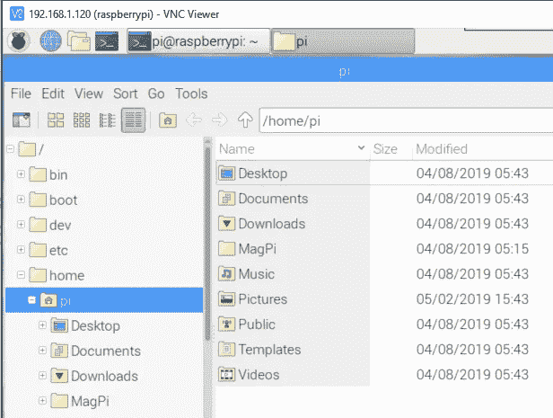

# DeepPiCar —第 2 部分:Raspberry Pi 设置和 PiCar 装配

> 原文：<https://towardsdatascience.com/deeppicar-part-2-8512be2133f3?source=collection_archive---------2----------------------->

## [DeepPiCar 系列](https://towardsdatascience.com/tagged/deep-pi-car)

## 组装 PiCar 硬件并安装所有软件驱动程序。让它在客厅里运行

# 行动纲要

欢迎回来！在本指南中，我们将首先介绍要购买的硬件以及我们为什么需要它们。接下来，我们将设置它们，以便在本文结束时，我们将有一个 PiCar 在我们的客厅中运行。

# 硬件供应清单


*   1 个[树莓 Pi 3 型号 B+套件，带 2.5A 电源](https://www.amazon.com/CanaKit-Raspberry-Power-Supply-Listed/dp/B07BC6WH7V/) ($50)这是你 DeepPiCar 的大脑。这款最新型号的 Raspberry Pi 具有 1.4Ghz 64 位四核处理器、双频 wifi、蓝牙、4 个 USB 端口和一个 HDMI 端口。我推荐这个套件(不仅仅是 Raspberry Pi 板),因为它配有一个电源适配器，你需要在进行非驱动编码和测试时插入，还有两个芯片散热器，这将防止你的 Raspberry Pi CPU 过热。
*   1 个 [64 GB 微型 SD 卡](https://www.amazon.com/Kingston-64GB-microSDHC-microSD-SDCS/dp/B079GVC5B8/) ($8)这是你的树莓派的操作系统和我们所有软件的存储位置。任何品牌的 micro SD 卡应该都可以。你家里可能就有一个。32GB 应该也可以。我选择 64 GB 是因为我计划在我的汽车行驶时录制大量视频，以便我可以在以后分析它的行为，并在以后的项目中使用这些视频进行深度学习训练。


*   1 x [SunFounder PiCar-V 套件](https://www.amazon.com/SunFounder-Raspberry-Graphical-Programming-Electronic/dp/B06XWSVLL8/) ($115)这是 DeepPiCar 的主体。确保你得到的是如上图所示的 V 型车(又名 2.0 版)。它配备了机器人汽车所需的一切，除了树莓派和电池。市场上有许多 Raspberry Pi 车载套件，我选择了这个车载套件，因为它带有开源 python API 来控制汽车，而其他供应商有其专有的 API 或基于 C 的 API。我们知道，python 现在是机器学习和深度学习的首选语言。此外，开源很重要，因为如果我们发现 API 中的错误，我们可以自己修补汽车 API 的内部，而不必等待制造商提供软件更新。
*   4 节 [18650 电池和 1 节电池充电器](https://www.amazon.com/Garberiel-5000mAh-Rechargeable-Flashlight-Universal/dp/B07QD2432Q/) ($20)您可以获得任何 18650 电池和兼容充电器。这些电池用于高消耗应用，例如驱动 Raspberry Pi 板和 PiCar。PiCar 只需要两节电池，但你总是希望身边有另一节刚刚充电的电池，这样你就可以让你的车一直在赛道上行驶。我建议在晚上给两套充电，这样你就不用担心测试时电池没电了。


*   1 x [谷歌边缘 TPU USB 加速器](https://coral.withgoogle.com/products/accelerator) ($75)每个英雄都需要一个助手。谷歌的 Edge TPU (Edge 意味着它用于移动和嵌入式设备，TPU 代表张量处理单元)是 Raspberry Pi 板的一个很好的附加组件。虽然 Pi CPU 将大量计算能力打包在一个微小的包中，但它不是为深度学习而设计的。另一方面，谷歌新发布的 Edge TPU(2019 年 3 月)是专门为运行用 TensorFlow 编写的深度学习模型而设计的。在本系列的第 6 部分中，我们将在 TensorFlow 中构建一个实时交通标志检测模型。这个模型有 200+层深！仅在 Raspberry Pi 的 CPU 上运行该模型只能处理每秒 1 帧(FPS)，这几乎不是实时的。此外，它消耗 100%的 CPU，使所有其他程序无响应。但是在 Edge TPU 的帮助下，我们现在可以处理 12 FPS，这对于实时工作来说已经足够了。我们的 CPU 保持凉爽，可以用来做其他处理任务，如控制汽车。


*   1 套[微型交通标志](https://www.amazon.com/Wooden-Street-Playset-Traffic-Perfect/dp/B01A8XTHHA/)(15 美元)和一些乐高玩具。如果你的小宝宝在游戏室里有这些玩具标志和乐高玩具，你可能就不需要买了。你可以使用你找到的任何标志来训练模型，只要确保它们*不要太大*！


*   (可选)1 个 [170 度广角 USB 摄像头](https://www.amazon.com/ELP-2-1mm-Camera-industrial-system/dp/B01N07O9CQ)(40 美元)。这是一个可选配件。我买它是为了取代 SunFounder PiCar 附带的库存相机，以便汽车可以拥有广阔的视野。库存相机很棒，但没有我喜欢的广角，它看不到前轮前 3-4 英寸的车道线。最初，我在第 4 部分中用库存相机编写了车道跟踪代码。在尝试了几个镜头后，我发现这个广角相机大大提高了车道跟踪的准确性和稳定性。控制你的硬件和软件是很好的(相对于在汽车模拟器中驾驶一辆汽车)，因为如果一个问题不能简单地通过软件解决，你可以求助于硬件修复。
*   接受 HDMI 输入的 USB 键盘/鼠标和显示器。您只需要在 Pi 的初始设置阶段使用它们。之后，我们可以通过 VNC 或 Putty 远程控制 Pi。
*   一台运行 Windows/Mac 或 Linux 的台式机或笔记本电脑，从这里开始我将称之为“PC”。我们将使用这台 PC 远程访问 Pi 计算机并将代码部署到 Pi 计算机。

有时候，让我惊讶的是，我们汽车的大脑树莓派仅售 30 美元，比我们的许多其他配件都便宜。事实上，随着时间的推移，硬件越来越便宜，功能越来越强大，而软件则完全免费且丰富。我们不是生活在一个伟大的时代吗？！

组装完成后，这就是最终产品。我这里用的是广角相机。


# 树莓 Pi 设置

## Raspberry Pi 操作系统设置(1 小时)

*   按照这个优秀的[一步一步的指导](https://projects.raspberrypi.org/en/projects/raspberry-pi-setting-up)将 NOOBS Raspbian 操作系统(Linux 的一个变种)安装到一个微型 SD 卡上。这大约需要 20 分钟和 4GB 的磁盘空间。安装和重启后，您应该会看到一个完整的 GUI 桌面，如下所示。这感觉就像你在一个 Windows 或者 Mac 的 GUI 环境中，不是吗？


*   在安装过程中，Pi 会要求您更改默认用户`pi`的密码。比如我们把密码设为`rasp`。
*   初次安装后，Pi 可能需要升级到最新的软件。这可能还需要 10-15 分钟。

## 设置远程访问

设置远程访问允许 Pi 计算机无头运行(即没有显示器/键盘/鼠标),这使我们不必一直连接显示器和键盘/鼠标。这个[视频](https://www.youtube.com/watch?v=IDqQIDL3LKg&list=PLQVvvaa0QuDesV8WWHLLXW_avmTzHmJLv&index=3)给出了一个非常好的关于如何设置 SSH 和 VNC 远程访问的教程。不管怎样，这是步骤。

*   打开终端应用程序，如下所示。终端应用程序是一个非常重要的程序，因为我们在后面文章中的大多数命令都将从终端输入。


*   通过运行`ifconfig`找到 Pi 的 IP 地址。在这个例子中，我的 Pi 的 IP 地址是`192.168.1.120`。

```
pi@raspberrypi:~ $ **ifconfig | grep wlan0 -A1**
wlan0: flags=4163<UP,BROADCAST,RUNNING,MULTICAST>  mtu 1500
        inet **192.168.1.120**  netmask 255.255.255.0  broadcast 192.168.1.255
```

*   在终端运行`sudo raspi-config`，启动“树莓 Pi 软件配置工具”。可能会提示您输入用户`pi`的密码


*   启用 SSH 服务器:选择`5\. Interface Options`->-`SSH`->-`Enable`
*   启用 VNC 服务器:选择`5\. Interface Options`->-`VNC`->-`Enable`
*   下载并[安装 RealVNC 浏览器](https://www.realvnc.com/en/connect/download/viewer/)到你的电脑上。
*   连接到 Pi 的 IP 地址使用真正的 VNC 浏览器。您将看到与 Pi 正在运行的桌面相同的桌面。
*   此时，您可以安全地断开显示器/键盘/鼠标与 Pi 计算机的连接，只保留电源适配器。


## 设置远程文件访问

由于我们的 Pi 将无头运行，我们希望能够从远程计算机访问 Pi 的文件系统，以便我们可以轻松地将文件传输到 Pi 计算机或从 Pi 计算机传输文件。我们将在 Pi 上安装 Samba 文件服务器。

```
pi@raspberrypi:~ $ **sudo apt-get update && sudo apt-get upgrade -y**
Get:1 [http://archive.raspberrypi.org/debian](http://archive.raspberrypi.org/debian) stretch InRelease [25.4 kB]
Packages [45.0 kB]
[omitted...]
Unpacking lxplug-ptbatt (0.5) over (0.4) ...
Setting up lxplug-ptbatt (0.5) ...pi@raspberrypi:~ $ **sudo apt-get install samba samba-common-bin -y**
Reading package lists... Done
Building dependency tree       
[omitted...]
Processing triggers for libc-bin (2.24-11+deb9u4) ...
Processing triggers for systemd (232-25+deb9u11) ...pi@raspberrypi:~ $ **sudo rm /etc/samba/smb.conf**pi@raspberrypi:~ $ **sudo nano /etc/samba/smb.conf**
```

然后将下面几行粘贴到 nano 编辑器中

```
[global]
netbios name = Pi
server string = The PiCar File System
workgroup = WORKGROUP

[HOMEPI]
path = /home/pi
comment = No comment
browsable = yes
writable = Yes
create mask = 0777
directory mask = 0777
public = no
```

按 Ctrl-X 保存并退出 nano，按 Yes 保存更改。

然后设置一个 Samba 服务器密码。为了简单起见，我们将使用相同的`rasp`作为 Samba 服务器密码。设置密码后，重启 Samba 服务器。

```
# create samba password
pi@raspberrypi:~ $ **sudo smbpasswd -a pi**
New SMB password:
Retype new SMB password:
Added user pi.# restart samba server
pi@raspberrypi:~ $ **sudo service smbd restart**
```

此时，您应该能够通过 Pi 的 IP 地址(我的 Pi 的 IP 是 192.168.1.120)从 PC 连接到 Pi 计算机。转到您的 PC (Windows)，打开命令提示符(cmd.exe)并键入:

```
# mount the Pi home directory to R: drive on PC
C:\>**net use r: \\192.168.1.120\homepi**
The command completed successfully.
C:\Users\dctia>r:C:\>**dir r:**
 Volume in drive R is HOMEPI
 Volume Serial Number is 61E3-70FFDirectory of R:\05/02/2019  03:57 PM    <DIR>          .
04/08/2019  04:48 AM    <DIR>          ..
04/08/2019  05:43 AM    <DIR>          Desktop
04/08/2019  05:43 AM    <DIR>          Documents
04/08/2019  05:43 AM    <DIR>          Downloads
04/08/2019  05:15 AM    <DIR>          MagPi
04/08/2019  05:43 AM    <DIR>          Music
05/02/2019  03:43 PM    <DIR>          Pictures
04/08/2019  05:43 AM    <DIR>          Public
04/08/2019  05:43 AM    <DIR>          Templates
04/08/2019  05:43 AM    <DIR>          Videos
               0 File(s)              0 bytes
              11 Dir(s)  22,864,379,904 bytes free
```

事实上，这是我们的 Pi 计算机的文件系统，我们可以从它的文件管理器中看到。这将是非常有用的，因为我们可以直接从我们的 PC 编辑驻留在 Pi 上的文件。例如，我们可以先使用 PyCharm IDE 在 Pi 上编辑 Python 程序，然后只需使用 Pi 的终端(通过 VNC)运行这些程序。



如果你有一台 Mac，这里是如何连接到 Pi 的文件服务器。点击 Command-K 调出“连接到服务器”窗口。输入网络驱动器路径(替换为您的 Pi 的 IP 地址)，即 smb://192.168.1.120/homepi，然后单击连接。输入登录/密码，即 pi/rasp，然后单击 OK 以安装网络驱动器。然后，该驱动器将出现在您的桌面上和 Finder 窗口的边栏中。关于 Mac 更深入的网络连接指导，请查看[这篇优秀的文章](http://osxdaily.com/2010/09/20/map-a-network-drive-on-a-mac/)。


## 安装 USB 摄像头

USB 摄像头的设备驱动程序应该已经带有 Raspian 操作系统。我们将安装一个视频摄像头查看器，这样我们就可以看到现场视频。

*   从 PiCar 套件中取出 USB 摄像头，并将其插入 Pi 计算机的 USB 端口
*   从终端运行`sudo apt-get install cheese`安装“Cheese”，相机浏览器。

```
pi@raspberrypi:~ $ **sudo apt-get install cheese -y**
Reading package lists... Done
Building dependency tree       
Reading state information... Done
....
cheese is the newest version (3.22.1-1).
```

*   通过`Raspberry Pi button(Top Left Corner)`->-`Sound & Video`->-`Cheese`启动奶酪应用程序，您应该会看到一个直播视频，如上图所示。

# SunFounder PiCar-V 软件配置(偏离手册)

在组装 PiCar 之前，我们需要安装 PiCar 的 python API。SunFounder 发布了其 Python API 的服务器版本和客户端版本。用于远程控制 PiCar 的客户端 API 代码运行在您的 PC 上，并且使用 Python 版本 3。服务器 API 代码运行在 PiCar 上，不幸的是，它使用的是 Python 版本 2，这是一个过时的版本。由于我们编写的自动驾驶程序只能在 PiCar 上运行，PiCar 服务器 API 也必须在 Python 3 中运行。幸运的是，SunFounder 的所有 API 代码都在 [Github](https://github.com/sunfounder/SunFounder_PiCar-V) 上开源，我做了一个 [fork](https://github.com/dctian/SunFounder_PiCar-V) 并将整个 repo(包括服务器和客户端)更新到 Python 3。(我将很快向 SunFounder 提交我的更改，这样一旦 SunFounder 批准，它就可以合并回主 repo。)

目前，运行以下命令(粗体**代替 SunFounder 手册中的软件命令。您不必运行手册第 20-26 页上的命令。**

```
# route all calls to python (version 2) to python3, 
# pip (version 2) to pip3, even in sudo mode 
# note: `sudo abcd` runs `abcd` command in administrator mode
**alias python=python3
alias pip=pip3
alias sudo='sudo '**# Download patched PiCar-V driver API, and run its set up
pi@raspberrypi:~ $ **cd**pi@raspberrypi:~ $ **git clone** [**https://github.com/dctian/SunFounder_PiCar.git**](https://github.com/dctian/SunFounder_PiCar.git)
Cloning into 'SunFounder_PiCar'...
remote: Enumerating objects: 9, done.
remote: Counting objects: 100% (9/9), done.
remote: Compressing objects: 100% (9/9), done.
remote: Total 276 (delta 0), reused 2 (delta 0), pack-reused 267
Receiving objects: 100% (276/276), 53.33 KiB | 0 bytes/s, done.
Resolving deltas: 100% (171/171), done.
pi@raspberrypi:~ $ **cd ~/SunFounder_PiCar/picar/**

pi@raspberrypi:~/SunFounder_PiCar/picar $ **git clone** [**https://github.com/dctian/SunFounder_PCA9685.git**](https://github.com/dctian/SunFounder_PCA9685.git)
Cloning into 'SunFounder_PCA9685'...
remote: Enumerating objects: 7, done.
remote: Counting objects: 100% (7/7), done.
remote: Compressing objects: 100% (5/5), done.
remote: Total 87 (delta 2), reused 6 (delta 2), pack-reused 80
Unpacking objects: 100% (87/87), done.pi@raspberrypi:~/SunFounder_PiCar/picar $ **cd ~/SunFounder_PiCar/**
pi@raspberrypi:~/SunFounder_PiCar $ **sudo python setup.py install**
Adding SunFounder-PiCar 1.0.1 to easy-install.pth file
Installing picar script to /usr/local/bin
[omitted....]# Download patched PiCar-V applications
# and install depedent software
pi@raspberrypi:~/SunFounder_PiCar/picar $ **cd**
pi@raspberrypi:~ $ **git clone** [**https://github.com/dctian/SunFounder_PiCar-V.git**](https://github.com/dctian/SunFounder_PiCar-V.git)
Cloning into 'SunFounder_PiCar-V'...
remote: Enumerating objects: 969, done.
remote: Total 969 (delta 0), reused 0 (delta 0), pack-reused 969
Receiving objects: 100% (969/969), 9.46 MiB | 849.00 KiB/s, done.
Resolving deltas: 100% (432/432), done.pi@raspberrypi:~ $ **cd SunFounder_PiCar-V**pi@raspberrypi:~/SunFounder_PiCar-V $ **sudo ./install_dependencies**
Adding SunFounder-PiCar 1.0.1 to easy-install.pth file
Installing picar script to /usr/local/binInstalled /usr/local/lib/python2.7/dist-packages/SunFounder_PiCar-1.0.1-py2.7.egg
Processing dependencies for SunFounder-PiCar==1.0.1
Finished processing dependencies for SunFounder-PiCar==1.0.1
complete
Copy MJPG-Streamer to an Alternate Location.  complete
Enalbe I2C. completeInstallation result:
django   Success
python-smbus  Success
python-opencv  Success
libjpeg8-dev  Success
The stuff you have change may need reboot to take effect.
Do you want to reboot immediately? (yes/no)**yes**
```

当提示重新启动时，回答是。重新启动后，应安装所有必需的硬件驱动程序。我们将在汽车组装后测试它们。

# 皮卡装配

组装过程紧密地重新组装一个复杂的乐高玩具，整个过程需要大约 2 个小时，大量的手眼协调，非常有趣。(在构建阶段，你甚至可以让你的年轻人参与进来。)PiCar 套件附带印刷的分步指导手册。但是我推荐这两个*额外的*资源。

*   [PDF 版本的指导手册](https://www.sunfounder.com/learn/download/X1BWQ19SYXNwYmVycnlfUGlfU21hcnRfVmlkZW9fQ2FyX1YyLjAucGRm/dispi)。打印手册很小，图表可能打印不太清楚，而 PDF 版本非常清晰，可以搜索和放大以了解更多细节。在组装阶段，我发现它对我笔记本电脑上的 PDF 非常有帮助。
*   SunFounder 发布的 YouTube 4 集教学视频。不幸的是，这些视频是为老版本的 PiCar，所以有些部分(如伺服电机组件)是不同的。但是大部分零件和组装技术都是一样的。因此，如果您对组装手册中的某个图感到困惑，您可能需要看一下视频的相关部分。我希望 SunFounder 能为新的 PiCar-V 套件发布一组新的视频。

Assembly Videos (4 Parts) for an Older Version of PiCar, a Useful reference

## 当橡胶遇到路面！

既然 PiCar 的所有基本硬件和软件都已就绪，让我们试着运行它吧！

*   从 PC 通过 VNC 连接到 PiCar
*   确保放入新电池，将开关切换到 ON 位置，并拔下 micro USB 充电电缆。请注意，您的 VNC 远程会话应该仍处于活动状态。
*   在 Pi 终端中，运行以下命令(粗体显示的**)。您应该:**

1.  **看到车开快了，再发出`picar.back_wheel.test()`就慢下来**
2.  **当你发出`picar.front_wheel.test()`时，看到前轮转向左、中、右。要停止这些测试，请按 Ctrl-C。要退出 python 程序，请按 Ctrl-D。**

```
pi@raspberrypi:~/SunFounder_PiCar/picar $ **python3** 
Python 3.5.3 (default, Sep 27 2018, 17:25:39) 
[GCC 6.3.0 20170516] on linux
Type "help", "copyright", "credits" or "license" for more information.>>> **import picar**
>>> **picar.setup()**>>> **picar.front_wheels.test()**
DEBUG "front_wheels.py": Set debug off
DEBUG "front_wheels.py": Set wheel debug off
DEBUG "Servo.py": Set debug off
turn_left
turn_straight
turn_right>>> **picar.back_wheels.test()**
DEBUG "back_wheels.py": Set debug off
DEBUG "TB6612.py": Set debug off
DEBUG "TB6612.py": Set debug off
DEBUG "PCA9685.py": Set debug off
Forward, speed = 0
Forward, speed = 1
Forward, speed = 2
Forward, speed = 3
Forward, speed = 4
Forward, speed = 5
Forward, speed = 6
Forward, speed = 7
Forward, speed = 8
Forward, speed = 9
Forward, speed = 10
Forward, speed = 11
```

*   **如果您遇到错误或看不到轮子移动，那么要么是您的硬件连接或软件设置有问题。对于前者，请仔细检查你的电线连接，确保电池充满电。对于后者，请在评论区发布消息，详细说明您遵循的步骤和错误消息，我会尽力提供帮助。**

# **下一步是什么**

**恭喜你，你现在应该有一个 PiCar 可以看到(通过 Cheese)，运行(通过 python 3 代码)！这还不是一辆深度学习的汽车，但我们正在朝着它前进。当你准备好了，就开始第三部分吧，在那里我们将赋予 PiCar 计算机视觉和深度学习的超能力。**

**以下是整个指南的链接:**

**第 1 部分:[概述](https://medium.com/@dctian/deeppicar-part-1-102e03c83f2c)**

**第 2 部分: [Raspberry Pi 设置和 PiCar 装配](https://medium.com/@dctian/deeppicar-part-2-8512be2133f3)(本文)**

**第 3 部分:[让皮卡看到并思考](https://medium.com/@dctian/deeppicar-part-3-d648b76fc0be)**

**第 4 部分:[通过 OpenCV 的自主车道导航](https://medium.com/@dctian/deeppicar-part-4-lane-following-via-opencv-737dd9e47c96?source=your_stories_page---------------------------)**

**第五部分:[自主](https://medium.com/@dctian/deeppicar-part-4-lane-following-via-opencv-737dd9e47c96?source=your_stories_page---------------------------) [通过深度学习进行车道导航](https://medium.com/@dctian/deeppicar-part-5-lane-following-via-deep-learning-d93acdce6110?source=your_stories_page---------------------------)**

**第六部分:[交通标志和行人检测与处理](https://medium.com/@dctian/deeppicar-part-6-963334b2abe0?source=your_stories_page---------------------------)**