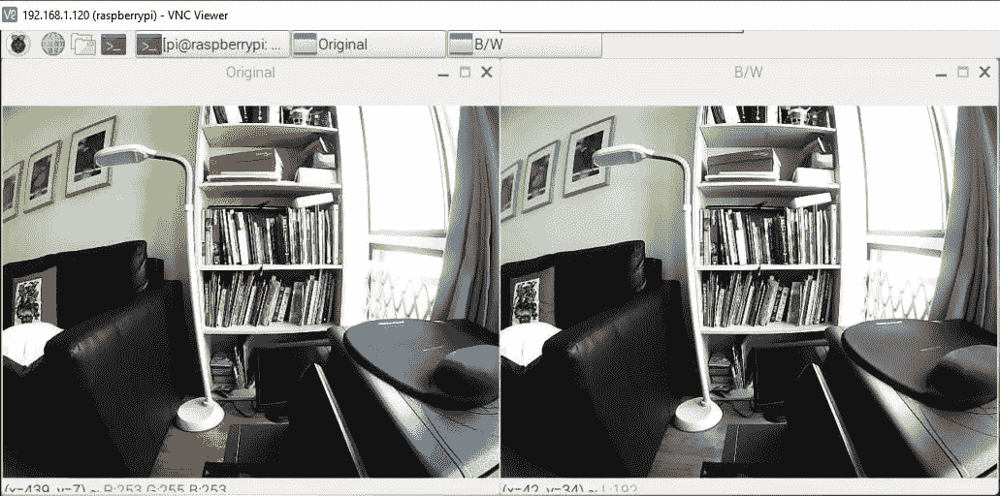
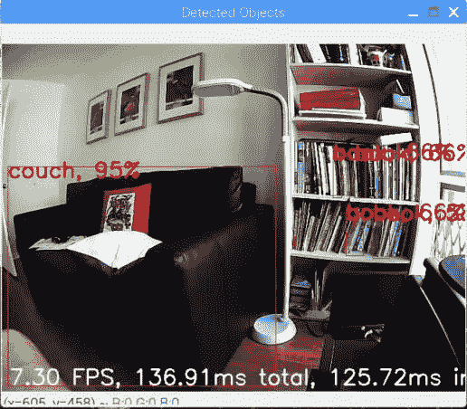

# DeepPiCar —第 3 部分:让 PiCar 看到并思考

> 原文：<https://towardsdatascience.com/deeppicar-part-3-d648b76fc0be?source=collection_archive---------6----------------------->

## [DeepPiCar 系列](https://towardsdatascience.com/tagged/deep-pi-car)

## 设置计算机视觉(OpenCV)和深度学习软件(TensorFlow)。把 PiCar 变成 DeepPiCar。

# 行动纲要

欢迎回来！如果你一直关注我在 DeepPiCar 上的前两篇帖子([第一部分](https://medium.com/@dctian/deeppicar-part-1-102e03c83f2c)和[第二部分](https://medium.com/@dctian/deeppicar-part-1-102e03c83f2c))，你应该有一辆可以通过 Python 控制的跑步机器人汽车。在文章中，我们将赋予您的汽车计算机视觉和深度学习的超能力。在文章的结尾，它将被改造成一个真正的 DeepPiCar，能够检测和识别你房间里的物体。


# 用于计算机视觉的 OpenCV

请注意，我们 PiCar 的唯一感知传感器是 USB DashCam。DashCam 为我们提供了一个实时视频，它本质上是一系列图片。我们将使用 OpenCV，一个强大的开源计算机视觉库，来捕捉和转换这些图片，以便我们可以理解相机所看到的内容。运行以下命令(**粗体**)将其安装到您的 Pi 上。

## 安装打开的 CV 和相关库

```
# install all dependent libraries of OpenCV (yes, this is one long command)
pi@raspberrypi:~ $  **sudo apt-get install libhdf5-dev -y && sudo apt-get install libhdf5-serial-dev -y && sudo apt-get install libatlas-base-dev -y && sudo apt-get install libjasper-dev -y && sudo apt-get install libqtgui4 -y && sudo apt-get install libqt4-test -y**# install OpenCV and other libraries
pi@raspberrypi:~ $ **pip3 install opencv-python**
Collecting opencv-python
[Omitted....]
Installing collected packages: numpy, opencv-python
Successfully installed numpy-1.16.2 opencv-python-3.4.4.19pi@raspberrypi:~ $ **pip3 install matplotlib**
Collecting matplotlib
Collecting pyparsing!=2.0.4,!=2.1.2,!=2.1.6,>=2.0.1 (from matplotlib)
[Omitted...]
Successfully installed cycler-0.10.0 kiwisolver-1.1.0 matplotlib-3.0.3 numpy-1.16.3 pyparsing-2.4.0 python-dateutil-2.8.0 setuptools-41.0.1 six-1.12.0
```

## 测试 OpenCV 安装

下面是最基本的测试，看看我们的 python 库是否安装了。OpenCV 的 Python 模块名是`cv2`。如果您在运行以下命令时没有看到任何错误，那么模块应该安装正确。Numpy 和 Matplotlib 是两个非常有用的 python 模块，我们将结合 OpenCV 使用它们进行图像处理和渲染。

```
pi@raspberrypi:~ $ **python3 -c "import cv2"** pi@raspberrypi:~ $ **python3 -c "import numpy"** pi@raspberrypi:~ $ **python3 -c "import matplotlib"**
```

好了，让我们来尝试一些现场视频处理吧！

```
pi@raspberrypi:~ $ **cd**
pi@raspberrypi:~ $ **git clone** [**https://github.com/dctian/DeepPiCar.git**](https://github.com/dctian/DeepPiCar.git)
Cloning into 'DeepPiCar'...
remote: Enumerating objects: 482, done.
[Omitted...]
Resolving deltas: 100% (185/185), done.pi@raspberrypi:~ $ **cd DeepPiCar/driver/code**
pi@raspberrypi:~ $ **python3 opencv_test.py** 
```



如果您看到两个实时视频屏幕，一个是彩色的，一个是黑白的，那么您的 OpenCV 正在工作！按下`q`退出测试。本质上，该程序获取从相机捕获的图像并按原样显示它(原始窗口)，然后将图像转换为黑白图像(黑白窗口)。这非常重要，因为在[第 4 部分:自动车道导航](https://medium.com/@dctian/deeppicar-part-4-lane-following-via-opencv-737dd9e47c96?source=your_stories_page---------------------------)中，我们将调出多达 9-10 个屏幕，因为原始视频图像将经过许多阶段处理，如下所示。


# 为 CPU 和 EdgeTPU 安装 TensorFlow

谷歌的 TensorFlow 是目前最流行的深度学习 python 库。它可以用于图像识别、人脸检测、自然语言处理和许多其他应用。在 Raspberry Pi 上安装 TensorFlow 有两种方法:

*   CPU 的张量流
*   面向 Edge TPU 协处理器的 TensorFlow(售价 75 美元的 Coral 品牌 u 盘)

## 为 CPU 安装 TensorFlow

第一种方法安装 TensorFlow 的 CPU 版本。我们不会使用 Pi 来执行任何深度学习(即模型训练)，因为它的 CPU 远远不足以进行反向传播，这是学习过程中需要的非常慢的操作。然而，我们可以使用 CPU 根据预先训练的模型进行推理。推断也称为模型预测，它仅使用向前传播，这是一种快得多的计算机操作。即使 CPU 只是进行推理，它也只能在相对较浅的模型(比如 20-30 层)上实时进行推理。对于更深的模型(100+层)，我们需要边缘 TPU。截至 2019 年 5 月，TensorFlow 最新的量产版是 1.13 版本(2.0 还是 alpha)

```
pi@raspberrypi:~ $ **pip3 install tensorflow**
Collecting tensorflow
[omitted...]
pi@raspberrypi:~ $ **pip3 install keras** Collecting keras
[omitted...]
Successfully installed h5py-2.9.0 keras-2.2.4 keras-applications-1.0.7 keras-preprocessing-1.0.9 numpy-1.16.3 pyyaml-5.1 scipy-1.2.1 six-1.12.0
```

现在让我们测试并确保安装顺利。导入 TensorFlow 时，它会报告一些警告信息。但是它们可以被安全地忽略。您应该看不到任何错误。(如果您确实看到了其他错误，请将您键入的命令和错误信息发布在下面的帖子中，我会尽力帮助您。)

```
pi@raspberrypi:~ $ **python3**
Python 3.5.3 (default, Sep 27 2018, 17:25:39) 
[GCC 6.3.0 20170516] on linux
Type "help", "copyright", "credits" or "license" for more information.
>>> **import numpy**
>>> **import cv2**
>>> **import tensorflow**
/usr/lib/python3.5/importlib/_bootstrap.py:222: RuntimeWarning: compiletime version 3.4 of module 'tensorflow.python.framework.fast_tensor_util' does not match runtime version 3.5
  return f(*args, **kwds)
/usr/lib/python3.5/importlib/_bootstrap.py:222: RuntimeWarning: builtins.type size changed, may indicate binary incompatibility. Expected 432, got 412
  return f(*args, **kwds)
>>> **import keras**
Using TensorFlow backend.
>>> quit()
```

## 为 EdgeTPU 安装 TensorFlow

当深度学习模型非常深度，100 层以上，要达到实时性能，需要运行在 EdgeTPU 协处理器上，而不是 CPU 上。然而，在撰写本文时，EdgeTPU 是如此之新(大约在 2019 年初向公众发布)，以至于它无法运行所有可以在 CPU 上运行的模型，因此我们必须仔细选择我们的模型架构，并确保它们可以在 Edge TPU 上工作。关于哪些模型可以在 Edge TPU 上运行的更多细节，请阅读谷歌的[这篇文章。](https://coral.withgoogle.com/docs/edgetpu/models-intro/)

按照下面的说明安装 EdgeTPU 驱动程序和 API。当被问及是否要`enable the maximum operating frequency`时，回答`y`。对于 TPU 来说，我们运行的模型相对来说是轻量级的，我从未见过它运行得非常热。

```
pi@raspberrypi:~ $ **cd** 
pi@raspberrypi:~ $ **wget** [**https://dl.google.com/coral/edgetpu_api/edgetpu_api_latest.tar.gz**](https://dl.google.com/coral/edgetpu_api/edgetpu_api_latest.tar.gz) **-O edgetpu_api.tar.gz --trust-server-names**
--2019-04-20 11:55:39--  [https://dl.google.com/coral/edgetpu_api/edgetpu_api_latest.tar.gz](https://dl.google.com/coral/edgetpu_api/edgetpu_api_latest.tar.gz)
Resolving dl.google.com (dl.google.com)... 172.217.10.78
[omitted]
edgetpu_api.tar.gz  100%[===================>]   7.88M   874KB/s    in 9.3s
2019-04-20 11:55:49 (867 KB/s) - ‘edgetpu_api.tar.gz’ saved [8268747/8268747]pi@raspberrypi:~ $ **tar xzf edgetpu_api.tar.gz**
pi@raspberrypi:~ $ **cd edgetpu_api/**
pi@raspberrypi:~/edgetpu_api $ **bash ./install.sh
Would you like to enable the maximum operating frequency? Y/N
y**
Using maximum operating frequency.
Installing library dependencies...
[omitted]
Installing Edge TPU Python API...
Processing ./edgetpu-1.9.2-py3-none-any.whl
Installing collected packages: edgetpu
Successfully installed edgetpu-1.9.2# restart the pi just to complete the installation
pi@raspberrypi:~/edgetpu_api $ **sudo reboot now**
```

重新启动后，让我们通过运行一个活动对象检测程序来测试它。我们将从 DeepPiCar repo 运行一个演示对象检测应用程序。

```
pi@raspberrypi:~ $ **cd ~/DeepPiCar/models/object_detection/**pi@raspberrypi:~/DeepPiCar/models/object_detection $ **python3 code/coco_object_detection.py** 
W0420 12:36:55.728087    7001 package_registry.cc:65] Minimum runtime version required by package (5) is lower than expected (10).couch, 93% [[  4.81752396 167.15803146]
 [381.77787781 475.49484253]] 113.52ms
book, 66% [[456.68899536 145.12086868]
 [468.8772583  212.99516678]] 113.52ms
book, 58% [[510.65818787 229.35571671]
 [534.6181488  296.00133896]] 113.52ms
book, 58% [[444.65190887 222.51708984]
 [467.33409882 290.39138794]] 113.52ms
book, 58% [[523.65917206 142.07738876]
 [535.19741058 213.77527237]] 113.52ms
------
2019-04-20 12:36:57.025142: 7.97 FPS, 125.46ms total, 113.52ms in tf
```

您应该会看到一个实时视频屏幕出现，它会以大约 7-8 帧/秒的速度尝试识别屏幕中的对象。请注意， [COCO(上下文中的常见对象)对象检测模型](http://cocodataset.org/#home)可以检测大约 100 个常见对象，如人、椅子、电视、沙发、书、笔记本电脑、手机等。不要让这个简单的程序欺骗了你，这是**深度学习**在起作用。这个程序使用的物体检测模型叫做 [ssd_mobilenet_coco_v2](https://github.com/tensorflow/models/blob/master/research/object_detection/g3doc/detection_model_zoo.md#coco-trained-models) ，它包含了 200 多层！(作为比较，我之前曾尝试使用 Pi 的 CPU 运行 COCO 对象检测模型，这是一个长得多的设置，只能以 1 帧/秒的速度运行，CPU 的利用率为 100%，CPU 温度上升非常快。所以不建议在 CPU 上运行深度模型。)当然，这只是一个演示应用程序，它可以确认 Edge TPU 的设置是否正确。我们将在本系列的第 6 部分中利用 Edge TPU 的全部功能，[实时交通标志和行人检测与处理](https://medium.com/@dctian/deeppicar-part-6-963334b2abe0?source=your_stories_page---------------------------)。



更新(2020 年 3 月):自从我的博客在 2019 年 4 月发表以来，Coral EdgeTPU 的安装已经更新。请按照目前 Google [这里](https://coral.ai/docs/accelerator/get-started/)的官方说明安装 Tensorflow Lite API 和 EdgeTPU 运行时，这样就可以做上面的物体检测例子了。

# 下一步是什么

恭喜你，我们现在已经给你的车同时赋予了眼睛(摄像头和 OpenCV)和大脑(TensorFlow)，所以它确实是一辆 *DeepPiCar* 。无论何时你准备好了，前往[第四部分](https://medium.com/@dctian/deeppicar-part-4-lane-following-via-opencv-737dd9e47c96?source=your_stories_page---------------------------)，在那里我们将教 DeepPiCar 在车道内自主导航。

以下是整个指南的链接:

第 1 部分:[概述](https://medium.com/@dctian/deeppicar-part-1-102e03c83f2c)

第 2 部分: [Raspberry Pi 设置和 PiCar 装配](https://medium.com/@dctian/deeppicar-part-2-8512be2133f3)

第 3 部分:[让 PiCar 看到并思考](https://medium.com/@dctian/deeppicar-part-3-d648b76fc0be)(本文)

第 4 部分:[通过 OpenCV 的自主车道导航](https://medium.com/@dctian/deeppicar-part-4-lane-following-via-opencv-737dd9e47c96?source=your_stories_page---------------------------)

第五部分:[自主](https://medium.com/@dctian/deeppicar-part-4-lane-following-via-opencv-737dd9e47c96?source=your_stories_page---------------------------) [通过深度学习进行车道导航](https://medium.com/@dctian/deeppicar-part-5-lane-following-via-deep-learning-d93acdce6110?source=your_stories_page---------------------------)

第六部分:[交通标志和行人检测处理](https://medium.com/@dctian/deeppicar-part-6-963334b2abe0?source=your_stories_page---------------------------)