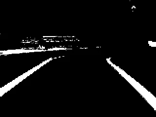

# DeepPiCar —第 4 部分:通过 OpenCV 的自主车道导航

> 原文：<https://towardsdatascience.com/deeppicar-part-4-lane-following-via-opencv-737dd9e47c96?source=collection_archive---------2----------------------->

## [DeepPiCar 系列](https://towardsdatascience.com/tagged/deep-pi-car)

## 使用 OpenCV 检测颜色、边缘和线段。然后计算转向角度，以便 PiCar 可以在车道内自行导航。


Adaptive Cruise Control (left) and Lane Keep Assist System (right)

# 行动纲要

随着所有的硬件([第二部分](/deeppicar-part-2-8512be2133f3?source=your_stories_page---------------------------))和软件([第三部分](/deeppicar-part-3-d648b76fc0be?source=your_stories_page---------------------------))设置完毕，我们已经准备好享受赛车的乐趣了！在本文中，我们将使用一个流行的开源计算机视觉包 OpenCV 来帮助 PiCar 在车道内自主导航。注意这篇文章只会让我们的 PiCar 成为一辆“自动驾驶汽车”，而不是一辆**深度学习**，自动驾驶汽车。深度学习部分会出现在 [Part 5](https://medium.com/@dctian/deeppicar-part-5-lane-following-via-deep-learning-d93acdce6110?source=your_stories_page---------------------------) 和 [Part 6](https://medium.com/@dctian/deeppicar-part-6-963334b2abe0?source=your_stories_page---------------------------) 中。

# 介绍

目前，市场上有几款 2018-2019 款汽车搭载了这两项功能，即自适应巡航控制(ACC)和某些形式的车道保持辅助系统(LKAS)。自适应巡航控制使用雷达来检测并与前方的汽车保持安全距离。这一功能自 2012–2013 年左右就已出现。车道保持辅助系统是一个相对较新的功能，它使用安装在挡风玻璃上的摄像头来检测车道线，并进行转向，以便汽车位于车道中间。当你在高速公路上开车时，这是一个非常有用的功能，无论是在拥挤的交通中还是在长途驾驶中。圣诞节期间，我们全家开车从芝加哥去科罗拉多滑雪，一共开了 35 个小时。我们的沃尔沃 XC 90 拥有 ACC 和 LKAS(沃尔沃称之为 PilotAssit)，在高速公路上表现出色，因为 95%漫长而无聊的高速公路里程都是由我们的沃尔沃驾驶的！我所要做的就是把手放在方向盘上(但不一定要转向)，然后盯着前方的路。当道路弯弯曲曲时，或者当我们前面的车减速或停车时，甚至当一辆车从另一条车道超车时，我都不需要转向、刹车或加速。它不能自动驾驶的几个小时是当我们开车穿过暴风雪时，车道标志被雪覆盖。(沃尔沃，如果你在读这篇文章，是的，我要代言！:)我很好奇，心想:我想知道这是如何工作的，如果我能自己复制它(在较小的规模上)岂不是很酷？

今天，我们将把 LKAS 建成我们的深海乐园。实现 ACC 需要雷达，我们 PiCar 没有。在以后的文章中，我可能会在 DeepPiCar 上添加一个超声波传感器。类似于雷达，超声波也可以探测距离，除了在更近的范围内，这对于小型机器人汽车来说是完美的。

# 感知:车道检测

车道保持辅助系统有两个组成部分，即感知(车道检测)和路径/运动规划(转向)。车道检测的工作是将道路的视频转化为检测到的车道线的坐标。实现这一点的一种方法是通过计算机视觉包，我们在第 3 部分 OpenCV 中安装了这个包。但是在我们能够检测视频中的车道线之前，我们必须能够检测单幅图像中的车道线。一旦我们可以做到这一点，检测视频中的车道线只是简单地对视频中的所有帧重复相同的步骤。步骤很多，那就开始吧！

## 隔离车道的颜色

当我在客厅为我的 DeepPiCar 设置车道线时，我使用了蓝色画家的胶带来标记车道，因为蓝色是我房间的独特颜色，胶带不会在硬木地板上留下永久的粘性残留物。


Original DashCam Image (left) and Blue Masking Tape for Lane Line (right)

上面是来自我们 DeepPiCar 的 DashCam 的典型视频帧。首先要做的是隔离图像上所有的蓝色区域。为此，我们首先需要将图像使用的颜色空间，即 RGB(红/绿/蓝)转换为 HSV(色调/饱和度/值)颜色空间。(阅读此处了解更多关于 [HSV 色彩空间](https://en.wikipedia.org/wiki/HSL_and_HSV)的详细信息。)这背后的主要思想是，在 RGB 图像中，蓝色胶带的不同部分可能被不同的光照亮，导致它们看起来像深蓝色或浅蓝色。然而，在 HSV 色彩空间中，色调组件将整个蓝色带渲染为一种颜色，而不管其阴影如何。最好用下图来说明。请注意，现在两条车道线的洋红色大致相同。


Image in HSV Color Space

下面是实现这一点的 OpenCV 命令。

注意，我们用的是**到 HSV 的转化，而不是**到 HSV 的转化。这是因为 OpenCV 由于一些传统原因，默认情况下将图像读入 BGR(蓝/绿/红)色彩空间，而不是更常用的 RGB(红/绿/蓝)色彩空间。它们本质上是等价的颜色空间，只是交换了颜色的顺序。****

****一旦图像在 HSV 中，我们可以从图像中“提升”所有的蓝色。这是通过指定蓝色的范围来实现的。****

****在色调色彩空间中，蓝色大约在 120-300 度范围内，在 0-360 度标度上。您可以为蓝色指定一个更窄的范围，比如 180-300 度，但这没有太大关系。****

********

****Hue in 0–360 degrees scale****

****下面是通过 OpenCV 提升蓝色的代码，以及渲染的蒙版图像。****

********

****Blue Area Mask****

****注意 OpenCV 使用的范围是 0–180，而不是 0–360，所以我们需要在 OpenCV 中指定的蓝色范围是 60–150(而不是 120–300)。这些是下限和上限数组的第一个参数。第二个参数(饱和度)和第三个参数(值)并不重要，我发现 40-255 的范围对于饱和度和值来说都相当不错。****

****注意这种技术正是电影工作室和天气预报员每天使用的。他们通常使用绿色屏幕作为背景，这样他们就可以将绿色与霸王龙向我们冲过来的惊险视频(电影)或实时多普勒雷达图(天气预报员)进行交换。****

****************

## ****检测车道线的边缘****

****接下来，我们需要检测蓝色遮罩中的边缘，以便我们可以有几条不同的线来表示蓝色车道线。****

****[Canny 边缘检测功能](https://docs.opencv.org/master/da/d22/tutorial_py_canny.html)是检测图像边缘的强大命令。在下面的代码中，第一个参数是上一步中的蓝色遮罩。第二个和第三个参数是边缘检测的下限和上限，OpenCV 建议为(100，200)或(200，400)，因此我们使用(200，400)。****

********

****Edges of all Blue Areas****

****将上面的命令放在一起，下面是隔离图像上的蓝色并提取所有蓝色区域的边缘的函数。****

## ****隔离感兴趣区域****

****从上面的图像中，我们看到我们发现了相当多的蓝色区域不是我们的车道线。仔细一看，发现它们都在屏幕的上半部分。事实上，在进行车道导航时，我们只关心检测离汽车更近的车道线，即屏幕底部。因此，我们将简单地裁剪掉上半部分。嘣！如右图所示，两条明显标记的车道线！****

************

Edges (left) and Cropped Edges (right)**** 

****下面是实现这一点的代码。我们首先为屏幕的下半部分创建一个遮罩。然后当我们将`mask`和`edges`图像合并，得到右边的`cropped_edges`图像。****

## ****检测线段****

****在上面的裁剪边缘图像中，对我们人类来说，很明显我们发现了四条线，代表两条车道线。然而，对于计算机来说，它们只是黑色背景上的一堆白色像素。不知何故，我们需要从这些白色像素中提取出这些车道线的坐标。幸运的是，OpenCV 包含了一个神奇的函数，叫做 Hough Transform，它可以做到这一点。霍夫变换是一种用于图像处理的技术，用于提取直线、圆和椭圆等特征。我们将使用它从一堆似乎形成一条线的像素中找到直线。函数 HoughLinesP 本质上试图拟合许多穿过所有白色像素的线，并返回最可能的线集合，服从某些最小阈值约束。(阅读此处深入解释[霍夫线变换](https://docs.opencv.org/3.0-beta/doc/py_tutorials/py_imgproc/py_houghlines/py_houghlines.html)。)****

****************

****Hough Line Detection (left), Votes (middle), detected lines (right)****

****下面是检测线段的代码。在内部，HoughLineP 使用极坐标检测直线。极坐标(仰角和离原点的距离)优于笛卡尔坐标(斜率和截距)，因为它可以表示任何线，包括笛卡尔坐标不能表示的垂直线，因为垂直线的斜率是无穷大。HoughLineP 有很多参数:****

*   ****rho 是以像素为单位的距离精度。我们将使用一个像素。****
*   ****角度是以弧度为单位的角度精度。(三角学快速复习:弧度是表示角度度数的另一种方式。即弧度 180 度就是 3.14159，也就是π)我们就用一度。****
*   ****min_threshold 是被认为是线段所需的投票数。如果一条线有更多的投票，霍夫变换认为它们更有可能检测到线段****
*   ****minLineLength 是线段的最小长度，以像素为单位。霍夫变换不会返回任何短于此最小长度的线段。****
*   ****maxLineGap 是可以分开但仍被视为单个线段的两条线段的最大像素值。例如，如果我们有虚线车道标记，通过指定合理的最大线间隙，霍夫变换会将整个虚线车道线视为一条直线，这是可取的。****

****设置这些参数实际上是一个反复试验的过程。下面是我的机器人汽车在 320x240 分辨率的摄像机运行在纯蓝色车道线之间时工作良好的值。当然，它们需要重新调整，以适应一辆实物大小的汽车，配有高分辨率摄像头，在真实的道路上以白色/黄色虚线行驶。****

****如果我们打印出检测到的线段，它将显示端点(x1，y1)后接(x2，y2)和每条线段的长度。****

```
**INFO:root:Creating a HandCodedLaneFollower...
DEBUG:root:detecting lane lines...
DEBUG:root:detected line_segment:
DEBUG:root:[[  7 193 107 120]] of length 123
DEBUG:root:detected line_segment:
DEBUG:root:[[226 131 305 210]] of length 111
DEBUG:root:detected line_segment:
DEBUG:root:[[  1 179 100 120]] of length 115
DEBUG:root:detected line_segment:
DEBUG:root:[[287 194 295 202]] of length 11
DEBUG:root:detected line_segment:
DEBUG:root:[[241 135 311 192]] of length 90**
```

********

****Line segments detected by Hough Transform****

## ****将线段合并成两条车道线****

****现在我们有了许多端点坐标为(x1，y1)和(x2，y2)的小线段，我们如何将它们组合成我们真正关心的两条线，即左车道线和右车道线？一种方法是根据这些线段的斜率对它们进行分类。从上图中我们可以看到，属于**左**车道线的所有线段都应该是屏幕左侧的**上斜**和**，而属于**右**车道线的所有线段都应该是屏幕右侧**的**下斜**和**。一旦线段被分成两组，我们只需取线段的斜率和截距的平均值，就可以得到左右车道线的斜率和截距。******

**下面的`average_slope_intercept`函数实现了上面的逻辑。**

**`make_points`是`average_slope_intercept`函数的辅助函数，它获取直线的斜率和截距，并返回线段的端点。**

**除了上面描述的逻辑之外，还有一些特殊情况值得讨论。**

1.  **图像中的一条车道线:在正常情况下，我们希望摄像机能看到两条车道线。然而，有时汽车开始偏离车道，可能是由于转向逻辑有缺陷，或者是当车道转弯太急。此时，摄像机可能只捕捉到一条车道线。这就是为什么上面的代码需要检查`len(right_fit)>0`和`len(left_fit)>0`**
2.  **垂直线段:当汽车转弯时，偶尔会检测到垂直线段。虽然它们不是错误的检测，但是因为垂直线具有无穷大的斜率，所以我们不能将它们与其他线段的斜率进行平均。为了简单起见，我选择忽略它们。由于垂直线不是很常见，这样做不会影响车道检测算法的整体性能。或者，可以翻转图像的 X 和 Y 坐标，因此垂直线的斜率为零，这可以包括在平均值中。但是水平线段的斜率为无穷大，但这种情况非常罕见，因为仪表板摄像头通常指向与车道线相同的方向，而不是垂直于车道线。另一种方法是用极坐标表示线段，然后对角度和到原点的距离取平均值。**

******

Only one lane line (left), Vertical Line segment in left lane line (right)** 

## **车道检测摘要**

**将以上步骤放在一起，这里是 detect_lane()函数，它给定一个视频帧作为输入，返回(最多)两条车道线的坐标。**

**我们将在原始视频帧的顶部绘制车道线:**

**这是检测到的车道线以绿色绘制的最终图像。**

******

Original Frame (left) and Frame with Detected Lane Lines (right)** 

# **运动规划:转向**

**现在我们有了车道线的坐标，我们需要驾驶汽车，使它保持在车道线内，更好的是，我们应该尽量把它保持在车道的**中间**。基本上，我们需要根据检测到的车道线计算汽车的转向角度。**

## **两条检测到的车道线**

**这是一个简单的场景，因为我们可以通过简单地平均两条车道线的远端点来计算前进方向。下面显示的红线是标题。请注意，红色标题线的下端总是在屏幕底部的中间，这是因为我们假设 dashcam 安装在汽车的中间，并指向正前方。**

****

## **一条检测到的车道线**

**如果我们只检测到一条车道线，这将有点棘手，因为我们不能再平均两个端点。但是请注意，当我们只看到一条车道线时，比如说只看到左(右)车道，这意味着我们需要向右(左)使劲转向，这样我们就可以继续沿着车道行驶。一种解决方案是将标题线设置为与唯一车道线相同的坡度，如下所示。**

********

## **转向角**

**现在我们知道我们要去哪里，我们需要把它转换成转向角，这样我们就可以告诉汽车转向。记住，对于这辆皮卡来说，90 度的转向角是直行，45-89 度是左转，91-135 度是右转。下面是一些将航向坐标转换成以度为单位的转向角的三角方法。请注意，PiCar 是为普通男性创建的，因此它使用的是度数而不是弧度。但是所有的三角数学都是用弧度表示的。**

## **显示标题行**

**我们在上面展示了几幅带有标题行的图片。下面是呈现它的代码。输入实际上是转向角。**

## **稳定化**

**最初，当我从每个视频帧计算转向角度时，我只是告诉 PiCar 以这个角度转向。然而，在实际的道路测试中，我发现 PiCar 有时会像醉酒司机一样在车道线之间左右弹跳，有时会完全冲出车道。然后我发现这是由于从一个视频帧到下一个视频帧计算的转向角度不太稳定造成的。你应该在没有稳定逻辑的车道上开车，明白我的意思。有时，转向角可能暂时在 90 度左右(直线行驶)，但是，无论什么原因，计算出的转向角可能会突然剧烈跳动，比如 120 度(向右急转弯)或 70 度(向左急转弯)。结果，汽车会在车道内左右颠簸。显然，这是不可取的。我们需要稳定驾驶。的确，在现实生活中，我们有一个方向盘，所以如果我们想向右转向，我们就平稳地转动方向盘，转向角作为一个连续的值发送给汽车，即 90°、91°、92°…。132，133，134，135 度，不是一毫秒 90 度，下一毫秒 135 度。**

**所以我稳定转向角度的策略如下:如果新的角度与当前角度相差超过`max_angle_deviation`度，就在新角度的方向上最多转向`max_angle_deviation`度。**

**在上面的代码中，我使用了两种风格的`max_angle_deviation`，如果两条车道线都被检测到，则为 5 度，这意味着我们更加确信我们的方向是正确的；1 度，如果只检测到一条车道线，这意味着我们不太有信心。这些是你可以为自己的车调整的参数。**

# **把它放在一起**

**执行 LKAS(车道跟踪)的完整代码在我的 [DeepPiCar GitHub repo](https://github.com/dctian/DeepPiCar/tree/master/driver/code) 中。在 DeepPiCar/driver/code 文件夹中，这些是感兴趣的文件:**

*   **`deep_pi_car.py`:这是 DeepPiCar 的主要入口**
*   **`hand_coded_lane_follower.py`:这是车道检测和跟随逻辑。**

**只需运行以下命令来启动您的汽车。(当然，我假设你已经记下了车道线并将 PiCar 放在车道上。)**

```
# skip this line if you have already cloned the repo
pi@raspberrypi:~ $ **git clone** [**https://github.com/dctian/DeepPiCar.git**](https://github.com/dctian/DeepPiCar.git)pi@raspberrypi:~ $ **cd DeepPiCar/driver/code**
pi@raspberrypi:~/DeepPiCar/driver/code $ **python3 deep_pi_car.py** 
INFO :2019-05-08 01:52:56,073: Creating a DeepPiCar...
DEBUG:2019-05-08 01:52:56,093: Set up camera
DEBUG:2019-05-08 01:52:57,639: Set up back wheels
DEBUG "back_wheels.py": Set debug off
DEBUG "TB6612.py": Set debug off
DEBUG "TB6612.py": Set debug off
DEBUG "PCA9685.py": Set debug off
DEBUG:2019-05-08 01:52:57,646: Set up front wheels
DEBUG "front_wheels.py": Set debug off
DEBUG "front_wheels.py": Set wheel debug off
DEBUG "Servo.py": Set debug off
INFO :2019-05-08 01:52:57,665: Creating a HandCodedLaneFollower...
```

**如果你的设置和我的非常相似，你的 PiCar 应该像下面这样在房间里走来走去！键入`Q`退出程序。**

# **下一步是什么**

**在这篇文章中，我们教会了我们的 DeepPiCar 在车道线内自主导航(LKAS)，这非常棒，因为市场上的大多数汽车还不能做到这一点。然而，这并不十分令人满意，因为我们不得不用 python 和 OpenCV 编写大量手工调整的代码来检测颜色、检测边缘、检测线段，然后不得不猜测哪些线段属于左车道线或右车道线。在这篇文章中，我们必须设置许多参数，如蓝色的上限和下限，霍夫变换中检测线段的许多参数，以及稳定期间的最大转向偏差。事实上，我们在这个项目中没有使用任何深度学习技术。如果我们可以“展示”DeepPiCar 如何驾驶，并让它知道如何驾驶，岂不是很酷？这就是深度学习和大数据的承诺，不是吗？在下一篇文章中，这正是我们将要建造的，一辆深度学习的自动驾驶汽车，它可以通过观察一个优秀的司机如何驾驶来学习。《T2》第五部再见。**

**以下是整个指南的链接:**

**第一部分:[概述](https://medium.com/@dctian/deeppicar-part-1-102e03c83f2c)**

**第 2 部分: [Raspberry Pi 设置和 PiCar 装配](https://medium.com/@dctian/deeppicar-part-2-8512be2133f3)**

**第 3 部分:[让 PiCar 看到并思考](https://medium.com/@dctian/deeppicar-part-3-d648b76fc0be)**

**第 4 部分:[通过 OpenCV 的自主车道导航](https://medium.com/@dctian/deeppicar-part-4-lane-following-via-opencv-737dd9e47c96?source=your_stories_page---------------------------)(本文)**

**第五部分:[自主](https://medium.com/@dctian/deeppicar-part-4-lane-following-via-opencv-737dd9e47c96?source=your_stories_page---------------------------) [通过深度学习进行车道导航](https://medium.com/@dctian/deeppicar-part-5-lane-following-via-deep-learning-d93acdce6110?source=your_stories_page---------------------------)**

**第六部分:[交通标志和行人检测与处理](https://medium.com/@dctian/deeppicar-part-6-963334b2abe0?source=your_stories_page---------------------------)**