# DeepPiCar 第 5 部分:通过深度学习实现自主车道导航

> 原文：<https://towardsdatascience.com/deeppicar-part-5-lane-following-via-deep-learning-d93acdce6110?source=collection_archive---------3----------------------->

## [DeepPiCar 系列](https://towardsdatascience.com/tagged/deep-pi-car)

## 使用英伟达的端到端深度学习方法来教会我们的 PiCar 自主导航车道。

# 行动纲要

欢迎回来！如果你已经通读了 [DeepPiCar 第四部](https://medium.com/@dctian/deeppicar-part-4-lane-following-via-opencv-737dd9e47c96?source=your_stories_page---------------------------)，你应该有一辆自动驾驶汽车，它可以在车道内相当平稳地自动驾驶。在本文中，我们将使用深度学习方法来教我们的 PiCar 做同样的事情，将它变成一个 **DeepPiCar** 。这类似于你我是如何学会开车的，通过观察好的司机(比如我们的父母或者驾校教练)是如何开车的，然后开始自己开车，一路上从自己的错误中学习。请注意，对于本文的大部分内容，您不需要使用 DeepPiCar 来理解，因为我们将在 Google 的 Colab 上进行深度学习，这是免费的。

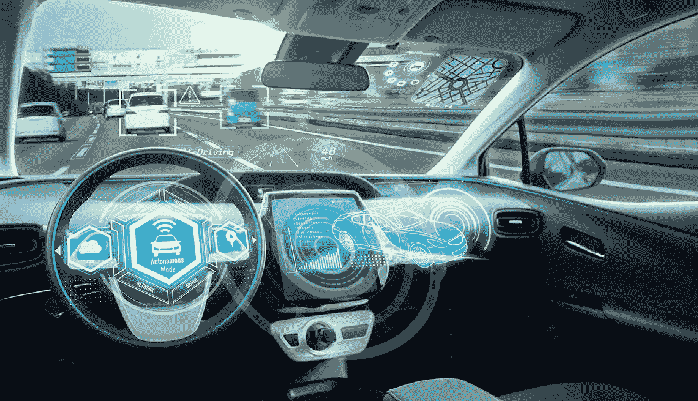

# 介绍

回想一下第 4 部分，我们手工设计了驾驶汽车所需的所有步骤，即颜色隔离、边缘检测、线段检测、转向角度计算和转向稳定性。此外，有相当多的参数需要手动调整，如蓝色的上限和下限，通过霍夫变换检测线段的许多参数，以及稳定期间的最大转向偏差等。如果我们没有正确调整所有这些参数，我们的汽车就不会平稳运行。此外，每当我们遇到新的路况时，我们都必须想出新的检测算法，并将其编程到汽车中，这非常耗时，也很难维护。在人工智能和机器学习的时代，我们不应该只是向机器“展示”要做什么，并让它向我们学习，而不是我们“告诉”它具体的步骤吗？幸运的是，Nvidia 的研究人员在[这篇出色的论文](https://arxiv.org/abs/1604.07316)中展示了，通过“展示”一辆全尺寸汽车如何驾驶，汽车将学会自动驾驶。这听起来很神奇，对吧？让我们看看这是如何做到的，以及如何将其应用到我们的 DeepPiCar。

# Nvidia 型号

在高层次上，Nvidia 模型的输入是来自汽车上仪表板摄像头的视频图像，输出是汽车的转向角度。该模型使用视频图像，从中提取信息，并试图预测汽车的转向角度。这被称为**监督机器学习程序**，其中视频图像(称为**特征**)和转向角度(称为**标签**)被用于训练。因为转向角度是数值，这是一个**回归**问题，而不是**分类**问题，其中模型需要预测图像中是狗还是猫，或者哪一种类型的花。

在英伟达模型的核心，有一个**卷积神经网络** (CNN，**不是**有线电视网)。细胞神经网络广泛用于图像识别深度学习模型。直觉是，CNN 特别擅长从其各个层面的图像中提取视觉特征(又名。过滤器)。例如，对于面部识别 CNN 模型，早期层将提取基本特征，如线条和边缘，中间层将提取更高级的特征，如眼睛、鼻子、耳朵、嘴唇等，后期层将提取部分或全部面部，如下所示。关于 CNN 的全面讨论，请查看[卷积神经网络的维基百科页面](https://en.wikipedia.org/wiki/Convolutional_neural_network)。

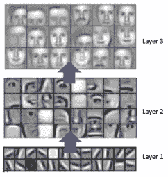

Nvidia 模型中使用的 CNN 图层与上面非常相似，因为它在早期图层中提取线条和边缘，在后期图层中提取复杂的形状。完全连接的层功能可以被认为是用于转向的控制器。

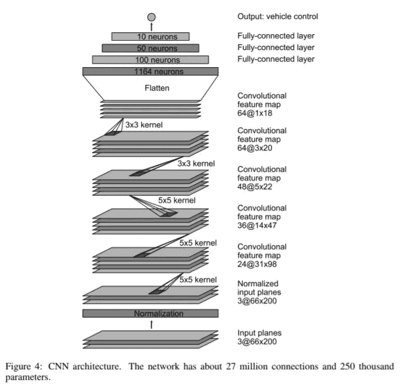

上图来自英伟达的论文。它总共包含大约 30 层，以今天的标准来看并不是一个很深的模型。模型的输入图像(图的底部)是一个 66x200 像素的图像，这是一个分辨率非常低的图像。该图像首先被归一化，然后通过 5 组卷积层，最后通过 4 个全连接的神经层并到达单个输出，这是汽车的模型预测转向角。

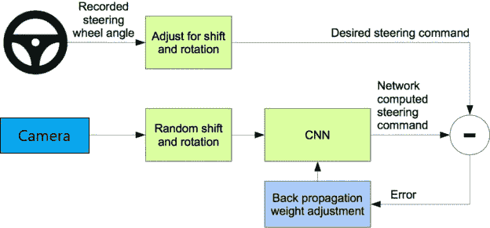

然后将该模型预测角度与给定视频图像的期望转向角度进行比较，误差通过**反向传播**反馈到 CNN 训练过程中。从上图可以看出，这个过程会循环重复，直到误差(又名**损失或均方差**)足够低，这意味着模型已经学会了如何合理地驾驶。事实上，这是一个非常典型的图像识别训练过程，除了预测输出是一个数值(**回归**)而不是物体的类型(**分类**)。

# 为 DeepPiCar 调整 Nvidia 模型

除了尺寸之外，我们的 DeepPiCar 与 Nvidia 使用的汽车非常相似，因为它有一个仪表板摄像头，可以通过指定转向角度来控制。Nvidia 通过让其司机在不同的州和多辆汽车上行驶 70 小时的公路里程来收集数据。因此，我们需要收集一些 DeepPiCar 的视频镜头，并记录每个视频图像的正确转向角度。

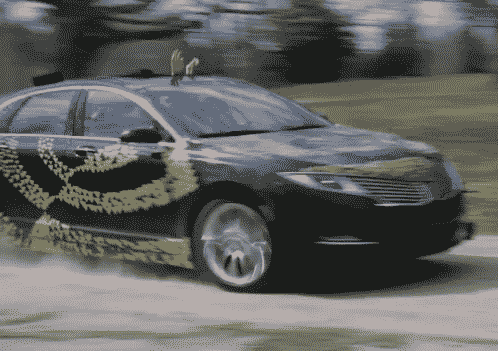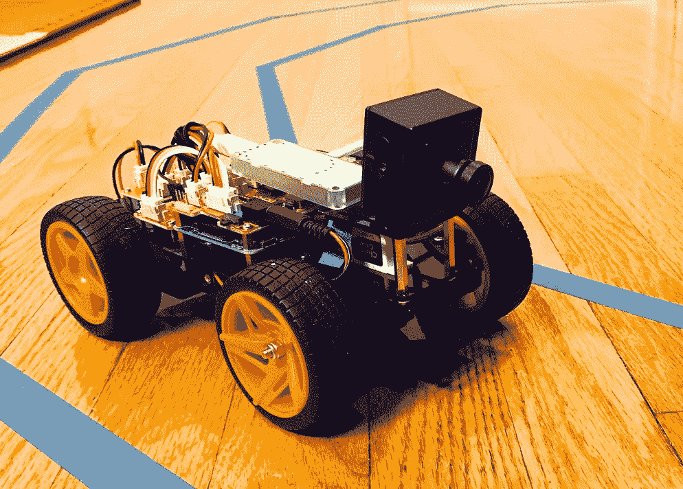

See the similarities? No Hands on the steering wheel!

## 数据采集

有多种方法可以收集训练数据。

一种方法是编写一个远程控制程序，这样我们就可以远程控制 PiCar，并让它保存视频帧以及汽车在每一帧的转向角度。这可能是最好的方法，因为它将模拟一个真实的人的驾驶行为，但需要我们编写一个远程控制程序。一种更简单的方法是利用我们在第 4 部分中构建的东西，即通过 OpenCV 的车道跟随器。因为它运行得相当好，我们可以使用该实现作为我们的“模型”驱动程序。机器从另一台**机器**学习！我们所要做的就是在赛道上运行我们的 OpenCV 实现几次，保存视频文件和相应的转向角度。然后我们可以用它们来训练我们的 Nvidia 模型。在第 4 部分，`deep_pi_car.py`会自动保存下来一个视频文件(AVI 文件)每次你运行汽车。

下面是获取视频文件并保存单个视频帧用于训练的代码。为了简单起见，我将转向角作为图像文件名的一部分嵌入，因此我不必维护图像名称和转向角之间的映射文件。

假设您有第 4 部分中录制的名为 video01.avi 的 dashcam 视频，

这是一个 DashCam 视频示例。

下面是保存静态图像的命令，并用转向角度标记它。

```
pi@raspberrypi:~/DeepPiCar/driver/code $ **python3 save_training_data.py ~/DeepPiCar/models/lane_navigation/data/images/video01**
```

以下是生成的图像文件。请注意。png 后缀是转向角。从下面，我们可以知道汽车正在左转，因为角度都小于 90 度，这是从上面观看 DashCam 视频确认的。

```
pi@raspberrypi:~/DeepPiCar/driver/code $ **ls ~/DeepPiCar/models/lane_navigation/data/images |more**
video01_000_**085**.png
video01_001_**080**.png
video01_002_**077**.png
video01_003_**075**.png
video01_004_**072**.png
video01_005_**073**.png
video01_006_**069**.png
```

## 培训/深度学习

现在我们有了特征(视频图像)和标签(转向角度)，是时候做一些深度学习了！事实上，这是我们在这个 DeepPiCar 博客系列中第一次做深度学习。尽管目前 D **eep Learning** 都是炒作，但重要的是要注意**它只是整个工程项目**的一小部分。大部分时间/工作实际上花费在硬件工程、软件工程、数据收集/清理上，最后将深度学习模型的预测连接到生产系统(像一辆行驶的汽车)等。

做深度学习模型训练，不能用树莓派的 CPU，需要一些 GPU 肌肉！然而，我们的预算很少，所以我们不想购买配备最新 GPU 的昂贵机器，也不想从云中租用 GPU 时间。幸运的是，谷歌在这个名为[谷歌实验室](https://colab.research.google.com)的网站上免费提供了一些 GPU 甚至 TPU 动力**！感谢谷歌给了我们机器学习爱好者一个学习的好地方！**

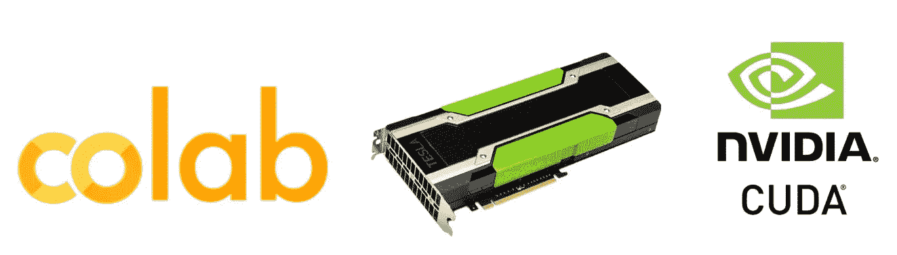

Colab 是一个免费的基于云的 Jupyter 笔记本，让你用 Python 编写和训练深度学习模型。支持的流行 python 库有 TensorFlow、Keras、OpenCV、Pandas 等。最酷的是，TensorFlow for GPU 已经预装，因此您不必花几个小时来摆弄 pip 或 CUDA 驱动程序或软件设置，并且可以直接投入到训练您的模型中。

事不宜迟，让我们开始 Jupyter 笔记本。我假设读者相对精通 Python 和 Keras 库。

这里是我在 GitHub 上的整个[端到端深度学习车道导航笔记本](https://github.com/dctian/DeepPiCar/blob/master/models/lane_navigation/code/end_to_end_lane_navigation.ipynb)。我将在下面介绍它的关键部分。

**导入库**

首先，我们需要导入我们将在培训过程中使用的 python 库。

**加载训练数据**

然后我们需要加载训练数据。对于本文，我已经将生成的图像文件的样本集上传到我的 GitHub，以便读者可以克隆它并跟随它。记住，图像文件命名为`videoXX_FFF_SSS.png`，其中`videoXX`是视频的名称，`FFF`是视频中的帧数，`SSS`是以度为单位的转向角度。生成的训练数据被读入`image_paths`和`steering_angles`变量。比如`video01_054_110.png`表示这张图片来自`video01.avi`视频文件，是第 54 帧，转向角度 110 度(右转)。

**分成训练/测试组**

我们将使用 sklearn 的`train_test_split`方法将训练数据分成 80/20 的训练/验证集。

**图像增强**

样本训练数据集只有大约 200 幅图像。显然，这不足以训练我们的深度学习模型。然而，我们可以采用一种简单的技术，称为图像增强。一些常见的增强操作有缩放、平移、更改曝光值、模糊和图像翻转。通过在原始图像上随机应用这 5 种操作中的任何一种或全部，我们可以从原始的 200 幅图像中生成更多的训练数据，这使得我们最终训练的模型更加健壮。我将在下面举例说明缩放和翻转。其他操作非常相似，在我的 GitHub 中的 Jupyter 笔记本中有所介绍。

**缩放**

这是随机缩放的代码，在 100%和 130%之间，以及结果缩放图像(右)。

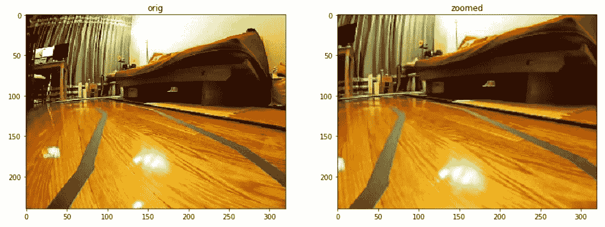

**翻转**

这是随机翻转的代码。请注意，翻转操作不同于其他图像增强操作，因为当我们翻转图像时，我们需要改变转向角度。例如，下图(左)的原始图像有一条向左弯曲的车道线，因此转向角为 85°。但是当我们翻转图像时，车道线现在指向右边，所以正确的角度是`180 -original_angle`，是 95 度。

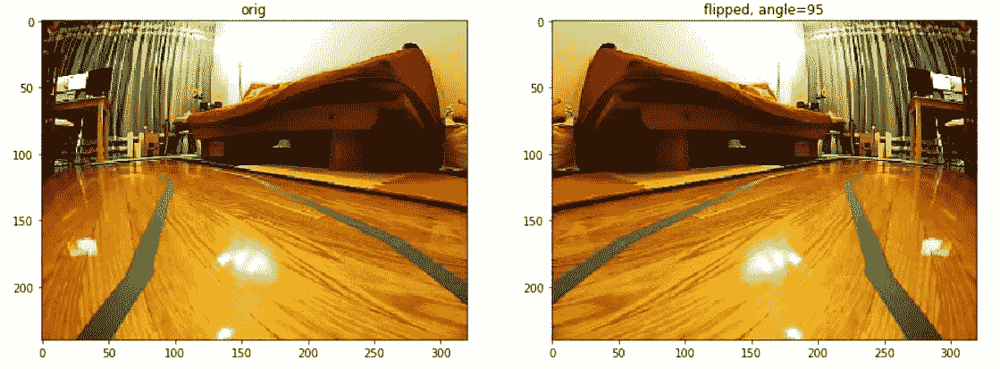

我们有一个函数将所有的增强操作组合在一起，因此一个图像可以应用任何或所有的操作。

**图像预处理**

我们还需要将我们的图像转换成 Nvidia 模型接受的颜色空间和大小。首先， [Nvidia 研究论文](https://arxiv.org/pdf/1604.07316.pdf)要求输入图像为 200x66 像素分辨率。类似于我们在第 4 部分中所做的，图像的上半部分与预测转向角无关，所以我们将把它裁剪掉。其次，它要求图像在 YUV 颜色空间中。我们将简单地使用`cv2.cvtColor()`来做到这一点。最后，它要求我们将图像标准化。

**英伟达型号**

这里我们再次呈现 Nvidia 模型架构，所以我们可以很容易地在代码中将其与我们的模型进行比较。


请注意，我们已经相当忠实地实现了 Nvidia 模型架构，只是我们移除了标准化层，因为我们会在模型外部这样做，并添加一些丢弃层，以使模型更加健壮。我们使用的损失函数是均方误差(MSE ),因为我们是在做回归训练。我们还使用了 eLU(指数线性单位)激活函数，而不是我们熟悉的 ReLU(校正线性单位)激活函数，因为当 x 为负时，ELU 不存在“垂死 RELU”问题。

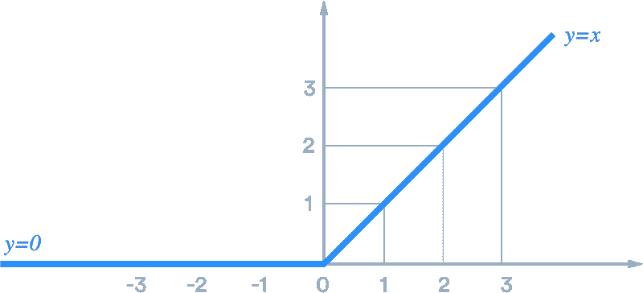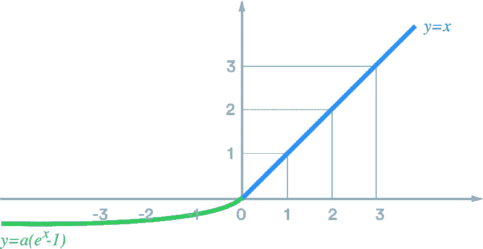

ReLU (left) and ELU (right)

当我们创建模型并打印出它的参数列表时，显示它包含大约 250，000 个参数。这是一个很好的检查，我们的模型的每一层都是按照我们的期望创建的。

```
Model: "Nvidia_Model" _________________________________________________________________ Layer (type)                 Output Shape              Param #    ================================================================= conv2d (Conv2D)              (None, 31, 98, 24)        1824       _________________________________________________________________ conv2d_1 (Conv2D)            (None, 14, 47, 36)        21636      _________________________________________________________________ conv2d_2 (Conv2D)            (None, 5, 22, 48)         43248      _________________________________________________________________ conv2d_3 (Conv2D)            (None, 3, 20, 64)         27712      _________________________________________________________________ dropout (Dropout)            (None, 3, 20, 64)         0          _________________________________________________________________ conv2d_4 (Conv2D)            (None, 1, 18, 64)         36928      _________________________________________________________________ flatten (Flatten)            (None, 1152)              0          _________________________________________________________________ dropout_1 (Dropout)          (None, 1152)              0          _________________________________________________________________ dense (Dense)                (None, 100)               115300     _________________________________________________________________ dense_1 (Dense)              (None, 50)                5050       _________________________________________________________________ dense_2 (Dense)              (None, 10)                510        _________________________________________________________________ dense_3 (Dense)              (None, 1)                 11         ================================================================= Total params: 252,219 Trainable params: 252,219 Non-trainable params: 0 
```

**训练**

现在数据和模型都准备好了，我们将开始训练数据。

对于已经使用 Keras 训练深度学习模型的人，我们通常使用`model.fit()`命令。但是请注意，今天我们使用了`model.fit_generator()`命令。这是因为我们没有使用静态的训练数据集，我们的训练数据是通过前面讨论的图像增强从我们的原始 200 幅图像中动态生成的。为了实现这一点，我们需要创建一个助手函数来进行增强，然后在每次迭代中向`model.fit_generator()`返回一批新的训练数据。

下面是这个助手的代码，`image_data_generator()`。

评估已训练的模型

训练 30 分钟后，模型将完成 10 个周期。现在是时候看看训练进行得如何了。首先要绘制训练集和验证集的损失函数。很高兴看到训练和验证损失一起快速下降，然后在第 5 个纪元后保持在非常低的水平。似乎没有任何过度拟合的问题，因为验证损失保持在低水平**和**培训损失。

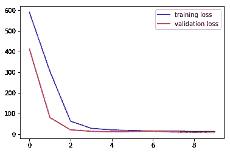

检验我们的模型是否表现良好的另一个指标是 R 指标。R 接近 100%意味着模型表现得相当好。正如我们可以看到的，我们的模型，即使有 200 张图像，也有 93%的 R，这是非常好的，这主要是因为我们使用了图像增强。

```
mse       = 9.9
r_squared = 93.54%
```

下面是 GitHub 上的[全 Jupyter 笔记本源代码训练深度学习车道导航模型，最好直接用](https://github.com/dctian/DeepPiCar/blob/master/models/lane_navigation/end_to_end_lane_navigation.ipynb) [Google Colab](https://colab.research.google.com) 打开。这样，一旦您提供了 Google 凭据，您就可以自己运行代码。

## 在旅途中

一个车型是不是真的好，需要在橡胶遇到路面的时候进行最终的检验。下面是驱动 PiCar 的核心逻辑。与我们手动编码的车道导航实现相比，检测蓝色、检测车道和计算转向角度等所有步骤(大约 200 行代码)都消失了。取而代之的是这些简单的命令，`load_model`和`model.predict()`。当然，这是因为所有的校准都是在训练阶段完成的，3Mb 的 HDFS 格式的训练模型文件包含多达 250，000 个参数。

下面是使用训练好的深度学习模型的车道导航代码的[完整源代码](https://github.com/dctian/DeepPiCar/blob/master/driver/code/end_to_end_lane_follower.py)。注意文件中有几个助手和测试函数来帮助显示和测试。

下面是 DeepPiCar 在车道上跑步的视频。是的，现在的**才是真正的**名副其实， **DeepPiCar** 。我们可以看到它在大部分时间里表现不错，但在接近终点时偏离了车道。因为这是使用深度学习，要解决这个问题，我们要做的就是给模型更多良好驾驶行为的视频片段，要么通过远程控制驾驶汽车，要么使用更好的手动编码车道导航仪。如果我们希望汽车在白色/黄色标记的道路上导航，那么我们可以给它提供带有白色/黄色标记的道路和转向角度的视频，模型也会学习这些，而无需我们手动调整白色和黄色的颜色遮罩。多酷啊！

# 下一步是什么

在这篇文章中，我们教会了我们的 DeepPiCar 在车道内自主导航，只需让它“观察”一个好司机如何驾驶。将深度学习通道导航实现与我们上一篇文章中手动调整的实现进行对比，它要短得多，也更容易理解。它的准确率也相当高，达到了 94%的 R，当然，我们不得不先训练深度学习模型，它包含了 25 万个参数。但是它仅仅通过观察我们如何驾驶就学会了所有的参数。在下一篇文章中，我们将构建自动驾驶汽车的另一个重要功能，即观察和响应周围环境，最常见的是响应交通标志和行人。希望能在[第六部](https://medium.com/@dctian/deeppicar-part-6-963334b2abe0?source=your_stories_page---------------------------)见到你！

以下是整个指南的链接:

第一部分:[概述](https://medium.com/@dctian/deeppicar-part-1-102e03c83f2c)

第二部分:[树莓 Pi 设置和 PiCar 装配](https://medium.com/@dctian/deeppicar-part-2-8512be2133f3)

第 3 部分:[让 PiCar 看到并思考](https://medium.com/@dctian/deeppicar-part-3-d648b76fc0be)

第 4 部分:[通过 OpenCV 的自主车道导航](https://medium.com/@dctian/deeppicar-part-4-lane-following-via-opencv-737dd9e47c96?source=your_stories_page---------------------------)

第五部分:[自主](https://medium.com/@dctian/deeppicar-part-4-lane-following-via-opencv-737dd9e47c96?source=your_stories_page---------------------------) [通过深度学习进行车道导航](https://medium.com/@dctian/deeppicar-part-5-lane-following-via-deep-learning-d93acdce6110?source=your_stories_page---------------------------)(本文)

第六部分:[交通标志和行人检测与处理](https://medium.com/@dctian/deeppicar-part-6-963334b2abe0?source=your_stories_page---------------------------)