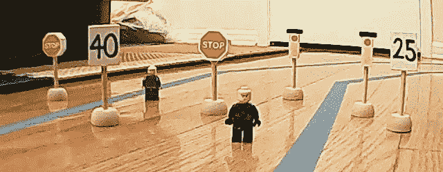
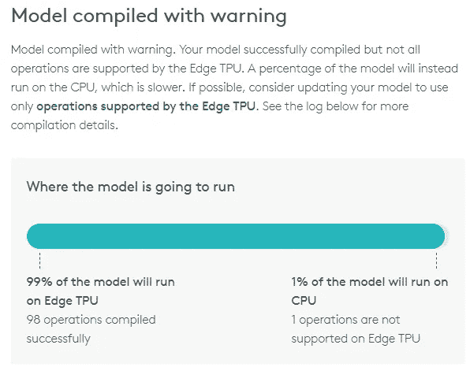

# DeepPiCar 第 6 部分:交通标志和行人检测与处理

> 原文：<https://towardsdatascience.com/deeppicar-part-6-963334b2abe0?source=collection_archive---------4----------------------->

## [DeepPiCar 系列](https://towardsdatascience.com/tagged/deep-pi-car)

使用迁移学习来调整预训练的 MobileNet SSD 深度学习模型，以通过谷歌的 Edge TPU 检测交通标志和行人。

# 行动纲要


在博客系列的[第 4 部分](/deeppicar-part-4-lane-following-via-opencv-737dd9e47c96?source=your_stories_page---------------------------)和[第 5 部分](https://medium.com/@dctian/deeppicar-part-5-lane-following-via-deep-learning-d93acdce6110?source=your_stories_page---------------------------)中，我们讨论了车道检测和导航。一辆真正的自动驾驶汽车还需要时刻意识到周围的情况。在本文中，我们将讨论另一个重要的感知特征，即**检测交通标志和行人**。注意，这项功能在任何 2019 款车辆上都不可用，除了[可能是特斯拉](https://electrek.co/2019/03/28/tesla-autopilot-stopping-red-light/)。我们将训练 DeepPiCar 去**识别**和**实时**响应(微型)交通标志和行人**。我们还将利用 2019 年初刚刚推出的 75 美元的谷歌 Edge TPU 加速器！**

没有购买任何硬件的读者请注意:对于本文的前半部分，您可以只带一台 PC，因为我们将在云中训练我们的模型。

# 介绍

当我驾驶沃尔沃 XC90 的 PilotAssist 从芝加哥驶往科罗拉多时，我的沃尔沃在高速公路上表现出色，因为我不需要转向或刹车。不过有一点让我很困扰的是，在一些有红绿灯的高速公路上，它无法检测到红绿灯或者交通标志，看到红灯就要刹车。我想，如果它也能做到这一点，那不是很好吗？这就是我写这篇文章的动机，我想让这辆 DeepPiCar 比我的沃尔沃更智能！

就像第 5 部分中的车道导航项目一样，有一个感知步骤和一个规划/控制步骤。我们首先需要检测**汽车前面的**是什么。然后我们可以用这个信息告诉汽车停下、前进、转弯或改变速度等。

# 感知:交通标志和行人检测

目标检测是计算机视觉和深度学习中的一个众所周知的问题。目标检测模型有两个组成部分，即**基本神经网络**和**检测神经网络**。

首先， [**基神经网络**](https://en.wikipedia.org/wiki/Convolutional_neural_network) 是从图像中提取特征的 CNN，从线、边、圆等低层特征到人脸、人、红绿灯、站牌等高层特征。一些众所周知的基本神经网络是 LeNet、InceptionNet(又名。GoogleNet)、ResNet、VGG 网、AlexNet 和 MobileNet 等。这篇[优秀的文章](https://medium.com/@RaghavPrabhu/cnn-architectures-lenet-alexnet-vgg-googlenet-and-resnet-7c81c017b848)在下面讨论了这些基础神经网络之间的区别。


Base Neural Networks detect features in an image

然后 [**检测神经网络**](https://en.wikipedia.org/wiki/Object_detection) 被附加到基本神经网络的末端，并用于借助于提取的特征从单个图像中同时识别多个对象。一些流行的检测网络是 SSD(单次多盒检测器)、R-CNN(具有 CNN 特征的区域)、更快的 R-CNN 和 YOLO(你只看一次)等。这篇[优秀文章](/understanding-ssd-multibox-real-time-object-detection-in-deep-learning-495ef744fab)讨论了这些检测神经网络的区别。


Detection Neural Networks detect the type of the object and its bounding box (x,y,w,h)

对象检测模型通常被命名为其基本网络类型和检测网络类型的组合。例如，“MobileNet SSD”模型，或“Inception SSD”模型，或“ResNet fast R-CNN”模型，仅举几个例子。

最后，对于预训练的检测模型，模型名称还将包括它被训练的图像数据集的类型。用于训练图像分类器和检测器的几个知名数据集是 **COCO 数据集**(大约 100 种常见的家用对象) **Open Images 数据集**(大约 20000 种对象)和自然主义者数据集(大约 200000 种动植物物种)中的**。例如，`ssd_mobilenet_v2_coco`模型使用第二版 MobileNet 提取特征，SSD 检测对象，并在 COCO 数据集上进行预训练。**

跟踪所有这些模型的组合不是一件容易的事情。但是多亏了谷歌，他们用 TensorFlow(称为模型动物园，实际上是模型动物园)发布了一个预训练模型的列表，所以你可以下载一个适合你需要的模型，并直接在你的项目中使用它进行检测推理。


Source: Google’s Detection Model Zoo

回想一下，我们在[第三部分](/deeppicar-part-3-d648b76fc0be?source=your_stories_page---------------------------)中使用了在 COCO 数据集上预先训练的 MobileNet SSD 模型，它识别了我客厅书架和沙发上的书籍。


## 迁移学习

然而，这篇文章是关于检测我们的迷你交通标志和行人，而不是书或沙发。但我们不想收集和标记成千上万的图像，并花费数周或数月从零开始构建和训练一个深度检测模型。我们可以做的是利用**转移学习** — ，它从预训练模型的模型参数开始，只为它提供 50–100 张我们自己的图像和标签，只花几个小时来训练检测神经网络的部分。直觉是，在预训练的模型中，基本 CNN 层已经擅长于从图像中提取特征，因为这些模型是在大量和各种各样的图像上训练的。区别在于，我们现在有一组不同于预训练模型的对象类型(约 100–100，000 种)。


Miniaturized versions of traffic signs and pedestrians used for training

## 建模培训

模型训练包括几个步骤。

1.  图像收集和标记(20-30 分钟)
2.  型号选择
3.  转移学习/模型培训(3-4 小时)
4.  以边缘 TPU 格式保存模型输出(5 分钟)
5.  在树莓 Pi 上运行模型推理

**图像采集和标记**



我们有 6 种对象类型，即红灯、绿灯、停车标志、40 英里/小时限速、25 英里/小时限速，以及一些作为行人的乐高小雕像。于是我拍了大概 50 张类似上面的照片，把物体随机放在每张图片里。

然后，我用图像上的每个对象的边界框来标记每个图像。这看起来需要几个小时，但是有一个免费的工具，叫做 [labelImg](https://tzutalin.github.io/labelImg/) (用于 windows/Mac/Linux)，让这项艰巨的任务变得轻而易举。我所要做的就是将 labelImg 指向存储训练图像的文件夹，对于每个图像，在图像上的每个对象周围拖一个框，并选择一个对象类型(如果是新类型，我可以快速创建一个新类型)。因此，如果您使用键盘快捷键，每张照片只需 20-30 秒，因此我只花了 20 分钟就标记了大约 50 张照片(大约 200-300 个对象实例)。之后，我只是随机地将图像(以及它的标签 xml 文件)分成训练和测试文件夹。你可以在`models/object_detection/data`下的 [DeepPiCar 的 GitHub repo](https://github.com/dctian/DeepPiCar/tree/master/models/object_detection/data/images) 中找到我的训练/测试数据集。


Labeling Images with LabelImg Tool

**型号选择**

在 Raspberry Pi 上，由于我们的计算能力有限，我们必须选择一个既运行相对快速又准确的模型。在试验了几个模型后，我选定了`MobileNet v2 SSD COCO`模型作为速度和准确性之间的最佳平衡。此外，为了让我们的模型在边缘 TPU 加速器上工作，我们必须选择`MobileNet v2 SSD COCO **Quantized**` 模型。[量化](https://arxiv.org/abs/1806.08342)是一种通过将模型参数存储为整数值而不是双精度值来使模型推断运行更快的方法，预测精度几乎不会下降。Edge TPU 硬件经过优化，可以**只运行量化**模型。[这篇文章](/google-coral-edge-tpu-board-vs-nvidia-jetson-nano-dev-board-hardware-comparison-31660a8bda88)对 Edge TPU 的硬件和性能基准进行了深入分析，供感兴趣的读者阅读。

**转移学习/模型训练/测试**

对于这一步，我们将再次使用 Google Colab。本节基于程维的优秀教程[“如何免费轻松训练一个物体检测模型”](https://www.dlology.com/blog/how-to-train-an-object-detection-model-easy-for-free/)。我们需要在**树莓派**上运行，使用**边缘 TPU** 加速器。由于整个笔记本及其输出相当长，我将在下面介绍我的 Jupyter 笔记本的关键部分。[完整的笔记本代码](https://colab.research.google.com/github/dctian/DeepPiCar/blob/master/models/object_detection/code/tensorflow_traffic_sign_detection.ipynb)可以在我的 GitHub 上找到，里面对每一步都有非常详细的解释。

*设置培训环境*

上面的代码选择`MobileNet v2 SSD COCO **Quantized**` 模型，从 TensorFlow GitHub 下载训练好的模型。如果我们想选择不同的检测模型，这一部分设计得很灵活。

*准备培训数据*

上面的代码将 LabelImg 工具生成的 xml 标签文件转换为二进制格式(。记录)以便 TensorFlow 快速处理。

*下载预训练模型*

```
'/content/models/research/pretrained_model/model.ckpt'
```

上述代码将下载`ssd_mobilenet_v2_quantized_300x300_coco_2019_01_03`模型的预训练模型文件，我们将仅使用`model.ckpt`文件，我们将从该文件应用迁移学习。

*训练模型*

这一步需要 3-4 个小时，取决于你训练的步数(又名纪元或`num_steps`)。训练完成后，你会在`model_dir`里看到一堆文件。我们正在寻找最新的`model.ckpt-xxxx.meta`文件。在这种情况下，由于我们运行了 2000 步，我们将使用来自`model_dir`的`**model.ckpt-2000.meta**`文件。

```
!ls -ltra '{model_dir}/*.meta'-rw------- 1 root root 17817892 Apr 16 23:10 model.ckpt-1815.meta
-rw------- 1 root root 17817892 Apr 16 23:20 model.ckpt-1874.meta
-rw------- 1 root root 17817892 Apr 16 23:30 model.ckpt-1934.meta
-rw------- 1 root root 17817892 Apr 16 23:40 model.ckpt-1991.meta
**-rw------- 1 root root 17817892 Apr 16 23:42 model.ckpt-2000.meta**
```

在训练期间，我们可以通过 TensorBoard(上面我的 GitHub 链接中的源代码)来监控损失和精度的进展。我们可以看到，在整个培训过程中，测试数据集的丢失率在下降，精确度在提高，这是一个很好的迹象，表明我们的培训正在按预期进行。


Total Loss (lower right) keeps on dropping


mAP (top left), a measure of precision, keeps on increasing

**测试训练好的模型**

训练结束后，我们通过新模型运行了测试数据集中的一些图像。正如所料，图像中几乎所有的物体都以相对较高的置信度被识别。有一些图像中的物体离得更远，没有被探测到。这对我们的目的来说很好，因为我们只想**检测附近的物体**，这样我们就可以对它们做出反应。当我们的车靠近远处的物体时，它们会变得更大，更容易被发现。


**以边缘 TPU 格式保存模型输出**

一旦模型被训练，我们必须将模型`meta`文件导出到 Google ProtoBuf 格式的推理图，然后导出到 Edge TPU 加速器可以理解和处理的格式。这似乎是一个简单的步骤，但在撰写本文时，在线资源(包括 [Edge TPU 自己的网站](https://coral.withgoogle.com/products/accelerator))非常稀缺，以至于我花了数小时研究正确的参数和命令，以转换成 Edge TPU 可以使用的格式。

幸运的是，经过几个小时的搜索和实验，我已经找到了下面的命令来做到这一点。

最终我们得到一个`road_signs_quantized.tflite`文件，适合移动设备和 Raspberry Pi CPU 进行模型推断，但还不适合 Edge TPU 加速器。

```
!ls -ltra '/content/gdrive/My Drive/Colab Notebooks/TransferLearning/Training/fine_tuned_model/*.tflite'root root 4793504 Apr 16 23:43 **road_signs_quantized.tflite**
```

对于边缘 TPU 加速器，我们需要再执行一个步骤。那就是通过 [Edge TPU 模型 Web 编译器](https://coral.withgoogle.com/web-compiler/)运行`road_signs_quantized.tflite`。


将`road_signs_**quantized**.tflite`上传到 web 编译器后，可以下载另一个 tflite 文件，保存为`road_signs_**quantized_edgetpu**.tflite`。现在你完成了！会有一些警告，但是可以安全地忽略。请注意，99%的模型将在边缘 TPU，这是伟大的！



`_edgetpu.tflite`文件和常规`.tflite`文件的区别在于，使用`**_edgetpu**.tffile`文件，所有(99%)模型推理将在 TPU 边缘运行，而不是在 Pi 的 CPU 上运行。出于实用目的，这意味着您每秒可以处理大约 20 幅 320x240 分辨率的图像(又名。FPS，每秒帧数),但是单独使用 Pi CPU 时只有大约 1 FPS。20 FPS 对于 DeepPiCar 来说是(接近)实时的，这值 75 美元。(嗯，考虑到整个树莓派——CPU+电路板才 30 美元，我觉得这 75 美元的成本应该更低！)

# 规划和运动控制

现在 DeepPiCar 已经可以检测和识别它面前有什么物体了，我们仍然需要告诉它如何处理它们，也就是运动控制。运动控制有两种方法，即基于规则的和端到端的。**基于规则的方法**意味着我们需要告诉汽车当它遇到每个物体时该做什么。例如，告诉汽车如果看到红灯或行人就停下来，或者如果看到限速标志就开慢点，等等。这类似于我们在第 4 部分中所做的，在第 4 部分中，我们通过一组代码/规则告诉汽车如何在车道内导航。**端到端方法**只是向汽车输入大量优秀驾驶员的视频片段，汽车通过深度学习，自动计算出它应该在红灯和行人面前停下来，或者在限速下降时减速。这类似于我们在第 5 部分“端到端车道导航”中所做的。

对于本文，我选择了基于规则的方法，因为 1)这是我们人类通过学习道路规则来学习如何驾驶的方式，2)它更容易实现。

由于我们有六种类型的对象(红灯、绿灯、40 英里/小时限制、25 英里/小时限制、停车标志、行人)，我将说明如何处理一些对象类型，您可以在 GitHub 上的这两个文件中阅读我的完整实现，`[traffic_objects.py](https://github.com/dctian/DeepPiCar/blob/master/driver/code/traffic_objects.py)`和`[object_on_road_processor.py](https://github.com/dctian/DeepPiCar/blob/master/driver/code/objects_on_road_processor.py)`。

规则很简单:如果没有探测到物体，就以最后已知的速度限制行驶。如果检测到某个物体，该物体将修改汽车的速度或速度限制。例如，当你探测到足够近的红灯时停止，当你没有探测到红灯时继续。

首先，我们将定义一个基类`TrafficObject`，它表示道路上可以检测到的任何交通标志或行人。它包含一个方法，`set_car_state(car_state)`。`car_state`字典包含两个变量，即`speed`和`speed_limit`，这两个变量将被方法改变。它还有一个助手方法`is_close_by()`，检查检测到的对象是否足够近。(嗯，由于我们的单个相机不能确定距离，我用物体的高度来近似距离。为了精确确定距离，我们需要激光雷达，或者它的小兄弟，超声波传感器，或者像特斯拉一样的立体视觉摄像系统。)

红灯和行人的实现很简单，只需将汽车速度设置为 0。

25 Mph 和 40 Mph 速度限制只能使用一个 SpeedLimit 类，该类将 speed_limit 作为其初始化参数。当检测到该标志时，只需将车速限制设置到适当的极限即可。

绿光实现甚至更简单，因为它除了检测到打印绿光之外什么也不做(代码未显示)。停止标志的实现稍微复杂一些，因为它需要跟踪状态，这意味着它需要记住它已经在停止标志处停了几秒钟，然后在汽车经过标志时继续前进，即使后续的视频图像包含非常大的停止标志。具体可以参考我在`[traffic_objects.py](https://github.com/dctian/DeepPiCar/blob/master/driver/code/traffic_objects.py)`的实现。

一旦我们定义了每个交通标志的行为，我们需要一个类将它们联系在一起，这个类就是`ObjectsOnRoadProcessor`类。该类首先加载边缘 TPU 的训练模型，然后用该模型检测实时视频中的对象，最后调用每个交通对象来改变汽车的速度和速度限制。下面是`[objects_on_road_processor.py](https://github.com/dctian/DeepPiCar/blob/master/driver/code/objects_on_road_processor.py)`的关键部位。

注意，每个 TrafficObject 只是改变了`car_state`对象中的`speed`和`speed_limit`，而没有实际改变汽车的速度。是`ObjectsOnRoadProcessor`在检测和处理所有交通标志和行人后，改变汽车的实际速度。

# 把它放在一起

这是这个项目的最终成果。请注意，我们的 DeepPiCar 在停车标志和红灯前停下来，不等任何行人，继续前行。此外，它在 25 英里/小时的标志下减速，在 40 英里/小时的标志下加速。

感兴趣的完整源代码在 DeepPiCar 的 GitHub 上:

1.  [Colab Jupyter 笔记本](https://github.com/dctian/DeepPiCar/blob/master/models/object_detection/code/tensorflow_traffic_sign_detection.ipynb)用于物体检测和迁移学习
2.  [Python 中的规划和运动控制](https://github.com/dctian/DeepPiCar/blob/master/driver/code/objects_on_road_processor.py)逻辑
3.  DeepPiCar [主驱动程序](https://github.com/dctian/DeepPiCar/blob/master/driver/code/deep_pi_car.py)。

# 下一步是什么

在这篇文章中，我们教会了我们的 DeepPiCar 识别交通标志和行人，并对它们做出相应的反应。这不是一个小壮举，因为路上的大多数汽车还不能做到这一点。我们采取了一种捷径，使用了预先训练的对象检测模型，并在其上应用了迁移学习。事实上，当一个人无法收集足够的训练数据来从头创建深度学习模型，或者没有足够的 GPU 能力来训练模型数周或数月时，迁移学习在人工智能行业中非常普遍。那么为什么不站在巨人的肩膀上呢？

在以后的文章中，我有相当多的想法。这里有一些好玩的项目，以后可以试试。

嘿，贾维斯，开始开车！

我想在车上装一个**麦克风**，训练它识别我的声音和我的**唤醒词**，这样我就可以说:“嘿，[贾维斯](https://ironman.fandom.com/wiki/J.A.R.V.I.S.)，开始开车！”或者“嘿贾维斯，左转！”我们在吴恩达的[深度学习课程](https://www.deeplearning.ai/deep-learning-specialization/)中做了一个唤醒词项目，那么能够召唤 DeepPiCar 的**超级酷**岂不是更好，就像钢铁侠或者蝙蝠侠一样？


JARVIS, Tony Stark’s (Ironman) AI Assistant

**自适应巡航控制**

另一个想法是在 DeepPiCar 上安装一个**超声波传感器**。这类似于现实生活中车辆上的激光雷达，而我们可以感知 DeepPiCar 和其他物体之间的距离。例如，使用超声波传感器，我们将能够实现 ACC(自适应巡航控制)，这是自动驾驶汽车的一个基本功能，或者我们可以通过仅检测特定范围内的对象来增强我们的对象检测算法。

**端到端深度驾驶**

我还想尝试完全端到端的驾驶，我将远程控制汽车一段时间，保存视频片段，速度和转向角度，并应用深度学习。希望深度学习将教会它如何驾驶，即通过模仿我的驾驶行为，既遵循车道，又对交通标志和行人做出反应。这将是一个超级酷的项目*，如果*它实际工作。这意味着我们不需要告诉汽车任何规则，它只是通过观察来解决一切问题！！这将是自动驾驶汽车的圣杯，这类似于 AlphaZero 如何在没有任何人类输入启发的情况下学习下围棋或象棋。

**谢谢！**

如果你已经读到这里(或者和我一起构建/编码)，那么恭喜你！如果到目前为止一切正常，你应该有一辆深度学习、自动驾驶的机器人汽车在你的客厅里运行，并且能够在它观察到停止标志或红灯时停下来！如果没有，请在下面留言，我会尽力帮助你。我真的很高兴能和你一起分享这美妙的旅程。事实上，比起编写代码、训练模型和在我的客厅里测试 DeepPiCar**加起来**，我写这些文章花费的时间要长得多。这也是我第一次写博客，既害怕又兴奋。我现在意识到，我喜欢建造东西，就像向别人展示如何建造东西一样。

像往常一样，这里是整个指南的链接，以防你需要参考以前的文章。现在需要给自己找一份自动驾驶汽车公司的机器学习工程师的工作！一会儿见！

第 1 部分:[概述](https://medium.com/@dctian/deeppicar-part-1-102e03c83f2c)

第 2 部分: [Raspberry Pi 设置和 PiCar 装配](https://medium.com/@dctian/deeppicar-part-2-8512be2133f3)

第 3 部分:[让 PiCar 看到并思考](https://medium.com/@dctian/deeppicar-part-3-d648b76fc0be)

第 4 部分:[通过 OpenCV 的自主车道导航](https://medium.com/@dctian/deeppicar-part-4-lane-following-via-opencv-737dd9e47c96?source=your_stories_page---------------------------)

第五部分:[自主](https://medium.com/@dctian/deeppicar-part-4-lane-following-via-opencv-737dd9e47c96?source=your_stories_page---------------------------) [通过深度学习进行车道导航](https://medium.com/@dctian/deeppicar-part-5-lane-following-via-deep-learning-d93acdce6110?source=your_stories_page---------------------------)

第六部分:[交通标志和行人检测与处理](https://medium.com/@dctian/deeppicar-part-6-963334b2abe0?source=your_stories_page---------------------------)(本文)