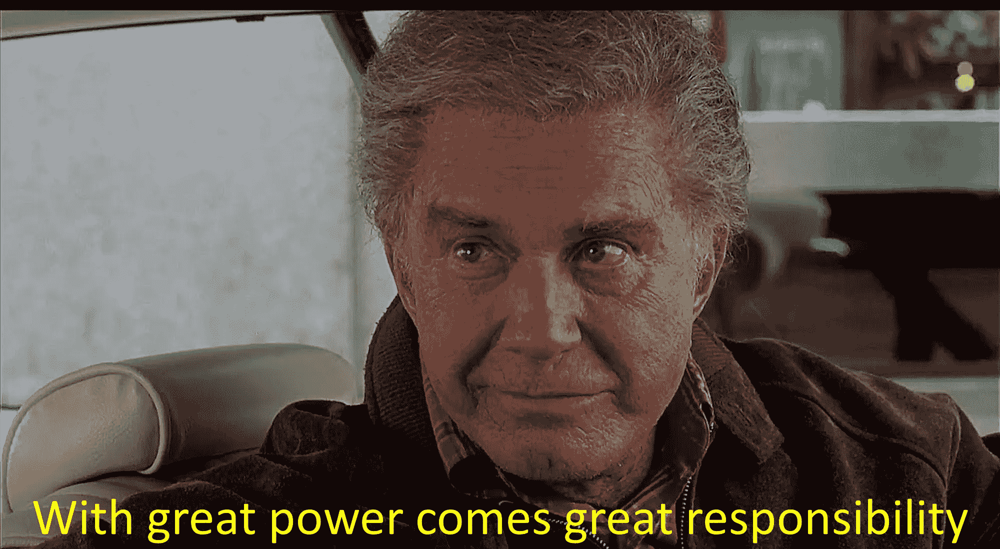
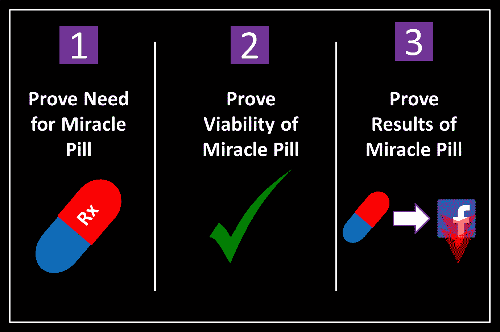
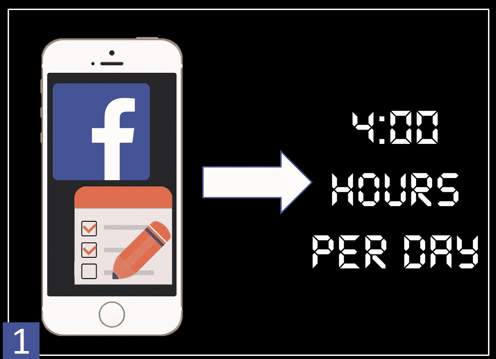
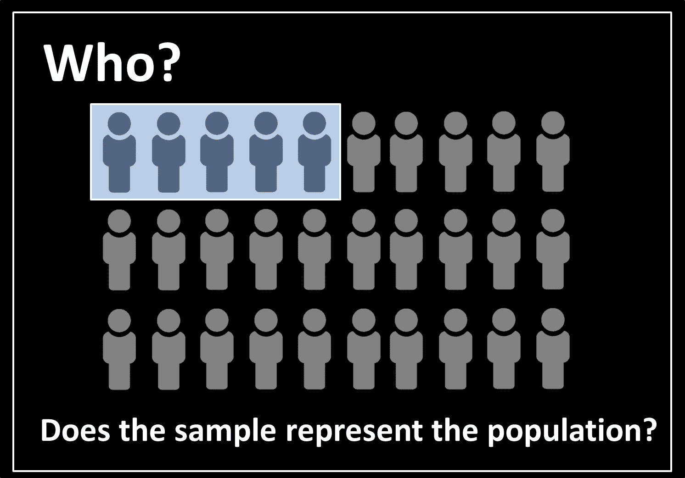
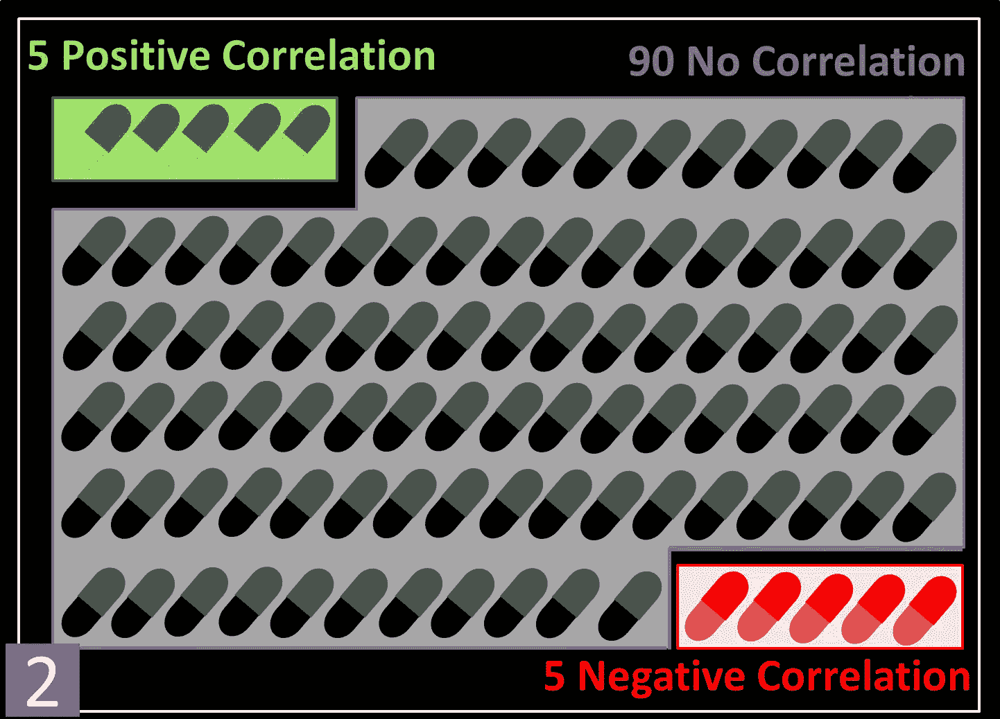
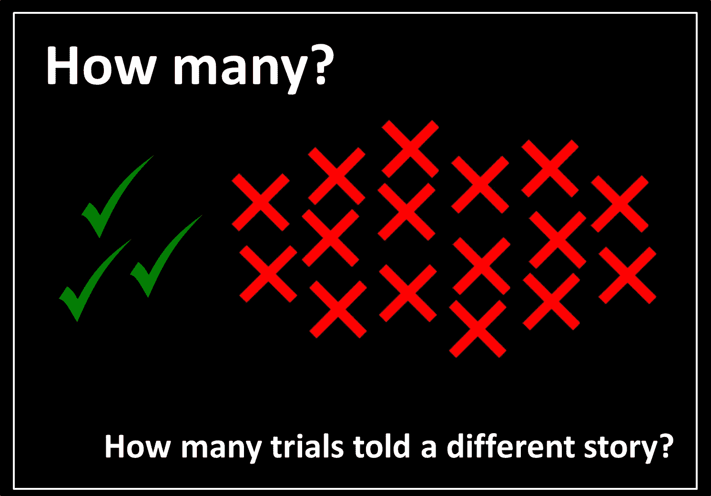
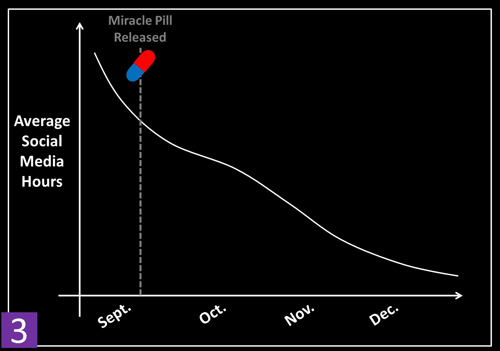
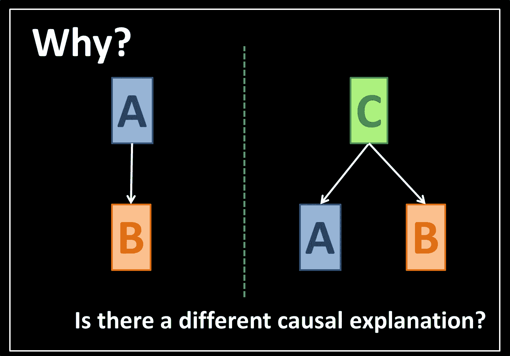

# 黑暗防御统计

> 原文：<https://towardsdatascience.com/defense-against-the-dark-stats-94ff3db4e844?source=collection_archive---------32----------------------->

如今，从政治到医疗保健到广告，统计、机器学习和大数据似乎处于几乎所有可以想象的领域的前沿。虽然这场稳步的革命无疑令人兴奋，但它也促使我们更加密切地关注蜘蛛侠叔叔本的明智之言:**“权力越大，责任越大”**。

Wise words from Uncle Ben.

事实上，正如这些领域有巨大的力量给世界带来持久的积极变化，它们也有力量被用来实现自私、阴暗、彻头彻尾的*邪恶目标。*

*在这篇文章的持续时间里，假设你是一个**邪恶制药公司**的领导。你的最新计划是向市场投放一种“神奇药丸”，承诺抑制一个人访问脸书、Instagram 等社交媒体网站的欲望。作为一个恶魔，你计划出售一个完全虚假的药丸，并使用高度扭曲的统计数据来获得人们的信任。*

*你的卑鄙计划只有三个组成部分:证明对你的神奇药丸有很大的需求，证明你的神奇药丸抑制了上社交媒体的欲望，证明你的神奇药丸在上市一段时间后发挥了作用。*

**

*Your evil 3 step plan.*

# *证明你的神奇药丸的必要性*

*为了开始你的计划，你需要让每个人相信社交媒体的使用已经完全失控，因此需要你的神奇药丸。你在脸书做了一个智能手机调查，询问人们每天花多少时间在社交媒体上。取回结果后，你发现普通人每天花 **4 个小时**在社交媒体上！*

**

*Your conduct a smartphone Facebook survey asking about social media use.*

**那么你的调查到底有什么邪恶之处呢？*事实上，你在社交媒体平台脸书上询问社交媒体的使用情况，几乎可以肯定会使你的结果偏向于在社交媒体上报告的更长时间。换句话说:回答你的调查*的人必须去过脸书*才能找到你的调查。当然，你会在新闻稿中忽略这个小细节。*

> **这种类型的统计误用被称为***过度概括，发生在样本不代表总体时。这里我们的人口是所有的美国人，但是我们的样本只包括那些已经有脸书账户的人。***
> 
> **那么，我们如何抵御这种类型的统计攻击呢？正如我们不久将看到的对统计数据的其他误用一样，我们可以通过要求回答一些关键问题来为自己辩护。为了泛化，我们想问一个“谁？”问题: ***“谁在样本中，他们是否代表我们试图测量的人群？”*****

****

**How to defend against overgeneralization.**

# **证明你的神奇药丸的可行性**

**好的，事情正在按计划进行。你已经让所有人相信社交媒体的使用正在失控，并为你的神奇药丸获得了大量资金。接下来，你需要对你的药丸进行临床试验，证明它确实降低了人们上社交网站的欲望。当然唯一的问题是你的药丸是一颗*完全假冒的*。**

****不过嘿！你是个邪恶的科学家；你绝不会让像真相这样微不足道的事情阻碍你的计划。在你的大量资助下，你进行了 100 次试验，每次都有几个参与者，并给每个参与者服用不同数量的神奇药丸。你跟踪他们在一段时间内的社交媒体使用情况，并对每一批参与者衡量是否存在正相关(社交媒体使用增加)、负相关(社交媒体使用减少)或无相关(社交媒体使用无显著变化)。****

**您的结果如下所示。**

****

**The results of your clinical trials.**

**好吧，很明显你的药是无用的。在 100 项试验中，只有 5 项表明社交媒体使用率下降，5 项实际上表明社交媒体使用率增加，而多达 90 项试验表明社交媒体使用率没有显著变化。不要担心！你只会报告显示社交媒体使用下降的 5。你将新闻稿的标题框定为:**“奇迹药丸在 5 次独立试验中持续显示社交媒体使用率下降”。**严格来说，你没有说谎对吧？**

> ***这种对统计数据的误用被称为* ***樱桃采摘。*** *它是只选择确认一个结果的证据片段，而忽略其他所有证据的行为。很容易看出为什么它确实非常险恶。一个不知情的公众成员甚至不会知道所有反驳这一说法的证据。***
> 
> **防止我们摘樱桃的最好方法是什么？我们应该总是问一个“有多少？”问题: ***“有多少试验讲述了一个不同于参考文献的故事？”*****

****

**How to defend against cherry picking.**

# **证明你神奇药丸的效果**

****完美！**你向所有人展示了你的神奇药丸是绝对必要的，然后让所有人相信你的药丸确实如其所言。因此，你的药丸现在已经上市几个月了，你只需要证明它对社交媒体的使用产生了预期的效果。你让你的市场部为你制作了这张漂亮的图表。**

****

**You create a chart showing social media use over time.**

*****很明显*** ，从这个图表很明显，自从你的神奇药丸上市以来，社交媒体的使用一直在下降。很明显这一定是你药丸的*原因*。**

**这个故事有几个问题。首先，即使在你的药片发布之前，社交媒体的使用似乎也在下降。第二，对于为什么社交媒体在假期使用下降，有一个强有力的替代解释:**人们可能花更多的时间与家人、朋友和爱人在一起，而花更少的时间在社交媒体上**。**

> ***这种对统计数据的误用非常普遍，被称为* ***虚假因果关系*** *或“相关性并不意味着因果关系”。也就是说，仅仅因为奇迹药丸的销售和社交媒体使用的减少之间存在关联，并不意味着使用的减少是由药丸引起的。***
> 
> **我们怎样才能抵御虚假的因果关系？我们最好问一个“为什么？”问题: ***“为什么我会看到我看到的结果？是因为陈述的原因还是有其他可能的解释？”*****

****

***How to defend against the False Causality trap.***

> ***在上图中，我们问自己，是 A 导致了 B，还是 A 和 B 都是不同变量 c 的结果。同样，我们需要问自己，是药丸销量增加*导致了社交媒体使用率下降*，还是药丸销量增加和社交媒体使用率下降都是由即将到来的假日季节***造成的。****

# ***关键要点***

***当然，上面的例子是现实生活中发生的高度简化的版本。不幸的是，当我们在花哨、专业的图表或统计报告的伪装下被欺骗时，通常很难发现。此外，误导性的图表和对统计数据的严重滥用通常不是某些恶意制药公司所为，而仅仅是**人们没有仔细制定他们的统计模型**。***

***因此，在查看任何统计分析时，培养一种健康的怀疑变得越来越重要。我们在这篇文章中提出的简单关键问题可以帮助我们抵御黑暗统计。***