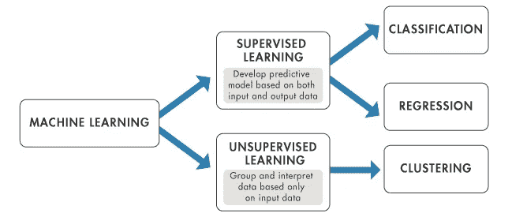
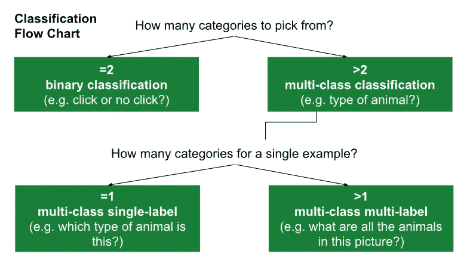
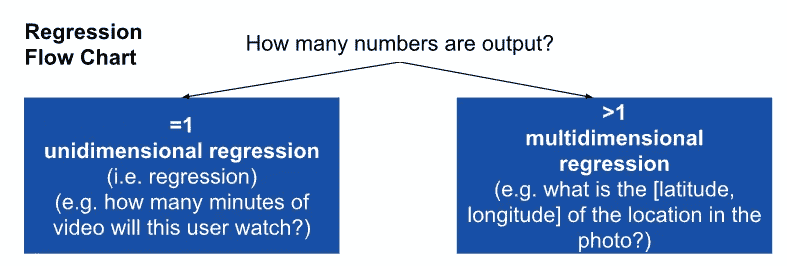

# 定义数据科学问题

> 原文：<https://towardsdatascience.com/defining-a-data-science-problem-4cbf15a2a461?source=collection_archive---------7----------------------->

## 数据科学家最重要的非技术性技能

Photo by [Kelly Sikkema](https://unsplash.com/@kellysikkema?utm_source=medium&utm_medium=referral) on [Unsplash](https://unsplash.com?utm_source=medium&utm_medium=referral)

根据 Cameron Warren 在他的《走向数据科学》文章 [**中的说法，不要做数据科学，解决业务问题**](/dont-do-data-science-solve-business-problems-6b70c4ee0083) ，*“…对于一个数据科学家来说，最重要的技能是清晰地评估和定义问题的能力，这超过了任何技术专长。”*

作为一名数据科学家，您会经常发现或遇到需要解决的问题。您的最初目标应该是确定您的问题实际上是否是数据科学问题，如果是，是什么类型的问题。能够将一个商业想法或问题转化为一个清晰的问题陈述是非常有价值的。并且能够有效地传达该问题是否可以通过应用适当的机器学习算法来解决。

## **是数据科学问题吗？**

真正的数据科学问题可能是:

*   对数据进行分类或分组
*   识别模式
*   识别异常
*   显示相关性
*   预测结果

一个好的数据科学问题应该是**具体的、结论性的**。例如:

*   *随着个人财富的增加，关键健康指标如何变化？*
*   在加州，大多数心脏病患者住在哪里？

相反，**模糊和不可测量的**问题可能不适合数据科学解决方案。例如:

*   *财务和健康有什么联系？*
*   *加州人更健康吗？*

## **这是什么类型的数据科学问题？**

一旦你决定你的问题是数据科学的一个很好的候选，你将需要确定你正在处理的问题的类型。为了知道哪种类型的机器学习算法可以被有效地应用，这个步骤是必要的。

机器学习问题通常分为两类:

*   **监督** — *根据标记输入&输出数据*预测未来输出
*   **无监督** — *在未标记的输入数据中寻找隐藏的模式或分组*

Image per [MathWorks](https://www.mathworks.com/help/stats/machine-learning-in-matlab.html)

**还有第三个桶(* ***强化学习*** *)不在本帖讨论范围内，不过你可以在这里* *阅读一下* [*。*](https://www.geeksforgeeks.org/what-is-reinforcement-learning/)

**有监督的**学习可以分为另外两个部分:

*   **分类** — *预测离散分类反应(例如:良性或恶性)*
*   **回归** — *预测连续的数字响应(例如:20 万美元的房价或 5%的降雨概率)*

## 每种机器学习问题的用例是什么？

*   **无人监管的**(主要被认为是“集群”)—市场细分、政治投票、零售推荐系统等等
*   **分类—** 医学成像、自然语言处理和图像识别等
*   **回归—** 天气预报、投票率、房屋销售价格等等

______________________________________________________________

**Pro 提示:** *通过使用条件逻辑将连续的数值响应转化为离散的分类响应，可以将回归问题转化为分类问题！例如:*

*   **问题** : *估计有人投票的概率。*
*   **回归反应** : *60%概率*
*   **分类响应** : *是(如果回归响应大于 50%)，否(如果回归响应小于 50%)*

______________________________________________________________

## 细化您的问题的子类型

在确定最终的问题定义之前，您需要非常具体地了解您的问题的机器学习子类型。弄清楚术语将有助于你决定选择哪种算法。下图说明了决定分类子类型(基于类)和回归子类型(基于数值)的示例工作流。

Image per [Google Developers](https://developers.google.com/machine-learning/problem-framing/formulate)

Image per [Google Developers](https://developers.google.com/machine-learning/problem-framing/formulate)

## **最终确定问题陈述**

一旦您确定了具体的问题类型，您应该能够清楚地阐明一个精炼的问题陈述，包括模型将预测什么。例如:

*这是一个多类分类问题，预测一幅医学图像是否会属于三类中的一类——*`*{benign, malignant, inconclusive}*`*。*

您还应该能够表达模型预测的预期结果或预期用途。例如:

*理想的结果是，当预测结果为* `*malignant*` *或* `*inconclusive*` *时，立即通知医疗保健提供者。*

## **结论**

一个好的数据科学问题将旨在做出决策，而不仅仅是预测。当你思考你面临的每一个问题时，记住这个目标。在上面的例子中，可能会采取一些措施来减少`*inconclusive*`预测的数量，从而避免后续几轮测试的需要，或者延迟所需的治疗。最终，你的模型的预测应该让你的利益相关者做出明智的决定——并采取行动！

Photo by [Kid Circus](https://unsplash.com/@kidcircus?utm_source=medium&utm_medium=referral) on [Unsplash](https://unsplash.com?utm_source=medium&utm_medium=referral)