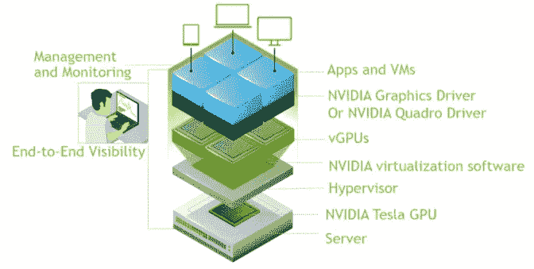

# 为 GPU 定义用户限制

> 原文：<https://towardsdatascience.com/defining-user-restrictions-for-gpus-6971a658a9ce?source=collection_archive---------28----------------------->

## 如何在用户之间共享多个 GPU 而不出现 OOM 错误？

我们正在南加州大学使用λ实验室的 4-GPU 工作站。由于多个用户可以同时在服务器上运行作业，处理内存不足(OOM)错误和公平性有点困难。我们可以在网上找到的解决方案如下:

1.  [英伟达的 GPU 虚拟化软件](https://docs.nvidia.com/grid/latest/grid-vgpu-user-guide/index.html)，可以添加到虚拟化管理程序之上。不过，目前仅支持[NVIDIA Turing](https://www.nvidia.com/en-us/design-visualization/technologies/turing-architecture/)、[Volta](https://www.nvidia.com/en-us/data-center/volta-gpu-architecture/)、[Pascal](https://www.nvidia.com/en-us/data-center/pascal-gpu-architecture/)和[Maxwell](https://developer.nvidia.com/maxwell-compute-architecture)GPU 架构。



NVIDIA’s GPU virtualization stack. [[Source](https://blogs.nvidia.com/blog/2018/06/11/what-is-a-virtual-gpu/)]

2.Slurm 是一个开源的、高度可伸缩的作业调度系统，适用于大型和小型 Linux 集群。它支持 GPU 资源调度。对于大型团队来说似乎是一个非常合适的选择。它还支持每 GPU 内存分配，如果有足够的内存和未充分利用的计算单元，则可以在单个 GPU 上运行多个进程。


Slurm workload manager [[Source](https://en.wikipedia.org/wiki/Slurm_Workload_Manager)]

在本文的其余部分，我们将解释我们为在用户之间共享多个 GPU 所做的工作。在多 GPU 工作站中，为每个 GPU 驱动程序文件创建用户组允许我们授予特定用户使用特定 GPU 的权限。现在，只有指定的 GPU 对用户可见。我们解释了在 4 GPU 工作站上创建 GPU 用户限制所需的命令。

**步骤 1:** 创建组，并将用户添加到组中。我们需要创建 4 个组，因为我们有 4 个 GPU:

```
# Adding groups
sudo groupadd nvidia0
sudo groupadd nvidia1
sudo groupadd nvidia2
sudo groupadd nvidia3# Adding users to the groups
sudo usermod -a -G nvidia0 olivia
sudo usermod -a -G nvidia1 peter
```

**第二步:**在*/etc/modprob . d/NVIDIA . conf*创建一个配置文件，内容如下:

```
#!/bin/bash
options nvidia NVreg_DeviceFileUID=0 NVreg_DeviceFileGID=0 NVreg_DeviceFileMode=0777 NVreg_ModifyDeviceFiles=0
```

这个配置文件将把 4 个 NVIDIA 的驱动参数加载到 Linux 的内核中。NVIDIA 的驱动程序文件的一个问题是，它们在每次会话后都会重新生成，这破坏了我们将要在驱动程序文件上设置的用户访问限制。 *NVreg_ModifyDeviceFiles* 保证驱动文件一次生成，以后不会更改。其他参数是设置具有 777 访问权限的默认用户和组 id。如果在 */etc/modprob.d/，*已经有一个 NVIDIA 配置文件，你可以保留它的备份，并用我们提供的脚本替换它的内容。

**第三步:**在 */etc/init.d/gpu-restriction 创建一个脚本来加载 NVIDIA 的驱动。*

```
#!/bin/bash
### BEGIN INIT INFO
# Provides:          gpu-restriction
# Required-Start:    $all
# Required-Stop:
# Default-Start:     2 3 4 5
# Default-Stop:
# Short-Description: Start daemon at boot time
# Description:       Enable service provided by daemon.
#  permissions if needed.
### END INIT INFOset -estart() {
/sbin/modprobe --ignore-install nvidia; /sbin/modprobe nvidia_uvm; test -c /dev/nvidia-uvm || mknod -m 777 /dev/nvidia-uvm c $(cat /proc/devices | while read major device; do if [ "$device" == "nvidia-uvm" ]; then echo $major; break; fi ; done) 0 && chown :root /dev/nvidia-uvm; test -c /dev/nvidiactl || mknod -m 777 /dev/nvidiactl c 195 255 && chown :root /dev/nvidiactl; devid=-1; for dev in $(ls -d /sys/bus/pci/devices/*); do vendorid=$(cat $dev/vendor); if [ "$vendorid" == "0x10de" ]; then class=$(cat $dev/class); classid=${class%%00}; if [ "$classid" == "0x0300" -o "$classid" == "0x0302" ]; then devid=$((devid+1)); test -c /dev/nvidia${devid} || mknod -m 660 /dev/nvidia${devid} c 195 ${devid} && chown :nvidia${devid} /dev/nvidia${devid}; fi; fi; done
}stop() {
:
}case "$1" in
    start)
       start
       ;;
    stop)
       stop
       ;;
    restart)
       stop
       start
       ;;
    status)
       # code to check status of app comes here 
       # example: status program_name
       ;;
    *)
       echo "Usage: $0 {start|stop|status|restart}"
esacexit 0
```

然后，输入以下命令，该命令将告诉 Linux 在重新启动后加载脚本:

```
sudo update-rc.d gpu-restriction defaults
sudo update-rc.d gpu-restriction enable
```

现在，我们有了一个 Linux 服务，可以通过以下命令启动它:

```
sudo service gpu-restriction start
```

重启机器。您现在一切就绪！

**检查脚本:**

加载 NVIDIA 驱动程序的脚本的核心部分是:

```
/sbin/modprobe --ignore-install nvidia;
/sbin/modprobe nvidia_uvm;
test -c /dev/nvidia-uvm || mknod -m 777 /dev/nvidia-uvm c $(cat /proc/devices | while read major device; do if [ "$device" == "nvidia-uvm" ]; then echo $major; break; fi ; done) 0 && chown :root /dev/nvidia-uvm; test -c /dev/nvidiactl || mknod -m 777 /dev/nvidiactl c 195 255 && chown :root /dev/nvidiactl; devid=-1; for dev in $(ls -d /sys/bus/pci/devices/*); do vendorid=$(cat $dev/vendor); if [ "$vendorid" == "0x10de" ]; then class=$(cat $dev/class); classid=${class%%00}; if [ "$classid" == "0x0300" -o "$classid" == "0x0302" ]; then devid=$((devid+1)); test -c /dev/nvidia${devid} || mknod -m 660 /dev/nvidia${devid} c 195 ${devid} && chown :nvidia${devid} /dev/nvidia${devid}; fi; fi; done
```

上面的脚本首先会加载 NVIDIA 模块 *nvidia* 和 *nvidia_uvm。*为了设置用户访问限制，在所有 PCI express 设备的循环中，我们发现它们的供应商和类别 id 是否与 NVIDIA GPU 卡匹配。之后，我们创建每个 GPU 的驱动程序文件，然后我们在它们上面设置组和访问限制(660)。驱动文件位于 */dev/nvidia0* ，…， */dev/nvidia3* 设置*。*

我们建议首先在一个可执行文件中运行上述脚本，以测试它是否工作正常。如果您在教程中发现任何问题，请告诉我，我将不胜感激。