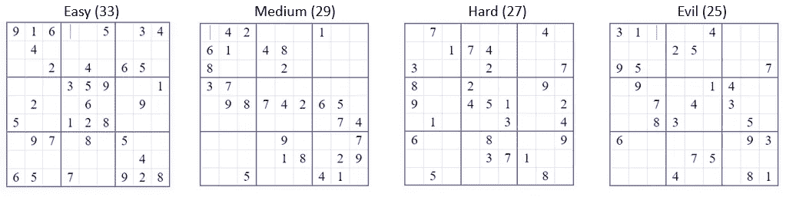

# 自由度和数独

> 原文：<https://towardsdatascience.com/degrees-of-freedom-and-sudoko-f65b921ea636?source=collection_archive---------13----------------------->

## 对自由度以及自由度如何影响数独的直观解释

Source : [Pixabay](https://pixabay.com/en/relaxation-sudoku-tea-puzzle-2040676/)

许多有抱负的数据科学家学习统计学课程，对自由度的概念感到困惑。有些人把它死记硬背成“n-1”。

但为什么是‘n-1’，有一个直观的原因。

## **直观的解释**

让我们考虑下面的例子。

想象一下，让你选择 5 个总和为 100 的数字。为了简单起见，你说 20，20，20，20。在你说出第五个数字之前，我告诉你，你的第五个数字也是 20。这是因为你选择的前 4 个数字加起来是 80，而条件是选择 5 个数字加起来是 100。

所以 100 -80 = 20。第五个数字是 20。

**第五个数字在某种意义上选择了自己**由于指定的条件。

你可以看到你有 4 个自由度。只需要前四个数字。

这也直观地解释了 n-1。这里 n 是 5，n-1 =4。

你因为**“5 个数之和应为 100”**的条件而失去了一个自由度

或者

换句话说，你有 4 个自由度。

## 数独连接

数独是我们大多数人都非常熟悉的游戏。[维基百科](https://en.wikipedia.org/wiki/Sudoku)给出了如下定义

> **数独**最初被称为**数字位置**)是一个基于逻辑的组合数字位置难题。目标是用数字填充一个 9×9 的网格，以便每一列、每一行以及组成网格的九个 3×3 子网格(也称为“框”、“块”或“区域”)中的每一个都包含从 1 到 9 的所有数字。难题设置器提供了一个部分完成的网格，对于一个适定的难题，它只有一个解。

我正在解一个数独游戏，只是为了消磨时间。我意识到数独和自由度之间有某种联系。

我不确定网络版的游戏是否考虑了自由度来给游戏评分“容易”、“中等”、“专家”。但是也许这个游戏可以这样评价！！

让我用一个取自在线数独谜题的例子来说明。

在线数独游戏的“简单”、“中等”、“困难”和“邪恶”等级如下所示。

请注意，数独游戏中有 81 个单元格。

Source : [websudoku](https://www.websudoku.com/?level=4)

## 更多的自由度=更难的数独

在每一层，我们都注意到一些有趣的事情。随着等级从易到恶，填充的单元格数量不断变小！！

基本上，当你有更多的单元格要填充(空白单元格)时，关卡会变得越来越难。你的自由度越多，解谜就越难！！至少在这种情况下，拥有很多自由并不理想。

这是一篇将自由度的统计概念与数独这样的日常游戏联系起来的小文章。

我希望在不久的将来写一个代码来描述上述内容。

你可以联系我

[Linkedin](http://www.linkedin.com/in/venkat-raman-Analytics)

[推特](https://twitter.com/venksaiyan)