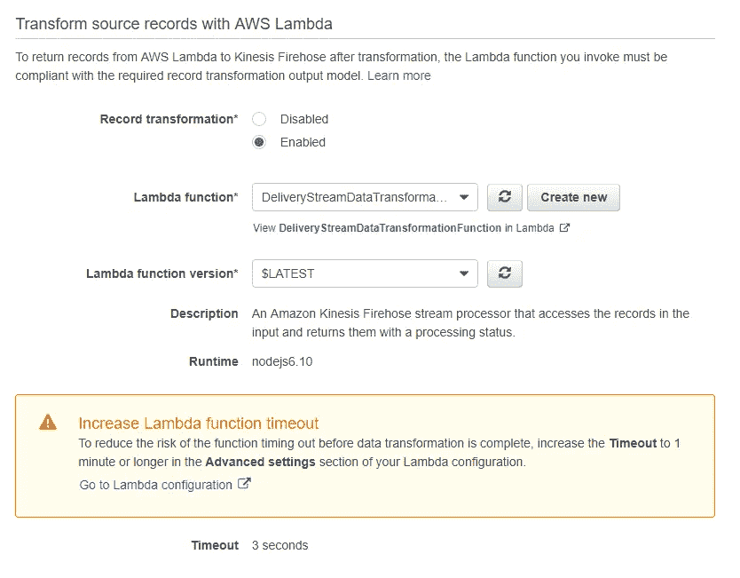

# 使用亚马逊 Kinesis Data Firehose 向亚马逊 S3 提供实时流数据

> 原文：<https://towardsdatascience.com/delivering-real-time-streaming-data-to-amazon-s3-using-amazon-kinesis-data-firehose-2cda5c4d1efe?source=collection_archive---------1----------------------->


在这篇文章中，让我们探索什么是流数据，以及如何使用亚马逊 Kinesis Firehose 服务来制作一个应用程序，将这些流数据存储到亚马逊 S3。作为实践体验，我们将使用 AWS 管理控制台接收模拟股票报价机数据，我们将从中创建一个交付流并保存到 S3。在实现之前，让我们先看看什么是流数据，什么是亚马逊 Kinesis。

流数据是由许多数据源连续生成的数据。这些可以同时以小尺寸发送。这些流数据可以通过 Amazon Kinesis、Apache Kafka、Apache Spark 和许多其他框架等工具收集。流式数据的一些例子是

*   应用程序生成的日志文件
*   来自 web 应用程序或移动应用程序的客户交互数据
*   金融股票市场数据
*   IOT 设备数据(传感器、性能监视器等..)

亚马逊 Kinesis 是亚马逊提供的一项服务，使其易于收集。处理和分析实时流数据。目前，亚马逊 Kinesis 提供了四种类型的 Kinesis 流数据平台。

*   **Kinesis 数据流** —用于实时收集和处理大量数据记录
*   **kine sis Data fire hose**——用于向亚马逊 S3、Redshift 等目的地传送实时流数据..
*   **kines 数据分析** —用于使用标准 SQL 处理和分析流数据
*   **Kinesis 视频流**——用于全面管理从设备传输实时视频的服务

# 亚马逊 Kinesis 数据消防软管

亚马逊 Kinesis data firehose 是亚马逊提供的一项完全托管的服务，用于向亚马逊服务提供的目的地交付实时流数据。目前，亚马逊 Kinesis Firehose 支持四类亚马逊服务作为目的地。

*   亚马逊 S3——一个易于使用的对象存储
*   亚马逊红移—Pb 级数据仓库
*   亚马逊弹性搜索服务——开源搜索和分析引擎
*   Splunk —用于分析机器生成数据的智能运营工具

在这篇文章中，我们将看看如何使用亚马逊 Kinesis Firehose 将流数据保存到亚马逊简单存储(S3)。在开始实现我们的应用程序之前，让我们先来看看 Amazon Kinesis Firehose 的关键概念。

**Kinesis 数据消防水带交付流**—kine sis 数据消防水带的底层实体。

**数据生产者** —将数据记录发送到 Kinesis 数据消防软管的实体。(例如:发送日志文件的 web 或移动应用程序)

**记录**——我们的数据生成器发送给 Kinesis 消防水带交付流的数据。

**缓冲区大小和缓冲区间隔** —这些配置决定了在将它们传送到目的地之前需要多少缓冲。

现在我们已经学习了 Kinesis Firehose 的关键概念，让我们进入流程的实现部分。下图显示了我们的交付流的基本架构。数据生产者将记录发送到我们的流中，我们将使用 Lambda 函数对其进行转换。之后，转换后的记录将通过 Kinesis Firehose 保存到 S3。我们还将在转换之前将流数据备份到 S3 存储桶。


对于这篇文章，我们将创建一个交付流，其中的记录将是股票行情数据。我们将使用 AWS 管理控制台接收模拟股票行情数据，并将 S3 作为我们的目的地。模拟数据将具有以下格式。

```
{"TICKER_SYMBOL":"JIB","SECTOR":"AUTOMOBILE","CHANGE":-0.15,"PRICE":44.89}
```

# 创建亚马逊 Kinesis 数据消防水带交付流

可以通过控制台或 AWS SDK 创建 Kinesis 消防水带传输流。对于我们的博客文章，我们将使用 ole 来创建交付流。在交付流创建之后，我们可以随时更新和修改它。

首先转到分析类别下的 Kinesis 服务。如果你以前从未使用过 Kinesis，你会看到下面的欢迎页面。


点击开始创建我们的交付流。在下一页中，您将看到四种类型的向导，用于为四种类型的数据平台服务创建 Kinesis 流。在这篇文章中，我们使用的是**通过 Kinesis Firehose 传送流**传送流数据，这是第二种选择。


提供传送流名称的名称。在来源下选择**直接上传或其他来源**。该选项将创建生产者应用程序直接写入的交付流。如果选择了 **Kinesis 流**，那么传送流将使用 Kinesis 数据流作为数据源。为简单起见，我们选择了第一个选项。


## 转换记录

在下一页中，我们将需要配置数据转换配置。Kinesis Firehose 可以调用 Lambda 函数来转换传入的源数据，并将转换后的数据传送到目的地。Lambda 函数的蓝图由 AWS 提供。但是在创建 Lambda 函数之前，让我们看看在转换数据之前我们需要知道的需求。

来自 lambda 函数的所有转换记录都应该包含下面描述的参数。

*   **recordid** —调用过程中从 Kinesis Firehose 传递到 Lambda 的记录 id。转换后的记录应该包含相同的 id。
*   **结果** —已被 Lambda 函数转换的数据的状态。
*   **数据** —转换后的数据

有几个为我们提供的 Lambda 蓝图，我们可以使用它们来创建用于数据转换的 Lambda 函数。我们将使用这些蓝图之一来创建我们的 Lambda 函数。


在**过程记录页面中**的** s 转换源记录，AWS Lambda** 选择启用。这将提示您选择一个 Lambda 函数。选择新建。在这里，我们得到了数据转换的 Lambda 蓝图。选择**通用水龙带加工**作为我们的蓝图。


这将把我们带到 Lambda 函数创建页面。为我们的函数提供一个名称。然后，我们需要提供一个 IAM 角色，它能够访问我们的消防软管交付流，并被允许调用**腐败批次**操作。


在查看策略文档中，选择编辑并将以下内容添加到策略中。

```
{
            "Effect": "Allow",
            "Action": [
                "firehose:PutRecordBatch"
            ],
            "Resource": [
                "arn:aws:firehose:your-region:your-aws-account-id:deliverystream/your-stream-name"
            ]
        }
```

确保在保存策略之前编辑**您的地区、您的 aws 帐户 id、您的流名称**。


创建 IAM 角色后，我们将被重定向回 Lambda 函数创建页面。在此选择创建的角色。之后，我们需要编写自己的 Lambda 函数代码来转换我们的数据记录。Lambda blueprint 已经用我们需要遵循的预定义规则填充了代码。

如上所述，我们的流数据将具有以下格式。

```
{"TICKER_SYMBOL":"JIB","SECTOR":"AUTOMOBILE","CHANGE":-0.15,"PRICE":44.89}
```

为了这篇文章的简单，我们将对这个记录做一个简单的转换。在流式传输记录时，我们将忽略“更改”属性。因此，我们转换后的记录将只有属性 **ticker_symbol** 、 **sector** 和 **price** 属性。将以下代码粘贴到 Lambda 函数中来实现这一点。

```
'use strict';
console.log('Loading function');exports.handler = (event, context, callback) => {
    /* Process the list of records and transform them */
    const output = event.records.map((record) => {
        console.log(record.recordId);
        const payload =JSON.parse((Buffer.from(record.data, 'base64').toString())) const resultPayLoad = {
                ticker_symbol : payload.ticker_symbol,
                sector : payload.sector,
                price : payload.price,
            };

        return{
            recordId: record.recordId,
            result: 'Ok',
            data: (Buffer.from(JSON.stringify(resultPayLoad))).toString('base64'),
        };
    });
    console.log(`Processing completed.  Successful records ${output.length}.`);
    callback(null, { records: output });
};
```

创建 Lambda 函数后，返回到交付流创建页面。在这里选择我们刚刚创建的新 Lambda 函数。



## 目的地

在下一页中，我们将被提示选择目的地。在这篇文章中，我们将把我们的记录保存到 S3。


在 S3 目的地选择 S3 桶，我们将存储我们的记录。如果您尚未创建 S3 存储桶，您可以选择创建新的。如果您想在 Lambda 完成转换过程之前备份记录，那么您也可以选择一个备份存储桶。


选择目的地后，我们将被重定向到配置页面。在这里，我们可以首先选择缓冲区大小和缓冲区间隔、S3 压缩和加密以及错误日志。除了 IAM 角色之外，保留所有配置设置的默认值。我们需要为 Kinesis 提供一个 IAM 角色来访问我们的 S3 桶。如果您已经有一个 IAM 角色，您可以在不创建新角色的情况下选择它。


查看我们的配置后，点击**创建交付流**创建我们的亚马逊 Kinesis 消防软管交付流。新的 Kinesis 消防水带交付流将在**创建**状态中花费一些时间，然后才可供我们使用。在交付流状态变为**活动**后，我们可以开始从生产者向其发送数据。


现在我们已经创建了交付流。现在让我们测试我们创建的交付流。点击交付流并打开带有演示数据的测试节点。


点击**开始发送演示数据**。这将开始向我们的交付流发送记录。发送演示数据后，点击**停止发送演示数据**以避免进一步充电。请注意，根据您的存储桶的缓冲配置，新对象可能需要几分钟才会出现在您的存储桶中。为了确认我们的流数据保存在 S3，我们可以去目的地 S3 桶和验证。验证流数据是否也没有更改属性。转换前的所有流记录都可以在备份 S3 存储桶中找到。


我们现在已经使用亚马逊 Kinesis Firehose 为 S3 成功创建了一个交付流，并成功进行了测试。你可以更深入地了解 Kinesis Firehose，它的目的地可能是亚马逊红移，也可能是 Kinesis 数据流的生产商。跟随这个[文档](https://docs.aws.amazon.com/firehose/latest/dev/what-is-this-service.html)深入了解亚马逊 Kinesis Firehose。