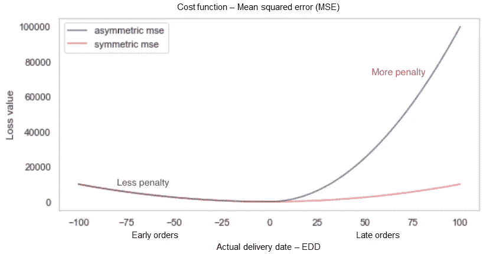
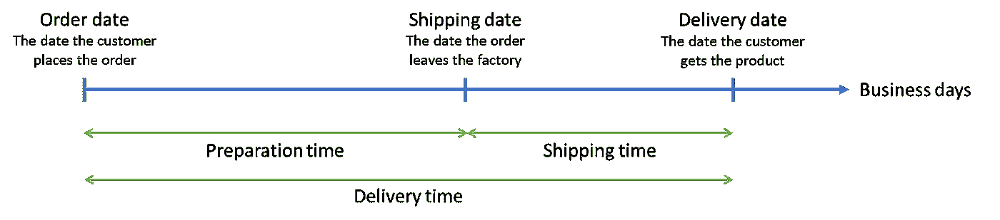
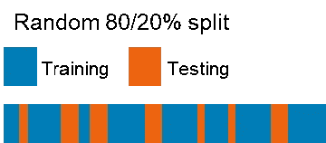
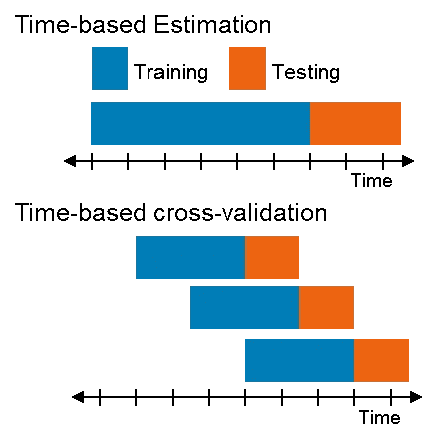

# 交货日期估计

> 原文：<https://towardsdatascience.com/delivery-date-estimation-5aff1a0ff8dc?source=collection_archive---------10----------------------->

## 在处理与时间相关且动态变化的环境时，您可能面临的技术挑战。

在戴尔，我们尽最大努力为客户提供卓越的体验。这也适用于满足我们的产品交付期限。在复杂的供应链中，向客户提供准确的预计交货日期并不容易。大型组织中的供应链团队可能很大，而且高度矩阵化，但是他们有一个共同的目标，那就是快速、准时地向客户提供产品。在下订单时，我们会利用我们所掌握的最佳信息为客户提供一个预计的交货日期。它需要考虑几个因素，如库存水平、地区、假期、预期的未来需求等。这些因素以及大量的历史数据使得这个问题成为应用机器学习的完美用例。

在本文中，我们将探索一些微妙的技术学习，以及我们在尝试将算法智能和机器学习引入这一重要挑战时面临的一些挑战。我们还将举例说明解决这些问题的一些方法。

我们开始吧。

# 准时订单与竞争力

估计交货日期有点棘手，需要保持一定的平衡，以确保订单不会延迟，同时尽可能在交货时间内报价。当客户下订单并得到承诺的交货日期时，我们必须履行订单并按时交货:在我们提供的预计日期或之前(在某些情况下，在特定的日期范围内)。应对这一挑战的简单方法是为客户提供较长的交付时间。例如，如果我们认为产品可以在一周内交付，我们可以提供一个月的交付日期，以最小化迟到的风险。然而，如果客户能在更短的时间内从竞争对手那里得到类似的产品，我们可能会失去这笔生意。

## 在准确性和竞争力之间有一个不断的权衡，当然，我们的目标是优化这两者。

绝大多数机器学习算法都是用对称的代价函数优化来构造的。在这种情况下，任何一个方向的误差成本都是一样的——晚 X 天或早 X 天的误差是一样的。在我们的例子中，有一个被认为代价更高的错误:我们宁愿早交货也不愿晚交货。我们通过创建一个定制的不对称成本函数，将这种业务逻辑编码到机器学习模型中，该函数对延迟订单的惩罚比对早期订单的惩罚更重。

下图显示了常规成本函数和不对称成本函数之间的比较。

Comparison between regular cost function and customize asymmetric cost function

我们希望将延迟订单的百分比保持在非常低的水平，同时在任何优化问题中，我们也希望尽可能地最小化成本函数，以实现零损失。通过这种方式，我们将能够为客户提供准确且有竞争力的交货时间。

# 选择目标变量

最直观的目标变量是订单周期时间(从订单输入到最终交付的总天数)。但是，要准确预测这个时间，我们应该考虑两个方面:

*   **计量单位**:产品是在**工作日**生产和交付的，因此我们的目标变量的计算应该只包括工作日。这样，我们消除了周末和节假日对交货日期估计的影响。
*   **周期时间定义**:总交付时间可以分为两个主要部分:构建/准备时间(订单输入和订单发货之间的时间)和发货时间(从订单发货到客户收到订单的时间)。因为运输时间通常由更一般的因素(运输提供商、天气、运输类型等)控制。建议使用一个主模型来预测订单的构建/准备时间，并使用一个额外的子模型来预测订单离开工厂后的运输时间(该模型将取决于与该特定问题更相关的其他因素)。

Timeline emphasizing the possible target variables

考虑到以上几个方面，我们可以确定没有外部效应被引入到模型中。这样，模型应该能够仅根据订单的特征来预测准备时间，而不需要外部数据源，如假期或运输选项。

# 基于时间的训练\测试分割

训练和评估机器学习模型通常需要一个训练集和一个测试集(以及一个交叉验证集来优化模型参数)。在大多数情况下，通过将 20%的数据作为模型不可见的测试数据，并将其余数据用于训练，来随机进行训练和测试拆分。

Random 80/20% split

当处理与时间相关且动态变化的环境时，例如大型公司供应链，其中环境的特征随着时间而变化，最好使用基于时间的分割，甚至应用基于时间的交叉验证来提供统计上稳健的模型评估。为此，我们使用一种取自时间序列领域的方法，即时间序列交叉验证，它形成了一种“滑动窗口”训练方法。

Time-based split

所建议的方法还可以帮助我们模拟实时生产环境，在这种环境中，机器学习模型根据到目前为止所有可用的订单进行训练，并用于预测未来订单的交付时间。

总之，我们分享了在使用机器学习估计订单交付日期时遇到的主要挑战。我们的目标是提高准确性并按时交付产品，同时保持竞争力的交付时间。为此，我们使用非对称成本函数来预测选定的目标变量，并通过使用独特的训练\测试分割方法来最佳模拟真实世界的行为。

特别感谢:

Kyle West 和 Oshry Ben-Harush，感谢他们在这个项目上的合作，感谢他们校对、审阅这篇文章并给出了令人敬畏的技术反馈。

# 推荐阅读

如果你想了解更多关于非对称成本函数的知识，我推荐阅读 Prince 的[梯度提升的自定义损失函数](/custom-loss-functions-for-gradient-boosting-f79c1b40466d)，它在这个项目的工作中帮助了我。