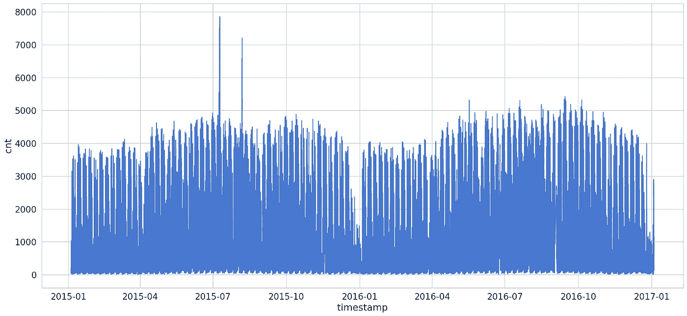
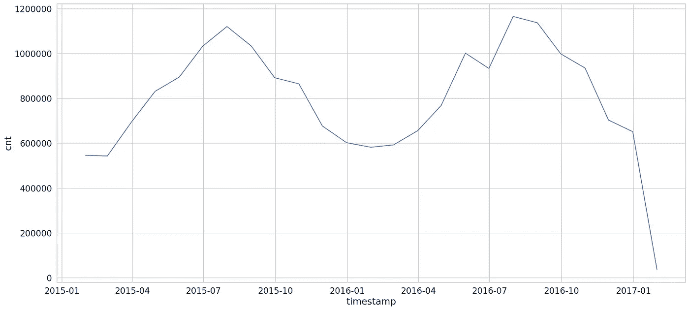
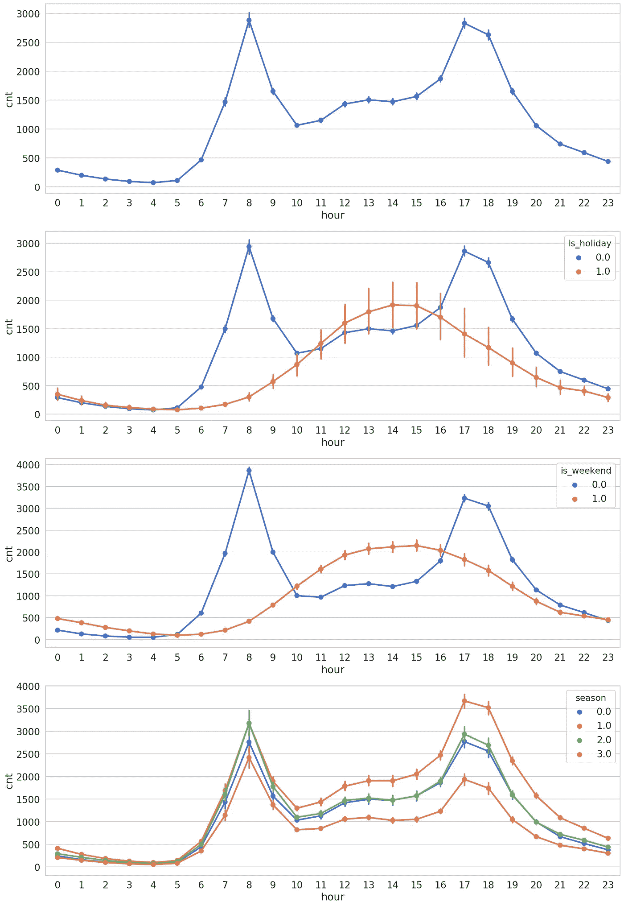
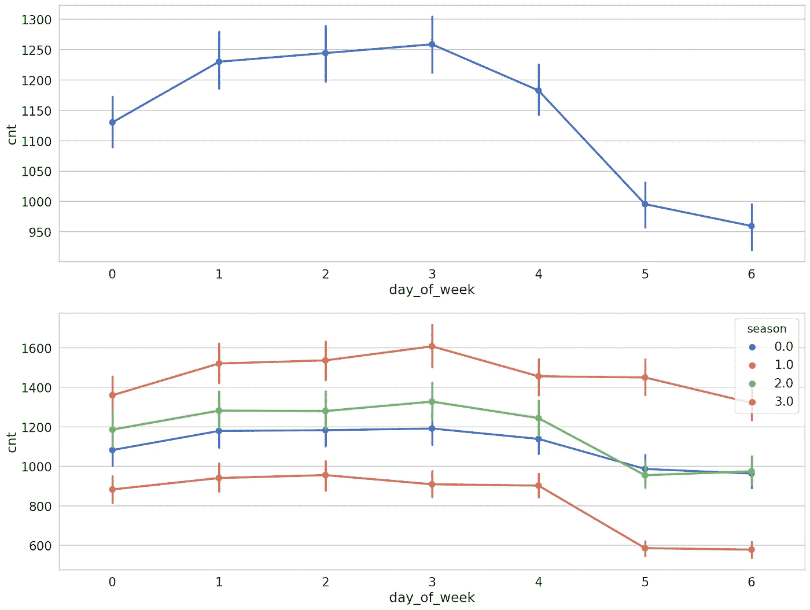
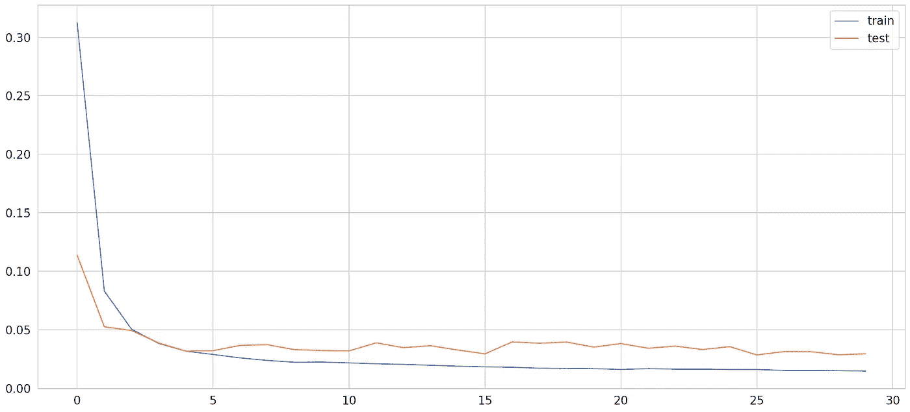
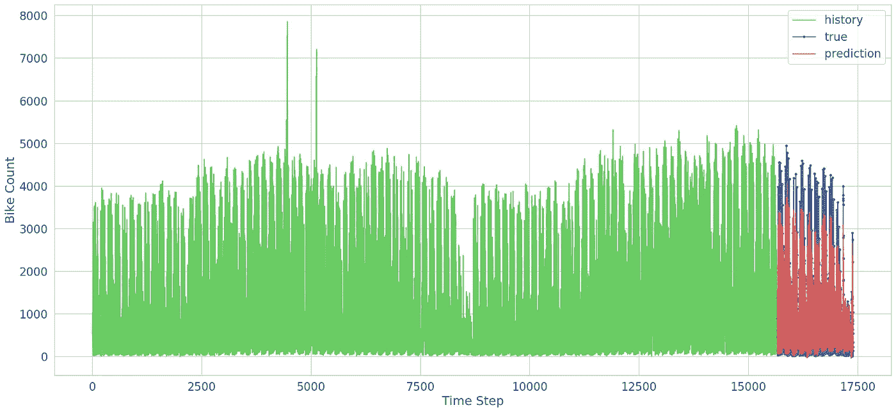
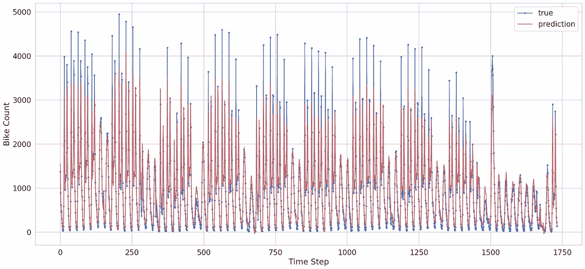

# 使用 TensorFlow 2 和 Keras 在 Python 中使用 LSTMs 进行需求预测

> 原文：<https://towardsdatascience.com/demand-prediction-with-lstms-using-tensorflow-2-and-keras-in-python-1d1076fc89a0?source=collection_archive---------5----------------------->

## 了解如何通过深度学习从多元时间序列数据中预测需求


> TL；DR 学习如何使用多元时间序列数据预测需求。在 Keras 和 TensorFlow 2 中建立一个双向 LSTM 神经网络，并使用它进行预测。

时间序列模型最常见的应用之一是预测未来值。股票市场将会如何变化？明天 1 个比特币值多少钱？下个月你打算卖多少咖啡？

[没听说过 LSTMs 和时间序列？阅读前一部分来学习基础知识。](/time-series-forecasting-with-lstms-using-tensorflow-2-and-keras-in-python-6ceee9c6c651)

本指南将向您展示如何使用多元(许多特征)时间序列数据来预测未来需求。您将学习如何预处理和缩放数据。你要建立一个双向 LSTM 神经网络来进行预测。

[**在浏览器中运行完整的笔记本**](https://colab.research.google.com/drive/1k3PLdczAJOIrIprfhjZ-IRXzNhFJ_OTN)

[**GitHub 上的完整项目**](https://github.com/curiousily/Deep-Learning-For-Hackers)

# 数据

我们的数据[伦敦自行车共享数据集](https://www.kaggle.com/hmavrodiev/london-bike-sharing-dataset)托管在 Kaggle 上。由[赫里斯托·马夫罗季耶夫](https://www.kaggle.com/hmavrodiev)提供。谢谢！

> *自行车共享系统、公共自行车计划或公共自行车共享(PBS)计划是一项服务，在该服务中，个人可以付费或免费短期共享自行车。——*[*维基百科*](https://en.wikipedia.org/wiki/Bicycle-sharing_system)

我们的目标是根据伦敦自行车份额的历史数据预测未来自行车份额的数量。让我们下载数据:

```
!gdown --id 1nPw071R3tZi4zqVcmXA6kXVTe43Ex6K3 --output london_bike_sharing.csv
```

并将其加载到熊猫数据框中:

Pandas 足够聪明，可以将时间戳字符串解析为 DateTime 对象。我们有什么？我们有 2 年的自行车共享数据，定期记录(1 小时)。就行数而言:

```
(17414, 9)
```

那也许可以。我们有什么特点？

*   *时间戳* —用于分组数据的时间戳字段
*   *计数* —一辆新自行车股份的计数
*   *t1*——实际温度，单位为摄氏度
*   *T2*——以摄氏度为单位的温度“感觉像”
*   *嗡嗡声*——湿度百分比
*   *风速* —风速，单位为千米/小时
*   *天气 _ 代码* —天气的类别
*   *is_holiday* —布尔字段— 1 节假日/ 0 非节假日
*   *is_weekend* —布尔字段—如果当天是周末，则为 1
*   *季节* —类别野外气象季节:0-春季；1-夏天；2-摔倒；3-冬天。

我们能在多大程度上根据数据预测未来的需求？

## 特征工程

我们会做一点工程设计:

所有新特性都基于时间戳。让我们更深入地研究这些数据。

## 探测

让我们从简单的开始。让我们来看看自行车份额的变化情况:



那有点太拥挤了。让我们来看看每月的相同数据:



我们的数据似乎有很强的季节性成分。夏季对生意有好处。

按小时共享自行车怎么样:



大多数自行车共享的时间根据周末或非周末有很大不同。工作日包含上午和下午晚些时候的两个大高峰(人们假装在中间工作)。周末下午早些时候到晚些时候似乎是最忙的。



按一周中的某一天来看数据，会发现自行车份额的数量要高得多。

我们小小的功能工程努力似乎有了回报。新功能可以很好地分离数据。

## 预处理

我们将使用最后 10%的数据进行测试:

```
15672 1742
```

我们将扩展建模中使用的一些功能:

我们还将扩大自行车份额的数量:

为了准备序列，我们将重用同一个`create_dataset()`函数:

每个序列将包含历史记录中的 10 个数据点:

```
(15662, 10, 13) (15662,)
```

我们的数据格式不适合训练 LSTM 模型。我们能多好地预测自行车份额的数量？

# 预测需求

让我们从一个简单的模型开始，看看效果如何。一层[双向](https://www.tensorflow.org/api_docs/python/tf/keras/layers/Bidirectional) LSTM，带[漏层](https://www.tensorflow.org/api_docs/python/tf/keras/layers/Dropout):

记住在训练时不要打乱数据:

# 估价

以下是我们为 *30* 个时代训练模型后的结果:



你可以看到这个模型学得很快。大约在第五纪元*和*时，它已经开始有点过度适应了。你可以试着调整它，改变单位的数量，等等。但是我们能用它来预测需求吗？



那对你的眼睛来说可能太多了。让我们放大预测:



请注意，我们的模型只预测未来的一个点。也就是说，它做得很好。虽然我们的模型不能真正捕捉到极值，但它在预测(理解)一般模式方面做得很好。

# 结论

你只是拿了一个真实的数据集，对它进行预处理，然后用它来预测自行车共享需求。您已经使用双向 LSTM 模型对原始数据集的子序列进行了训练。你甚至得到了一些非常好的结果。

[**在浏览器中运行完整的笔记本**](https://colab.research.google.com/drive/1k3PLdczAJOIrIprfhjZ-IRXzNhFJ_OTN)

[**GitHub 上的完整项目**](https://github.com/curiousily/Deep-Learning-For-Hackers)

LSTMs 对于时间序列数据还有其他应用吗？

[](https://leanpub.com/Hackers-Guide-to-Machine-Learning-with-Python/) [## 用 Python 进行机器学习的黑客指南

### Scikit-Learn、TensorFlow 和 Keras 深度学习实践指南了解如何解决现实世界的机器学习…

leanpub.com](https://leanpub.com/Hackers-Guide-to-Machine-Learning-with-Python/) 

*最初发表于*[*https://www.curiousily.com*](https://www.curiousily.com/posts/demand-prediction-with-lstms-using-tensorflow-2-and-keras-in-python/)*。*