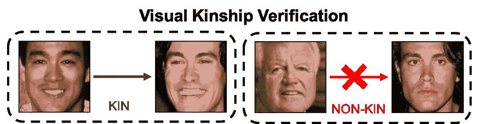
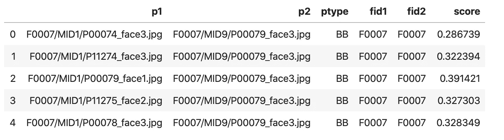
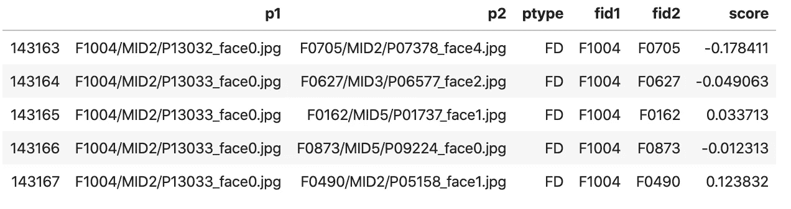
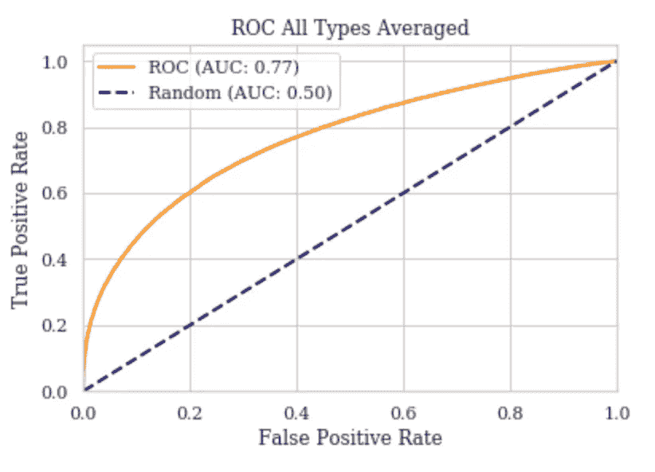
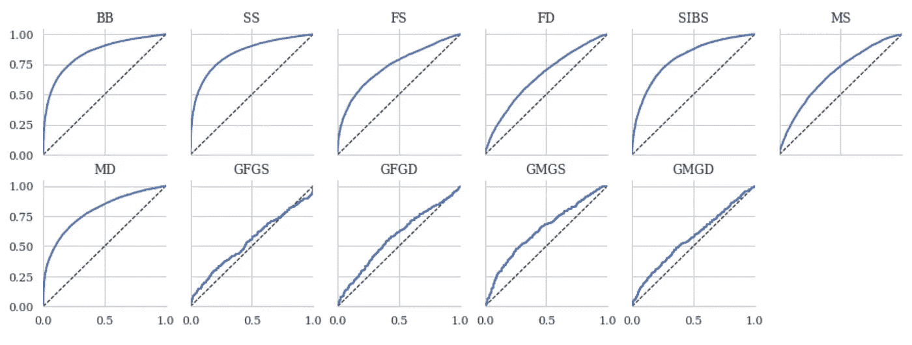
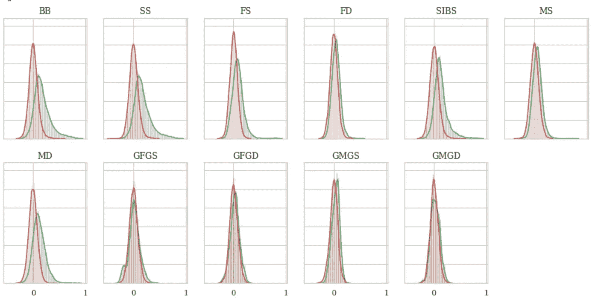
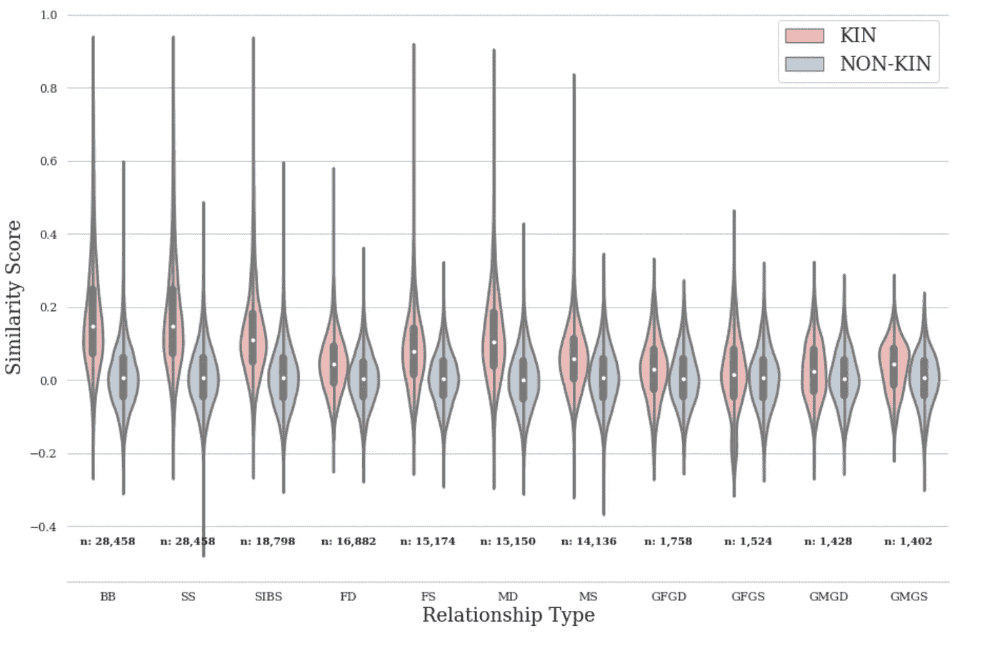

# 视觉亲属关系验证:Python 熊猫教程

> 原文：<https://towardsdatascience.com/demo-for-rfiw-2020-task-1-kinship-verification-8a8ed7081bcc?source=collection_archive---------36----------------------->

## 野外家庭的视觉识别

## 认识野外的家庭

# 目录

*   [问题公式化](#5dc1)
*   [概述](#3db9)
*   [设置环境和绘图风格](#1488)
*   [准备数据](#16bb)
*   [准备特征并计算分数](#7c62)
*   [通过信号检测理论分析性能](#31d4)
*   [突击测验](#21e3)

# 问题定式化

亲属关系验证的目标是确定不同主体的一对人脸是否是特定类型的亲属，像*亲子*。这是一个经典的布尔问题，系统响应要么相关，要么不相关。即分别为真或假，并形成自动亲属关系识别的一对一范例。

Given a pair of faces, the task here would be to determine whether or not either is a father-son pair.

# 概观

这个基本演示展示了在野外识别家庭( [RFIW](https://web.northeastern.edu/smilelab/rfiw2020/) )数据挑战中使用[熊猫](https://pandas.pydata.org/)的一些技巧。具体来说，亲属关系验证([任务一](https://competitions.codalab.org/competitions/21843))。 [FIW 数据集](https://web.northeastern.edu/smilelab/fiw/)支持 RFIW。这里的目的是演示如何通过几个简单的步骤完成评估。此外，我们还看到了如何轻松地生成既吸引人又富有洞察力的可视化效果。

我们将评估配对，并对用于评估的特征进行分析。具体来说:

*   将所有特征加载到字典中。
*   根据验证协议进行评估。
*   生成 ROC 曲线。
*   使用信号检测模型(SDMs)可视化不同关系类型的亲缘和非亲缘分数分布。

# 设置环境和打印样式

# 准备数据

假设特征被提取，存储为 [pickles](https://docs.python.org/3/library/pickle.html) ，并以与人脸图像相同的目录结构和命名方案保存。特征以字典的形式读入，键设置为无文件扩展名的相对文件路径(即<FID>/<MID>/<faceID>)。参见[准备特性](http://localhost:8889/lab#Prepare-features) —更改 i/o 方案以修改单个单元。为此，使用在 Pytorch 的 MSCeleb 上训练的 ArcFace 对人脸进行编码(来源， [Github](https://github.com/ronghuaiyang/arcface-pytorch) )。但是，任何功能都可以插入。

# 准备特征并计算分数

加载 pickle 文件并确定关系类型

Processing 143168 pairs of 11 relationship types
[‘BB’ ‘SS’ ‘FS’ ‘FD’ ‘SIBS’ ‘MD’ ‘MS’ ‘GFGS’ ‘GFGD’ ‘GMGS’ ‘GMGD’]

在 LUT 建立图像列表和加载功能

计算每对的分数

The output of cell above: head (top) and tail (bottom)

表格的顶部包含阳性对，而底部是阴性对。看分数差异。正如我们所希望的，亲属对似乎比非亲属对得分更高(即更相似)。

# 通过信号检测理论分析性能

在大多数情况下，标签从一个单独的文件中加载。然而，在这里，我们根据受试者 1 和 2 的家庭 ID (FID)来推断标签是*亲属*还是*非亲属*。

## 生成接收机工作特性(ROC)曲线

以前，这一部分只包含代码片段和图形。感谢 [Abal Harith](https://www.facebook.com/helmi.murad) 的评论激发了本文的阐述。尽管如此，未来的博客将会更深入，但下面描述的是最低限度。

验证中提出的一对一协议直接转化为布尔分类的经典问题。因此，ROC 曲线是评估两类问题的一种传统方法，如是/否、垃圾邮件/非垃圾邮件、患病/未患病，以及(我希望)在这一点上毫不奇怪的*亲属* / *非亲属*。本质上，ROC 曲线的每个点都是做出正确决策的概率，假设感兴趣的样本确实是*阳性*(即*y*= {是，垃圾邮件，患病，或*亲属}，*其中标签 *y* 是针对目标对的)。具体来说，ROC 曲线直观地描述了作为假阳性率(FPR)函数的真阳性率(TPR)。作为回报，是一个由滑动阈值决定的权衡比率。换句话说，ROC 曲线揭示了做出的正确(即 *KIN* )决策的数量中正确和错误决策的数量(即每次预测被推断为肯定时的正确率)。此外，找到曲线下的面积(AUC)会将该图转换为单个值 *v* ，其中*v*∈ℝ:*v*∈【0，1】。

首先，将 random(即 50-50)绘制成一条穿过对角线的虚线。如果 ROC 曲线低于 random，那么我们只能说你最好抛硬币:)尽管如此，为了直观的帮助:

ROC curves for all pairs

现在生成每种关系(即成对)类型的 ROC 曲线:

ROC curves for each relationship types

显然，祖孙辈似乎是最糟糕的一群。此外，平均而言，FP 是丰富的，这是不好的。

ROC 曲线不是这篇文章的重点。因此，让我们就此打住——我尊敬地提到[乔斯林·德索萨](https://medium.com/u/71a366ceb3de?source=post_page-----8a8ed7081bcc--------------------------------)和[萨朗·纳克希德](https://medium.com/u/7fe94d3af4e6?source=post_page-----8a8ed7081bcc--------------------------------) [这里](https://medium.com/greyatom/lets-learn-about-auc-roc-curve-4a94b4d88152)和[这里](/understanding-auc-roc-curve-68b2303cc9c5)。两位作者都很好地描述了这个主题的介绍性观点。尽管如此，我们只考虑积极的预测，因此，未来的博客将沉迷于其他指标，同时指出这些指标可能会产生误导的情况(例如，患病/未患病，其中阳性(即患病)的数量通常比阴性少得多)。

让我们对分数分布做一些分析。

**信号分析**

接下来，为每种关系类型绘制信号检测模型(SDM)。由此，我们将分数的分布视为标签的函数(即，亲属与非亲属)。

SDM for the different pair-wise types.

类似于 SDM，但是让我们看看小提琴的情节，作为两类可分性的另一种可视化的手段。

Violin plot comparing scores of KIN to NON-KIN per category.

# 突击测验

你看出 ROC 曲线和 SDM 之间的关系了吗？数学上？直觉上？请在下面评论您的想法和解决方案。未来的演示将探索这一概念。