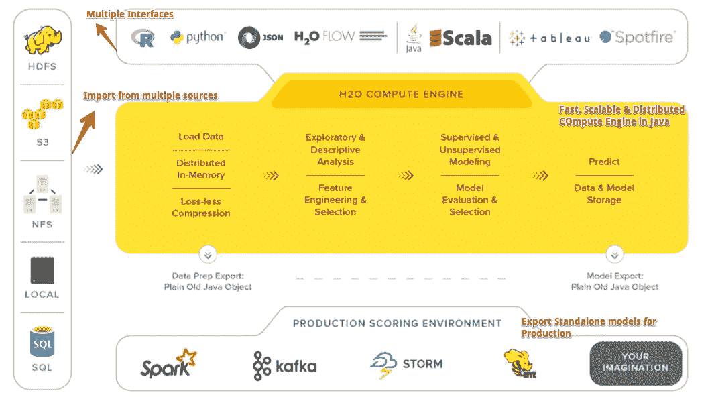
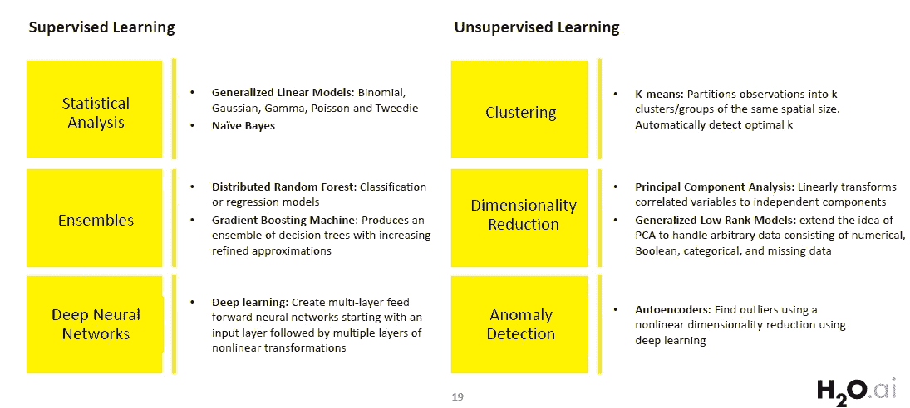

# 与 H2O 一起使机器学习民主化

> 原文：<https://towardsdatascience.com/democratising-machine-learning-with-h2o-7f2f79e10e3f?source=collection_archive---------3----------------------->

## H2O 概述:开源、分布式内存机器学习平台


Photo by [Pixabay](https://www.pexels.com/@pixabay?utm_content=attributionCopyText&utm_medium=referral&utm_source=pexels) from [Pexels](https://www.pexels.com/photo/water-yellow-orange-drop-of-water-33397/?utm_content=attributionCopyText&utm_medium=referral&utm_source=pexels)

> 为了社会和经济的稳定，让每个人都能接触到人工智能是很重要的。

[**Kaggle days**](http://blog.kaggle.com/2018/11/27/kaggle-days/) 是一个为期两天的活动，数据科学爱好者可以面对面地相互交流，交流知识，并一起竞争。Kaggle days 旧金山刚刚结束，按照惯例，Kaggle 还为参与者组织了一次黑客马拉松。我在 Twitter 上关注了 Kaggle 几天，来自[**Erin LeDell**](https://www.linkedin.com/in/erin-ledell/)(H2O . ai 的首席机器学习科学家)的以下推文引起了我的注意。


Source: [Twitter](https://twitter.com/ledell/status/1116533416155963392)

我已经用 H2O 做了一段时间的实验，发现它在解决 ML 问题时非常无缝和直观。看到它在排行榜上表现如此之好，我想是时候写一篇关于它的文章了，让其他人更容易过渡到 H2O 的世界。

# H2O . ai:H2O 背后的公司

[H2O.ai](http://h2o.ai/) 位于加州山景城，提供一套机器学习平台。H2O 的核心优势是其高性能的 ML 组件，这些组件紧密集成在一起。在 2019 年 1 月发布的报告中，H2O.ai 在 Gartner 数据科学平台魔力象限中是一个有远见的人。


[Source: Gartner (January 2019)](https://www.gartner.com/doc/reprints?id=1-65X91LU&ct=190128&st=sb)

让我们简单看一下 H2O.ai 的**产品**:


[H2O.ai Products and Solutions](https://www.h2o.ai/products/)

## H2O

[**H2O**](http://docs.h2o.ai/h2o/latest-stable/h2o-docs/welcome.html#python-users) 是一个开源的、分布式内存机器学习平台，具有线性可扩展性。H2O 支持最广泛使用的统计&机器学习算法，也具有 AutoML 功能。H2O 的核心代码是用 Java 编写的，它的 REST API 允许从外部程序或脚本访问 H2O 的所有功能。该平台包括 R、Python、Scala、Java、JSON 和 CoffeeScript/JavaScript 的接口，以及内置的 web 接口 Flow，

> 由于这篇文章的主要焦点是关于 H2O，我们将在文章的后面了解更多。

## H2O 苏打水

[**苏打水**](http://docs.h2o.ai/h2o/latest-stable/h2o-docs/faq/sparkling-water.html) 允许用户将 H2O 的快速、可扩展的机器学习算法与 Spark 的能力相结合。苏打水是 H2O 用户的理想选择，他们需要管理大型集群以满足其数据处理需求，并希望将数据从 Spark 传输到 H2O(反之亦然)。

## H2O4GPU

[**H2O4GPU**](https://www.h2o.ai/blog/h2o-ai-releases-h2o4gpu-the-fastest-collection-of-gpu-algorithms-on-the-market-to-expedite-machine-learning-in-python/) 是一个开源的 GPU 加速的机器学习包，带有 Python 和 R 中的 API，允许任何人利用 GPU 来构建高级机器学习模型。

## H2O 无人驾驶人工智能


Driverless AI’s UI

[**H2O 无人驾驶 AI**](https://www.h2o.ai/products/h2o-driverless-ai/) 是 H2O.ai 的自动机器学习旗舰产品。它完全自动化了应用数据科学中一些最具挑战性和生产力的任务，例如特征工程、模型调整、模型集成和模型部署。有了无人驾驶人工智能，各种熟练程度的数据科学家只需在 GUI 上点击几下，就可以训练和部署建模管道。无人驾驶 AI 是一种商业许可产品，有 21 天的免费试用版。

# 什么是 H2O

最新版本叫做 [**H2O-3**](https://github.com/h2oai/h2o-3/blob/master/README.md) 是 H2O 的第三次化身。H2O 使用熟悉的接口，如 R、Python、Scala、Java、JSON 和 Flow notebook/web 接口，并与 Hadoop 和 Spark 等大数据技术无缝合作。通过更快、更好的预测建模，H2O 可以轻松、快速地从数据中获得洞察力。

## 高层架构

H2O 使得从多个来源导入数据成为可能，并拥有一个用 Java 编写的快速、可扩展的分布式计算引擎。这里是该平台的高级概述。



A High-Level architecture of h2o

## 支持的算法

H2O 支持很多常用的机器学习算法。



Algorithms supported by H2O

## 装置

H2O 提供了一个可以从 CRAN 安装的 R 包和一个可以从 PyPI 安装的 python 包。在本文中，我将只使用 Python 实现。另外，你可能想看看[文档](http://docs.h2o.ai/h2o/latest-stable/h2o-docs/downloading.html)中的完整细节。

## 先决条件

*   计算机编程语言
*   Java 7 或更高版本，你可以在 [Java 下载页面](https://www.oracle.com/technetwork/java/javase/downloads/index.html)获得。要构建 H2O 或运行 H2O 测试，需要 64 位 JDK。要使用命令行、R 或 Python 包运行 H2O 二进制文件，只需要 64 位 JRE。

## 依赖关系:

```
pip install requests
pip install tabulate
pip install "colorama>=0.3.8"
pip install future
```

*   pip 安装

```
pip install **-**f http:**//**h2o**-**release**.**s3**.**amazonaws**.**com**/**h2o**/**latest_stable_Py**.**html h2o
```

*   康达

```
conda install -c h2oai h2o=3.22.1.2
```

**注意**:在 OS X El Capitan 中从`pip`安装 H2O 时，用户必须包含`--user`标志。比如说-

```
pip install -f [http://h2o-release.s3.amazonaws.com/h2o/latest_stable_Py.html](http://h2o-release.s3.amazonaws.com/h2o/latest_stable_Py.html) h2o --user
```

关于 R 安装，请参考官方文档[此处](http://docs.h2o.ai/h2o/latest-stable/h2o-docs/downloading.html#install-in-r)。

## 测试装置

每个新的 python 会话都从初始化 python 客户端和 H2O 集群之间的连接开始。一个[集群](http://docs.h2o.ai/h2o/latest-stable/h2o-docs/glossary.html)是一组协同工作的 H2O 节点；当作业提交到集群时，集群中的所有节点都处理该作业的一部分。

要检查是否一切就绪，请打开 Jupyter 笔记本，键入以下内容:

```
import h2o
h2o.init()
```

这是一个本地的 H2O 集群。在执行单元时，一些信息将以表格的形式显示在屏幕上，其中包括节点数量、总内存、Python 版本等。如果您需要报告一个 bug，请确保包含所有这些信息。此外，`h2o.init()`确保没有 H2O 的先前实例在运行。


Running h2o.init() (in Python)

默认情况下，H2O 实例使用所有内核和大约 25%的系统内存。但是，如果您希望为它分配固定的内存块，您可以在 init 函数中指定它。假设我们想给 H2O 实例 4GB 内存，它应该只使用 2 个内核。
#分配资源
h2o.init(nthreads=2，max_mem_size=4)


现在，我们的 H2O 实例只使用了 2 个内核和大约 4GB 的内存。但是，我们将使用默认方法。

# 在 Python 中使用 H2O 导入数据

安装成功后，就该动手处理真实世界的数据集了。我们将使用著名的葡萄酒数据集解决一个回归问题。这里的任务是 ***预测白葡萄酒*** 的质量，给定一组特征作为输入，范围为 0-10。

> **这里有一个到** [**Github 资源库**](https://github.com/parulnith/Machine-learning-with-H2O-in-Python) **的链接，如果你想跟进或者你可以点击下面的图片在我的活页夹上查看。**

[](https://hub.mybinder.org/user/parulnith-machi-h-h2o-in-python-rumzvaul/tree?token=W5oRIGlASFym7dcXHIrI1Q)

## 数据

这些数据属于葡萄牙“Vinho Verde”葡萄酒的白色变种。

*   https://archive.ics.uci.edu/ml/datasets/Wine+Quality**来源** e: [来源](https://archive.ics.uci.edu/ml/datasets/Wine+Quality)
*   **CSV 文件**:([https://archive . ics . UCI . edu/ml/machine-learning-databases/wine-quality/wine quality-white . CSV](https://archive.ics.uci.edu/ml/machine-learning-databases/wine-quality/winequality-white.csv)

## 数据导入

从本地 CSV 文件导入数据。该命令与`pandas.read_csv`非常相似，数据作为[H2 of frame](http://docs.h2o.ai/h2o/latest-stable/h2o-py/docs/frame.html)存储在内存中。

```
wine_data = h2o.import_file("winequality-white.csv")
wine_data.head(5)# The default head() command displays the first 10 rows.
```


Displaying the first 5 rows of the dataset

## 电子设计自动化(Electronic Design Automation)

让我们探索数据集以获得一些见解。

```
wine_data.describe()
```


Exploring some of the columns of the dataset

这里所有的特征都是数字，没有任何分类变量。现在让我们也来看看各个特征之间的相互关系。

```
import matplotlib.pyplot as plt
import seaborn as sns
plt.figure(figsize=(10,10))
corr = wine_data.cor().as_data_frame()
corr.index = wine_data.columns
sns.heatmap(corr, annot = True, cmap='RdYlGn', vmin=-1, vmax=1)
plt.title("Correlation Heatmap", fontsize=16)
plt.show()
```


# 和 H2O 一起做模特

我们将建立一个回归模型来预测葡萄酒的质量。在 H2O 模块中有很多算法可以用于分类和回归问题。

## 将数据拆分为测试集和训练集

由于我们只有一个数据集，让我们将它分成训练和测试部分，以便我们可以评估模型的性能。我们将使用`split_frame()`功能。

```
wine_split = wine_data.split_frame(ratios = [0.8], seed = 1234)wine_train = wine_split[0] # using 80% for training
wine_test = wine_split[1] #rest 20% for testingprint(wine_train.shape, wine_test.shape)
**(3932, 12) (966, 12)**
```

## 定义预测变量

```
predictors = list(wine_data.columns) 
predictors.remove('quality')  # Since we need to predict quality
predictors
```


## 广义线性模型

我们将建立一个默认设置的广义线性模型(GLM)。广义线性模型(GLM)根据指数分布估计回归模型的结果。除了高斯(即正态)分布，还包括泊松、二项式和伽玛分布。你可以在[文档](http://docs.h2o.ai/h2o/latest-stable/h2o-docs/data-science/glm.html)中读到更多关于 GLM 的信息。

```
# Import the function for GLM
from h2o.estimators.glm import H2OGeneralizedLinearEstimator# Set up GLM for regression
glm = H2OGeneralizedLinearEstimator(family = 'gaussian', model_id = 'glm_default')# Use .train() to build the model
glm.train(x = predictors, 
                  y = 'quality', 
                  training_frame = wine_train)print(glm)
```


GLM model’s parameters on the Training set

现在，让我们在测试数据集上检查模型的性能

```
glm.model_performance(wine_test)
```


## 做预测

使用 GLM 模型在测试数据集中进行预测。

```
predictions = glm.predict(wine_test)
predictions.head(5)
```


同样，您可以使用其他监督算法，如 [**分布式随机 Fores**](http://docs.h2o.ai/h2o/latest-stable/h2o-docs/data-science/drf.html#distributed-random-forest-drf)**[**梯度推进机器**](http://docs.h2o.ai/h2o/latest-stable/h2o-docs/data-science/gbm.html#gradient-boosting-machine-gbm) ，甚至 [**深度学习**](http://docs.h2o.ai/h2o/latest-stable/h2o-docs/data-science/deep-learning.html#deep-learning-neural-networks) 。你也可以调整超参数。**

# **H2OAutoML:自动机器学习**

**[**自动化机器学习** ( **AutoML** )](https://heartbeat.fritz.ai/automl-the-next-wave-of-machine-learning-5494baac615f) 是将机器学习应用于现实世界问题的端到端过程自动化的过程。AutoML 使得真正意义上的机器学习成为可能，甚至对于在这个领域没有主要专业知识的人也是如此。H2O 的 AutoML 倾向于将模型的训练和调整部分自动化。**

****

**H2O AutoML: Available Algos**

**在这一部分，我们将使用 H2O 的 AutoML 功能来解决预测葡萄酒质量的回归问题。**

## **导入 AutoML 模块**

```
from h2o.automl import H2OAutoML
aml = H2OAutoML(max_models = 20, max_runtime_secs=100, seed = 1)
```

**在这里，AutoML 将为 20 个基本模型运行 100 秒。默认运行时间是 1 小时。**

## **培养**

```
aml.train(x=predictors, y='quality', training_frame=wine_train, validation_frame=wine_test)
```

## **排行榜**

**现在让我们看看 automl 排行榜。**

```
print(aml.leaderboard)
```

****

**AutoML Leaderboard**

**排行榜显示了 AutoML 构建的前 10 个模型及其参数。最好的模型放在最上面是一个堆叠的系综。**

**领导者模型存储为`aml.leader`**

## **单个模型的贡献**

**让我们看看这个元学习者的个人模型的贡献。**

```
metalearner = h2o.get_model(aml.leader.metalearner()['name'])
metalearner.std_coef_plot()
```

****

**XRT(极度随机化的树)的贡献最大，其次是分布式随机森林。**

## **预言**

```
 preds = aml.leader.predict(wine_test)
```

**上面的代码是最快的入门方式，然而，要了解更多关于 H2O AutoML 的信息，值得看一看深入的 [AutoML 教程](https://github.com/h2oai/h2o-tutorials/tree/master/h2o-world-2017/automl)(有 R 和 Python 版本)。**

## **停工**

```
h2o.shutdown()
```

# **使用心流——H2O 的网络用户界面**

**在本文的最后一部分，让我们快速了解一下 H2O 的开源 Web UI[**Flow**](http://docs.h2o.ai/h2o/latest-stable/h2o-docs/flow.html#using-flows)。FLow 是一个基于 web 的交互式计算环境，您可以将代码执行、文本、数学、情节和富媒体结合到一个文档中，就像 Jupyter 笔记本一样。**

## **发射流程**

**一旦 H2O 启动并运行，你所需要做的就是将你的浏览器指向 http://localhost:54321 ，你就会看到我们非常漂亮的用户界面**流。****

****

**Launching H2O flow**

## **流动界面**

**这里是流接口的一个快速浏览。你可以在这里 阅读更多关于使用和操作 [**的信息。**](http://docs.h2o.ai/h2o/latest-stable/h2o-docs/flow.html#using-flows)**

****

**H2O’s flow interface**

**Flow 旨在帮助数据科学家快速轻松地创建模型、导入文件、分割数据框，以及完成在其他环境中通常需要大量输入的所有工作。**

## **工作**

**让我们看一下同样的葡萄酒例子，但这次是流动的。以下视频解释了使用 flow 的模型构建和预测，这是一目了然的。**

**Demonstration of H2O Flow**

**要深入了解 FLow 及其功能，请参考下面的文章:**

**[](/getting-started-with-h2o-using-flow-b560b5d969b8) [## 使用 Flow 开始使用 H2O

### 看看 H2O 的开源 UI，它将代码执行、文本、情节和富媒体结合在一个文档中。

towardsdatascience.com](/getting-started-with-h2o-using-flow-b560b5d969b8)** 

# **结论**

**H2O 是一个强大的工具，鉴于它的能力，它真的可以永远改变数据科学的进程。人工智能的能力和优势应该面向所有人，而不是少数人。这是民主化的真正本质，而民主化的数据科学对于解决威胁我们星球的真正问题应该是至关重要的。**