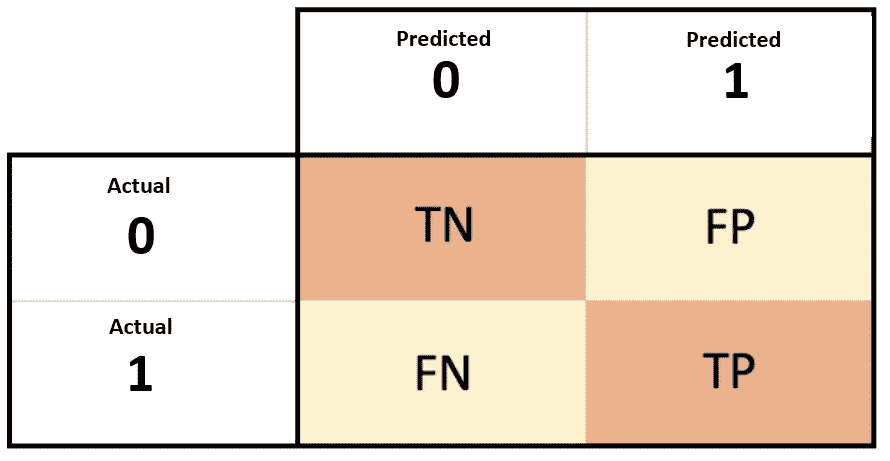
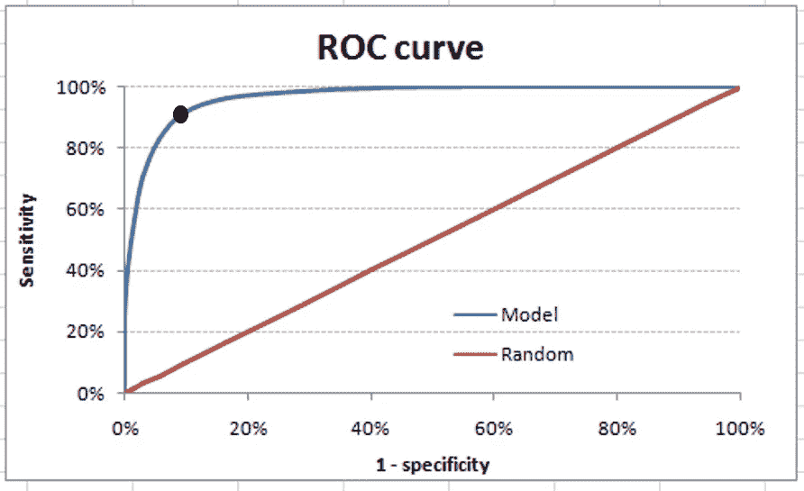
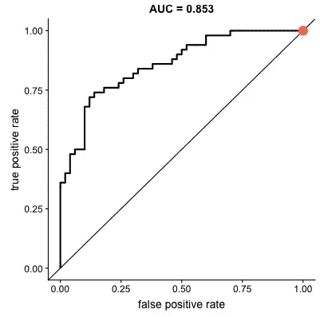

# 使用业务示例揭开混淆矩阵的神秘面纱

> 原文：<https://towardsdatascience.com/demystifying-confusion-matrix-29f3037b0cfa?source=collection_archive---------12----------------------->

## 深入混乱矩阵，了解 ROC 的阈值、曲线下面积(AUC)及其对模型评估的主要影响。

Source: Unsplash [image](https://unsplash.com/photos/yzqZTrffdr0) by [Leo Foureaux](https://unsplash.com/@leofoureaux)

你刚刚开始机器学习，完成了监督线性回归。现在你可以建立一个准确度还不错的模型了。现在，您转到分类模型。你训练这个模型，并用验证(测试)数据测试它，瞧，你得到了高达 91%的准确率。但是准确性是评估你的模型的正确方法吗？一个*混乱矩阵*将回答这个问题。网上有很多教程会解释什么是混淆矩阵。这篇文章将帮助你理解企业如何在他们的商业解决方案中使用混淆矩阵分析。

**什么是混淆矩阵？**

简单来说，混淆矩阵包含我们的预测数据的计数，相对于原始数据分为 4 个部分。它可以为一个分类问题而形成。

Outline of a confusion matrix for 2-way classification

让我们以垃圾邮件过滤器为例来理解这四个部分。有些电子邮件是垃圾邮件，有些不是。我们的垃圾邮件过滤器将预测这一点。
1)真实否定(TN):最初是非垃圾邮件，被预测为非垃圾邮件。
2)真阳性(TP):原本是垃圾邮件，预测为垃圾邮件。
3)假阴性(FN):原本是垃圾邮件，预测为非垃圾邮件。
4)误报(FP):原本不是垃圾邮件，预测为垃圾邮件。

我们可以清楚地看到，TN 和 TP 是我们的模型的正确预测，精确度可以通过:(TN+TP)/(总预测)来计算。但是公司很少纯粹根据准确率分数来做决定。从混淆矩阵中可以得出许多值，如灵敏度、特异性、召回率、精确度等。根据手头的业务问题来选择。我们可以很容易地在网上找到这些性能指标的公式。现在，让我们使用银行试图预测贷款违约者的业务场景来理解这些*点指标*的重要性。

**银行贷款违约者混淆矩阵评估**

一家银行创建了一个模型，使用其以前的数据库来预测客户是否违约。此处 **TN** 实际并预测为*非违约*， **TP** 实际并预测为*违约。*模型的误差为 FN 和 FP，其中 FN 实际上是违约者但被预测为非违约者，FP 实际上是被预测为违约者的非违约者。
在这种情况下，公司将关注两个参数:
1) ***真阳性率(TPR)*** :真阳性率也称为**敏感度。**在这种情况下会是，TP/(TP+FN)。该指标将向我们显示所有*实际违约者中有多少被正确预测。银行将为此需要一个高价值。理想情况下，它应该是 1，因为如果银行能够预测违约者并以 100%的把握拒绝他们的申请，这将对银行有利。
2) ***假阳性率(FPR)*** :假阳性率由(FP/TN+FP)给出，又称**1——特异性**。该指标将向我们显示，在所有非违约者中，有多少人被 ML 模型预测为违约者。FPR 值越低越好。理想情况下，它应该为零，因为高值意味着如果实施 ML 模型，银行将拒绝潜在的好客户，从而减少银行的整体业务。*

**阈值及其对混淆矩阵的影响**

我们可以理解的一点是，混淆矩阵可以根据手头的业务问题进行分析。现在让我们试着理解混淆矩阵是如何形成的。正如我们在图中看到的，我们有一组 Y-original，我们的模型给出 Y-概率作为分类问题的输出。根据我们的例子，这里的 Y 概率是 Y 为 1(违约者)或 0(非违约者)的概率。

Predicted value with default threshold i.e. 0.5

我们可以设置一个*阈值*，将所有大于阈值的值归类为 1，小于阈值的值归类为 0。这就是预测 Y 的方法，我们得到了“Y 预测”。我们通常得到混淆矩阵的阈值的默认值是 **0.50** 。这就是事情开始变得有趣的地方。我们可以改变这个阈值。阈值的变化将导致 Y 的预测值的变化，因此新的混淆矩阵将不同，更重要的是 **TPR** 和 **FPR** 值也将变化。因此，我们可以想象，对于阈值的每个唯一值，我们将得到不同的 TPR 和 FPR 值。当这些不同的 **TPR(灵敏度)**和**FPR(1-特异性)**值被绘制在散点图上，并且一条线穿过它们时，我们得到了著名的**接收器工作特性(ROC)** 曲线。

ROC with high AUC

对于不同的分类机器学习模型，ROC 曲线是不同的。就像敏感性或准确性一样，ROC 曲线的曲线下面积(AUC)被视为评估模型的非常有价值的度量。图中的 ROC 具有高 AUC。我们还可以看到图中有一个**点** *，这里 TPR(灵敏度)相当高，而 FPR(1-特异性)非常低*。如果我们回头看看我们业务需求，我们需要高 TPR 和低 FPR，这正是我们从这个 ROC 上的**点**得到的。该点对应的阈值可以说是**最佳阈值**。但是在现实生活中，建立一个具有很高 AUC 的模型并不总是可能的。这是一个合适的分类模型的 ROC 的样子:

从图中可以看出，要获得好的真阳性率，假阳性率也必须提高。因此，必须在它们之间进行*权衡*。现在到了*业务部分*，银行有效地在**减少违约者**(提高 TPR)和**减少将良好客户错误分类为可能违约者**(降低 FPR)之间进行平衡。因此，在这种情况下，组织不能仅仅依赖模型的准确性。在得出任何结论和做出业务决策之前，需要对混淆矩阵进行深入分析，并将其与业务问题联系起来。因此，在最终确定 TPR 和 FPR 值之后，可以很容易地追溯相应的阈值，并且该阈值将用于客户类型的最终预测(Y_pred)。我们现在可以理解不同的业务问题需要不同的分析来建立正确的模型。

我希望您觉得这篇文章很有趣，并且现在对混淆矩阵如何在真实的商业场景中使用有了更好的理解。我期待在评论中听到你们的评论。我也欢迎任何问题、建议或讨论。

**感谢阅读。**