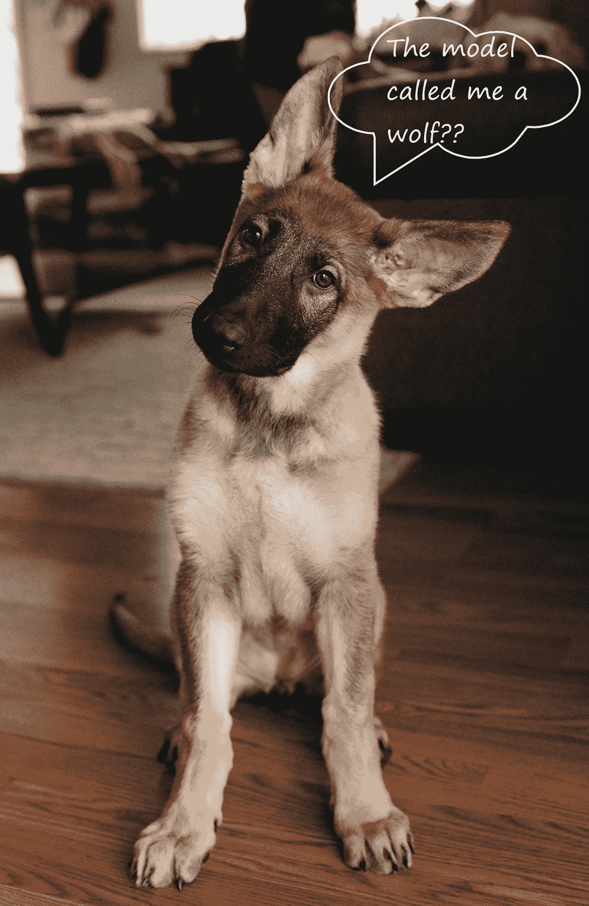
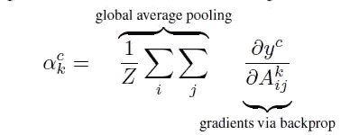
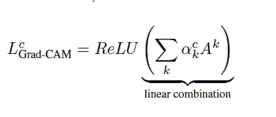
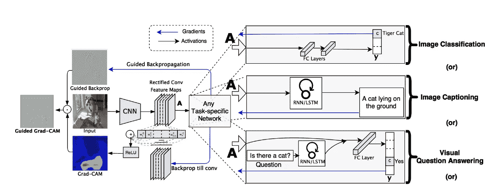
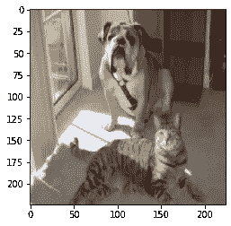
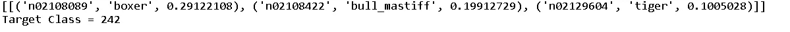
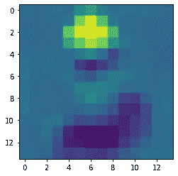
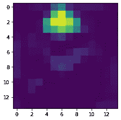
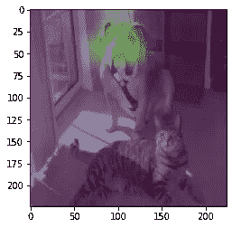

# 使用 GradCam 解密卷积神经网络

> 原文：<https://towardsdatascience.com/demystifying-convolutional-neural-networks-using-gradcam-554a85dd4e48?source=collection_archive---------4----------------------->

([source](https://unsplash.com/photos/fg8tdcxrkrA))

卷积神经网络(CNN)和其他深度学习网络已经在各种计算机视觉任务中实现了前所未有的突破，从图像分类到对象检测、语义分割、图像字幕以及最近的视觉问题回答。虽然这些网络实现了卓越的性能，但它们缺乏可分解成直观和可理解的组件的能力，这使得它们很难解释。因此，当今天的智能系统失败时，它们失败得非常可耻，没有警告或解释，让用户盯着不连贯的输出，想知道为什么。

> 深度学习模型的可解释性对于建立信任并将其成功融入我们的日常生活至关重要。为了实现这个目标，模型透明性对于解释他们为什么预测他们所预测的是有用的。

概括地说，这种透明性在人工智能(AI)进化的三个阶段都是有用的。

> 首先，当人工智能相对弱于人类，还不能可靠地“部署”时，透明性和解释的目标是识别故障模式。
> 
> 第二，当人工智能与人类相当并且可靠地“可部署”时，目标是在用户中建立适当的信任和信心。
> 
> 第三，当人工智能明显强于人类时，解释的目标是机器教学，即教人类如何做出更好的决定。

在[之前的文章中，](/demystifying-convolutional-neural-networks-using-class-activation-maps-fe94eda4cef1)我们讨论了卷积神经网络中的可解释性问题，并讨论了一种非常流行的技术，称为类激活图或 CAM，用于在一定程度上解决该问题。虽然 CAM 是一种很好的技术，可以揭开 CNN 工作的神秘面纱，并在开发的应用程序中建立客户信任，但它们有一些局限性。CAM 的一个缺点是，它要求特征映射直接位于 softmax 层之前，因此它适用于特定类型的 CNN 架构，该架构在预测之前立即对卷积映射执行全局平均池。(即 conv 特征地图→全球平均池→softmax 图层)。在某些任务上，这种体系结构可能比一般网络实现的精度差，或者根本不适用于新的任务。

在这篇文章中，我们讨论了一个 CAM 的推广，称为 Grad-Cam。Grad-Cam 于 2017 年发布，旨在改善 Cam 的缺点，并声称可以兼容任何一种架构。该技术不需要对现有模型架构进行任何修改，这使得它可以应用于任何基于 CNN 的架构，包括那些用于图像字幕和视觉问答的架构。对于全卷积架构，Grad-Cam 简化为 Cam。

# 方法:

一些先前的作品已经断言，CNN 中的更深层次的表示捕获了最好的高级结构。此外，CNN 自然地重新训练在全连接层中丢失的空间信息，因此我们可以期望最后的卷积层在高级语义和详细的空间信息之间具有最佳的折衷。

与 Cam 不同，Grad-Cam 使用流入 CNN 最后一个卷积层的梯度信息来了解每个神经元，以做出感兴趣的决策。为了获得任何类别 c 的宽度 u 和高度 v 的类别区别定位图，我们首先计算类别 c 的分数 yc(在 softmax 之前)相对于卷积层的特征图 Ak 的梯度。这些流回的梯度被全局平均汇集，以获得目标类的神经元重要性权重 ak。

**Figure 1**.Calculating weights ak

在为目标类 c 计算 ak 之后，我们执行激活图的加权组合，并在其后跟随 ReLU。

**Figure 2\.** Linear Combination followed by ReLU resulting in final class discriminative map.

这导致与卷积特征图大小相同的粗略热图。我们将 ReLU 应用于线性组合，因为我们只对对感兴趣的类别有积极影响的特征感兴趣。如果没有 ReLU，类激活映射会突出显示比所需更多的内容，因此会导致低本地化性能。

每个计算机视觉任务的完整流水线如图 2 所示，以便更清楚地了解这一重要概念。

**Figure 3.**Complete pipeline extending towards specific tasks.

# 使用 Keras 实现 Grad Cam

实施分为以下步骤:-

1.  首先，我们需要一个模型来运行向前传递。我们使用在 Imagenet 上预先训练的 VGG16。您可以使用任何模型，因为与 Cam 不同，GradCam 不需要特定的架构，并且与任何卷积神经网络兼容。

2.定义模型后，我们加载一个样本图像并对其进行预处理，使其与模型兼容。

**Input Image**

3.然后，我们使用该模型对样本图像进行预测，并解码前三个预测。正如您在下图中看到的，我们只考虑了模型中的前三个预测，模型中的第一个预测是 boxer。

**Decoded predictions and Target Class**

5.在下一步中，我们找到目标类得分 yc 相对于最后一个卷积层的特征图 Ak 的梯度。直观地，它告诉我们每个渠道对于目标阶层有多重要。变量 grads 返回一个张量，将在下面的步骤中使用。

6.这样获得的梯度然后被全局平均，以获得对应于目标类的神经元重要权重 **ak** ，如图 1 所示。这将返回一个传递给 Keras 函数的张量，该函数将图像作为输入，并返回 pooled_grads 以及来自最后一个卷积层的激活贴图。

7.之后，我们将每个激活图与相应的混合梯度相乘，该混合梯度作为权重来确定每个通道对于目标类有多重要。然后，我们取沿着通道的所有激活图的平均值，并且所获得的结果是最终的类别区分显著图。

**Class Discriminative Map**

8.然后，我们对生成的热图应用 ReLU，以便只保留对输出图有积极影响的要素。但是我们看到热图中没有太多的负强度，因此在应用 ReLU 后热图没有太大的变化。

**Class Discriminative Map after ReLU**

9.然后，我们将热图的每个强度值除以最大强度值，以便标准化热图，使所有值都在 0 和 1 之间。

**Class Discriminative Saliency Map after Normalization**

10.最后，我们对生成的热图进行上采样，以匹配输入图像的尺寸，并将其覆盖在输入图像上，以便查看结果。

**Final Saliency Map with Bull Dog as Target Class**

# **结论:**

在这篇文章中，我们学习了一种解释卷积神经网络的新技术，卷积神经网络是一种艺术架构，特别是对于图像相关的任务。Grad Cam 对其前身 Cam 进行了改进，并提供了更好的定位和清晰的类别区分显著图，这些图指导我们揭开黑盒模型背后的复杂性。可解释机器学习领域的研究正在以更快的速度前进，并被证明对于建立客户信任和帮助改进模型至关重要。

在接下来的文章中，我将探索该领域中与卷积神经网络相关的更多最新研究，并将借助直观的可视化和简单的实现来揭开复杂概念的神秘面纱。如果你喜欢这篇文章，留下掌声激励我，如果你有任何建议，请随时在 [Linkedin](https://www.linkedin.com/in/divyanshu-mishra-ai/) 上与我联系，或者在 [twitter](https://twitter.com/Perceptron97) 上关注我。