# 使用 ScoreCam 解密卷积神经网络

> 原文：<https://towardsdatascience.com/demystifying-convolutional-neural-networks-using-scorecam-344a0456c48e?source=collection_archive---------11----------------------->

([source](https://unsplash.com/photos/hKVg7ldM5VU))

最近，越来越多的注意力集中在机器学习模型的可解释性上，主要是深度学习模型，因为它们具有黑箱性质。一种重要的深度学习架构是卷积神经网络(CNN ),它在计算机视觉领域取得了突破，包括图像分类、对象检测、语义分割、实例分割、图像字幕等。在 CNN 的改进和发展方面的进展是指数级的，并且架构已经被极大地简化，但是预测结果不能被分解成直观的和完全可理解的部分。

理解和解释模型对于建立人们对我们系统的信心至关重要。CNN 解决的最常见的问题是图像分类，通常称为显著图或属性图的视觉解释方法用于找到影响模型预测的最有影响力的特征。有几种用于生成显著图的技术，其中最常见的是基于梯度的可视化，其反向传播关于输入层的目标类分数的偏导数。然而，基于梯度的地图的问题是它们通常质量低并且具有随机噪声。其他方法包括基于扰动的方法，该方法通过向输入添加小噪声(扰动)并观察预测的变化来工作。另一个是类激活图(CAM ),我最近在我的[帖子](/demystifying-convolutional-neural-networks-using-class-activation-maps-fe94eda4cef1)中解释了它以及它们的扩展，比如 Grad-Cam 和 Grad-Cam++。它们通常通过激活图的线性加权组合来生成显著图，以突出图像空间中的重要区域。然而，它们也遭受与图像中的目标对象无关的随机噪声的问题，并且权重不能很好地捕捉每个激活图的重要性。

# 计分摄像机:

在这篇文章中，我将尝试解释最近的一篇论文 Score-Cam，它是对前面提到的方法的改进，并试图使 CNN 的可解释性与其前辈一样。

Score-Cam 建立在类激活映射的基础上，并声称可以解决以前报告的无关噪声问题，并生成更清晰和有意义的解释。在 Score-Cam 中，研究人员遵循基于扰动的方法的思想，该方法掩盖了原始输入中的部分区域，并观察目标分数的变化。所获得的激活掩模被视为输入图像的一种掩模，其掩蔽输入图像的部分，并使模型在部分掩蔽的图像上进行预测。然后利用目标类的分数来表示激活图的重要性。

使用基于扰动的方法的屏蔽激活示例

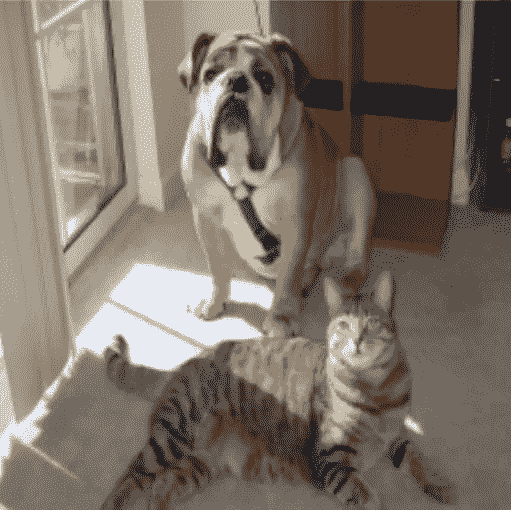

**Figure 1\. Input Image**

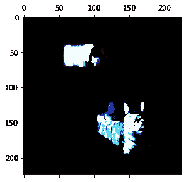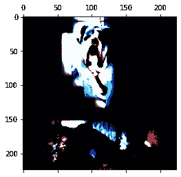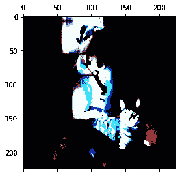

Figure 2\. Masks applied on Input Image.

与著名的 Grad-Cam 不同，Score-Cam 没有利用梯度，因为研究人员认为传播的梯度非常不稳定，并在基于梯度的显著图中产生随机噪声。图 3 中显示了梯度的不稳定特性，其中当输入图像稍微改变时，梯度会急剧改变，即使这种改变不会被人眼察觉，也不会改变预测结果。这就是为什么有理由怀疑基于梯度的方法减少冗余噪声的有效性。

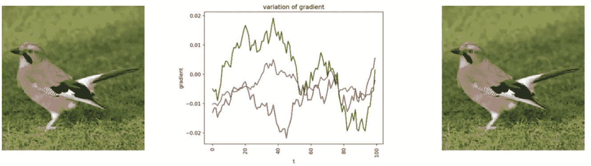

Figure 3\. The partial derivative changes sharply for indistinguishable changes in the input image.

# 方法:

各种以前的作品，如凸轮，GradCam 等。已经断言了这样一个事实，即 CNN 中更深的层捕获更高级别的视觉信息。此外，卷积要素自然会保留在完全连接的图层中丢失的空间信息，因此通常期望最后一个卷积图层在高级语义和详细空间信息之间提供最佳折衷，并且这些图层中的神经元会在输入图像中寻找特定于类的语义信息。因此，在 Score-Cam 中，我们使用最后一层来获得包含平衡表示的激活图。

相比之下，GradCam 和 GradCam++使用流经 CNN 最后一层的梯度信息来表示每个激活图的重要性。在 Score-Cam 中，我们使用特定目标类的得分权重。因此，Score-Cam 可以摆脱对梯度的依赖，并作为更通用的框架工作，因为它只需要访问模型的类激活图和输出分数。

Score-Cam 的流水线如图 4 所示，显示了实现最终显著图的所有步骤。

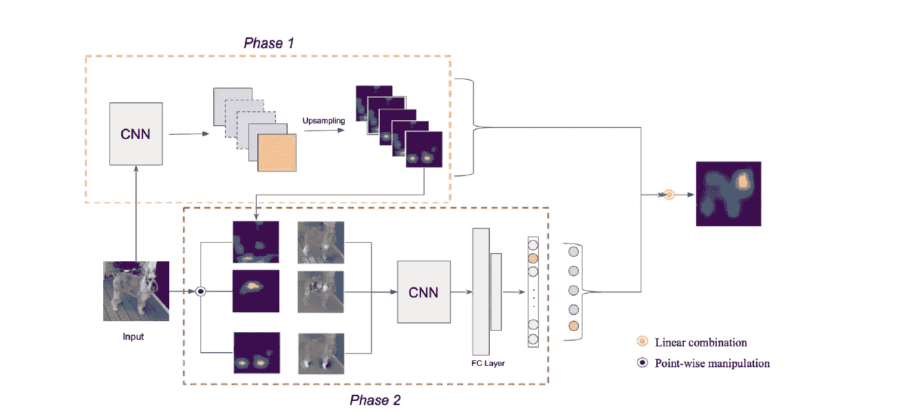

Figure 4\. The pipeline of the Score-Cam.

为了使用 Score-Cam 获得类别区分显著图，该过程被分成以下步骤:

1.  第一步是将图像传递给 CNN 模型并执行 forward_pass。在正向传递之后，从网络中的最后一个卷积层提取激活。
2.  从具有 1xmxn 形状的最后一层获得的每个激活图然后使用双线性插值被上采样到与输入图像相同的尺寸。
3.  在对激活图进行上采样之后，所得到的激活图被归一化为[0，1]范围内的每个像素，以保持像素之间的相对强度。使用图 5 中的**所示的公式实现标准化。**

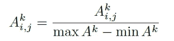

**Figure 5\.** Normalizing each Activation Map

4.在激活图的归一化完成之后，通过将每个归一化的激活图(**1×W×H)**乘以原始输入图像(**3×W×H**)以获得形状为**3×W×H .**的掩蔽图像 M，激活图的高亮区域被投影到输入空间上

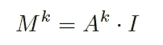

**Figure 6.** Element-Wise Multiplication of all the activation maps with the Input Image.

5.由此获得的掩蔽图像 **M** 然后被传递到具有 SoftMax 输出的卷积神经网络。

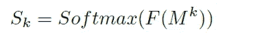

**Figure 7.** The Output Score Sk is obtained by the Softmax Operation.

6.在得到每个类的分数后，我们提取目标类的分数来表示第 k 个激活图的重要性。

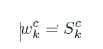

**Figure 8**. The score of Target Class used as weights.

7.然后，我们计算目标类得分和每个激活图之间的线性组合的所有激活图的总和。这导致单个激活映射具有与输入类相同的大小。

8.最后，我们将逐像素 ReLU 应用于最终的激活图。我们应用 ReLU 是因为我们只对对感兴趣的类有积极影响的特性感兴趣。

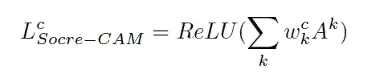

**Figure 9.**

# 分数 CAM 在 KERAS 中的实现；

我们将遵循之前在图和方法中描述的相同管道。

1.  我们使用在 Imagenet 上预先训练的 VGG16 作为整个管道的模型。

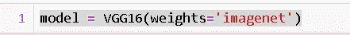

2.我们加载上面图 1 的中所示的输入图像，对其进行预处理，使其适合传递到 VGG16 模型中。

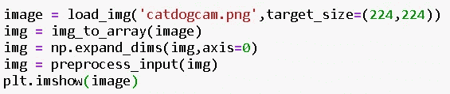

3.之后，我们通过模型传递图像，并获得每个类别的预测分数。我们从预测中提取目标类的索引。

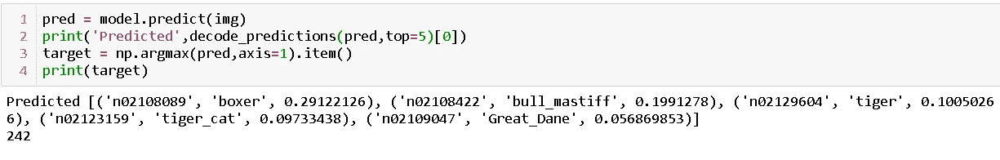

4.然后，我们从大小为(**1×14×14×512**)的最终卷积层中提取激活。

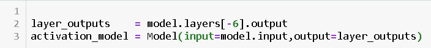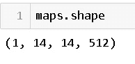

5.然后，我们对所有激活图进行上采样，以匹配原始输入图像的大小。

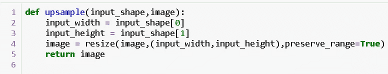

Function to Upsample Activations

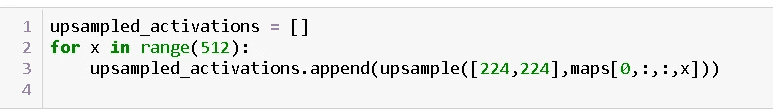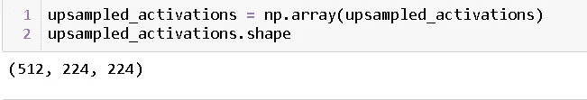

6.然后，我们使用图 5 中的公式对 512 个激活图进行标准化。

> **注意:我们在分母中添加了一个非常小的项，即 1e-5，以防止被零除的误差导致 nan 值。**

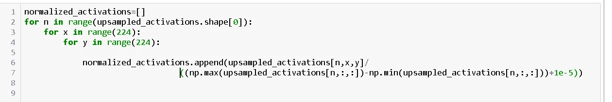

7.在步骤 6 之后，我们通过在掩模和输入图像之间执行元素乘法来投影在原始图像上产生的掩模，如图 6 中的**所示。**

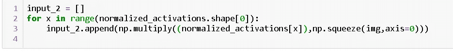

8.这样获得的掩蔽图像然后通过 VGG16 模型向前传播，并且获得 softmax 分数。

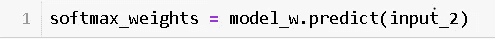

9.在获得所有类的分数后，我们只需提取与我们的目标类相对应的分数。在我们的输入图像的例子中，我们有两个类，但是为了演示的目的，我们将把狗作为我们的目标类。

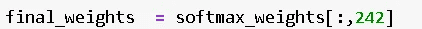

Here 242 corresponds to the index of the class dog.

10.现在，我们已经得到了生成类别区分显著图所需的全部内容，即归一化的激活图和用作权重的目标类别的分数。现在，我们执行目标类 softmax 分数和标准化激活图的逐元素乘法。

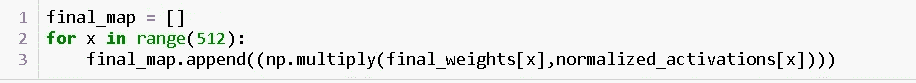

11.在最后一步完成并且我们有了结果之后，我们对所有的激活图执行求和(512)，并且我们组合所有的图以产生形状为**1×224×224×3**的单个激活图

12.为了获得最终的显著图，我们对上一步中获得的激活图执行逐像素 ReLU。

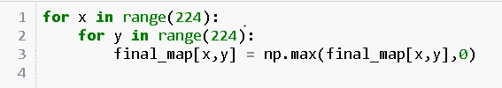

Pixel-Wise ReLU

获得的最终类别判别图如下面的图 9 所示。

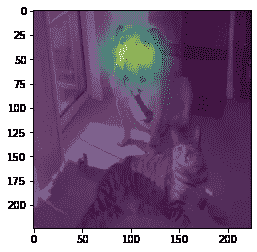

Score-Map Saliency Map

正如我们所看到的，分数凸轮是阶级歧视，以及有更少的噪音相比，其前身。

# Score-Cam 的优势:

1.  像 Grad-Cam 和 Grad-Cam++这样的 Score-Cam 可以用在任何卷积神经网络架构中，并且不需要像 Cam 那样重新训练模型来产生显著图。
2.  Score-Cam 具有类别区分性，可以去除不相关的噪声，从而生成有意义的显著图。
3.  使用 Softmax 分数作为权重，并消除对不稳定梯度的依赖。

# 结论:

在这篇文章中，我们讨论了最近发布的一篇关于基于分数的类激活映射(Score-Cam)的新架构的论文，该架构提供了一种解决模型可解释性问题的新方法。该论文介绍了一种架构，其中去除了无用的噪声，并且仅产生重要的显著图。此外，它消除了对目标类别梯度的依赖，并产生了一种更通用的方法来产生显著图。本文从两种产生显著图的方法中得到启发，主要是扰动图和类激活图，并提出了一种结合两者优点的方法。

要了解更多关于 Score-Cam 的信息，请阅读以下链接提供的论文【https://arxiv.org/abs/1910.01279。

希望你喜欢这篇文章，如果有进一步的讨论、疑问或相关内容，你可以通过 [Linkedin](https://www.linkedin.com/in/divyanshu-mishra-ai/) 联系我，或者通过 [Twitter 关注我。](https://twitter.com/Perceptron97)