# 去神秘化——深度图像先验

> 原文：<https://towardsdatascience.com/demystifying-deep-image-prior-7076e777e5ba?source=collection_archive---------11----------------------->

## 使用深度图像先验的图像恢复介绍。

在这篇文章中，我将主要关注图像恢复的任务，以及如何使用之前的[深度图像来解决这个任务。](https://dmitryulyanov.github.io/deep_image_prior)

# 图像恢复简介

图像恢复是指从退化图像中恢复未知真实图像的任务。图像退化可能发生在图像形成、传输和存储过程中。这一任务在卫星成像、弱光摄影中具有广泛的应用范围，并且由于数字技术、计算和通信技术的进步，从退化图像中恢复干净图像是非常重要的，因此已经发展成为与图像处理、计算机视觉和计算成像交叉的研究领域。

图像恢复主要有三个任务:

## **图像去噪:**

图像去噪是指恢复被加性噪声污染的图像。这是图像恢复中最简单的任务，因此已经被几个技术团体广泛研究。

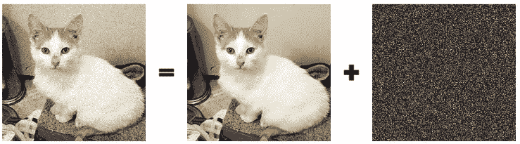

Fig.1 (left)noise add image, (center)true image, (right)Gaussian noise

## 2.**超分辨率:**

超分辨率是指从一组低分辨率图像产生高分辨率图像(或高分辨率图像序列)的过程。

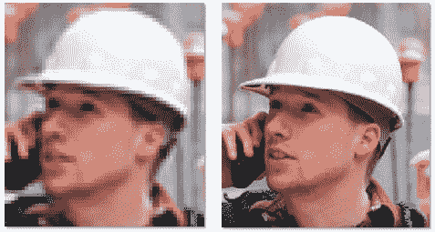

Fig2\. (left)low resolution image, (right)high resolution image

**3** 。**图像补绘:**
图像补绘是对图像中丢失或损坏的部分进行重建的过程。内画实际上是一种古老的艺术，需要人类来画出画中已经变质和丢失的部分。但是在今天的世界中，研究已经提出了许多方法来使用深度卷积网络来自动完成这项任务。

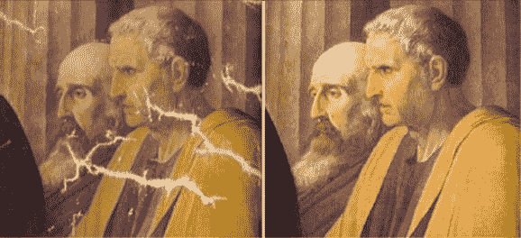

Fig. 3 (left) input, (right) output

# 什么是深度图像先验？

随着 alexnet 在 2012 年 image-net 竞赛中的成功，卷积神经网络变得非常流行，已经用于每个计算机视觉和图像处理任务，并且已经广泛用于执行逆图像重建任务，并且已经实现了最先进的性能。
深度卷积网络已经取得了成功，因为它们能够从大量图像数据集进行学习。Dmitry Ulyanov 的惊人论文“Deep Image Prior”表明，为了解决像图像恢复这样的逆问题，网络的结构是足够的，并且施加了强先验以从降级图像恢复原始图像。该论文强调，为了执行这些任务，不需要预先训练的网络或大型图像数据集，并且可以仅在考虑降质图像的情况下执行。

为了完成图像恢复的任务，学习先验和显式先验是研究人员常用的两种方法。

在学习-先验中是一种训练深度卷积网络的直接方法，以通过数据集学习世界，该数据集将有噪声的图像作为输入，将干净的图像作为期望的输出。
另一方面，explicit-prior 或手工制作的 prior 方法，是我们在其中嵌入硬约束并教导什么类型的图像是自然的、人脸等。从合成数据中。像自然这样用数学表达约束是非常困难的。

在深度图像先验中，作者试图通过使用卷积神经网络构造一个新的显式先验来弥补两种流行方法之间的差距。

# 让我们从技术角度出发...

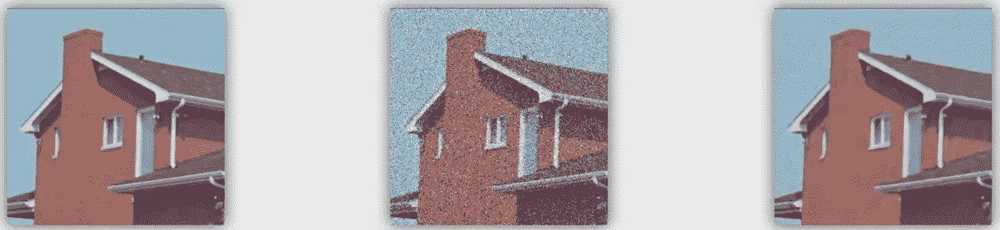

Fig.4\. (left)clean image, (center)corrupted image, (left) restored image

***x*** → *干净图像* ***ẋ****→*退化图像* ***x****→*恢复图像**

*我们可以使用最大后验分布来估计经验数据中的未观测值*

*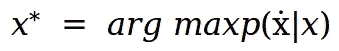*

*使用贝叶斯规则，我们可以将其表示为*似然*先验。**

*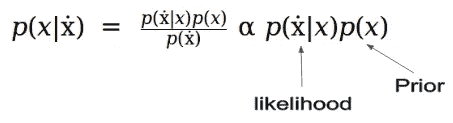*

*我们可以通过对等式应用负算法，将等式公式化为优化问题，而不是分别处理分布。(1)*

*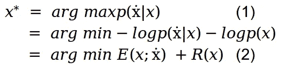*

*e(x；ẋ) 是作为似然负对数的数据项，R(x)是作为先验负对数的图像先验项。*

*现在的任务是在图像 *x* 上最小化等式(2)。传统的方法是用随机噪声初始化 *x* ，然后计算函数相对于 x 的梯度，并遍历图像空间，直到我们收敛到某个点。*

*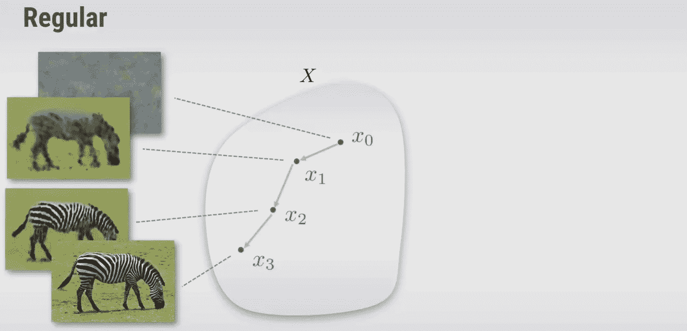*

*Fig. 5 visualization of regular approach*

*另一种方法是构造一个函数 *g* ，它用随机θ初始化，来自不同空间的输出可以映射到图像 x，并使用梯度下降更新θ，直到它收敛到某个点。因此，我们可以在θ上优化，而不是在图像空间上优化。*

*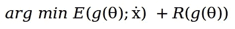**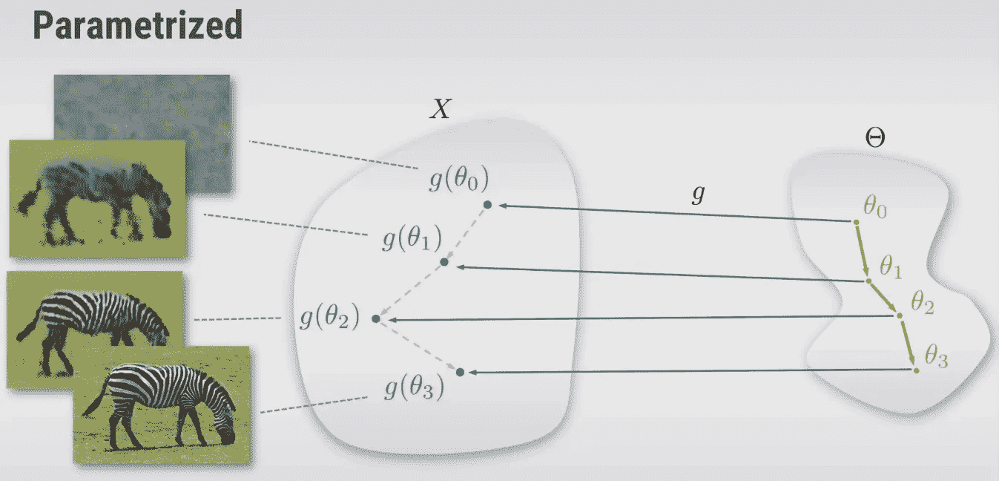*

*FIg. 6 Visualization of parameterized approach*

*但是，为什么这种方法是可能的，为什么我们应该使用它？。这是可能的，因为从理论上讲，如果 g 是满射的***g:θ*↦*x***(如果至少有一个 *θ* 映射到图像 *x* )那么这个优化问题是等价的，即它们有相同的解。但在实践中， *g* 在优化方法搜索图像空间的方式上发生了巨大的变化。我们实际上可以把 *g* 作为超参数来对待，并对其进行调优。如果我们观察，g(θ)作为一个先验，有助于选择一个好的映射，它给出一个期望的输出图像，并防止使用得到错误的图像。
所以，与其优化两个分量之和。我们现在将只优化第一项。*

*现在，Eq 2。可以表示为，*

*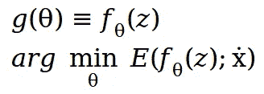*

*其中， *z* 是随机固定输入图像，θ是随机初始化的权重，其将使用梯度下降来更新，以获得期望的输出图像。*

*但是仍然不清楚为什么我们应该考虑这种参数化方法。理论上乍一看，它似乎会产生原始噪声图像。在论文中，作者进行了一项实验，该实验表明，当使用梯度下降来优化网络时，卷积神经网络不愿意噪声图像，并且更快和更容易地下降到看起来自然的图像。*

*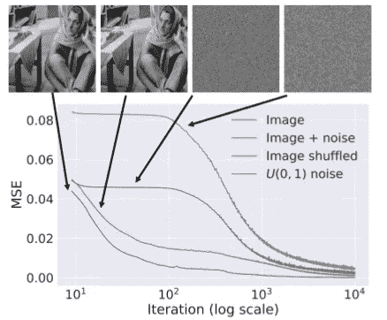*

*Fig. 7 Learning curves for the reconstruction task using: a natural image, the same plus i.i.d. noise, the same
randomly scrambled, and white noise. Naturally-looking images result in much faster convergence, whereas noise is rejected.*

# *逐步深入图像先验*

**ẋ =被破坏的图像*(被观察)
**1。初始化*z*T8*。*:用均匀噪声或任何其它随机图像填充输入 *z。****

***2。使用基于梯度的方法求解**并优化函数。*

*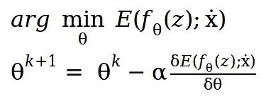*

*3.最后，当我们找到最佳θ时，我们可以**获得最佳图像**，只需将固定输入 *z* 正向传递给具有参数θ的网络。*

*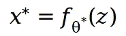**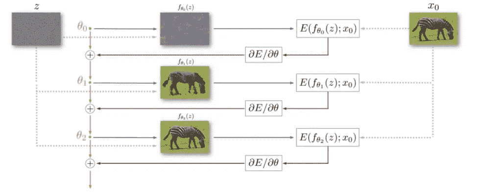*

*Fig. 8: Image restoration using the deep image prior. Starting from a random weights θ 0 , we iteratively
update them in order to minimize the data term eq. (2). At every iteration the weights θ are mapped to image
x = f θ (z), where z is a fixed tensor and the mapping f is a neural network with parameters θ. The image x is
used to compute the task-dependent loss E(x, x 0 ). The gradient of the loss w.r.t. the weights θ is then computed and used to update the parameters.*

# *结论*

*该论文试图表明，在具有随机化权重的深度卷积神经网络结构内构造隐式先验的方法非常适合于图像恢复任务。该论文中显示的结果在很大程度上表明，适当手工制作的网络架构足以解决图像恢复任务。*