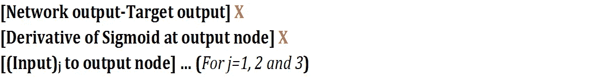

# 使用 MS Excel 揭开前馈和反向传播的神秘面纱

> 原文：<https://towardsdatascience.com/demystifying-feed-forward-and-back-propagation-using-ms-excel-30f5aeefcfc7?source=collection_archive---------7----------------------->

*深入探究神经网络的奥秘，超越理论界限，在 MS Excel 中实现它。*

近年来，关于神经网络(NNs)已经说了很多，也写了很多——从感知器的概念到神经元的复杂多层结构。本文试图揭开两种基本算法的神秘面纱，**前馈**和**反向传播**，这两种算法使得神经网络能够工作。使用 Microsoft Excel 以最简单的形式解释了这些技术。

所考虑的例子是非常基础的，与真实世界的例子相去甚远。这里的意图是保持简单直观，理解工作逻辑，而不是关注背后复杂的数学。

首先，我只考虑了一个输入向量 V= [X1=1，X2= 0，X3=1，X4=0]，它有一个由 3 个神经元和一个输出层组成的隐藏层。目标输出是 1。

Neural Network with One Hidden Layer

**网络设置-**

***输入和输出-*** 作为一个例子，假设我们期望算法对于‘X1’&‘X3’(比如说 1)的指示非零值给出输出‘1’，对于‘X2’&‘X4’给出输出‘0’。因此，这里考虑的输入向量是[1，0，1，0]。

Input and Output

# ***前馈:***

## 步骤 1:初始化网络参数

第一步是使用 MS Excel 中的 **rand()** 函数初始化权重和偏差。

*(附注:下表中突出显示的单元格代表基于建议公式的导出值)*

Weights and Biases — Input to Hidden Layer

Weights and Biases — Hidden to Output Layer

## 步骤 2:计算隐藏层节点的净输入

净输入只不过是输入乘以权重，然后按偏差递增。使用输入向量[1×4]和权重[4×3]的矩阵乘法，结果矩阵的维数为[1×3]。要在 excel 中实现这一点，请使用 **=SUMPRODUCT()** 得出如下结果矩阵[1X3]

Input times Weight

在突出显示的单元格中使用公式来获得*输入乘以权重*:

> **=SUMPRODUCT({1，0，1，0}，{0.49，0.35，0.44，0.80})**
> 
> **=SUMPRODUCT({1，0，1，0}，{0.72，0.90，0.58，0.92})**
> 
> **=SUMPRODUCT({1，0，1，0}，{0.38，0.43，0.39，0.21})**

现在，给这些*输入乘以权重*加上偏差

Net Input

要在突出显示的单元格中使用的公式，以获得净输入

> ***=* SUM(0.92，0.40)**
> 
> **=SUM(1.30，0.00)**
> 
> **=SUM(0.76，0.99)**

## 步骤 3:通过激活函数(Sigmoid)传递净输入

让我们将“步骤 2”的输出[1.33，1.30，0.99]作为输入传递给隐藏层的每个神经元处的激活函数[f(1.33)，f(1.30)，f(0.99)]，这可以通过在 MS Excel 中键入 f(x) = 1/(1+exp (-x))来轻松完成。

Output at Hidden Layer

要在突出显示的单元格中使用的公式，以获得隐藏层输出:

> **=1/(1+exp(-1.33) )**
> 
> **=1/(1+exp(-1.30))**
> 
> **=1/(1+exp(-0.99))**

## 步骤 4:计算输出节点的净输入

现在，“步骤 3”的输出[0.79，0.79，0.73]将作为输出节点的输入。让我们重复“步骤 2”，输入向量为[0.79，0.79，0.73]，权重向量为[0.71，0.16，0.57]，输出偏差为[0.83]。

Net Input at Output Node

在突出显示的单元格中使用的公式，用于在输出节点获得*净输入*

> **=SUMPRODUCT ({0.79，0.79，0.73}，{0.71，0.16，0.57}) + 0.83**

其中简化后= **1.93**

## 步骤 5:获得神经网络的最终输出

让我们将从“步骤 4”[1.93]接收到的输出作为 f(1.93)传递给激活函数，这也可以使用 f(x)=1/(1+exp(-x))来计算，从而得到神经网络的最终输出。

> **=1/(1+exp(-1.93))**

***前馈网络输出=0.87***

# **反向传播:**

一旦获得前馈的输出，下一步是通过与目标结果比较来评估从网络接收的输出。

现在，神经网络设计者控制的一个明显的事情是权重和偏差(也称为网络参数)。因此，这里的挑战是找到能够最小化误差平方和的最佳权重和偏差: *E=1/2 ∑(网络输出-目标输出)*由网络接收，在这种情况下=[0.5 *(0.13)]= 0.00798

我们需要单独查看这些权重和偏差所造成的误差，然后不断更新它们以减少误差。这个过程将被重复直到收敛。一旦达到最优，该网络将被称为训练过的网络。让我们开始在 Excel 中实现这个理论。

## 步骤 1:更新权重[wH1，wH2，wH3]

使用[链式法则](https://en.wikipedia.org/wiki/Chain_rule) ( *我将跳过这里的推导*)计算误差函数 **E** 相对于权重【wH1，wH2，wH3】的导数，简化后等于

其中，*sigmoid 函数 f(x)的导数= [f(x)*(1-f(x)]*

所以，[ *d* (E)/d(wH1)，d(E)/d(wH2)，d(E)/d(wH3)] =

Derivative of E with respect to WH1, WH2 and WH3 respectively

要在突出显示的单元格中使用的公式:

> **=乘积(-0.13，0.87，0.13，0.79)**
> 
> **=乘积(-0.13，0.87，0.13，0.79)**
> 
> **=乘积(-0.13，0.87，0.13，0.73)**

新的更新权重将是**【初始权重】— [{(学习率)* [d(E)/d(wH1)，d(E)/d(wH2)，d(E)/d(wH3)]]，**其中，学习率被假定为 0.5

Updated weights after 1st Iteration

通过使用-

> **=(0.71)-乘积(0.5，-0.0110)**
> 
> **=(0.16)-乘积(0.5，-0.0110)**
> 
> **=(0.57)-乘积(0.5，-0.0102)**

## **步骤 2 —在输出节点**更新偏置 BO

对于偏差，使用链式法则计算误差函数 **E** 相对于偏差 BO 的导数，简化后等于

所以，d(E)/d(BO)= 1

Derivative of Error E with respect to output node bias

要在突出显示的单元格中使用的公式:

> ***=乘积(-0.13，0.87，0.13)***

新的更新偏差[BO] *新的*=[初始偏差]—[学习率*{d(E)/d(BO)}]

Update Bias at Output node after 1st Iteration

要在突出显示的单元格中使用的公式:

> **=(0.83)-乘积(0.5，-0.0139)**

## 步骤 3-更新权重[w11，w12，…w43]

为了更新“隐藏输入”层的权重，让我们计算误差 **E** 相对于权重【W11，W12…w43】的导数，其在简化后等于

所以，[ *d* (E)/d(w11)，d(E)/d(w12)，……d(E)/d(w43)] =

Derivatives of error E with respect to weights w11, w12,….w43

要在突出显示的单元格中使用的公式:

MS Excel formula to be used to get the derivatives

新的更新权重=[初始权重]—[学习率* (d(E)/dwij)]

Updated Weight after 1st Iteration

要在突出显示的单元格中使用的公式:

MS Excel formula to be used to update the weights

## 步骤 4:更新偏差[BH1，BH2，BH3]

同样，使用链式法则计算误差 **E** 相对于隐藏节点偏差的导数，简化后等于

所以，[ *d* (E)/d(BH1)，d(E)/d(BH2)，d(E)/d(BH3)] =

Derivative of error E with respect to Bias at Hidden nodes

要在突出显示的单元格中使用的公式:

> ***=乘积(-0.13，0.87，0.13，0.71，0.79，0.21)***
> 
> ***=乘积(-0.13，0.87，0.13，0.16，0.79，0.21)***
> 
> ***=乘积(-0.13，0.87，0.13，0.57，0.73，0.27)***

新的更新偏差=[初始偏差]—[学习率* (d(E)/d(BHi))]

Updated Hidden node Bias after 1st Iteration

要在突出显示的单元格中使用的公式:

> **=(0.40)-乘积(0.5，-0.0016)**
> 
> **=(0.00)-乘积(0.5，-0.0004)**
> 
> **=(0.22)-乘积(0.5，-0.0016)**

因此，我们已经完成了**前馈**和**反向传播**的一个循环，重复相同的步骤，即使用这些更新的参数再次运行前馈将使您更接近目标输出，反向传播将再次用于更新这些参数。这种前馈和反向传播的循环过程将继续下去，直到误差变得几乎恒定，并且在目标输出中没有太多进一步改进的余地。

上述模型在 Excel 中实现，经过 100 次迭代后，网络的行为如下所示。随着每次迭代，网络输出朝着目标输出(蓝线)前进，误差(红线)减少。

# 为什么选择 MS Excel？

在 excel 中实现这些复杂概念的主要优势是为这些网络的工作方式提供了坚实的基础，如果您非常了解基础知识，理解复杂架构的工作方式会容易得多。

# 接下来是什么:

在我接下来的系列文章中，我将尝试将这些概念与相关的数学联系起来。此外，输入可以通过不同的方式传递到网络，训练网络参数也有不同的方式。我将在以后的文章中谈到这些细节。

希望这种在 excel 中演示神经网络的努力将有助于初学者轻松地理解前馈和反向传播的概念。如果您需要在 excel 中实现一个现成的神经网络作为工作模型，请联系我。