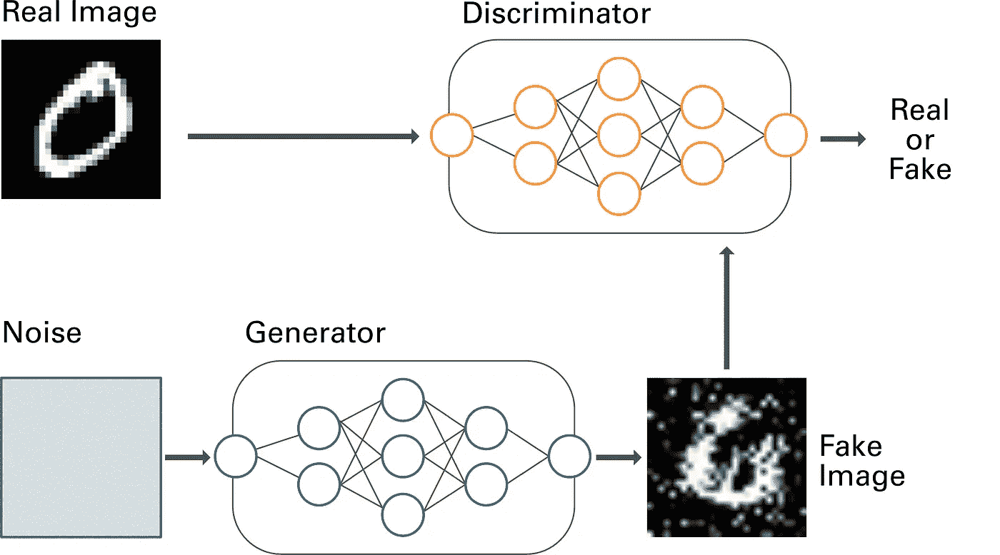
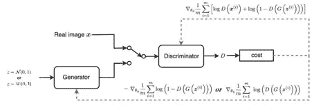

# 揭开 TensorFlow 2.0 中 GANs 的神秘面纱

> 原文：<https://towardsdatascience.com/demystifying-gans-in-tensorflow-2-0-9890834ab3d9?source=collection_archive---------4----------------------->


本教程向您展示了如何在新的 **TensorFlow 版本 2.0** 中轻松实现生成式对抗网络(GAN)。我们将关注基本实现，这为可选的增强留有余地。在我们仔细研究实现之前，我们需要理解 GANs 背后的思想和理论。如果你已经熟悉 GANs 背后的理论，你可以跳到实现部分。

# 甘斯背后的理论

GAN 的主要焦点是通过对抗过程从零开始生成数据。这个过程包括两个模型——鉴别器和生成器。鉴别器了解来自数据分布的样本是真的还是假的，而生成器试图产生假样本来欺骗鉴别器。

> “生成模型可以被认为类似于一队伪造者，试图生产假币并在不被发现的情况下使用，而鉴别模型类似于警察，试图检测假币。”[1]

让我们从理论上来理解 GANs 背后的基本过程。鉴别者和发生者可以被认为是多层次的感知，它们相互竞争。发生器 *G(z)* 馈入先前的输入噪声*p _ z(z)*，该噪声随后作为鉴频器的输入。鉴别器 *D(x)* 的输出是一个单一标量，它代表发生器产生的输入数据 *x* 是真实样本还是虚假样本的概率。如果 *D(x)* 等于 1，鉴别器绝对确定输入是来自训练数据的真实样本，如果 *D(x)* ≈ *0* 鉴别器知道它被生成器愚弄了。



The idea behind generative adversarial networks

挑战在于，我们训练 *D* 最大化分配正确标签的概率，同时训练 *G* 最小化分配正确标签的概率。在文学中，这也被称为最小最大游戏。


等式的蓝色标记部分定义了成为真实图像的概率，红色部分定义了成为虚假图像的概率。上面的方程也可以理解为鉴别器的目标，下面的方程可以理解为生成器的目标，我们想优化它来更好的忽悠鉴别器。


发电机输入是均匀或正态分布的样本，我们在下文中称之为噪声。然后，鉴别器被输入真实图像和噪声。通过神经网络计算误差，它学习如何区分它们。



# 履行

如果你想复制粘贴或者只是想根据你的需要调整笔记本，在 [GitHub](https://github.com/MonteChristo46/GAN-Notebooks) 上检查代码。

首先，我们将导入我们需要的基本库。我们将使用 *TensorFlow* *2.0* 来构建网络和对抗过程，使用 *NumPy* 来生成噪声，使用 *matplotlib* 来保存图像。还要确保您使用的是 TensorFlow 2.0 —下面的代码无法在旧版本上运行！

```
import tensorflow as tf
import numpy as np
import matplotlib.pyplot as plt
from tensorflow import kerasprint(tf.__version__)
```

之后，我们需要定义一些在整个实现过程中需要的全局变量。参数 *BATCH_SIZE* 定义了一次向神经网络中输入多少样本。我们将 BUFFER_SIZE 参数设置为等于训练数据集的长度，以便进行完美的洗牌([单击此处](https://www.tensorflow.org/versions/r2.0/api_docs/python/tf/data/Dataset#shuffle))。如果您想使用不同的批量或数据集，不要忘记调整这些变量。 *OUTPUT_DIR* 定义了路径，在训练期间，发生器的输出图像存储在该路径中。

```
BATCH_SIZE = 256
BUFFER_SIZE = 60000
EPOCHES = 300
OUTPUT_DIR = "img" # The output directory where the images of the generator a stored during training
```

现在，我们将直接从 TensorFlow 加载 MNIST 数据集——我们总共有 60.000 张图像，高度和宽度为 28 像素(列表中的每张图像代表一张图片)。

在我们将要实现神经网络之前，数据被传递到一个 *tf.data.Dataset* 对象中。一个 *tf.data.Dataset* 表示一个元素序列，其中每个元素包含一个或多个张量对象——我们将使用它作为迭代器来批量存储我们的图像，并在以后循环遍历它们。此外，图像被归一化到-1 和 1 之间(由均匀分布产生的相同范围)。

为了构建生成器和鉴别器，使用了 tf.keras 模型子类化 API，这为我们构建模型提供了更多的灵活性。这意味着，我们将为鉴别器和生成器实现一个类。在构造函数中，我们将定义网络的层，在调用方法中，我们将定义模型的前向传递。我们将向网络中输入 100 维的噪声，并输出大小为 784 的向量。稍后，我们将把这个向量重塑成一个 28x28 的矩阵(图像的原始大小)。此外， *generate_noise* 方法用于从均匀分布中创建随机数据点。

上面描述的目标函数就是二元交叉熵。它只接受输入鉴别器的噪声和真实的标签，因为发生器认为它产生真实的图像。

我们对鉴别器目标做了同样的事情，但是现在我们把假的和真的损失加在一起。此外，我们增加了一点平滑的目标的真实损失，以避免过度拟合。

鉴频器网络的实现方式与发生器类似。唯一的区别是，我们将一个 784 维的向量(28*28 = 784)作为输入，并只输出一个神经元，它可以告诉我们输入的是假图像还是真图像。

作为优化器，我们将使用 RMSprop 优化器。这只是我做的一个武断的决定——你可以随意使用你想要的任何其他优化器。

```
generator_optimizer = keras.optimizers.RMSprop()
discriminator_optimizer = keras.optimizers.RMSprop()
```

下一步是定义在一个单独的训练步骤中应该发生什么。通过使用发生器和鉴别器的梯度，我们同时训练两个网络。首先，根据我们之前定义的批量大小，会产生一些噪声。然后，我们将真实图像和虚假图像输入鉴别器，并计算其损失。最后一步是对生成器进行同样的操作，并应用这些渐变。

最后一步是定义一个描述整个训练的函数。感谢 *tf.data.Dataset* 对象，我们可以轻松地迭代我们的数据。最后一个函数将每隔 50 个时期生成的所有图像保存到您在变量 *OUTPUT_DIR* 中定义的目录中。

正如你在我的 jupyter 笔记本上看到的，我进行了 300 次训练，取得了很好的结果。我认为，当涉及到像 MNIST 这样的简单数据集时，通过更多的微调和更深入的生成器以及鉴别器，您实际上可以获得更好的结果。


Exemplary results of the implemented GAN

请记住，这是您能想到的最简单的 GAN 实现之一。在鉴别器和生成器中使用卷积可以获得更好的结果。你可以查看 TensorFlow 团队提供的使用卷积而不是密集层的教程([点击此处](https://www.tensorflow.org/beta/tutorials/generative/dcgan))。

*链接到 Jupyter 笔记本:*[*https://github.com/MonteChristo46/GAN-Notebooks*](https://github.com/MonteChristo46/GAN-Notebooks)

# 参考

[Goodfellow 等人(2014):生成对抗网络。*arXiv:1406.2661*](https://arxiv.org/abs/1406.2661#)