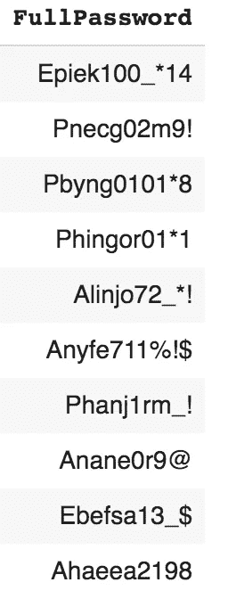
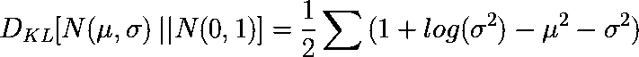

# 通过生成密码来揭开生成模型的神秘面纱—第 2 部分

> 原文：<https://towardsdatascience.com/demystifying-generative-models-by-generating-passwords-part-2-38ad3c325a46?source=collection_archive---------23----------------------->

## 从概率到深度学习方法

## 理解朴素贝叶斯模型和变分自动编码器(VAE)在生成任务中的区别。


Photo by [Isis França](https://unsplash.com/@isisfra?utm_source=unsplash&utm_medium=referral&utm_content=creditCopyText) on [Unsplash](https://unsplash.com/search/photos/gear?utm_source=unsplash&utm_medium=referral&utm_content=creditCopyText)

# 介绍

你好，这又是“揭开生成模型的神秘面纱”帖子的第二部分，所以如果你还没有阅读第一部分，我真的强烈建议你在这里阅读[。](/generating-passwords-with-generative-models-from-probabilistic-to-deep-learning-approaches-54d41d8810e3)

在上一篇文章中，我们讨论了判别模型和生成模型之间的区别，窥视了迷人的概率世界，并利用这些知识开发了一个可以为我们生成密码的朴素贝叶斯。现在，我们将稍微改变一下我们的方法，并探索当概率失败时，深度学习如何帮助我们。

# 不是很有用的朴素贝叶斯

假设您已经掌握了第 1 部分的上下文知识，我将直接切入正题。开发的多项式朴素贝叶斯模型是基于这样一个假设，即每个特征都是相互独立的，并且它工作得非常好！但是让我们稍微改变一下问题的提法，观察一下它的表现。不要有 4 个特性，固定的顺序，每个特性有有限的选择，让我们定义一个字母表，包含所有出现在初始特性选择中的字母、数字和特殊字符。这些将是:

> **小写** : ['a '，' b '，' c '，' e '，' f '，' g '，' h '，' I '，' j '，' k '，' l '，' m '，' n '，' o '，' p '，' r '，' s '，' t '，' y']
> **数字** : ['0 '，' 1 '，' 2 '，' 3 '，' 4 '，' 7 '，' 8 '，' 9']
> **特殊** : [' *！'，' @ '，' $ '，' % '，' * '，_']* **大写** *: ['A '，' E '，' T '，' P']*

为了使这个新问题尽可能接近前一个问题，我们将密码的最大长度限制为 **15** ，因为这是我们的密码数据集中的最大长度。另外，让我们定义另一个虚构的人物，叫做< NULL >。因为下面将要描述的模型必须填充密码的所有 15 个位置，所以空字符<只是模型告诉用户不要在这里放置任何东西的一种方式。因此，从我们的角度来看，任何空字符都将被忽略。

经过所有这些变化，字母表现在总共包含 19+8+6+4 + 1= 38 个字符(大写+小写+数字+特殊字符+空字符)。因此，在我们的样本空间中有 38 种⁵可能的组合！当然，这是一个比以前大得多的样本空间，但是让我们观察一下朴素贝叶斯模型在这些情况下的表现。

下面的列表说明了在当前问题上下文中使用旧的朴素贝叶斯模型生成的密码:



你能发现这里的问题吗？由于依赖于条件独立性假设，每个字符位置都是**独立推断的，**因此密码中没有一个单词是有意义的。这将使记住密码变得极其困难，这不是我们想要的。

回想一下，在第 1 部分中，对输出格式和输入都有约束。我们特别要求模型基于有限的选择集进行一些采样，这不可避免地是有意义的，而且它们确实是独立的！尽管如此，这一次，样本空间非常大。在所有可能的组合中，只有极小的一部分类似于一个单词或遵循一开始就定义好的格式，因为每个字母都依赖于前面的字母。举个例子，我们的密码序列第四位出现“e”的概率，应该是前三个字母是“caf”而不是“pas”的时候更大！希望这在某种程度上解释了为什么 Naive-Bayes 等统计模型在非结构化数据上表现不佳。

# 表征学习的深度模型

然而，这并不意味着我们不能处理非结构化数据。近年来，深度学习已经获得了大量的研究和行业关注，很明显，非结构化数据是深度学习模型擅长的领域！毫无疑问，这是因为他们有能力**对输入数据**的底层结构/依赖性进行建模。


A typical example of a deep learning model with fully connected layers

但是这怎么可能呢？你可能会想。好吧，经过训练的深度学习模型中神经元的深度堆叠分层，可以被设想为从高维空间到低维潜在空间的映射(降维)。在这样的空间中，建模数据点之间的关系变得更加容易，甚至可能执行算术运算。例如，潜在空间表示的一个广泛使用的应用是使用深度学习模型生成**单词嵌入**。

> 你可以在我的旧博客[这里](/nlp-extract-contextualized-word-embeddings-from-bert-keras-tf-67ef29f60a7b)了解更多关于单词嵌入的内容。

更正式的说法是，这被称为*表征学习*，作为人类，我们经常使用它，甚至没有注意到。尽管如此，对一台机器来说，这仍然是一项极其困难的任务。举个例子，回想一下你最后一次试图向某人描述一个人的时候。最有可能的是，你提到了头发颜色、体型、服装、眼睛颜色、皮肤颜色等等……而与你交谈过的人马上就能想象出你所描述的那个人的照片！所有用于这种描述的特征都是低维特征，我们的大脑知道如何转换到更高层次的维度，或者换句话说，一个图像！同样，大脑的感官输入以高维度表示，但人类的认知能力允许我们将这些转换为低维特征！这难道不令人兴奋吗？？

# 自动编码器

A utoencoder[1]是一种神经网络架构，可以更精确地描述为连接在一起的编码器和解码器。编码器是一个较小的神经网络，它将高维数据映射到较小的潜在空间，同时保留原始数据的主要特征。同样，解码器只是一个反向编码器。它从潜在空间获取输入，并试图重建原始数据。


Credit: Jeremy Jordan — [Introduction to Autoencoders](https://www.jeremyjordan.me/autoencoders/)

请注意，网络最窄的部分位于中间。这部分被称为网络的“瓶颈”,本质上是迫使自动编码器丢弃一些信息并只存储重要的特征，而不仅仅是将信息从输入传递到输出。

在生成建模环境中，网络作为一个整体被训练，但是只需要解码器部分来生成数据。通过最小化**原始输入**与**重构输出的误差来执行训练。**

在这篇文章中，我将跳过对网络如何工作的正式描述，因为我的主要目的是强调与概率学习的区别，但如果你想了解更多，斯坦福大学有一个关于自动编码器的优秀教程。

让我们重新看看密码生成的例子，开发一个自动编码器，它可以为我们生成密码，并观察它与独立的朴素贝叶斯模型相比如何。

## **TL；DR；**

请注意，下一节的所有代码都可以在这里找到:

 [## apogiatzis/vae-lstm-自动编码器-密码生成

### 这个库包含了名为“通过…揭开生成模型的神秘面纱”的系列文章的第 2 部分的相关代码

github.com](https://github.com/apogiatzis/vae-lstm-autoencoder-password-generation) 

所以，如果你是为了代码而来，请随意跳过其余部分，但我建议你打开笔记本，跟着读，因为如果和文章的其余部分一起阅读，代码会更有意义。

## 一个热编码

最初，密码必须被转换为向量，以便作为输入传递给任何类型的深度学习模型。对于这样的任务，最著名的技术之一是**一键编码**。一般来说，一种热编码适用于分类数据，通俗地说，它将一个项目表示为“one-of-X ”,其中 X 是所有可能类别的一个实例。在文本数据的上下文中，假设有固定的词汇，并且每个标记被表示为与词汇长度相同的稀疏向量，其中数字 1 指示该标记是对应于相关向量索引的类的实例。

让我们看一个例子来澄清任何混淆。假设我的词汇表只包含 5 个字符(“a”、“b”、“c”、“d”、“e”)，那么一个热编码中的单词“bad”可以表示为:

```
one_hot_encoding("bad") = [[0, 1, 0, 0, 0], [1, 0, 0, 0, 0], [0, 0, 0, 1, 0]] 
```

## 体系结构

如前所述，自动编码器通常遵循标准的堆叠架构，但有许多参数可以调整，如堆叠层数、单元数、连接单元的方式等...此外，自动编码器可以采用非对称架构，其中解码器与编码器具有不同的结构。不管是什么情况，这个概念都是一样的。

对于我们的密码生成场景，我采用了 BiLSTM 自动编码器架构，如下图所示。BiLSTM 层只是普通 LSTM 层的双向版本。这一选择背后的主要原因是利用一个擅长捕获顺序依赖关系的模型，但是任何其他顺序模型也适用于这里描述的内容。


## 履行

为了实现上面的模型，使用了带有 Tensorflow 后端的 Keras 功能 API。更准确地说，密码是如上所述的一个热编码，然后分别通过 16、10 和 6 个单元的 3 个 BiLSTM 层。然而在幕后，输出维度是加倍的，因为例如第一层在一个方向上输出 16 个单位，在相反方向上输出 16 个单位。最后，输入通过具有 6 个单元的全连接密集层，这是瓶颈。换句话说，当密码到达**瓶颈**时，它被表示为一个 6 维向量。接下来，解码器获取这个 6 维向量，并尝试重建密码。

该模型的训练是在由 **1000 个密码**组成的数据集上进行的，该数据集的结构在本教程的第 1 部分中进行了描述。经过 3 个 **00 代**的训练，模型达到了 **95%** 的准确率。

请注意，瓶颈层的大小对模型重建原始数据的准确性有着重要影响，因为它最终决定了在编码阶段保留多少信息。更复杂的数据需要更大的瓶颈尺寸，以便捕捉可能携带的所有细微差别。尽管如此，考虑到在这种情况下的最终目标是生成新密码，6 维似乎足够了，并且重建精度确实是可接受的。

更仔细地检查结果，很明显，该模型在仅从 6 个值重建密码方面做得相当不错！


## 生成密码

现在是表演的时候了！让我们看看我们令人敬畏的模型的运行情况，并生成一些密码。对于此任务，只需要模型的解码器，因为我们将有效地采样 6 个随机值，并将它们馈送到解码器以获得密码:


Generated passwords from autoencoder

结果很有趣。首先，很明显，自动编码器在生成密码方面肯定比朴素贝叶斯模型做得更好！

> 这应该是“啊哈！”认识到深度学习在识别非结构化数据中隐藏的相关性时可以变得多么强大的时刻！

里面有一些非常有用的密码，甚至有一些原始密码中没有的单词，比如`haakerman11$`。

然而，他们中的大多数都很离谱。密码 1、2、3、5、6 和 7 完全没有意义。但是到底是什么问题导致了这一切呢？让我们通过视觉化潜在空间来进一步检查正在发生的事情。

通过对潜在空间中的 200 个密码使用 t-SNE(一种用于可视化高维数据的技术)，我们确实可以观察到相似的密码聚集在一起(即`hackerman`密码都在左上角，下面是`hyper`，然后是`ninja`，以此类推……)。


显然，星团并没有真正的对称结构。更具体地说，空间的右上部分完全是空的，这让我们想知道如果从那个区域取样，密码会是什么样的。此外，聚类之间存在大的间隙，并且正 y 轴比负 y 轴具有更大范围的点。结果，采样变得很成问题，因为当从潜在空间随机采样时，如果该点不在已经看到的点附近，解码器将不知道如何解码。另外，我们如何知道从哪里采样，因为点甚至不在原点周围。

事实上，所有这些问题是普通自动编码器的主要弱点之一，但是有一种更现代的自动编码器叫做**变型自动编码器**，它采用了一种有趣的方法来解决这个问题！

# 可变自动编码器

可变自动编码器(VAE)[2]于 2013 年首次推出，是一种特殊类型的自动编码器，它采用贝叶斯方法来形成一个更通用、内在连续的潜在空间，以随机采样新数据点。

通俗地说，它与标准的自动编码器几乎是同一个模型，只是在中间多了一层。这是一个完全连通的稠密层，它不是将密码直接映射到潜在空间中的一个点，而是输出一个多元正态分布。更准确地说，它映射到定义多元正态分布的参数。

## 统计复习

让我们做一个简短的统计复习来阐明这些概念。正态(又名高斯)分布是由两个参数定义的概率分布。即均值(μ)和方差(σ)(也有标准差，但只是方差的平方根)。在正式术语中定义为:


Normal Distribution Equation

正态分布关于平均值是对称的，可以通过其钟形曲线很容易地识别出来。要从正态分布中采样一个点，您可以使用以下公式:


其中，ε从标准正态分布(μ = 0，σ = 1)中采样。这也被称为*重新参数化技巧*，也有助于模型的反向传播。(见[此处](https://medium.com/@llionj/the-reparameterization-trick-4ff30fe92954))

此外，正态分布可以在多个维度上定义，这里称为多元正态分布。更正式地，n 维的多元正态分布被定义为:


Multivariate Normal Distribution

其中 **μ** 是均值向量，而**σ**是协方差矩阵。在 2D，它们看起来如下图所示:


ρ是维度之间的相关性。

在 VAEs 的情况下，相关系数ρ是不相关的，因为它假定维度之间没有任何相关性。严格地说，这意味着协方差矩阵是对角的，因此多元正态分布等价于一组独立的正态分布。

证据和更多细节可以在这里找到:[http://cs229.stanford.edu/section/gaussians.pdf](http://cs229.stanford.edu/section/gaussians.pdf)

## 回到问题上来

回到密码生成问题，如前所述，我们不是将密码编码到潜在空间中的具体点，而是将其编码到一组*正态分布的参数中。然后从它们中的每一个中随机抽取一个变量，在我们的潜在空间中形成一个点！*

> 需要说明的另一个技术性问题是，在现实中，我们将其映射到方差的对数，而不是方差本身。这个调整允许方差取(-inf，inf)中的任何值，而不仅仅是正值。

到目前为止一切顺利，但是你可能会想，所有这些是如何解决我们的问题的呢？

实际上，这使得 VAE 在生成新数据时有两个非常好的特性。更具体地说**完整性**和**连续性**！例如，从概率分布中采样意味着每个输入密码映射到一个区域而不是单个点，从而迫使解码器为潜在空间中落入该分布的点生成类似的数据。例如，假设点(1，1)映射到密码“mypass”，点(1.1，1.1)应该映射到类似的密码。

## 损失函数

然而，仅仅给潜在空间中的样本点增加一个概率分布并不能解决所有问题。还有一件事需要调整，以完善我们的变化自动编码器。即**修正损失函数。**

我们已经确保了相似的数据点应该是非常接近的，但是那些具有完全不同特征的数据点呢？进一步解释，密码“Mypass”不应该直接紧挨着潜在空间中的“SomethingRandom”。然而，我们希望**避免如下图所示的数据点簇之间存在巨大的间隙**。所以从技术角度来说，无论何时发生这种情况，模型都应该受到惩罚。


这是通过在损失函数中引入“Kullback-Leibler (KL)”散度来实现的。简而言之，KL 散度是一种度量两种分布差异的指标(即它们之间的差异)。关于 KL 更彻底的解释可以在这个[牛逼的帖子](https://www.countbayesie.com/blog/2017/5/9/kullback-leibler-divergence-explained)里找到。

对于 VAEs，我们希望惩罚任何偏离标准正态分布(μ = 0，σ = 1)的分布。这奖励了在潜在空间的原点周围均匀分布的模型，否则惩罚它。

在数学上，它表示为:



KL Divergence from Standard Normal Distribution

对潜在空间中所有维度的均值和方差进行求和。

总之，最终损失函数变为:

> 损失=分类 _ 交叉熵+KL _ 散度

## 履行

好了，理论到此为止！让我们把事情做好！**提醒一下，代码包含在上述章节提供的笔记本中。**

当然，除了使用 Keras API 的`Lambda`层实现的额外采样层之外，模型架构与前面的相同。同样，该模型在 1000 个密码的数据集上训练，超过 300 个时期，达到 85%的准确率**。请注意，精确度低于标准自动编码器的精确度。请记住，这里的准确性只是指绝对的准确性，因此它只反映了重建的准确性。它没有说任何关于潜在空间的结构，而这正是 VAEs 的意义所在！但是总的来说，由于更复杂的损失函数使得训练更加困难，所以预期的准确度更低。**

**通过观察下图中的密码重建，我们可以看到该模型在解码密码方面仍然做得不错。**

****

## **生成密码**

**这可能是 post 系列中最激动人心的部分。让我们使用最终确定的变分自动编码器来生成一些密码！**

**为了创建新的密码，只需从均值为 0、方差为 1-3 的正态分布中抽取点就足够了，因为理论上我们在潜在空间中的所有点都分布在标准正态分布的周围。**

****

**这就对了。比传统的自动编码器好得多！很明显，这些密码中的大部分实际上都是有意义的！记住……与前一篇文章中的朴素贝叶斯相反，我们没有在模型中的字母之间强加任何类型的结构或依赖性。一切都是深度学习本身衍生出来的！**

**最后，我们可以使用 t-SNE 观察其结构的变化来可视化 2D 图中的潜在空间。**

****

**Latent Space Visualization for VAE**

**诚然，潜在空间的变化视觉化并不完全是我所期待的，我也不确定为什么。我原本期望在潜在空间中看到更密集的点，但相反，中间有一个很大的间隙。它可能是一个小数据集，SNE 霸王龙本身，或者它可能需要更多的训练，但我不能确定。因此，如果你们中的任何人对可能发生的情况有所了解，请在下面的评论中告诉我。**

## **代码:**

**再一次避免你一路向上滚动。这里是包含这篇文章所有相关代码的存储库:**

 **[## apogiatzis/vae-lstm-自动编码器-密码生成

### 这个库包含了名为“通过…揭开生成模型的神秘面纱”的系列文章的第 2 部分的相关代码

github.com](https://github.com/apogiatzis/vae-lstm-autoencoder-password-generation)** 

# **结论**

**“通过生成密码来揭开生成模型的神秘面纱”系列文章到此结束。在这些文章中，我们探讨了区别建模与生成建模的区别，并分析了一些生成模型，以确定它们的内部工作方式、优势和弱点。采用密码生成场景作为在实践中应用模型的基础，我们使用 Keras API 在 Python 中描述、分析、实现和测试这些模型，并使用真实的实际案例来突出每个案例中的问题。**

**总之，我们已经看到，当特征的数量很少或者在处理之前可能需要某种形式的特征工程时，像朴素贝叶斯这样的概率模型表现得相对较好。然而，当特征的数量非常大时(即处理非结构化数据)，深度学习的表现远远超过统计模型，因为重要的特征被识别为训练的一部分。更准确地说，这篇文章特别关注标准和变化的自动编码器，以展示生成性深度学习的能力。**

**在这篇文章的最后，我们实现了一个有效的可变自动编码器，只需从正态分布中解码 6 个点就能生成新密码。**

**我真的希望你和我一样喜欢这些演示，并且这些帖子让你深入了解了简单的生成建模。非常感谢任何反馈。**

# **参考资料:**

**[1]杰弗里·E·辛顿和鲁斯兰·R·萨拉胡季诺夫。用神经网络降低数据的维数。《科学》，313(5786):504–507，2006。**

**[2]迪德里克·P·金马和马克斯·韦林。**自动编码变分贝叶斯**，2013。**