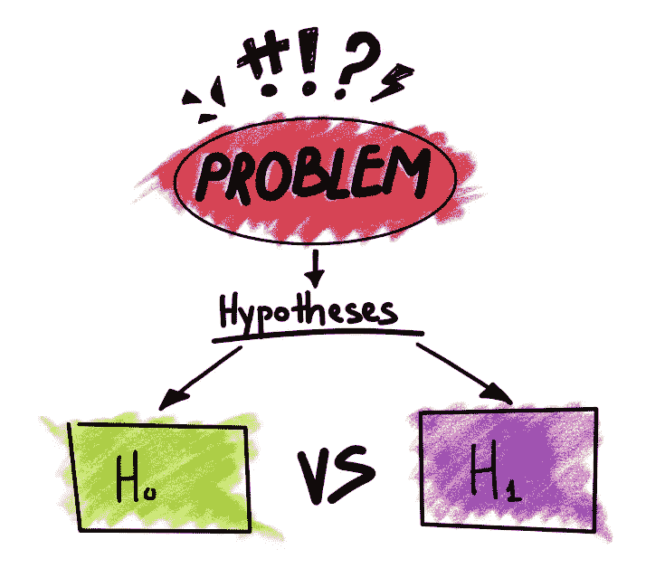
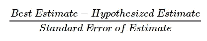
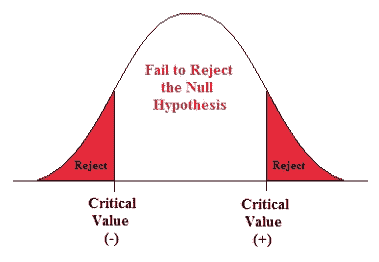
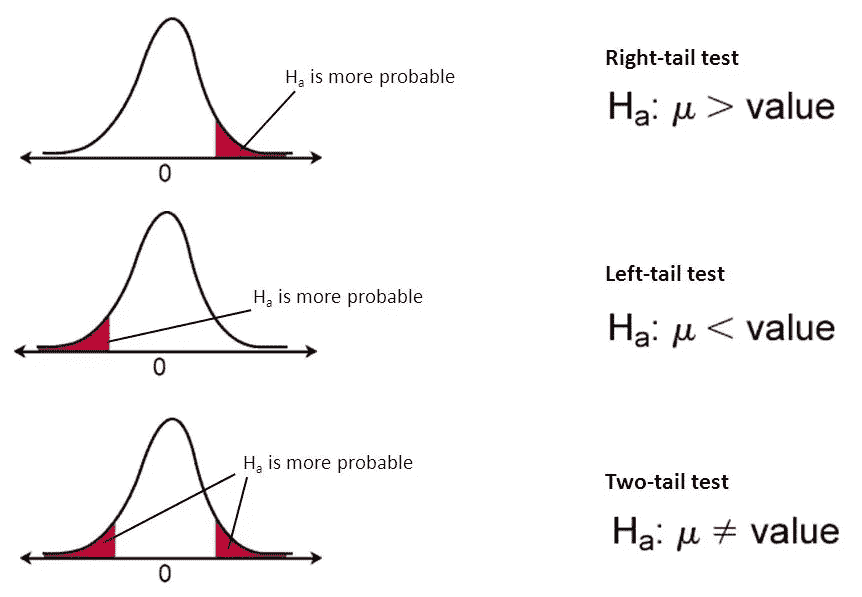
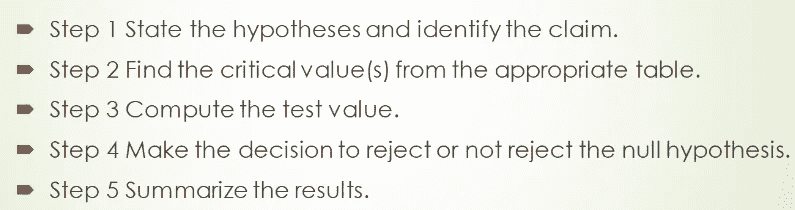
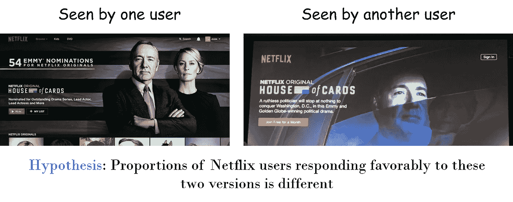
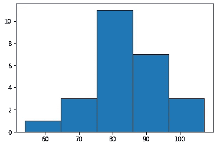
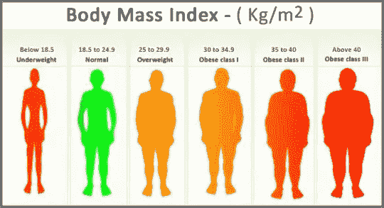

# 用简单的 Python 例子揭开假设检验的神秘面纱

> 原文：<https://towardsdatascience.com/demystifying-hypothesis-testing-with-simple-python-examples-4997ad3c5294?source=collection_archive---------4----------------------->

## 假设检验是推断统计学的基础，也是数据科学家的一项重要技能。我们用非常简单的 Python 脚本来演示这个概念。



Source: [https://luminousmen.com/post/demystifying-hypothesis-testing](https://luminousmen.com/post/demystifying-hypothesis-testing)

# 介绍

假设检验是推断统计学中的一个关键工具，用于确定一个 ***总体参数*** 的值可能是多少。我们经常根据一个 ***样本数据分析*** 得出这个结论。

不确定“人口”和“样本”在统计学中的确切含义？见此文。

[](https://www.statisticshowto.datasciencecentral.com/what-is-a-population/) [## 统计学中的人口是什么？

### 统计学定义>什么是统计学中的总体？统计学中的人口是什么？在统计中，样本是…

www.statisticshowto.datasciencecentral.com](https://www.statisticshowto.datasciencecentral.com/what-is-a-population/) 

随着商业、科学、技术、社会和政治事业中数据驱动决策的出现，[假设检验的概念对于理解和在正确的环境中应用变得至关重要](/data-science-simplified-hypothesis-testing-56e180ef2f71)。

为此，在统计分析中使用了大量的测试。这可能会让人困惑。参见这篇优秀的文章，全面了解在什么情况下使用哪种测试。

[](/statistical-tests-when-to-use-which-704557554740) [## 统计测试——何时使用哪一种？

### 对于一个来自非统计学背景的人来说，统计学最令人困惑的方面总是…

towardsdatascience.com](/statistical-tests-when-to-use-which-704557554740) 

假设检验的基础有两个属性:(a) **原假设**和(b) **备择假设。**

通常，零假设是无聊的东西，即假设没有有趣的事情发生。

另一个假设是，**其中动作是**，即一些观察/现象是真实的(即不是偶然的)，统计分析将为我们提供更多关于这方面的见解。

查看该文档，获取关于该主题的快速和全面的指南。

# 流程是怎样的？

统计学家持悲观态度，从零假设开始，在样本数据中计算某种检验统计量。它是由，



这里，‘*最佳估计*’来自样本，例如样本中某些数据的样本均值或比例。[标准误差](https://www.statisticshowto.datasciencecentral.com/what-is-the-standard-error-of-a-sample/)代表估计值的可变性，通常取决于方差和样本量。

然后他们问这个简单的问题，

> “对于这个样本(考虑到它的大小和控制它的合适的概率动力学)，如果零假设为真，观察到这个极端的检验统计的机会是多少？”

这个机会——观察检验统计量的概率值——就是所谓的 [**p 值**](https://blog.minitab.com/blog/adventures-in-statistics-2/how-to-correctly-interpret-p-values) 。

因此，p 值是观察检验统计的概率，假设零假设为真。并且这个概率是在某个概率分布的假设下计算的(测试统计是从这个概率分布产生的)。想法是这样的，



如果这个特定值非常小(小于预定的**临界值**，我们可以拒绝零假设。

请注意，在某些情况下，我们必须使用概率分布的两侧(如上图红色所示)。这就是所谓的“双边”或“双尾”测试。在这些情况下，备择假设一般以“ ***x 不等于 y*** ”的形式表示。

在其他情况下，假设以“ ***x 大于 y*** ”或“ ***x 小于 y*** ”的形式处理问题。在这种情况下，只需要检查概率分布的一侧，我们称之为“单侧”或“单尾”检验。



Source: [https://www.fromthegenesis.com/why-hypothesis-testing/](https://www.fromthegenesis.com/why-hypothesis-testing/)

实际上，我们已经在观察者(我们自己)的头脑中注入了足够的怀疑，怀疑我们基本假设 的有效性——零假设是真的。

这里有一篇总结 p 值及其用途的好文章。

[](https://medium.com/analytics-vidhya/everything-you-should-know-about-p-value-from-scratch-for-data-science-f3c0bfa3c4cc) [## 对于数据科学，您应该从头开始了解 p 值的所有内容

### 什么是 p 值？在数据科学中用在什么地方？又该如何计算呢？我们在此回答所有这些问题…

medium.com](https://medium.com/analytics-vidhya/everything-you-should-know-about-p-value-from-scratch-for-data-science-f3c0bfa3c4cc) 

这是假设检验流程，总结如下:



关于这种 p-value 方法有很多活跃且不那么讨人喜欢的讨论，但这种方法长期以来一直相当有效。因此，在本文中，我们将遵循这一点。然而，保持开放的心态，寻找其他方法。

# 假设检验的一个简单例子？

你看关于网飞的电影或电视剧吗？那么，你肯定接受了一种叫做 A/B 测试的假设测试。

网飞向不同的用户群展示同样的节目，不同的设计。记录用户的反应(点击/不点击/浏览/不浏览/回来看或不看),并使用古老的假设检验方法进行分析。



# 用 Python 进行假设检验

推动 Python 作为统计建模语言流行的最重要因素之一是它作为数据科学和机器学习的首选语言的广泛使用。

如今，随着越来越多的企业在其运营中应用数据科学，对数据科学专业知识的需求非常大。Python 提供了强大功能、多功能性和来自其社区的支持的正确组合来引领潮流。

虽然 Python 在数据争论、可视化、通用机器学习、深度学习和相关的线性代数(张量和矩阵运算)以及 web 集成方面最受欢迎，**但它的统计建模能力远没有宣传得那么好**。

很大一部分数据科学家仍然使用其他特殊的统计语言，如 R、MATLAB 或 SAS over Python 来进行建模和分析。虽然每种方法都为统计分析提供了各自独特的特性和功能，但对于一名有前途的数据科学家来说，了解更多有关可用于描述性和推断性统计的各种 Python 框架和方法的知识是非常有用的。

关于如何开始使用 Python 进行统计建模的全面讨论，请参阅本文。

[](https://kite.com/blog/python/statistical-modeling-python-libraries/) [## 使用 Python 进行统计建模:指南和顶级库- Kite 博客

### 推动 Python 作为统计建模语言流行的最重要因素之一是它的广泛使用…

kite.com](https://kite.com/blog/python/statistical-modeling-python-libraries/) 

在本文中，我们展示了用 Python 进行假设检验的四个简单例子(使用来自 [**Statsmodels 包**](https://www.statsmodels.org/stable/index.html) 的函数)。这四种情况出现在大部分统计分析中，

*   一个人口比例
*   人口比例的差异
*   一个总体平均值
*   人口的差异意味着

# 真实情况的代码示例

整个 [**Jupyter 笔记本都在这里**](https://github.com/tirthajyoti/Stats-Maths-with-Python/blob/master/Intro_Hypothesis_Testing.ipynb) 。个别案例用现实生活中的例子来说明。他们来了，

## 一个人口比例


**研究问题**:前几年，52%的父母认为电子产品和社交媒体是他们青少年睡眠不足的原因。*现在是否有更多的父母认为他们的孩子睡眠不足是由电子产品和社交媒体造成的*？

**人群**:有青少年的父母(13-18 岁)
**兴趣参数** : p(比例)

**零假设:**p = 0.52
备选假设: p > 0.52(注意这是单侧检验)

**数据**:调查 1018 人。56%的受访者认为，他们青少年的睡眠不足是由电子产品和社交媒体造成的。

**方法**:单组比例采用[**z-统计检验**](https://www.statisticshowto.datasciencecentral.com/z-test/) 。我们使用 Statsmodels 包中的`proportions_ztest()`函数。注意参数`alternative="larger"`表示单边测试。该函数返回两个值-z 统计值和相应的 p 值。

```
import statsmodels.api as sm
import numpy as np
import matplotlib.pyplot as pltn = 1018
pnull = .52
phat = .56sm.stats.proportions_ztest(phat * n, n, pnull, alternative='larger')>> (2.571067795759113, 0.005069273865860533)
```

**结论**:由于 z 检验的计算 p 值(~0.005)非常小，我们**可以拒绝**无效假设，即*认为青少年睡眠不足是由电子产品和社交媒体造成的父母比例与前几年的估计相同，即 52%* 。虽然我们不接受替代假设，但这非正式地意味着这个比例很有可能超过 52%。

## 人口比例的差异


Source: [http://www.ymcamidtn.org/swim-lessons](http://www.ymcamidtn.org/swim-lessons)

**研究问题** : *黑人孩子的父母和西班牙裔孩子的父母报告他们的孩子上过游泳课的人口比例有显著差异吗*？

**人口**:6-18 岁黑人儿童的所有父母和 6-18 岁西班牙裔儿童的所有父母
**感兴趣的参数**:P1-p2，其中 p1 =黑人，p2 =西班牙裔

**零假设:** p1 — p2 = 0
**备选假设:** p1 — p2 ≠ 0

**数据** : 247 名黑人儿童家长。36.8%的家长报告说他们的孩子上过游泳课。308 名西班牙裔儿童的父母。38.9%的家长报告说他们的孩子上过游泳课。

**逼近**:人口比例差异需要 [**t 检验**](https://www.statisticshowto.datasciencecentral.com/probability-and-statistics/t-test/) 。此外，这里的人口服从二项式分布。我们可以将两个带有适当二项式分布参数的总体量传递给 t 检验函数。

我们可以使用 Statsmodels 中的`ttest_ind()`函数。该函数返回三个值:(a)检验统计量，(b)t 检验的 p 值，以及(c)t 检验中使用的自由度。

```
n1 = 247
p1 = .37

n2 = 308
p2 = .39

population1 = np.random.binomial(1, p1, n1)
population2 = np.random.binomial(1, p2, n2)sm.stats.ttest_ind(population1, population2)>> (0.9309838177540464, 0.3522681761633615, 553.0)
```

**结论**:由于 p 值(~0.352)相当高，我们**无法拒绝**人口比例差异为零的零假设*。*

*但是，如果我们可以对 5000 名父母而不是几百名父母进行抽样调查，会发生什么呢？[查看笔记本](https://github.com/tirthajyoti/Stats-Maths-with-Python/blob/master/Intro_Hypothesis_Testing.ipynb)看结论如何变化。*

## *一个总体平均值*

**

***研究问题**:假设组织了一场成年人的侧手翻比赛。数据如下所示，*

*(80.57, 98.96, 85.28, 83.83, 69.94, 89.59, 91.09, 66.25, 91.21, 82.7 , 73.54, 81.99, 54.01, 82.89, 75.88, 98.32, 107.2 , 85.53, 79.08, 84.3 , 89.32, 86.35, 78.98, 92.26, 87.01)*

**成年人的平均侧手翻距离(以英寸为单位)是否大于 80 英寸*？*

***人群**:所有成年人
**感兴趣参数** : μ，人群平均侧滑距离。*

***零假设:**μ= 80
备选假设 : μ > 80*

***数据** :
25 名成年被试。
μ=83.84
σ=10.72*

***方法**:我们使用 Statsmodels 包中的 z 测试，用`alternate='larger'`作为参数来表示单尾测试。*

```
*sm.stats.ztest(cwdata, value = 80, alternative = "larger")>> (1.756973189172546, 0.039461189601168366)*
```

***结论**:由于 p 值(0.0394)低于标准置信水平 0.05，我们**可以拒绝**零假设*成年人(人口数量)的平均侧滑距离等于 80 英寸*。有强有力的证据支持另一个假设，即平均车轮距离实际上高于 80 英寸。*

***正态性目测检验**:对于 z 统计量的单总体均值检验，基本假设是数据的正态性。我们应该经常检查。*

**

## *人口的差异意味着*

**

*Source: [https://www.shdoonline.org/blog-5/](https://www.shdoonline.org/blog-5/)*

***研究问题** : *考虑到* [*NHANES 数据*](https://www.cdc.gov/nchs/nhanes/index.htm) *中的成年人，男性的平均* [*体重指数*](https://www.cdc.gov/healthyweight/assessing/bmi/index.html) *是否明显高于女性*？*

***观点**:国家健康和营养检查调查(NHANES)是一项研究计划，旨在评估美国成人和儿童的健康和营养状况。这项调查的独特之处在于它结合了面试和体检。*

***人口**:NHANES 数据中的成年人。
**感兴趣参数**:μ1-μ2μ1-μ2，体重指数。*

***零假设:** μ1=μ2
**备选假设:** μ1≠μ2*

***数据:***

*女性 2976 人，μ1=29.94，σ1=7.75
男性成年人 2759 人，μ2=28.78，σ2=6.25*

*μ1−μ2=1.16*

***方法**:我们可以再次使用 z 统计量进行假设检验。但是在这里，测试必须是“双边的”,因为在替代假设中出现了不平等，即男性的身体质量指数可以高于或低于女性。计算 p 值时，两边的概率必须相加。*

```
*url = "https://raw.githubusercontent.com/kshedden/statswpy/master/NHANES/merged/nhanes_2015_2016.csv"
da = pd.read_csv(url)females = da[da["RIAGENDR"] == 2]
male = da[da["RIAGENDR"] == 1]sm.stats.ztest(females["BMXBMI"].dropna(), male["BMXBMI"].dropna(),alternative='two-sided')>> (6.1755933531383205, 6.591544431126401e-10)*
```

***结论**:由于 p 值(6.59e-10)极小，我们**可以拒绝**零假设*即男性的平均身体质量指数与女性的相同*。*

# *外卖食品*

*从这些例子中有一些简单的收获，*

*   *将你的统计推断问题归入一个设定的类别可能不会太难。如果你正在做一个临床药物试验或网站设计选择的 A/B 测试，你可能在比较两个总体均值。如果你试图判断一些制造过程变化的影响，你可能会遇到一个比例问题。*
*   *一旦你解决了你的问题，就遵循一个屡试不爽的程序。确定你的人口，感兴趣的参数，构建一个无效和替代假设。预先确定 p 值阈值。通常为 0.05 ，但根据您的应用进行调整。*
*   *此后，**选择一个适合你的推理问题类型的测试**——t 测试、z 测试、卡方测试或类似的测试。简单直观的函数存在于 Python 包中，如 Scipy 或 Statsmodels。使用选择的函数运行测试，并**检查 p 值**和**拒绝/未能拒绝零假设**。*
*   *理解 p 值的真正含义。我们从不接受另一个假设，我们只是给出充分/不充分的证据来拒绝零假设。*
*   *你可以试验不同的样本大小、不同类型的概率分布或生成模型，以检查这些对你的结论的影响。但是基本过程是一样的。*
*   *你可能想知道当你拒绝一个为真的无效假设时会发生什么，反之亦然。这些问题与**第一类和第二类错误**有关，在数据科学的说法中，你可能知道它们的其他名称——**假阳性**和**假阴性**。通过对数据和样本进行实验，了解它们是如何产生的以及如何应对。*

# *摘要*

*在本文中，我们展示了简单而直观的现实生活中的例子，以及可以使用紧凑的 Python 代码回答的推断统计研究问题。*

*这些例子说明了假设检验概念的应用，对于数据科学家和分析专业人员来说，掌握假设检验是一项非常有价值的技能，他们使用数据来收集见解并做出业务/科学决策。*

*如果你有任何问题或想法要分享，请联系作者[**tirthajyoti【AT】Gmail . com**](mailto:tirthajyoti@gmail.com)。另外，你可以查看作者的 [**GitHub**](https://github.com/tirthajyoti?tab=repositories) **资源库**中其他有趣的 Python、R 和机器学习资源中的代码片段。如果你像我一样对机器学习/数据科学充满热情，请随时[在 LinkedIn 上添加我](https://www.linkedin.com/in/tirthajyoti-sarkar-2127aa7/)或[在 Twitter 上关注我。](https://twitter.com/tirthajyotiS)*

*[](https://www.linkedin.com/in/tirthajyoti-sarkar-2127aa7/) [## Tirthajyoti Sarkar - Sr .首席工程师-半导体、人工智能、机器学习- ON…

### 通过写作使数据科学/ML 概念易于理解:https://medium.com/@tirthajyoti 开源和有趣…

www.linkedin.com](https://www.linkedin.com/in/tirthajyoti-sarkar-2127aa7/) 

享受中等:[https://medium.com/@tirthajyoti/membership](https://medium.com/@tirthajyoti/membership)*