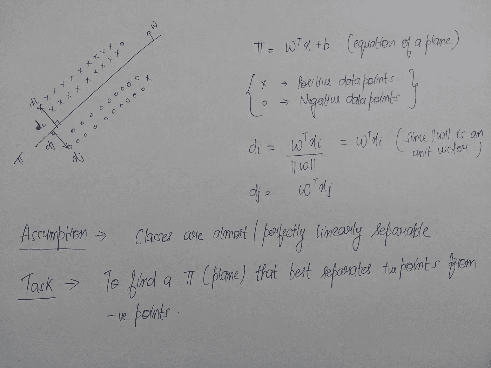
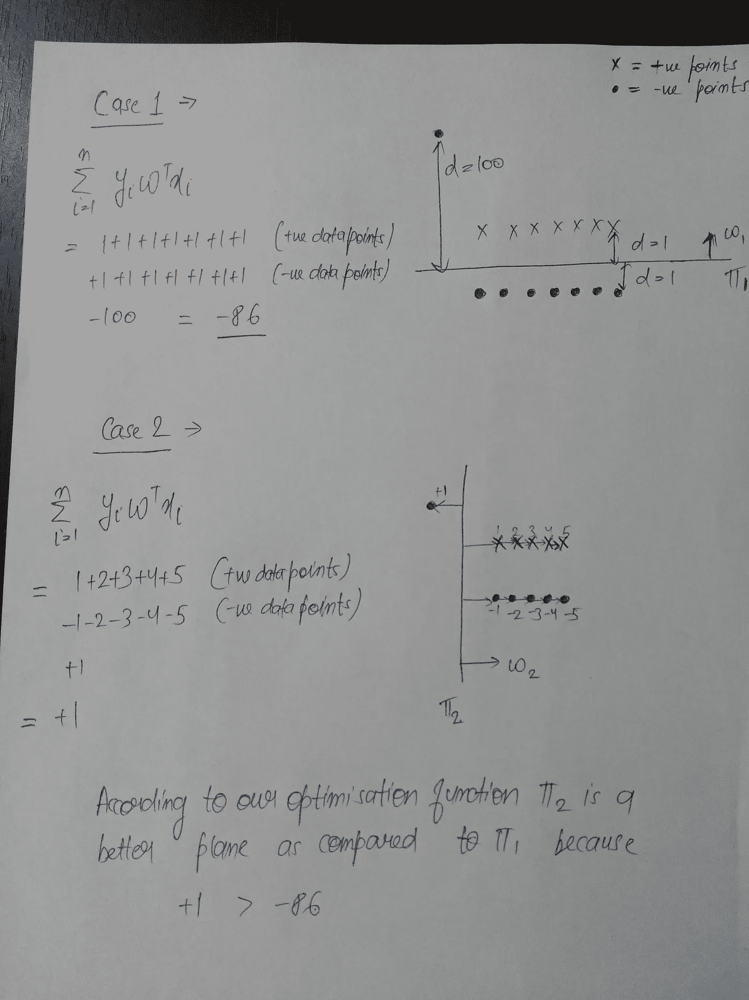
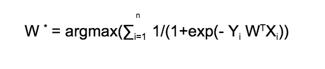
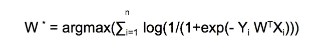
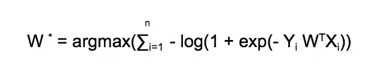
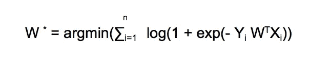
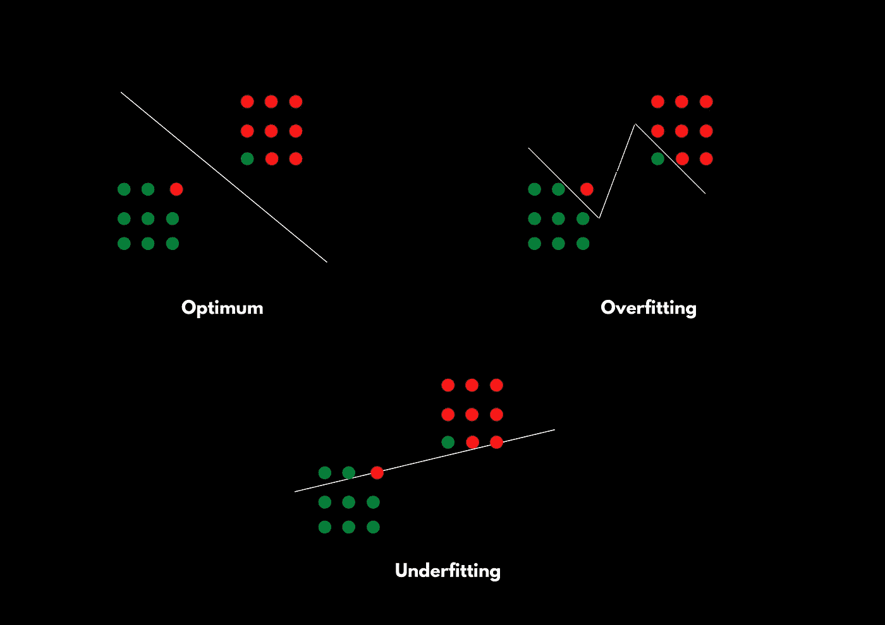
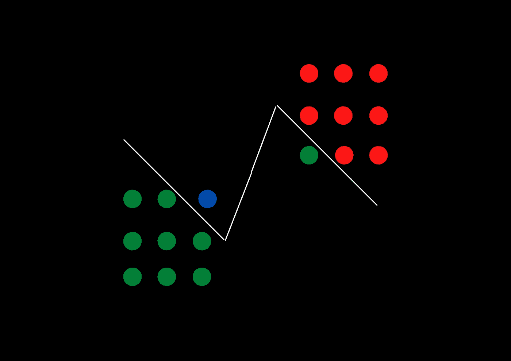
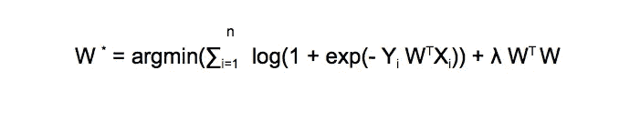

# 揭秘逻辑回归

> 原文：<https://towardsdatascience.com/demystifying-logistic-regression-ee24c1104d45?source=collection_archive---------12----------------------->

## 逻辑回归的几何研究


Photo by [Héctor J. Rivas](https://unsplash.com/@hjrc33?utm_source=unsplash&utm_medium=referral&utm_content=creditCopyText) on [Unsplash](https://unsplash.com/collections/1413080/geometry?utm_source=unsplash&utm_medium=referral&utm_content=creditCopyText)

逻辑回归是最流行的分类技术之一。在大多数教程和文章中，人们通常会解释逻辑回归的概率解释。所以在这篇文章中，我将尝试给出逻辑回归的几何直观。我将在这篇文章中涉及的主题—

*   逻辑回归的几何直观
*   优化功能
*   Sigmoid 函数
*   过度拟合和欠拟合
*   正规化— L2 和 L1

## 直觉



Image by Author

从上图中，我们可以简单地将逻辑回归视为寻找一个平面的过程，该平面最好地将我们的类分开，如上所述，逻辑回归假设类是线性可分的。

所以现在我们需要的是一个能够区分这两个类的分类器。从图 1 中我们可以观察到，`W^T * Xi > 0` 代表正类，因为正类点位于`W`的方向，而`W^T * Xi < 0` 代表负类。

所以我们的分类器是—

```
If W^T * Xi > 0  :  then Y = +1    where Y is the class labelIf W^T * Xi < 0  :  then Y = -1    where Y is the class label
```

在上面的段落中，我提到了逻辑回归的目标是找到两个类别的最佳分离平面，如果你是一个好奇的人，那么你一定想知道我们如何确定最佳分离。所以让我们试着理解这一点。

## 寻找合适的飞机

为了测量任何东西，我们需要一个值，在这种情况下，我们将通过定义一个优化函数来获得该值，该函数的结果将用于确定哪个平面是最好的。这是尽可能模糊和抽象的，但我想用几个案例和相应的例子来解释它。抓紧了！！

```
**Case 1 —** [Yi = +1] , [W^T * Xi > 0]Yi = +1 means that the correct class label is positive.Yi * W^T * Xi > 0 means that we have correctly predicted the class label.
```

例如，W^T * Xi = 5 (5 > 0)，易= +1。

这里，易* W^T * Xi = 5

```
**Case 2 —** [Yi = -1] , [W^T * Xi < 0]Yi = -1 means that the correct class label is negative.Yi * W^T * Xi > 0 means that we have correctly predicted the class label.
```

举例来说，W^T * Xi =-5 (-5 < 0)，而易=-1。

这里，易* W^T * Xi = (-1)(-5) = 5

```
**Case 3 —** [Yi = +1] , [W^T * Xi < 0]Yi = +1 means that the correct class label is positive.Yi * W^T * Xi < 0 means that we have incorrectly predicted the class label.
```

举例来说，W^T * Xi =-5 (5 < 0)，而易= +1。

这里，易* W^T * Xi = (1)(-5) = -5

```
**Case 4 —** [Yi = -1] , [W^T * Xi > 0]Yi = -1 means that the correct class label is negative.Yi * W^T * Xi < 0 means that we have incorrectly predicted the class label.
```

例如，W^T * Xi = 5 (5 < 0)，而易= -1。

这里，易* W^T * Xi = (-1)(5) = -5

如果你仔细观察这些案例，你会发现`Yi * W^T*Xi > 0` 意味着我们已经正确地对这些点进行了分类，而`Yi * W^T * Xi < 0` 意味着我们已经错误地对这些点进行了分类。

看来我们已经找到了期待已久的优化功能。


Optimisation Function (Image by Author)

因此，具有该函数最大值的平面将作为决策面(最好地分隔我们的点的平面)。

## 分析优化函数

在你开始庆祝我们得到了优化函数之前，让我们分析一下这个函数，确保这个函数不管数据集如何都能正常工作。



Image by Author

你可能已经猜到了，我们的优化函数不够健壮，不足以处理任何异常值。直观地看一下上图，你会发现ㄫ1 比ㄫ2 更好，因为ㄫ1 正确地分类了 14 个数据点，而ㄫ2 只正确地分类了一个数据点，但是根据我们的优化函数，ㄫ2 更好。

有各种方法可以从数据集中移除异常值，但没有这样的方法可以 100%移除异常值，正如我们在上面看到的，即使是一个异常值也会严重影响我们对最佳平面的搜索。

那么我们如何处理这个离群值的问题呢？输入 Sigmoid 函数。

## Sigmoid 函数

Sigmoid 函数背后的基本思想是挤压。挤压可以解释如下。

```
If signed distance is small :  then use it as is
If signed distance is large :  then squish it to a smaller value
```

Sigmoid 函数压缩较大的值，所有的值都在 0 和 1 之间。

现在你一定想知道，有各种各样的其他函数可以做同样的工作，将我们的函数值限制在一定的范围内，那么 sigmoid 函数有什么特别之处呢？

## 为什么是乙状结肠？？

有各种各样的理由选择 sigmoid 函数

*   它提供了一个很好的概率解释。例如，如果一个点位于决策面上(d = 0)，那么凭直觉，它的概率应该是 1/2，因为它可以属于任何类别，这里我们也可以看到，适马(0) = 1/2。
*   如果是很容易区分的。

如果你仍然不相信，那么你可以查看[这个](https://stats.stackexchange.com/questions/162988/why-sigmoid-function-instead-of-anything-else)链接来了解更多关于乙状结肠功能的信息。

所以我们新的优化函数是—



Image by Author

我们可以通过取这个函数的对数来进一步修改它，以简化数学运算。因为 log 是一个单调递增的函数，所以它不会影响我们的模型。如果你不知道什么是单调递增函数，那么这里有一个简单的概述

```
A function g(x) will be called a monotonically increasing function If - when x increases g(x) also increases
So if x1 > x2 then g(x1) > g(x2) if g(x) is a monotonically increasing function.
```

## 转换优化函数

在我们得到优化函数的最佳版本之前，还有一些变换。

1.  **取 Log f** 或简化优化该函数所涉及的数学。



Image by Author

2.**使用对数属性的变换** log(1/x) = -log(x)



Image by Author

3.**通过使用属性** argmax(-f(x)) = argmin(f(x))



Image by Author

## 最小化策略

```
 n 
W` = argmin(∑i=1  log(1 + exp(- Yi W^T Xi)) //Optimisation Function Let Z = Yi W^T Xi n 
W` = argmin(∑i=1  log(1 + exp(- Zi))
```

exp(-Zi)将始终为正。我们希望最小化我们的优化函数，exp(-Zi)的最小值是 0。

```
 n 
W` = argmin(∑i=1  log(1 + exp(- Zi)) >= 0 
```

我们的优化函数的最小值是 0，当 log(1+0) = 0 时，exp(-Zi)为 0。

因此，我们的优化函数的整体最小值将出现在

`Zi -> +∞ for all i`

让我们仔细看看子这个词。

```
Z = Yi W^T Xi
```

因为这是一个监督学习算法，所以我们得到了 X 和 y 的值。

x-我们预测正确分类标签所依据的特征

y-正确的类别标签

所以我们不能改变或易，因此剩下的唯一可操作的术语是“W”。你可以有一点直觉，如果我们选择一个很大的 W 值，那么只有 Z 会向无穷大移动。

为了将 Zi 的值移动到无穷大，我们将为 w 选择一个非常大的值(或者+或者-)。

```
**Case 1 —** [Yi = +1]Yi * W^T * Xi = +1 * (very large +ve value of W ) * Xi   =  Very large +ve value **Case 2—** [Yi = -1] Yi * W^T * Xi = -1 * (very large -ve value of W ) * Xi   =  Very large +ve value
```

所以你可以看到，如果我们为 W 选择一个大的值，那么我们就可以完成我们的目标，使`Zi -> +∞`

## 这个策略的问题

通过使用上述策略，一切看起来都很好，因为我们的目标是-

`Zi-> ∞`和`log(1 + exp(- Zi)) -> 0` ，如果我们使用这种策略，我们就能成功做到。

**这种策略的唯一问题是，我们可以成功地最小化所有‘I’值的优化函数。**听起来有点讽刺，因为我们的目标是最小化 I 的所有值的函数，突然这成了一个问题。如果你感到沮丧，那么这是一个很好的迹象，这意味着到目前为止你已经理解了每一个细节。所以我们来深入探讨一下这个问题。

这里的主要问题是我们对我们的模型**过度拟合**。如果你不熟悉过度拟合这个术语，这里有一个简单的概述-

```
Overfitting means that our model will work pretty well for the training data as it will just adjust the weights according to the training data and as a result it will do a really bad job on the test data
```

这不是一个技术上正确的定义，我只是想给你一个过度拟合的直觉。

## **过拟合**



Image by Author

这里红点代表负数据点，绿点代表正数据点。

正如您在过度拟合的情况下所看到的，我们的决策表面完美地对每个点进行了分类，在这种情况下，我们将在训练数据上获得 100%准确的结果。但是考虑一下这个场景—



Overfitting (Image by Author)

这里，蓝点是我们的测试数据点，我们希望预测它属于正类还是负类，正如您可以看到的，根据我们的决策表面，它是负类点，但我们可以看到，它最有可能是正类点，因为它比负类点更接近正类点。这叫做过度拟合。

这正是我们的模型看起来的样子，如果我们遵循上面的策略，总是选择一个大的 W 值，并使`Zi -> +∞`

## 救援的规范化

现在你终于明白了实际问题是什么，我们可以开始寻找解决方案，这个解决方案就是**规范化**。

你们中的许多人可能对此有一个模糊的概念，你们一定听说过它是用来防止过度适应和欠适应的，但是很少有人真正知道我们如何通过使用正则化来防止欠适应和过度适应。所以做好准备，你将加入精英团体。

有两种主要的规范化类型—

1.  L2 正规化
2.  L1 正规化

## L2 正规化—

在 L2 正则化中，为了防止过度拟合，我们引入了一个额外的术语，称为正则化术语。



Image by Author

```
 n
W * = argmin(∑i=1   log(1 + exp(- Yi W^TXi))   - Loss termλ W^T W                                        - Regularisation Term
```

这里的“λ”是一个超参数，它将在我们的分类模型中发挥重要作用，但首先让我们关注这个正则化项的效果。

如果你记得我们的目标是使`Zi -> +∞` 和由于和易是固定的，因此我们只能调整 w 的值，这里你可以看到我们是用λ乘以。

所以之前我们增加了 W 的值，使其成为`+∞ or -∞` ，但是现在如果我们尝试这样做，那么尽管我们的损失项的值将趋向于 0，我们的正则化项的值将非常非常大。因此，在损失项和规范项之间本质上存在一种权衡。

> 正则化项实质上惩罚了我们选择非常大的 W 值的模型，因此避免了过度拟合。

**λ**的作用

λ在优化我们的功能方面起着关键作用。

*   如果我们显著降低λ的值，那么模型会过拟合，因为正则化项的影响变得可以忽略不计。
*   如果我们显著地增加λ的值，那么我们的模型会欠拟合，因为损失项变得可以忽略，并且正则化项不包含任何训练数据。

## L1 正规化

L1 正则化的目的与 L2 相同，即在这种情况下避免过度拟合。

```
 n
W * = argmin(∑i=1   log(1 + exp(- Yi W^TXi))   - Loss termλ ||W||                                        - Regularisation Term n 
Here ||W|| = ∑i=1 |Wi|  where n is the number of data points and |Wi| represents the absolute value of W. 
```

L1 正则化和 L2 正则化的主要区别在于 L1 正则化创建稀疏向量。

```
F = <f1,f2,f3,fi..... fn>
W = <W1,W2,W3,Wi..... Wn>Here if we have a feature fi which is not important or less important then the weight corresponfing to it will be 0 if we use L1 regularisation whereas if we use L2 regularisation then it will be a small value but not neccesarily 0.
```

说到这里，我们已经到了这篇文章的结尾。非常感谢你的阅读。

如果你愿意，你可以鼓掌。它是免费的。

我的 [LinkedIn](https://www.linkedin.com/in/dhairya-kumar/) 、 [Twitter](https://twitter.com/DhairyaKumar16) 和 [Github](https://github.com/Dhairya10)
你可以查看我的[网站](https://alpha-dev.in/)了解更多关于我和我的工作。