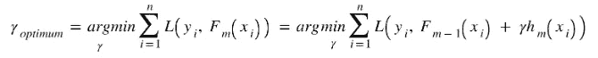

# 揭开梯度推进数学的神秘面纱

> 原文：<https://towardsdatascience.com/demystifying-maths-of-gradient-boosting-bd5715e82b7c?source=collection_archive---------4----------------------->

## 本文讨论了梯度推进算法数学背后的概念

# 介绍

Boosting 是一种集成学习技术。从概念上讲，这些技术包括: **1。学习基础学习者；2.使用所有模型得出最终预测**。集成学习技术有不同的类型，并且在它们如何为基础学习者实现学习过程，然后使用它们的输出给出最终结果方面都彼此不同。集成学习中使用的技术是自举聚合(也称为 Bagging)、Boosting、级联模型和堆叠集成模型。在本文中，我们将简要讨论 Bagging，然后继续讨论梯度推进，这是本文的重点。有很多资料解释了梯度推进算法中的步骤。但是，如果你试图找到一个来源，解释每一步真正做了什么，使整个算法工作，你可能会找到使用*平方误差*作为例子这样做的文章。这些解释非常好，但问题是它们太关注平方误差，以至于几乎无法传达一个*概括的*理念。梯度增强是一种通用模型，适用于任何可微分的损失函数，然而，仅看到它适用于*平方损失模型*并不能完全解释它在学习过程中的作用。在本文中，我打算通过一种更通用的方法来解释这个算法。

> **注:**基础模型在文献中也被称为基础学习者。他们是同一个人。然而，我用术语“基础学习者”来表示基础模型，用“模型”来表示由基础学习者构成的函数。

# 制袋材料

装袋是两个后续步骤的结合:

I .数据集的自举采样，分成 *M 个*子集。这些 *M 个*子集中的每一个然后被用于学习模型。这些模型被称为基础学习者/模型。

二。以多数票宣布最终预测值。

由于在 bagging 中，数据集的子集用于训练基础模型，每个基础学习者都可能过度适应(由于每个模型可学习的例子较少，它们可能不能很好地概括)。采用多数投票给出了一个模型，其方差是所有基础学习者方差的平均值(图 1)。

Fig. 1\. Blue curve rerpesents the variance of the final model, all other curves are variances of the base learners (source: [https://www.quora.com/What-does-Bagging-reduces-the-variance-while-retaining-the-bias-mean](https://www.quora.com/What-does-Bagging-reduces-the-variance-while-retaining-the-bias-mean))

Boosting 与 Bagging 在训练基础学习者并利用他们给出最终结果的方法上有很大不同。Bagging 从独立引导的数据子集学习基础学习器，因此我们可以在并行环境中同时训练所有的基础学习器。另一方面，Boosting 按顺序训练基础学习者——一个接一个地训练模型。因此，并行培训基础学习者是不可能的。此外，在 Boosting 算法中，我们从高偏置模型开始。实际模型首先用常数值初始化。然后，通过添加基础学习者来逐渐减少偏差。我们将看到梯度推进是如何学习最终模型的，该模型在给定适当数量的基础学习者的情况下具有低得多的偏差。

# 梯度推进

## **加法建模的思想:**

加法建模是 Boosting 算法的基础。这个想法很简单——通过将一些简单的项相加形成一个复杂的函数。在梯度推进中，一些简单的模型被加在一起以给出一个复杂的最终模型。正如我们将看到的，梯度推进通过对适当数量的基础学习器进行加权求和来学习模型。

## **梯度推进算法**

Source: [https://en.wikipedia.org/wiki/Gradient_boosting](https://en.wikipedia.org/wiki/Gradient_boosting)

## **伪残差**

在算法中，步骤 2(1)提到了计算“伪残差”。虽然几乎没有任何具体的伪剩余的概念定义，但是在数学上你如何定义它。不过，我感觉这个名字有点借用了差 *(y_actual - y_predicted)* 的意思，也就是通常所说的*残差*，它是我们以为例，通过对*的预测值***【x _ I】***对平方损失函数 ***L*** w.r.t 进行求导得到的。*

Fig.2\. Negative of Derivative of squared loss w.r.t. hypothesis function gives the residual for ith example

在优化问题中，附加到目标函数的常数不会影响最优点，所以如图 2 所示的*‘2’*的因子实际上并不重要，可以安全地去掉(仅当我们求解优化时)。可能没有损失函数微分给出残差，然而，在平方损失的情况下，其微分给出最接近*残差“视觉上”*的函数。可能这个名字就是借用了这个。尽管如此，*梯度提升与损失函数 w.r.t .假设的导数等于残差无关。*

## **算法如何工作**

我们可能已经想到了梯度推进中的一件事——对损失函数和假设函数求导。不用说，损失函数必须相对于假设函数是可微的。正如算法所说，梯度提升将训练集和损失函数作为输入。我们用 ***F_M(x)*** 来表示在算法结束时我们将得到的最终模型。

> **符号**

算法中使用的一些符号取自维基百科(见上文)，有些不一致。所以，我会用我自己的符号来表示这些变量。

*F_M(x)* :通过对 *M* 个基础学习器进行加权求和而学习的最终模型(加法建模)。

*F_m(x)* :将 *m (=1，2，…，m)* 基学习器和 *F_M(x)* 初始常数值相加得到的模型。

> **第一步。**用常数值初始化模型。

我们找到一个常数模型 *F_0 = γ* 来拟合实际的 y 值。为什么是常数模型？这就是助推的想法开始体现的地方——从高偏差到低偏差模型。我们从一个常数函数开始(没有其他函数比常数函数有更大的偏差，除非数据集非常枯燥，甚至常数模型也适合它)，然后通过许多步骤找到一个偏差相当低的函数。在一些文本中，你可能会发现用 *0* (零)来初始化模型。这也是一个常量函数，但是我们很可能从一个稍微好一点的选项开始。假设初始模型是一个常数函数 *γ。*常量函数的损失函数如下:

因此， *γ_optimal* 通过求解以下优化问题来确定:

这肯定比用零初始化的模型好。尤其对于平方损失误差， *F_0(x)* 等于实际 *y 值*的平均值，即 *F_0(x) = y_mean* 当使用平方损失*时。*

通常在文本中，该模型不被算作基础学习者之一，尽管最终模型将是从基础学习者获得的*加性模型*，并且该模型也将是加数之一。但是有一个不同之处——在文献中被称为基础学习器的所有模型都适合伪残差，而不是实际数据集的 *y 值*(我们将在步骤 2 中看到如何实现)。由于 *F_0(x)* 拟合在 *y 值*上，可能这就是为什么它在文献中不被认为是基础学习器之一。

此时 ***F_M(x) = F_0(x)。然而，*** *F_M(x)，*会被更新，直到所有的 *M* 基础学习者都以合适的权重被添加到其中。

> **步骤 2:** 从 m = 1 到 m=M，每个基础学习者都要遵循该步骤。注意，梯度推进一次添加一个模型，一个接一个。

在执行之前，必须用超参数 *M(基础学习者数量)*的合适值配置梯度增强算法。

> 第 2.1 步。计算伪残差:

使用训练示例为每个*计算伪残差:*

注意 *F_m-1(x)* 是将 *m-1* 加权基学习器和初始常数函数相加得到的模型。第*个基础学习者*还没有添加。与当前基学习器 *m* (其**将在步骤 2.2 中被**训练和添加)相对应的*与*训练示例的每个残差计算 *r_im* 是对从 *1 到 m-1* **的基学习器和初始常数函数**的加权和进行的(步骤 1)。回想一下，在步骤 1 之后， *F_0(x) =* γ不包括对应于任何基础学习器的任何项(回想一下， *F_0(x)* 在文献中最常不被称为基础学习器。它仅被视为模型的初始值)。

此时，我们已经计算了每个训练示例的伪残差值。

> 步骤 2.2。在伪残差上拟合**基础学习器**

对于这一步，从给定的数据集导出一个新的数据集。数据集 *D_modified* 的定义如图 3 所示。

Fig. 3\. Modified dataset

一个基础学习器 *h_m(x)* 在这个数据集上被训练和拟合。

至此，我们已经具备了确定 *F_m(x)* 所需的一切。我们是这样做的:

**为什么这么做有意义？**

如果我们将它与在*梯度下降*(图 4) *中完成的重量增加进行比较，就很容易明白为什么这个等式是有意义的。*梯度下降中的重量向损耗 *L* 减少的方向移动。应该移动多少权重由α(学习速率)决定。类似地，函数 *h_m(x)* 拟合到损耗变化率*L*w . r . t .*F _ m-1(x)*。函数 *h_m(x)* (期望适当地近似损失 w.r.t. *F_m-1(x)* 的导数的行为)代表*损失函数*减少 w.r.t. *F_m-1(x)* 的方向。γ对应于效用方面的超参数α(两者都决定了应该进行的更新量)。这类似于梯度下降中的权重更新方程，除了γ是可训练的，而α是超参数。我们将在步骤 2.3 中看到γ的最佳值是如何获得的。

Fig. 4\. Weight updation in Gradient Descent

注意，γ是唯一需要在原始数据集上优化的参数 w . r . t .*F _ m(x)*。然而，基础学习者在数据集 *D_modified* 上学习更多的参数，因为它们是实际的函数，它们被加在一起以给出最终的模型。

此时，我们有一个模型 *F_m(x)* ，它将在下一步中用于计算 *y_pred* 值。

> 第 2.3 步。找到最佳γ

我们将获取原始数据集 *D* (图 5) *。*

Fig. 5\. Original dataset

我们对原始数据集 *D，*采用模型 *F_m(x)* ，然后计算损失*l。*注意，该损失是 *γ的函数。*

我们应该找到 *γ_optimum* 。这可以通过解决以下优化问题来实现，该优化问题使:

此时我们有了 *γ的最佳值。*

> 第 2.4 步。模型更新

因此，模型 *F_m(x)* 被获得为:

在每次迭代数 *m 结束时，F_M(x)* 被更新为 *F_m(x)* 的值。

**步骤三。**对每个基本型号 *m = 1 到 M* 运行步骤 2。在步骤 2 的 *M* 次迭代之后，我们得到最终的模型 *F_M(x)。*

# 为什么叫“梯度推进”？

我们刚刚看到了“梯度”在这个算法中的作用——我们总是让一个基础学习者适应损失函数 w.r.t .的梯度，模型 *F_m-1(x)* 。术语“提升”指的是这样一个事实，即一个在数据集上表现非常差的高偏差模型被提升，最终成为一个合理的分类器，并且可能是一个强分类器。一般来说，Boosting 是一个算法家族，其中多个*【弱分类器】*(错误率低于 0.5 的一个)基本学习器被组合起来以给出一个强分类器(错误率接近 0 的一个)。在梯度提升中，我们从常数模型开始(根据数据集，它可能是一个非常弱的分类器)。在学习一个基础学习器的第 *m 次*迭代结束时，我们得到一个弱学习器，但相对来说是一个更好的分类器 *F_m(x)* ，它逐渐向强分类器发展。

# 脚注

希望这篇文章有意义。我的目标不仅仅是写下一个算法，我打算揭开数学的神秘面纱(如标题所示),揭示数学方程之外的东西。因此，如果我没能在任何地方传达数学背后的概念，请发表评论，这将是非常值得的。

感谢您的阅读！