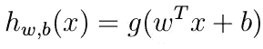
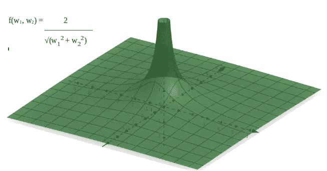

# 揭开 SVM 数学的神秘面纱——第一部分

> 原文：<https://towardsdatascience.com/demystifying-maths-of-svm-13ccfe00091e?source=collection_archive---------5----------------------->

## 推导线性可分数据集的支持向量机优化目标，并对每一步进行详细论述

因此，进入 SVM 的第三天，就完成工作而言，我 40%沮丧，30%焦躁不安，20%恼怒，100%效率低下。我被支持向量机的数学部分卡住了。我浏览了许多 YouTube 视频、许多文档、PPT 和 pdf 格式的课堂笔记，但所有的东西对我来说都太模糊了。在所有这些讲座中，我发现吴恩达的斯坦福讲座最有用。虽然他在表达他想要表达的一切的能力上有点不足，但他的笔记和推导非常流畅。无论我要讨论什么，50%的灵感来自吴恩达的讲座和他的笔记，20%的灵感来自我正在学习的一门 ML 课程，29%的灵感来自其他所有东西，剩下的 1%来自我为建立这个基础而做的一点点工作。最后，事实证明，理解 SVM 是如何出现的一点也不困难，因为它只需要高中坐标和向量几何。在很大程度上，我发现很难找到合适的点来制作合理的地图。在这篇文章中，我试图把我通过粘贴不同来源的想法得出的数学推导和思维过程放在一起。

# 让我们开始吧…

Fig 1\. Diagrammatic representation of SVM for linearly separable dataset (Source: [https://www.researchgate.net/figure/Classification-of-data-by-support-vector-machine-SVM_fig8_304611323](https://www.researchgate.net/figure/Classification-of-data-by-support-vector-machine-SVM_fig8_304611323))

如果你在一个高的概念层次上了解 SVM(最优边际分类器的东西)，这个图看起来并不太令人担忧。尽管线性可分数据集的情况在现实生活中并不常见，但本文中关于 SVM 的讨论仅针对这种情况。我可能会为一个更普遍的 SVM 版本写一个单独的帖子。

> **SVM 假说**

假设，w.r.t .一个机器学习模型就是模型本身，它无非就是我们的分类器(它，是一个函数)。

g(z) = 1 if z ≥ 0, -1 otherwise

> **班级标签**

在 SVM，类别标签表示为-1 表示负类别，而+1 表示正类别。

我们将在本文末尾得出的最终优化问题，以及 SVM 为拟合最佳参数而解决的问题是:

Optimization problem that the SVM algorithm solves

这是一个*凸优化*问题，有一个*凸优化目标函数*和一组将*凸集*定义为*可行域的约束。*凸函数看起来像一个倒置的碗。凸集是一组点，其中连接任意两点的直线完全位于该集合内。我很想更详细地谈论这些，但如果谷歌一下斜体的术语会更方便。

在深入实际部分之前，我们应该熟悉两个术语- *功能余量和几何余量*。

## 功能余量和几何余量

下面是我们将如何在整篇文章中标注出区分正面和反面例子的超平面:

Equation of separating hyperplane; w is the normal to the hyperplane

每个训练示例表示为 *x* ，上标( *i)* 表示第**I个训练示例。在以下部分中，标有(I)的 *y* 表示对应于第 ***i*** *个训练示例的标签。***

> 超平面 的功能余量**w . r . t .**I .***第四个例子*是*定义*为:**

Functional margin of a hyperplane w.r.t. ith example (denoting as gamma-hat superscripted with (i))

超平面 w.r.t .的功能余量 ***整个数据集定义为:***

Functional margin of a hyperplane w.r.t. the entire dataset

> 超平面 w.r.t. **i** 的几何裕度**定义为由范数( **w** )归一化的函数裕度:**

Geometric margin w.r.t. ith training example (denoted as gamma superscripted with (i)).

超平面的几何余量。整个数据集定义为:

Geometric margin of hyperplane w.r.t. the entire dataset

> **注**:在下面的讨论中，如果没有具体说明超平面的函数/几何余量是相对于整个数据集还是某个例子提及的，那么应该假设它是指整个数据集，而不是单个例子。

## 简要介绍 SVM 算法如何工作，它想要实现什么(从概念上解释 SVM)

为了确保我们在同一页上，让我们讨论 SVM 是如何工作的。我遇到过对 SVM(或者更准确地说，SVM 想要实现的目标)的两种解释。下面引用的两种解释只是表达同一事物的不同方式，我们将在推导优化目标时看到。

首先，

> SVM 通过学习合适的决策边界/决策表面/分离超平面来最大化余量(如图 1 所示)。

第二，

> SVM 通过学习合适的决策边界/决策表面/分离超平面来最大化几何余量(如已经定义的，并且在下面的图 2 中示出)。

Fig. 2\. A is ith training example, AB is the geometric margin of hyperplane w.r.t. A

我推导优化目标的方法是从使用功能和几何余量的概念开始的；在建立了 SVM 的两种解释共存之后，导出了最终的优化目标。

## 推导过程

如前所述，我们将从功能和几何边缘解释开始，然后建立 SVM 的两种解释共存。

> 我们可以反过来吗？

我试着这样做，但是从第一个解释开始并不是更好的方法。一旦我们得到了最优化目标的公式，我们将讨论为什么它不能很好地工作。

正如已经讨论过的，SVM 的目标是最大化几何余量，并返回相应的超平面。它的意思是，在所有可能的超平面中(每个超平面都有一个相对于它最近的点的几何裕度，它是相对于所有其他点定义的所有其他几何裕度中最小的)，SVM 选择那个具有最大几何裕度的超平面。在图 3 中，红色超平面是最佳分离超平面。

Fig. 3\. Which hyperplane is the best? — the one in red

这在数学上可以写成:

Initial optimization problem

显然，目标函数是超平面的几何余量( ***w*** *，b)* 。约束表示目标函数是超平面*(****w****，b)* w.r.t .的几何余量集合的最小值。

我们可以观察到，几何裕度的公式确保了对于最优超平面，所有几何裕度中最小的值(根据所有示例计算)由至少一对示例共享(一对来自+ve 类，另一对来自-ve 类)。这些点被称为 ***支持向量*** (图- 1)。

因此，上面定义的优化问题等价于最大化*裕度*值(不是几何/功能裕度值)的问题。边距定义为两个超平面之间的距离，每个超平面平行于分离超平面，并通过每类的支持向量(即一个超平面通过+ve 类的支持向量，而另一个超平面通过-ve 类的支持向量，并且两个超平面都平行于分离超平面)。

> 因此，在这一点上，我们可以确定，对 SVM 的两种解释实际上是共存的，尽管我们是从第二种解释开始得出这个结论的。最后，我将讨论，当反过来时，我们在表述中有一些冗余，因此，开始时对问题的概念不太清晰。

让我们将各自的超平面表示为:

Hyperplane passing through positive support vectors

Hyperplane passing through negative support vectors

因此，优化问题可以用下面的目标函数来重新表述:

Reformulated optimization objective (i)

Reformulated optimization objective (ii)

到目前为止，这种简化仅仅是在书写更小的符号和更小的表达式方面。与我们开始的地方相比，我们没有减少任何要做的计算(实际上，最好自己验证一下)。

> 在开发 SVM 优化问题的最终形式的下一步中，将被执行的想法似乎不像 ideate 那样简单。

从本文开始我们就一直在做向量几何。事实证明，SVM 实际上是几何动机算法的核心。为进一步简化目标函数所做的工作并不难应用或理解，但是在你可能对一个表达式做的许多操作中，把注意力集中在下面的想法上并不容易。

> 在这里…

关于超平面的方程的一件事是，缩放它不会改变超平面。它给出了一个新的等式*(****w’****，b’)*，其中***w’****= k .****w****和 b’= k . b*(*k*是比例因子)但是超平面在空间上保持不变，因此几何余量也不变(但是功能余量会变)利用这个因素，我们可以做的是在我们的优化目标函数 ***中缩放 ***w*** 和 *b* ，使得功能裕度变为 1。***

这使得我们的优化问题为:

w and b have been scaled such that functional margin has become 1

从真正的意义上来说，这通过减少要执行的计算数量而减少了优化问题！

> 我们已经完成了几乎整个推导过程，我们刚刚看到的最后一部分是最关键的一部分。

然而，这种提法有一个问题。目标函数是非凸函数，最好避免使用(图 4)。

Fig 4\. Geometic margin of hyperplane w = (w1, w2), b = 1; x(i) = (1, 1) (Plotter used: [https://www.geogebra.org/](https://www.geogebra.org/))

由于我们应用梯度下降来优化函数，非凸函数可能会导致算法陷入局部最小值。但结果是，对目标函数的乘法逆中的*范数(****w****)*求平方给出了一个凸的、可微的函数(目标函数的逆也是凸的，但在 ***w = 0*** 处不可微，可以使用在线绘图工具来验证这一点)。我们可以将此作为我们的目标函数，现在优化问题有了一点修改:

Making the objective function convex; this is also the final optimization problem of SVM

事实上，这是最终的目标函数，它也是完全凸的(图 5)！我们喜欢凸优化问题。

Fig. 5\. The final objective function is perfectly convex (Plotter used: [https://www.geogebra.org](https://www.geogebra.org))

注意，最大化函数 *f* 与最小化函数 *g = 1/f* 是相同的。这就是为什么优化问题现在是一个最小化问题，而不是像以前那样是一个最大化问题。

> 最终的结果令人满意。

还有几点需要总结:

1.  我们从优化几何余量的问题开始，而不是功能余量。这是因为通过简单地缩放*和 *b* 可以容易地增加(或减少)功能余量。回想一下，这样做不会改变超平面。因此，这要么不会收敛到最佳分离超平面，要么会有太多的迭代，这基本上是无用的。有人可能会说，限制 ***w*** 的大小可能有助于解决这个问题。但是这根本不是一个好主意，因为| |***w***| | =*c*(*c*是某个常数)是非凸约束(因为可行集是超球面的表面)，使得优化问题是非凸的。我们总是想避开非凸优化问题。*
2.  *我们从第二种解释开始，然后确立了两种解释并存。但是我们从第二种解释中推断出第一种解释。事实证明，从第一种解释开始可能不太方便，因为那样的话，我们将从两个平行的超平面开始，最初由一些*| b1-b2 |/|*|***w****|*分开，其中 B1 和 B2 是它们各自方程的初始常数。不难看出，即使改变它们的 ***w*** (将超平面旋转相同的角度)，两个超平面之间的距离也可能根本不变。约束可行性区域对于这种情况也很重要，因为学习最大距离处的超平面可能仅仅意味着学习尽可能远的那些超平面。那不符合目的。因此，约束优化问题类似于:“最大化距离 s.t .所有 ve 点在-ve 超平面的一侧，所有+ve 点在+ve 超平面的一侧”。我们可以为此使用泛函余量，但是我们可以观察到所有的+ve 点都在+ve 和-ve 超平面的同一侧，对于-ve 点也是如此。所以用两个超平面有点多余。此外，如果没有泛函和几何裕度的定义(它们是参照分离超平面定义的),要导出我们刚刚得到的结果即使不是不可能，也是不容易的。*

## *脚注*

*希望我已经用正确的数学写了一些有意义的东西。我使用了在 YouTube 上可以找到的吴恩达的课堂笔记和他的 T2 系列讲座(都来自斯坦福大学的离线课堂笔记，而不是 Coursera)，我正在进行的一个付费课程的一些想法和对 stackoverflow.com 的一些访问，然后将它们汇编成这个。希望你喜欢。*

*另外，请原谅我的笔迹。如果这些图片上写的不清楚，请告诉我。我将用新的图片代替它们。*

*感谢您的阅读。*

# *更新*

*我还写了一篇文章推导软利润 SVM。你可以在这里找到。谢谢你。*