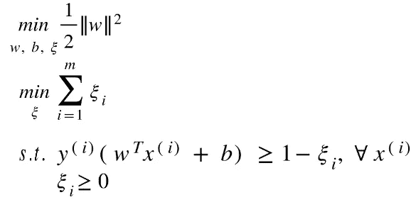

# 揭开 SVM 数学的神秘面纱——第二部分

> 原文：<https://towardsdatascience.com/demystifying-maths-of-svm-part-2-30308a73e072?source=collection_archive---------11----------------------->

## 本文讨论了为什么松弛变量被引入 SVM 的优化目标

在沿着一条相当平坦的曲线划动 K-NN、朴素贝叶斯分类器、逻辑回归和线性回归之后，SVM 来了，并对它施加了一个急剧的下降。在推导了线性可分数据集的 SVM 优化目标之后(我在我的[上一篇文章](/demystifying-maths-of-svm-13ccfe00091e)中详细描述了这一推导过程，这是本迷你系列的第 1 部分)，下一个停顿是“松弛的”SVM。在本文中，我们将一步一步地推导，并详细讨论每一步。

> **注**:本文是我上一篇文章——[揭秘 SVM 数学](/demystifying-maths-of-svm-13ccfe00091e)的续篇。重复作为线性分类和非线性分类数据集的基础的所有术语和概念是多余的，因为在本文的第一部分已经探讨过了。所以，我建议，如果有些话题或术语感觉不熟悉，也看看那篇文章。

# 让我们开始吧…

> **SVM 假说**

假设，w.r.t .一个机器学习模型，就是模型本身，就是我们想要机器学习的分类器(它，是一个函数)。

g(z) = 1 if z ≥ 0, -1 otherwise

> **分类标签**

在 SVM，等级标签被表示为-1 表示负等级,+1 表示正等级。

> **优化问题**

我们将在本文末尾最终得出的最优化问题，以及 SVM 为拟合最佳函数所解决的问题是:

Expression 1: Optimization problem for SVM for dataset which is not linearly separable

> **符号:**

1.  *(****w****，b)* 一起表示一个超平面- ***w*** 是该超平面的法线向量，*b =****w**_ T * x0(w _ T 是转置(w))* 其中**
2.  **C* 是常数。 *ξ_i* (希腊符号称为 *Xi，下标*为 *i* )被用来放宽条件。文章围绕这两个术语展开。*
3.  **x(i)* (x *上标*带(I))是第 *i* 个训练例。在整篇文章中，我们使用 *m* 来表示训练集中的样本数量。*

*作为参考，以下是线性可分数据集的 SVM 优化问题:*

**

*Expression 2: SVM optimization objective when dataset is linearly separable*

> ***希望读者熟悉的术语:***

*   ***功能余量***

**

*Functional margin of a hyperplane w.r.t. ith example (denoting as gamma-hat superscripted with (i))*

**

*Functional margin of a hyperplane w.r.t. the entire dataset*

*   ***几何余量***

**

*Geometric margin w.r.t. ith training example (denoted as gamma superscripted with (i))*

**

*Geometric margin of hyperplane w.r.t. the entire dataset*

*请访问我的[上一篇文章](/demystifying-maths-of-svm-13ccfe00091e)，对这些术语有一个更好的了解。*

## *简述 SVM 算法如何工作，它的目标是什么(从概念上解释 SVM)*

*为了确保我们在同一页上，让我们讨论 SVM 是如何工作的。SVM 有两种解读方式:*

*首先，*

> *SVM 通过学习合适的决策边界/决策表面/分离超平面来最大化余量(如图 1 所示)。*

*第二，*

> *SVM 通过学习合适的决策边界/决策表面/分离超平面来最大化几何余量(如已经定义的，并且在下面的图 2 中示出)。*

## *SVM 目前的表述够好了吗？*

*在[之前的文章](/demystifying-maths-of-svm-13ccfe00091e)中，我们已经从头开始推导了 SVM 的最优化问题。我们得出了以下表达式:*

**

*Optimization problem that the SVM algorithm solves*

*原来这个优化问题只有在数据集(完全)线性可分的情况下，才能学习到一个*合理的*超平面(图 1)。这是因为约束集定义了一个可行区域，该区域要求超平面具有至少 1 w.r.t .的功能裕度。每个点 ***w*** 和 *b* 的值将被学习，使得功能裕度变为 1。任何具有正功能裕度的超平面的定义域都落在可行区域中，因为 ***w*** 和 *b* 可以简单地缩放以给出功能裕度 1，同时仍然保持超平面不变。但是，只有某些特定的( ***w**** ， *b** )超平面才能在可行域内优化目标函数)。*

**

*Fig. 1\. Dashed lines are the margins to the hyperplane (drawn in solid); dataset is linearly perfectly separable*

*因此，在优化过程中，对于任何示例，都不会考虑具有负功能裕度(图 2)的超平面。负功能裕度仍然是当前优化问题避免的极端事件。除此之外，像图 3 中黄色虚线所示的分离超平面也是不可能的。正如我们所看到的(图 3)，蓝色超平面更靠近红色示例，并且由于数据集中的噪声而远离绿色示例的集合。一个看起来更像黄色的超平面，虽然看起来在形成决策边界方面做得更好，但它不在当前优化问题的可行区域内。*

**

*Fig 2\. The thicker hyperplane in dark blue is learnt on the feasible region, although the thin, grey hyperplane is apparently better*

**

*Fig 3\. In the current setting, SVM may learn a hyperplane like the one shown in blue.*

*由此，我们也可以容易地推导出这样一个事实:点位于超平面本身上的情况也是不可能的。此外，可行域可能是空的，在这种情况下，SVM 完全不能对例子进行分类。图 4 描述了一种情况，其中 SVM 不能用当前设置学习任何分离超平面。*

**

*Fig 4\. No separating hyperplane is possible*

*看起来，目前的 SVM 公式并不可靠，任何自然数据集都可能使它变得无用(因为自然数据集很少是线性可分的)。SVM 的这种配置被称为 ***硬边界 SVM****，表示它有非常严格的约束。**

**在开始下一部分之前，我想重申一个事实，即该名称代表 SVM 在一组*严格*约束下学习决策面的严格性，给出保持*不变的* w.r.t .训练示例。回想一下，约束表示可行区域，其中所有超平面都具有正的函数裕度 w.r.t .所有数据点都强调学习 ***w*** 和 *b* (对于相同的超平面)的缩放值，使得函数裕度为 1。**

# **引入时差**

**为了成为更好的分类器，SVM 必须具有更宽松的约束，使得在可行区域中超平面可以被允许具有小于 1 的功能裕度。为了允许这种情况发生，松弛变量被引入到优化问题的每个约束中:**

****

*****‘ξ’***是 *ξi 的松弛变量向量(ξ* 下标为 *i)* 。我们为数据集中的每个例子定义 *ξi* 。它的每个元素必须至少为零，以真正允许某些点具有小于或等于 1 的功能余量(上述表达式中的第二个不等式)。对于训练数据集中的每个例子，它具有不同的值，因此，超平面对于不同点的功能裕度值可能具有不同的最低要求。这也允许超平面对于一些数据点具有小于 1 w.r.t .的功能裕度。**

**因此，优化问题变成了:**

****

**这意味着，我们现在更有希望得到一个分离超平面，如图 2 中黄色虚线所示。**

> **我们得出的新优化问题表达了我们认为它应该表达的吗？**

**在本文前面的[部分，我们建立了优化函数对应的是几何余量最大化(几何余量最大化本身就是一个非凸优化问题，所以我们系统地将几何余量最大化问题归结为一个等价的凸极小化问题)。因此，优化目标是“在给定的约束条件下最大化几何余量”从约束中，我们可以观察到，由于 *ξi* 可以包含任何非负值，所以它可以取任意大的正值作为例子。这意味着超平面 w.r.t .的函数裕度可以是小于 1 的任何值，甚至是负值。这意味着一个超平面可能做出错误的分类(在本文的](/demystifying-maths-of-svm-13ccfe00091e)[第一部分](/demystifying-maths-of-svm-13ccfe00091e)中，我们讨论了一个负的泛函余量 w.r.t .一个点意味着该点被错误地分类)。因此，超平面可以有任意大的几何余量值，因为它可以自由地被推到任何地方。这并不能保证我们得到一个分离超平面！**

**这样做可能会以某种方式扩大可行域，使我们最终得到一个更坏的分离超平面。**

> ****输入新目标****

**事实证明，我们确实有一个不错的选择。我们为优化问题添加了一个新的目标，如下所示:**

****

# **帕累托最优的观点**

**随着第二个目标的引入，可以注意到的第一件事是，现在优化问题不会以 *ξ* 的任意值结束。解决方案不再像只有一个目标时那么简单。不管我们打算解决优化问题的背景是什么，同一点同时优化两个或多个目标的情况并不经常发生。这样的例子随处可见。例如，对于具有相似规格的汽车，当我们寻求更高的速度时，操控性可能会下降。速度(目标-1)和操纵(目标-2)不太可能在同一点(即同时)达到最佳值。换句话说，如果我们选择一辆速度最高的汽车，那么它很可能在设计(特征)空间的同一点上不具有最佳的操控性。反之亦然(图 5)。在这个例子中，速度和操控性是相关的，如果你增加一个，那么没有任何额外的调整，另一个可能会减少。更一般地，可能没有有意义的关系的两个函数也不可能具有相同的最佳点。**

****

**Fig. 5\. In red is the car with the highest speed (corresponding handling is not the best, it is likely to be the lowest as it is here) and in green is the car with best handling (corresponding speed is not the best, likely to be the worst as it is here).**

**这种类型的多目标优化(MOO)问题并非闻所未闻。帕累托最优的思想[1]被引入正式解决这个问题。帕累托最优定义了帕累托最优点。这些点定义了一个称为帕累托前沿的包络线[2]。发现这些点是为给定的 MOO 问题选择最佳点的最佳候选点。然而，对于一个给定的 MOO 问题，可以有许多 Pareto 解。“哪个最好？”——“没有人是。”。不可能说一点比另一点好。我们可以在图 5 中清楚地看到这一点——如果一个目标达到最优，另一个目标不一定处于最佳值。**

> **因此，这是一个偏好的问题。你想要多高的速度？操控性应该有多好？**

**如果希望有一辆速度为 70 的汽车，那么问题就解决了。(速度，处理)的最佳值是(70，30)(图 5)。没有一个单独的帕累托解是普遍最优的。需要 ***用户偏好*** 从所有可能的帕累托解中挑选一个。**

# **最终配方**

**随着对我们的优化问题引入一个更多的目标，我们进入了与上面讨论的汽车例子相同的情况。回想一下，第一个目标使利润最大化。给定约束条件，边距可以是一个很大的值。然而，这对应于无限地增加 *ξ* ，以便允许无限大和负的功能裕度值。相反，减少 *ξ* 对应于减少的余量(理想情况下，我们希望 *ξ* 是 *ξi 的*的合适向量，以便学习合理的分离超平面)。**

**因此，帕累托最优被用来描述这个多目标优化问题的解决方案。**

> ****SVM 和帕累托最优****

**用于解决 MOO 问题的方法之一是*加权和方法。*该方法允许将用户偏好添加到优化目标中。对于 SVM，我们想知道如何将我们对正确分离更多点的超平面的偏好(较低的 *ξ* 值比较大的 margin 值更可取)或具有较大 margin 的超平面(较大的 margin 值比较低的 *ξ* 值更可取)包括在权重的形式中。**

***表达式 1* 是 SVM 优化问题的最终表述。常数 *c≥0* 用于说明用户偏好，以便从众多帕累托最优解中识别出一个合适的解。如果偏好学习在训练集上进行最合理分离的超平面，则应该使用合适的值 *c* 。相对较大的 *c* 将意味着我们对 *sum_of_ξi* 项引入了更多的偏好，这意味着我们将为它获得一个更优的值，而为 *||w||* 获得一个次优的值。**

> ****权重如何考虑用户偏好，它如何影响最优点？****

*****Part 1*** *:用户偏好如何映射到权重？***

**现在让我们理解权重如何描述对特定目标函数的偏好。为了便于记记，我们将把两个目标函数写成如下所示:**

****

**我们的优化问题是(不写约束，但是它们必须成立)，**

****

**也就是说:**

****

**这个多目标优化问题可以表述为一个单目标优化问题。单目标是单个目标函数的加权和，通常称为*效用函数* [3]:**

****

**Equation — 1**

**权重 *w1* 和 *w2* 总是取正值。在这一点上，仍然不清楚权重如何对应于用户偏好。另外，请注意，用户偏好是相互关联的，并且只对给定的问题有局部意义。**

> **注意*如果优化问题是凸的，并且权重是正的*，那么确保求解加权和函数给出帕累托最优的解【3】。**

**我们可以将用户对目标的偏好表示为一个数学函数。不用说，偏好函数将是 *f1* 和 *f2 的函数。*姑且称之为 *P(f1，f2)* 。**P(f)*的梯度则为:***

****

**Equation — 2**

**等式-2 是偏好函数的总导数(关于总导数的更多信息，我建议你阅读这篇 [stackexchange](https://math.stackexchange.com/questions/174270/what-exactly-is-the-difference-between-a-derivative-and-a-total-derivative) 帖子的第一个答案)。**

**效用函数(等式- 1)的梯度为:**

****

**Equation — 3**

**等式-2 的每个分量代表用户偏好随设计点值变化的变化率(在该值上定义了函数 *f1* 和 *f2* )。**

**比较*方程-2* 和*方程-3* 表明，如果 *w1* 和 *w2* 选择得当，那么效用函数的梯度可以变得与偏好函数的梯度平行。简单地说，效用函数的变化率应该接近用户偏好的变化率。由于偏好是局部显著的，并且是相对的，所以讨论偏好如何改变 w.r.t .设计点是有意义的，而讨论在某种绝对意义上代表偏好的 *w1* 和 *w2* 是无关紧要的(因为偏好本身没有绝对/普遍的定义)。 ***选择合适的权重可以使效用函数的梯度与偏好函数的梯度平行。*****

*****第二部分****——权重如何影响最优分？***

**效用函数 *U* 有一个最优值**

****

**如果其中一个权重，比如说 *w2* ，显著大于 *w1* ，那么 *f1* 的每个偏导数将远大于 *f2* 的偏导数(因为 LHS = RHS)。对于凸函数，这对应于与 *f2* 相比 *f1* 具有更高值的点。类似的论点解释了当 *w1* 远大于 *w2* 时会是什么结果。**

# **结论**

**在 SVM，使用单个常数 *c* 而不是两个权重，因为同样的原因，对超平面的偏好是相对的，并且对于特定问题是局部的。因此， *c* 用于表示一个目标(最大化利润)如何优于另一个目标(最小化*sum _ of _ξI)*。因为一个问题可能不同于所有其他问题，*超调整*需要参数 *c* 以便可以将合适的偏好与优化问题合并，从而为我们的稳健分类器偏好建模。如果 *c* 设置得太高，目标||w|| /2 在计算出的帕累托最优点处也会很高。这对应于具有小余量和小 *ξi 值*的分类器，即，我们可能以硬余量 SVM 结束。因此，如果数据集不是线性可分的，我们可能会得到一个不太理想的超平面——如图 3 所示。**

# **附言**

**我发现很难理解第一个表情。并不是我找不到答案——我在 quora、stackexchange 等平台上看过。每个人都保持着相同的说法" *c* 平衡边距宽度和你想要避免的错误分类数量之间的权衡"。但是仅仅知道这一点似乎还不够。但是在参考了更多的资料和大约 10 篇论文之后，我发现了一个流畅的段落，引出了这个被引用的陈述。我在这里只引用了两篇最相关的论文。在这篇文章中，我试图对我所学到的东西进行流畅的讨论。我希望这篇文章没有从一个概念转到另一个概念。如果在某个地方感觉如此，请在评论区告诉我。我开始写作的目的不仅仅是为了解释一个主题，而是为了一个平稳的旅程——这是我个人喜欢的。**

**感谢您的阅读。期待得到反馈和建议。**

## **参考**

**[1] Bui，L. T .，& Alam，S. (2008 年)。多目标优化导论。在*计算智能中的多目标优化:理论与实践*(第 1–19 页)。IGI 国际。**

**[2][https://www.igi-global.com/dictionary/pareto-front/21878](https://www.igi-global.com/dictionary/pareto-front/21878)**

**[3]r . t . Marler 和 j . s . Arora(2010 年)。多目标优化的加权和方法:新见解。*结构和多学科优化*， *41* (6)，853–862。**