# 揭秘支持向量机

> 原文：<https://towardsdatascience.com/demystifying-support-vector-machines-8453b39f7368?source=collection_archive---------4----------------------->

## SVM 的几何研究

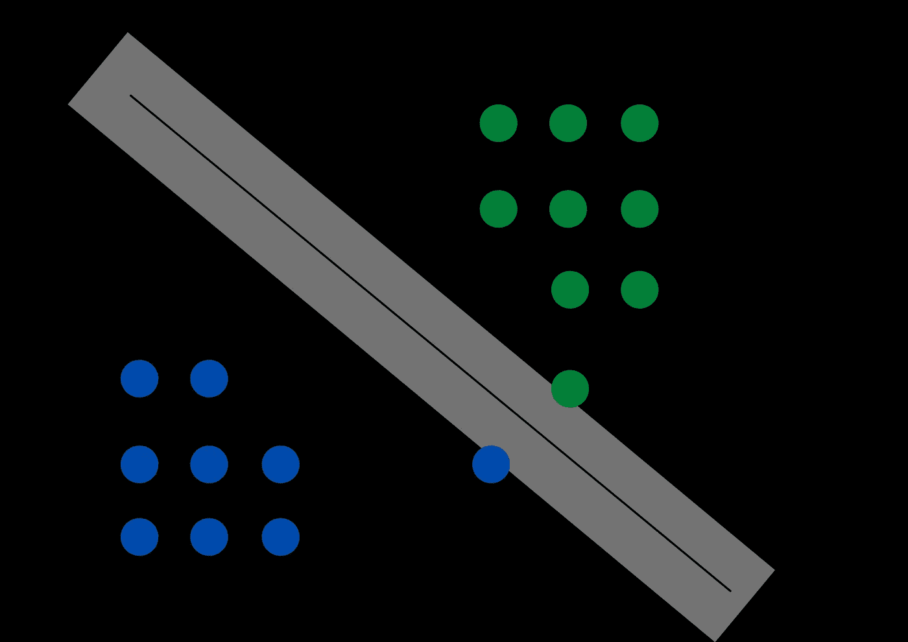

Image by Author

这是我的第二篇**揭秘**系列文章。你可以在这里查看第一篇文章—

[](/demystifying-logistic-regression-ee24c1104d45) [## 揭秘逻辑回归

### 逻辑回归的几何研究

towardsdatascience.com](/demystifying-logistic-regression-ee24c1104d45) 

在本文中，我将重点介绍支持向量机或 SVM。它是最受欢迎的机器学习算法之一，在近十年的时间里(20 世纪 90 年代初至 21 世纪初)，它一直享有第一的地位。然而，它仍然是一个非常基本和重要的算法，你绝对应该拥有它。让我们从 SVM 开始。

我将在本文中涉及的主题如下

*   SVM 简介
*   几何直觉
*   为什么我们对支持向量平面使用+1 和-1
*   损失函数
*   SVM 的双重形式
*   内核及其类型
*   努 SVM

# 支持向量机

支持向量机(SVM)是一种机器学习算法，可用于分类和回归问题。但多用于分类问题。在这个算法中，我们将每个数据项绘制为 n 维空间中的一个点(其中 n 是您拥有的特征的数量)。然后，我们通过找到最能区分这两类的超平面来执行分类。

> 如果你有一个 n 维空间，那么超平面的维数将是 n-1。
> 
> 例如，如果您有一个 2d 空间，那么它将是一条线，如果您有一个 3d 空间，那么它将是一个平面，以此类推。

# 几何直觉

SVM 背后的主要思想是找到一个平面，该平面最好地分开正负点，并且正负平面之间的距离是最大的。

> 选择具有较大裕度的决策边界的基本原理是，它减少了泛化误差，而具有较小裕度的决策边界通常会导致过度拟合。

从上图中你可能已经注意到的另一件重要的事情是**支持向量**基本上是位于正负超平面上的点。

现在，让我们仔细看看我们实际上是如何最大限度地提高利润的。

让我们考虑下面的等式—

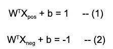

Image by Author

这些只是正负超平面的方程。我只在这个方程中加了 b，这是 y 轴截距。如果你想知道为什么我把正超平面和负超平面的值分别取为+1 和-1，那么就暂时保持这个想法，因为我将在本文的后面详细解释这样做的原因。

减去等式(1)和(2)后，我们得到—

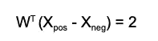

Image by Author

我们可以用向量 w 的长度来归一化这个方程，向量 w 的定义如下

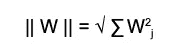

Image by Author

所以我们最后的等式是—

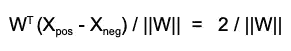

Image by Author

这个方程的左边基本上就是正负超平面之间的距离，实际上就是我们想要最大化的余量。

所以我们在 SVM 的优化函数是—

```
argmax( 2 / ||W||) for all i
such that Yi(W^T * Xi+b) >= 1
```

这里 Yi(W^T * Xi+b) >= 1 意味着这些点是完全线性可分的。所以所有的正点都在平面的正侧，所有的负点都在负侧

这种方法的问题是，在现实生活中，你几乎找不到完全线性分离的数据集。我们采用的方法被称为**硬边际 SVM** ，在现实生活中很少使用。所以为了在现实世界的应用中使用 SVM，一个被修改的版本被创造出来，叫做**软边际 SVM** 。

## 软利润 SVM

让我们首先来看看软利润 SVM 的等式

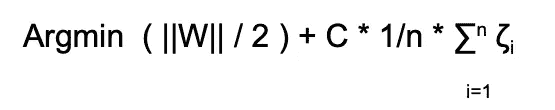

Image by Author

如果你不能理解这个等式，不要太担心，我会解释每一项。您可能对||W||/2 这个术语很熟悉。之前我们想最大化 2/||W||这个词，但是现在我们把它反过来了，所以我们把 argmax 改成了 argmin。

你可能已经猜到了' **n'** 表示数据点的数量。所以这个等式中新增加的两项是—

```
C         = It is a hyperparameter
ζ (Zeta)  = It denotes the distance of misclassified points 
```

## 了解泽塔

为了更好地理解术语 zeta，让我们看下面的例子。

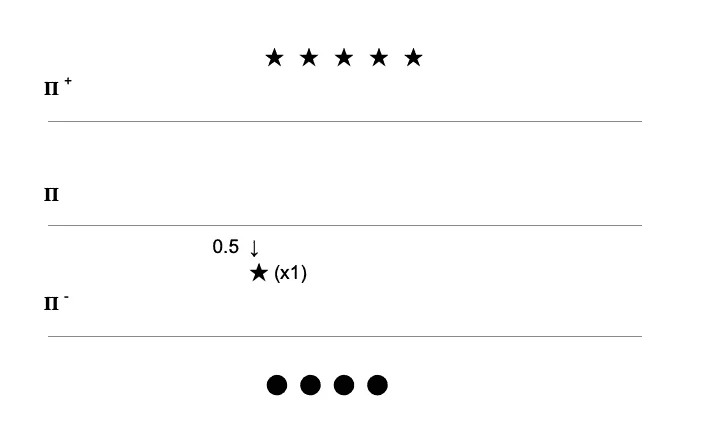

Image by Author

这里,★代表正点，⬤代表负点。

正如我在硬边界 SVM 的例子中所说的，我们很难找到一个完全线性可分的数据集，这里我们有一个点 x1，它是一个正点，但它不在正平面上。

所以在这种特殊情况下，点 x1 和平面𝚷之间的距离是 0.5(朝向负平面)。

```
For point x1 - 
Y(W^T * X + b)  = -0.5
Since class label(Y) is +1 and the distance is -0.5, since it is towards the negative plane
```

我们可以将上面的等式改写如下—

```
Y(W^T * X + b)  = 1 - 1.5  
So in general form we can write it as 
Y(W^T * X + b)  = 1 - ζ
```

> 所以基本上ζ代表的是误分类点离实际平面的距离。可以观察到，x1 到正平面𝚷 +的距离为 1.5，这正是本例中ζ的值。

## 理解 C

正如我上面提到的，C 是一个超参数，它可以被有效地调整，以避免过度拟合和欠拟合。

```
As C increases the tendency of the model to overfit increases
As C decreases the tendency of the model to underfit increases
```

# 为什么我们对支持向量平面使用+1 和-1

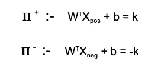

Image by Author

我们没有必要总是选择+1 和-1。所以我们在这里选择 k 的任意值。唯一的限制是它应该大于 0。

> 我们不能为我们的平面选择不同的值，也就是说，我们不能取+k1 和-k2，因为我们希望我们的正平面和负平面离我们的平面𝚷的距离相等

现在我们更新的利润是-

```
2*k / ||W||
for k = 5 we get10/||W||
```

因此，现在我们将使用 10/||W||而不是 2/||W||这是唯一的区别，因为 k 在这里是一个常数，所以我们选择什么值并不重要，因为它不会影响我们的优化问题。

所以我们用+1 和-1 来简化数学计算。

# 损失函数

SVM 使用的损失函数是铰链损失。简而言之，我们可以将铰链损耗理解为一个函数，其值在某个点(比如“z ”)之前不为零，在该点之后等于零。

我们研究了软利润 SVM 的方程式。


Image by Author

这里包含ζ和 C 的第二项是**损失项**。现在我们来看看这个术语是怎么来的。

```
Let Y(W^T * X + b) = Z   -- (i)
// Here we are just substituting the value of Y(W^T * X + b) so that it is more readableSo from (i) we can say that 
If Z > = 1  then the point is correctly classified and
If Z < 1    then the point is misclassified 
```

如果你没有理解上面的替换，那么让我进一步澄清一下。

假设你有 2 个点 x1 和 x2，其中 x1 为正，x2 为负。现在，对于位于负平面上的点 x2 ,( w^t * x+b)的值将为负，其 y 值将为-1。

所以，y*(w^t * x+b)=-1 *(ve 值)= +ve 值

类似地，对于正的点 x1，(W^T * X + b)将是正的，并且它的 y 值也将是正的。所以，y*(w^t * x+b)=+1 *(ve 值)= +ve 值。

现在，如果你有另一个点 x3，它是正的，但是在负平面上，那么(W^T * X + b)将是负的，但是类别标签 y 仍然是正的。

所以，y*(w^t * x+b)=+1 *(ve 值)= -ve 值

所以这里的关键是，Y*(W^T * X + b)只有在点被正确分类的情况下才会是正的，我们刚刚把 Y*(W^T * X + b)替换为 z

现在你对 Z 的概念已经很熟悉了(希望如此)，让我们看看我们的损失函数。

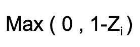

Image by Author

所以我们的损失函数相当简单，如果你不能理解它是如何工作的，那么我将为你分解它。

如前所述-

```
If Z >= 1   then the point is correctly classified and
If Z < 1    then the point is misclassified
```

因此，我们将在这里考虑两种情况。

**案例 1**——(Z≥1)

如果 Z ≥1，则 1-Z 将小于 0，因此 Max(0，1-Z ) = 0

直觉上，如果 Z≥1，则意味着我们已经正确地对该点进行了分类，因此我们的损失为 0。

**案例二** — ( Z < 1)

如果 Z <1 then 1-Z will be greater than 0 so Max(0, 1-Z ) = 1-Z

**最后一步**

我们已经知道-

Y(W^T * X + b) = 1 — ζ(参见**了解泽塔**小节)

所以我们可以改写为-
1 - Y(W^T * X + b) = ζ
而 Y(W^T * X + b) = Z
所以 1-Z = ζ

从上面的例子我们可以看出，我们想要最小化的项是 1-Z。


Equation 1 (Image by Author)

这正是我们在这里所写的。我们只是用ζ代替了 1-Z

# SVM 的双重形式

我们推导出的上面的等式 1 是 SVM 的原始形式。然而，为了利用内核的能力，我们使用双重形式的支持向量机。让我们看看 SVM 的双重形式。

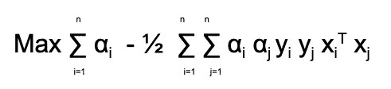

Equation 2 (Image by Author)

使用双重形式的 SVM 的原因是，它允许我们利用内核的力量，这是 SVM 的一个关键特性，如果你不熟悉内核，那么不要太担心，我将在下一节解释内核。但是现在只要理解我们使用 SVM 的双重形式是为了利用内核的力量。

> 从数学上证明了方程 2 等价于方程 1。

关于我们实际上如何得到这种对偶形式的数学证明超出了本文的范围，因为它在数学上有点复杂。如果你想了解背后的数学原理，你可以看看下面的视频

在这个视频中，帕特里克·亨利·温斯顿教授提供了一个出色的数学解释，我强烈建议你看看这个视频，以便更好地理解支持向量机的概念。

> 这里要注意的最重要的一点是，αi 的值只对支持向量是非零的。所以我们基本上只关心支持向量。

我们可以将等式 2 更新如下—

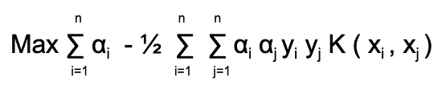

Equation 3 (Image by Author)

之前我们用的是 xi^t Xj，也就是说，我们取 Xi 和 XJ 的点积，相当于余弦相似函数。所以我们可以用 Xi 和 Xj 的其他函数来代替这个余弦相似函数。这就是所谓的内核技巧。现在我们来了解一下内核到底是个什么东西。

# 内核及其类型

在上面的等式 3 中，我们可以用任何核函数代替 K。现在你一定想知道那会改变什么。为什么我们使用哪个函数有关系呢？所以让我们试着回答这些问题。

假设您有一个不可线性分离的数据集。

现在，你如何使用 SVM 来分离这些数据？我们不可能找到一个平面来分开这两类人。

输入内核…

> 核函数的主要用途是允许我们将数据集投影到更高的维度上，在那里我们可以拟合一个平面来分离我们的数据集。

因此，我们可以将上述数据集投影到一个更高的维度上，然后我们可以找到一个平面来分隔这两个类。这正是 SVM 在 90 年代初超受欢迎的原因。

## 内核的类型

两种最受欢迎的内核是—

1.  多项式核
2.  径向基函数(RBF)核

**多项式核—**

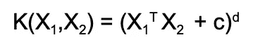

Image by Author

所以对于二次核，我们会得到这样的结果—

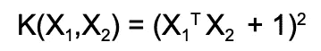

Image by Author

**RBF 核—**

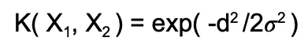

Image by Author

这里 d 是 x1 和 x2 之间的距离，即 d = | | x1-x2 | |𝜎是一个超参数。

# 新 SVM —

nu 是一个超参数，我们可以用它来定义可接受的误差百分比。

```
0 <= nu <= 1  // The value of nu is between 0 and 1Let's understand it with an example.
Suppose nu = 0.01 and N (Number of data points)= 100,000* Percentage of errors <= 1%
* Number of Support Vectors >= 1% of N i.e. 1000
```

所以在 nu 超参数的帮助下，我们可以做两件事

*   我们可以控制模型的误差百分比。
*   我们不能控制，但我们可以确定支持向量的数量。

至此，我们已经到了这篇文章的结尾。非常感谢你的阅读。

如果你愿意，你可以鼓掌。它是免费的。

我的 [LinkedIn](https://www.linkedin.com/in/dhairya-kumar/) ， [Twitter](https://twitter.com/DhairyaKumar16) 和 [Github](https://github.com/Dhairya10)
你可以查看我的[网站](https://alpha-dev.in/)了解更多关于我和我的工作。