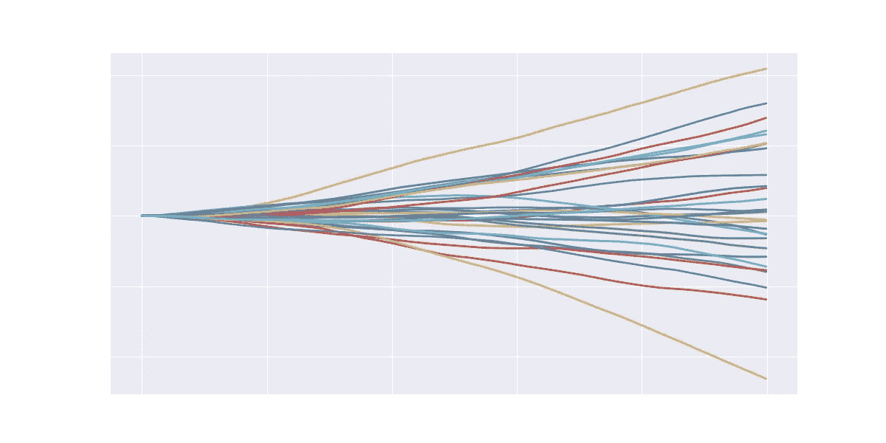

# 揭开张量流时间序列的神秘面纱:局部线性趋势

> 原文：<https://towardsdatascience.com/demystifying-tensorflow-time-series-local-linear-trend-9bec0802b24a?source=collection_archive---------2----------------------->

## [内部 AI](https://medium.com/towards-data-science/inside-ai/home)

## 了解 Tensorflow 如何使用线性动力系统、卡尔曼滤波器和变分推理来模拟时间序列并进行预测

在过去的几年里，大公司匆忙发布他们基于机器学习的时间序列库。比如脸书发布了[先知](https://facebook.github.io/prophet/)，亚马逊发布了[胶子时间序列](https://aws.amazon.com/blogs/opensource/gluon-time-series-open-source-time-series-modeling-toolkit/)，微软发布了[时间序列洞察](https://azure.microsoft.com/en-gb/services/time-series-insights/)，谷歌发布了 [Tensorflow 时间序列](https://medium.com/tensorflow/structural-time-series-modeling-in-tensorflow-probability-344edac24083)。这种流行表明，基于机器学习的时间序列预测需求很高。

本文介绍了 Google 最近发布的 [Tensorflow 时间序列库](https://medium.com/tensorflow/structural-time-series-modeling-in-tensorflow-probability-344edac24083)。这个库使用概率模型来描述时间序列。在我 7 年的算法交易经验中，我已经养成了分析时间序列库内部运作的习惯。因此，我深入研究了这个库的源代码，以了解 Tensorflow 团队对时间序列建模的看法。

这是一次迷人的旅行。Tensorflow 库将时间序列建模为带参数的线性动态系统。为了学习模型参数，它使用了卡尔曼滤波算法和变分推理。

本文将解释我们为什么以及如何使用这些技术，以及它们是如何协同工作的。要阅读这篇文章，你不需要知道动态线性系统，卡尔曼滤波器或变分推理。我会边走边介绍他们。我将向你们展示，这些技术自然会出现，使我们能够学习模型参数。

我们开始吧。

# 一些符号

这篇文章是关于时间序列的，所以会有下标。我使用下划线“_”来引导下标。比如我写 *Y_1* ， *Y_t* ， *Y_t-1* ， *Y_T+1* 的意思是:

当我写 *Y_1:t* 时，我指的是术语的序列(你可以把它理解为术语的数组):

如果一些数学符号在你的手机上显示为问号，请尝试从电脑上阅读这篇文章。这是某些 Unicode 呈现的已知问题。

# 局部线性趋势

局部线性趋势是张量流时间序列中最基本的模型。它有以下定义:

在上面三个方程中，对于每一个时间步长 *t* 、 *slope_t* 、 *level_t* 、 *y_t* 都是随机变量。 *ε_1* 、 *ε_2* 和 *ε_3* 也是随机变量。注意 *slope_t* 、 *level_t* 和 *y_t* 依赖于数量，例如 *slope_t-1* ，在前面的时间步 *t-1* 。但是噪声的分布 *ε_1* 、 *ε_2* 和 *ε_3* 不依赖于时间。

我们有观测值 *Y_1* 、 *Y_2* 直到并包括 *Y_T* ，或者更简洁地说， *Y_1:T* 。为了对这些方程如何生成观测值进行建模，我们使用以下生成性思维:

1.  看第三个等式。想象在时间步 *t* ，观测随机变量 *y_t* 的分布描述了在这个时间步实际观测可以取什么值。而我们实际观察到的 *Y_t* 就是这个分布中的一个样本。
2.  看第二个等式。随机变量 *level_t* 本身是由时间步 *t-1* 的随机变量 *level_t-1* 加上添加了高斯噪声的随机变量 *slope_t-1* 产生的 *ε_2* 。与 *y_t* 不同，对于 *level_t* 我们没有实际观测值，所以它是一个**潜变量**。
3.  看第一个方程。随机变量 *slope_t* 由随机变量 *slope_t-1* 在步骤 *t-1* 产生，带有高斯噪声 *ε_1* 。 *slope_t* 也是一个潜变量。

注意独立的高斯噪声 *ε_1* 、 *ε_2* 和 *ε_3* 具有零均值和标准差 *σ_level* 、 *σ_slope* 和 *σ_obs。*由于这三个量模拟标准偏差，它们只能取正的实数值，用ℝ⁺.表示它们是这个模型的参数。我们不知道他们的价值观；我们需要通过观察来了解它们。

你可能会问，一个局部线性趋势能建模什么样的时间序列？你可以理解为 *level_t = level_t-1 + ε_2* 代表某种趋势水平。这个趋势水平可以以固定的速率变化，由 *ε_2* 控制。使用 *slope_t* 组件，趋势水平可以随时间以不同的速率变化。直观地说， *slope_t* 变量决定了一个新的观察值可以从当前的 *level_t* 改变多少。我想这就是为什么 Tensorflow 的人把它叫做*斜率，*从直线方程中类比 *y=ax+b.* 在直线方程中， *a* 叫做斜率，它决定了 y 在一步中可以改变多少*δx*。

为了获得这个模型的具体感受，我编写了[这个代码](https://gist.github.com/jasonweiyi/f88b8d61fc72785b84d248bd6fa86a47)来从中抽取时间序列。下图显示了 30 个时间序列样本。我通过将所有三种噪声的标准偏差设置为 1 来生成这些曲线。你可以看到一些曲线有明显的上升或下降趋势，而另一些曲线有改变方向的趋势。

如果我将 *ε_1* 的标准偏差改为 0，有效地禁用 *slope_t* 变量，我们会得到完全不同的结果:

正如您所看到的，对模型参数使用不同的值允许您对不同的时间序列进行建模。

现在的问题是，如果我有一个时间序列，比如这个:

这条曲线是特色图片中山脉的天际线(改编自插画师约书亚·琼斯的 [Pixabay](https://pixabay.com/photos/lake-mcdonald-landscape-mountains-1056561/) )。它不是你典型的“时间序列”。但我想找点乐子，看看局部线性趋势模型是如何从一座山到另一座山追踪天际线的。

我应该为这三个标准偏差选择什么值来模拟天际线时间序列？幸运的是，我们不需要手动选择这些值。我们将应用机器学习来计算它们的最优值。使用 Tensorflow 时间序列 API，您将编写类似下面清单 1 的代码:

Listing 1\. Using Tensorflow time series API

在清单 1 中，第 9~11 行为 skyline 训练数据定义了一个局部线性趋势模型。第 13~23 行找到了模型参数的最佳值。第 25~38 行使用优化的模型预测未来值。

上面的代码片段读起来不错，API 也很直观。但是你可能想知道它是如何工作的，以及这些线条背后的数学原理是什么。我也是。这是我的发现。

**局部线性趋势的矩阵形式** 我们先把上面的方程改写成矩阵形式，以简化记法:

*w_t* 是一个二维多元高斯变量。一个组件尺寸用于 *ε_1* ，另一个用于 *ε_2* 。这个多元高斯函数的平均值为 0。它的协方差矩阵是对角的，方差 *ε_1* 和 *ε_2* 在其主对角线上。 *w_t* 均值为 0，因为随机变量 *ε_1* 和 *ε_2* 均值为 0。 *w_t* 的协方差矩阵是对角的，因为 *ε_1* 和 *ε_2* 是独立的。同样，我们可以把 *v_t* 看成一个只有一维的多元高斯变量。再次注意， *w_t* 和 *v_t* 不依赖于前一时间步 *t-1* 的数量，不同于 *level_t、slope_t* 和 *y_t* 。

让我们为不同的矩阵命名:

然后我们得到相同方程的更紧凑的符号:

这两个方程描述了系统如何随时间演化。我们称这个系统为线性动力系统。换句话说，Tensorflow 人所说的局部线性趋势模型，和线性动力系统是一样的。它们是同义词。

在该系统中， *x_t* 被称为时间步 *t* 的状态变量。 *y_t* 称为观测变量。该系统是线性的，因为 *x_t* 和 *y_t* 线性依赖**于 *x_t-1* 。**

上述线性系统是以归纳的方式定义的——它描述了时间步长 t 的量是如何从先前时间步长 *t-1* 的量产生的。

你可能会问，系统从哪里开始(或者这个归纳定义的基础情况是什么)？可以假设系统从任意初始状态开始，比如说 *level_0 = 0* ， *slope_0 = 0。*换句话说， *x_0 = [0，0]，*或者你可以选择 *x_0 =[3，5]。*无所谓。即使你的初始选择相当不正确，经过几步，系统状态也会远离这个错误的初始状态，变得与实际观测值更加一致。如果你还不明白为什么，不要担心，我们以后会回到这个重要的问题上来。

**模型参数** 以上线性动力系统有三个参数 *σ_level* 、 *σ_slope* 和 *σ_obs。*我们称它们为**模型参数**。在我们使用这个模型预测未来的观测值之前，我们需要计算出这些模型参数的值。这叫做**参数学习**。

# 参数学习

Tensorflow 时间序列将局部线性趋势视为贝叶斯模型。在贝叶斯设置中，参数学习意味着在给定观察数据的情况下计算模型参数的后验分布。定义 *Y* 为观测值 *Y_1* 到 *Y_T* 的向量。 *Y* 是长度为 *T* 的向量。定义 *z* 为模型参数的向量 *σ_level，σ_slope，σ_obs* 。 *z* 是长度为 3 的向量。

我们使用 *p(z|y)* 来表示后验密度函数。在这个公式里面， *z* 是我们模型参数的向量。定义 *y* 为第二系统方程中引入的观测变量 *y_1，y_2，…，y_T* 的向量。 *y* 的长度为 *T* 。注意大写字母和小写字母的用法。上部 *Y* 是实际观测值的矢量；而下方的 *y* 是随机观测变量的向量。

在本文中，大写字母 *A，H，Y* 表示常数，小写字母 *x，Y，σ，*表示变量。除了*σ*，我用来表示噪声的协方差，比如*σ_ w，σ_ v*。

后验密度 *p(z|y)* 通过贝叶斯法则计算:

该公式表明，计算后验 *p(z|y)* 需要三条信息:

(1)先验分布 *p(z)* ，我们在看到任何观察值之前对模型参数看起来如何的假设。

(2)可能性 *p(y|z)* ，观察值的概率，如果它们是由我们的模型生成的话。

(3)边际似然，是分母中的积分。该积分将等式的整个右侧换算成积分为 1 的适当概率密度函数。

我们需要计算这三个部分。作为预览:(1)是琐碎的，(2)需要一些工作，(3)是困难的。让我们一步一步来。

## 先验 p(z)

计算先验是微不足道的，因为我们完全控制指定先验。在局部线性趋势模型中，我们**假设**三个模型参数的先验来自[对数正态](https://en.wikipedia.org/wiki/Log-normal_distribution)分布。所以这些模型参数也是随机变量。这些对数正态分布有固定的自变量来决定概率密度的形状。我们不在乎这种形状。使用对数正态分布的主要原因是模拟标准偏差，在ℝ⁺.标准偏差只能取正值

我们还**假设**三个模型参数 *σ_level、σ_slope* 和 *σ_obs* 相互独立。因此，先验概率 p(z) 等于三个独立对数正态概率密度的乘积:

其中*LN(σ_ level；)*代表具有一些固定自变量的对数正态概率密度函数。在批注中*LN(σ_ level；)*， *LN* 是概率密度函数的名字，这里是对数正态。在括号内，分号前， *σ_level* 表示这个概率密度是针对随机变量 *σ_level* 的。在分号之后，我们放入密度函数的参数。对数正态密度有两个参数。这里我们用一个点" "来表示我们不关心那些固定参数的值。

你会注意到最后一条蓝线和它奇怪的解释“API”。这是一种明确显示函数参数的符号。 *λz.p(z)* 表示 *p(z)* 是一个函数(我们这里是一个概率密度函数)，这个函数取单自变量 *z* 。有编程语言背景的人会立刻看出这个符号是λ演算的λ表达式。λ是微积分中定义函数的符号。点等于“≐”符号读“有 API 的”。

λ符号使得函数的参数显式化。随着我们将构建越来越多的函数，簿记函数 API 帮助我们“接口检查”数学。请注意，这种簿记并没有改变数学。如果您不关心函数 API，您可以放心地忽略所有蓝色的线。

我强调，先验的 *p(z)* 是我们的**建模假设**，即模型参数相互独立，并且都来自对数正态分布。我们为他们继续建模提供了最佳猜测，但我们不知道这是否属实。

## 可能性 p(y|z)

可能性是在给定模型参数 *z* 的情况下观察数据 y 的概率。我们将可能性表示如下:

这个公式是所有概率模型的通用模板。我们需要为我们的局部线性趋势模型计算出 *p(y|z)* 的解析形式。让我们通过逆向应用概率论中的[乘积法则](https://en.wikipedia.org/wiki/Chain_rule_(probability))(也叫链式法则)将其改写成乘积形式:

我们可以看到，这个产品中的所有术语都具有相同的结构。让我们来看一个任意的术语:

此概率条件下的符号 *y_1:t-1* 表示 *y_1* 至 *y_t-1* 。我们的目标是写出这一项的解析式。如果我们能做到这一点，我们就能对可能性中的所有项做同样的处理。

为了推导上述表达式的解析形式，我们需要使用来自线性动力系统的两个方程。让我再次展示它的定义:

系统是用归纳的方式定义的，所以我们用一些归纳的思维。

我们来看第一个方程。这个等式告诉我们 *x_t* 是从 *x_t-1* 加高斯噪声 *w_t* 的线性变换。如果 *x_t-1* 是一个高斯随机变量，那么高斯的一个性质告诉我们，一个加了高斯噪声的高斯变量的**线性变换会产生另一个高斯变量**。

所以如果我们**假设**随机变量 *x_t-1|y_1:t-1，z* 是一个均值为 *μ_t-1* ，方差为*σ_ t-1*的高斯随机变量，并且我们知道 *μ_t-1* 和*σ_ t-1*的解析形式(我们将在后面证明这个假设):

那么我们就可以**得出**结论 *x_t | y_1:t-1，z* (请注意下标区别: *x_t-1* 在假设中， *x_t* 在结论中)也是一个高斯随机变量，高斯线性变换的规则也告诉我们其均值和方差的公式:

你可能会问，为什么我们需要在 *y_1:t-1，z 上条件 *x_t* ？*这是因为 *x_t* 可以取什么值取决于我们在时间步长 *t* 之前看到的观察值和模型参数。这是常识。如果前面的观察值是 100，那么 *x_t* 的分布也在 100 左右是有意义的。换句话说， *x_t* 取决于随机变量 *y_1:t* 和 *z* 。

你可能会问，我们怎么知道 *x_t* ，其中 *t=1，2，..，T* ，一开始是高斯变量吗？这很简单:我们可以假设系统从某个固定的初始高斯分布开始，例如，*x _ 0 ~ N(****0****，* ***1*** *)。* ***0*** 是长度为 2 的零向量，因为 *x_t* 是一个二维向量。 ***1*** 是大小为 2x2 *的单位矩阵。注意，这也是我们之前定义的系统的基本情况。然后我们知道 *x_1|y_1，z* 是高斯，还有 *x_2|y_1:2，z* ，…， *x_t|y_1:t，z* 。*

你可能会问，如果 *x_0* 的均值为 0，换句话说， *μ_0=0* ，所有的后件 *x_t|y_1:t-1，z* 的均值都是前面均值的线性变换，那么 *x_t* 的均值会一直为 0 吗 *μ_t=0* ？答案是否定的，因为 *μ_t* 能取什么值取决于实际观测 *Y_1:t* 。我们将在下一部分*卡尔曼滤波器*部分对此进行详细解释。

现在，让我们继续讨论第二个系统方程。既然我们已经表明 *x_t|y_1:t-1，z* 是一个高斯变量，同样根据高斯线性变换的规则， *y_t|y_1:t-1，z* 也是一个高斯变量。将 *x_t|y_1:t-1，z* 的均值和方差代入转换公式，得到 *y_t|y_1:t-1，z* 的概率密度:

这是我们的可能性 *p(y|z)* 中任意项的分析形式。这个公式很长，但是它是如何推导出来的很简单，我们根据线性动力系统的第一个和第二个方程应用高斯线性变换规则两次。

这个多元高斯线性变换规则在机器学习中非常重要，绝对值得你花时间去记住它。它会在很多模型中弹出，比如[高斯过程](/understanding-gaussian-process-the-socratic-way-ba02369d804)，甚至在[最小二乘线性回归](/where-do-confidence-interval-in-linear-regression-come-from-the-case-of-least-square-formulation-78f3d3ac7117)中对不确定性进行推理。

## 卡尔曼滤波器

还有一件事，上述所有推导都假定我们知道下列各项的解析形式:

现在我们需要证明这个假设是正确的。具体来说，我们需要证明我们可以推导出从 *1* 到 *T* 的所有 *t* 的 *x_t|y_1:t，z* 的解析形式。我们将进行归纳证明。别担心，证明很简单。

我们想假设我们知道:

并证明我们可以导出的解析形式:

请注意归纳假设中的下标和证明义务，以意识到我们正试图在下一个时间步中证明一些量，基于前一个时间步的量和新的观察。

这个证明义务意味着我们要找出 *μ_t* 和*σ_ t*的解析形式。不出意外的话，应该是 *μ_t-1* 和*σ_ t-1*的表达式。

让我们开始证明:

基步:我们知道 *p(x_0) = N(* ***0，1*** *)* 。因此 *μ_0* 的解析形式为 ***0*** ，*σ_ 0*为 ***1*** 。

归纳步骤:给定归纳假设:

根据我们线性动力系统中的两个方程和高斯线性变换法则，我们可以推导出:

我用 *μ_a* ，*σ_ aa，μ_b，σ_ bb*命名均值和方差来缩短公式，因为公式会变长。但是不要担心，公式会以一种不经大脑的方式变得更长——它们变得更长是因为我们将它们代入两个多元高斯分布规则。出于本文的目的，您可以放心地接受这些规则。它们是:联合概率密度和多元高斯的条件概率密度。

**规则 1** :利用多元高斯的[联合概率密度规则，我们可以推导出 *x_t* 和 *y_t* 之间的联合概率:](https://people.eecs.berkeley.edu/~jordan/courses/260-spring10/other-readings/chapter13.pdf)

我们可以对多元高斯应用联合概率密度规则，因为 *x_t|y_1:t-1* 和 *y_t|y_1:t-1* 都是多元高斯变量。

在上面的公式中，名称*σ_ ab*和*σ_ ba*(它们是相互转置的)是 *x_t|y_1:t-1，z* 和 *y_t|y_1:t-1，z* 之间的协方差。我们也可以推导出它们的解析形式。例如:

在上面的推导中，为了节省空间，我去掉了条件部分 *y_1:t-1* 。所以请记住上面公式中的 *x_t* 和 *y_t* 的意思是 *x_t|y_1:t-1，y_t|y_1:t-1* 。

第(1)行是 *x_t|y_1:t-1* 和 *y_t|y_1:t-1* 之间协方差的表示法。

线(2)是两个随机变量之间的协方差的定义。

第(3)行用第二个系统方程代替 *y_t|y_1:t_1* 及其均值。

第(4)行重新组织公式中的术语，并使用期望的线性属性将第(3)行中的期望分成两个期望。我们可以认识到第一个期望是 *x_t|y_1:t-1* 的方差的定义。

第(5)行和第(6)行插入*σ_ aa*求 *x_t|y_1:t-1 的方差。*

第(7)行显示噪声的期望值 *v* 为 0，因为 *v* 来自 0 均值高斯分布。

**规则 2** :由于上述联合是二维高斯分布，我们可以使用[多元高斯条件规则](https://people.eecs.berkeley.edu/~jordan/courses/260-spring10/other-readings/chapter13.pdf)写下条件概率:

第一行是条件概率表示。第二行显示其解析形式，即 *μ_t* 和*σ_ t*的公式。它们是由多元高斯条件规则给出的。第三行重新组织了条件中的术语，以安抚您的眼睛。

因此我们证明了我们可以推导出 *x_t|y_1:t，z.* 的概率密度函数的解析形式

证明结束。

我们来考察一下证明中的最后一个公式，对于 *p(x_t|y_1:t，z)* 的那个公式。这个公式告诉我们一些重要的事情。

首先，从上面公式的第二行可以看出， *μ_t* 和*σ_ t*只依赖于随机变量 *y_t* 和模型参数 *z* (因为其中的项，如， *μ_a，σ_ ab*，都是 *y_1:t-1* 和 *z* 的表达式)。换句话说， *μ_t* 和*σ_ t*是 *y_1:t* 和 *z* 的函数。认识到这一点后，让我们再次看看可能性中的任意项:

这个项依赖于 *μ_t-1* 和*σ_ t-1*，所以过渡性地依赖于 *y_1:t-1* 和 *z* 。从 API 的角度来看，这个术语开始是一个带有三个参数的函数， *y_t，y_1:t-1* 和 *z* ，如第 2 行所示。我们有实际观测 *Y_1:t-1* 。在我们将观察值 *Y_t* 和 *Y_1:t-1* 插入到前两个自变量中之后，整个项就变成了一个只将 *z* 作为其单一自变量的函数。这显示在第 3 行。

将此推广到 *p(y|z)* 中的所有项，我们可以看到，当插入观察值 *Y* 时，可能性是一个以 *z* 作为其单一自变量的函数。

其次，让我们了解状态变量 *x_t* 的均值是如何随时间变化的。让我们一起来看看 *μ_t* 的表达式以及 *μ_a* 和 *μ_b* 的定义:

我们可以看到 *μ_a = Aμ_t-1* 是系统认为在看到新的观察值 *Y_T* 之前**的状态。该算法然后使用新的观察值 *Y_T* 来**校正**其关于该量的信念，从而为下一时间步 *t* 产生新的校正后的信念 *μ_t* 。**

这个关于 *μ_t* 的解释也解决了之前的一个问题，问 *μ_t* 如果从 0 开始是否会一直为 0。答案是否定的。现在你明白为什么了。如果实际观测值不为 0，校正公式将快速迫使均值 *μ_t* 远离 0。

这些证明步骤也可以理解为著名的**卡尔曼滤波算法**——一种从以前的状态和新的观测值推导出当前系统状态分布的算法。卡尔曼滤波算法有许多解释。我发现上面的版本从概率的角度来看非常直观。

由于卡尔曼滤波器是如此重要的算法，让我总结一下:对于具有高斯噪声的线性动态系统:

假设我们知道潜在变量 *x_t-1* 在时间步长 *t-1* 的分布。给定一个新的观测值 *y_t* ，卡尔曼滤波算法导出潜在变量 *x_t* 在下一时间步 *t* 的分布。这个过程叫做过滤。其步骤是:

请注意这些步骤中的下标。下标的变化表明算法如何从系统状态 *x_t-1* 开始并导出系统状态 *x_t* 。每一步都优雅地应用了一个变换。

请注意，上述算法中的所有五项都代表概率密度函数。当新的观察可用时，该算法发展状态变量 *x* 的概率密度。前三步告诉你线性动力系统认为下一个系统状态和观测应该是什么。最后两步使用实际观察来更新这种信念。

这是一个美丽的算法！

回到清单 1，第 9~11 行描述了一个局部线性趋势模型。这个模型类有返回先验分布和似然概率的方法。

唷，我们已经写下了先验 *p(z)* 和似然 *p(y|z)* 的解析形式。现在我们来看三者中的最后一个——边际可能性。

## 边际可能性

边际似然是似然和先验乘积的积分。由于 *z* 已经被积分出来，结果是一个以 *y* 作为其单一参数的函数，如第二行所示。将 *Y=Y_1:t* 代入 *y* 后，整个边际似然变成一个常数，显示在第三行。常数用“λ”表示在λ之后和点“.”之前没有任何内容的部分。

不幸的是，积分很难用解析的方法计算。在我们的例子中， *p(y|z)* 是许多高斯密度函数的乘积，每个观测值一个。 *p(z)* 是三个对数正态概率密度函数的乘积，每个函数对应一个模型参数。即使写下他们的描述，我也能感受到其中的复杂性。

由于*很难解析地*计算边际似然，而边际似然是后验*、*的先决条件，我们也无法解析地计算后验 *p(z|y)* 。我们需要在数字上近似后验*。*

*近似后验分布意味着用新的分布代替后验分布。这个新的分布应该类似于真实的后验分布。它应该有简单的解析形式。Tensorflow 时间序列使用变分推理技术来寻找这种新的分布。*

# *近似后验概率的变分推断*

*变分推断用另一个分布 *q(z)* 逼近后验分布 *p(z|y)* ，称为**变分分布**。我们先想想 *q(z)* 应该是什么样子。*

1.  **q(z)* 的结构应该很简单，所以我们可以很容易地用它进行分析。*
2.  **q(z)* 和 *p(z|y)* 在同一组变量 z 上；每个变量取相同的一组值；并且 *q(z)* 作为概率密度函数，应该积分为 1。换句话说， *q(z)* 应该和 *p(z|y)* 有相同的 API。*
3.  **q(z)* 需要尽可能的接近 *p(z|y)* ，所以近似于 *p(z|y)* 。*

## *变分分布 q(z)*

*对于 *q(z)* 我们应该提出什么概率密度函数？Tensorflow 时间序列对 *q(z)* 使用一个[平均场变分族](https://arxiv.org/pdf/1601.00670.pdf)。*

*平均场族是对 *z* 中随机变量之间关系的限制——它假设所有变量彼此独立。这种限制的好处是联合概率密度 *q(z)* 等于个体变量概率密度的乘积。*

*为了完全指定 *q(z)* ，我们还需要选择 *z* 中每个变量的概率密度。为此，Tensorflow 时间序列为 *z* 中的每个随机变量选择高斯分布。在公式中:*

**

*其中*N(σ_ level；第 3 行的μ_l，σ_l* *)* 代表变量 *σ_level* 的高斯概率密度函数，均值 *μ_l* 和标准差 *σ_l.* 同样适用于模型参数 *σ_slope* 和 *σ_obs。**

*第 4 行和第 5 行显示 *q(z)* 有自己的参数 *vp* =[ *μ_l，μ_s，μ_o，σ_l* ， *σ_s，σ_o* ]，一个长度为 6 的向量。这些参数指定了三种独立的高斯分布。我们将这六个参数**称为变分参数**，以区别于我们之前介绍的局部线性趋势模型的参数**模型参数**。*

*第 5 行显示 *q(z)* 以 *z* 和 *vp* 为自变量。*q(z；vp)* ，分号在内，表示变量 *z.* 的一个概率密度，这个密度有参数 *vp* 来控制它的形状。注意，在第 1 行， *q(z)* 也是 *z* 和 *vp* 的函数。这一点从第 1 行到第 5 行没有变化。我们把它写成 *q(z)* 而没有明确提到 *vp* 只是为了强调 *q(z)* 是 *z* 中随机变量的概率密度函数。*

*请注意模型参数 *z* 和变分参数 *vp:* 之间的关系*

1.  **z* 是我们局部线性趋势模型的参数。z 的实际取值决定了我们可以建立什么样的时间序列模型。提醒自己我们在本文开头看到的不同样本时间序列。*
2.  **vp* 是 *z* 的概率密度函数的参数。 *z* 建模为随机变量，变分参数 *vp* 控制 *q(z)* 的形状， *z* 的概率密度函数。*

*回到清单 1，第 14 行构建了变分分布 *q(z)* 。由于 *q(z)* 具有均值场结构，所以 Python 代码中的 *qs* 变量就是一个字典，每个键值对就是一个模型参数及其对应的变分分布。*

*让我们检查一下这个 *q(z)* 是否满足我们的要求: *q(z)* 具有简单的结构和解析形式。此外， *q(z)* 与 *p(z|y)* 具有相同的变量集。然而， *q(z)* 中的变量与 *p(z|y)* 中的变量具有不同的定义域。*

## *随机变量域不匹配的问题*

**q(z* )中的变量来自高斯分布，因此它们具有全实数域，用ℝ.表示*

*后验 *p(z|y)* 变量的定义域怎么样？后 *p(z|y)* 变量的定义域与前 *p(z)* 变量的定义域相同。 *p(z)* 是对数正态密度函数的乘积，其定义域是正数ℝ⁺.*

**q(z)* 中的变量与 *p(z|y)* 中的变量之间存在域不匹配。这种域不匹配违反了上述 *q(z)* 的第二个要求。为了解决这个问题，我们将ℝ⁺域上变量的概率密度函数的后验概率 p(z|y) 转换成ℝ域上变量向量 *u* 的另一个概率密度函数 *p(u|y)* 。*

*你可能会问，我们不知道后验 *p(z|y)* 的解析形式，怎么进行这种变换呢？嗯，我们知道后鼻孔的结构:*

**

*其中 *m* 代表边际可能性的倒数:*

**

**m* 是一个不涉及 *z* 的常数，因为 *z* 已经被积分掉了。当插入观察值 *Y* 时，后验概率就变成了一个以 *z* 为唯一自变量的函数。这是因为它是一个常数和两个函数的乘积，这两个函数都将 *z* 作为它们唯一的自变量。上面的蓝线清楚地显示了这个结构。*

*我们还知道 *p(y|z)* 和 *p(z)* 的解析形式，因此我们可以转换它们的乘积，常数 *m* 只是缩放转换后的结果。*

*你可能还会问，我们为什么不把 q(z) 转换成正实域ℝ⁺上的另一个分布呢？因为这通过给它添加约束使得 *q(z)* 更加复杂。我们想要一个简单的 *q(z)* ，这就是变分推理的要点。*

*我们使用[概率密度变换](https://www.cl.cam.ac.uk/teaching/2003/Probability/prob11.pdf)的技术。*

## *概率密度变换*

*让我们重新陈述一下当前的目标。有时候在一个漫长的过程中，我们很容易忘记我们想要做什么。*

*概括地说，在正ℝ⁺域上，我们有后验 *p(z|y) = m×p(y|z)p(z)* 和变量 *z* 。我们想把它转换成另一个分布*p(u | y)*u 中的每个变量都来自于整个ℝ域。这样，后验密度和变分分布密度在其输入变量上将具有相同的域。*

**u* 会是什么样子？由于 *z* 中的三个变量 *σ_level、σ_slope* 和 *σ_obs* 是独立的，我们可以将它们独立变换。所以让 *u* 包含三个变量 *u_level，u_slope，u_obs* 是有意义的。 *u* 中的每个变量负责 *z* 中相应的变量。*

*概率密度 *p(u|y)* 会是什么样子？我们先来关注一下单变量对*σ_ level*∊ℝ⁺*t29】和 *u_level* ∊ ℝ.我们想把 *σ_level* 写成 *u_level 的函数。*该功能有输入域ℝ和输出范围ℝ⁺.许多函数都可以做到这一点，例如:**

**

*下图显示了绿色的指数函数曲线和红色的平方函数曲线。这两个函数都将一个值从ℝ映射到ℝ⁺.*

**

*两者之间，我们要选择指数函数。这是因为指数函数是单调递增的。所以在 *σ_level* 和 *u_level 之间是一一对应的。*稍后我们将需要这种一对一的映射属性。*

*所以我们决定使用指数作为从 *u* 中的变量到 *z* 中的变量的转换函数:*

**

*这就是[用其他变量的函数代替变量](https://en.wikipedia.org/wiki/Change_of_variables)的教科书案例。现在我们需要弄清楚这个变量替换是如何改变我们的后验概率密度 *p(z|y) = m×p(y|z)p(z)* 。为此，我们来看看概率密度函数的定义，它是一个非负的函数，在变量的定义域上积分为 1。所以我们的后验密度实际上意味着:*

**

*第一行是概率密度函数的定义。第二行明确显示了变量和积分极限。*

*让我们看看最内在的整合:*

**

*在这个积分中，我们希望用指数函数 *exp(u_level)* 替换所有出现的*∑level*。在微积分中，[换元法](https://en.wikipedia.org/wiki/Integration_by_substitution)告诉我们如何去做:*

**

1.  *第一行是原始集成。*
2.  *在第二行，所有与当前积分无关的变量都用点“*”*代替，以简化公式。*
3.  *第三行是至关重要的一步。它应用替换积分规则:(a)在要积分的原始函数中，用变换函数替换所有出现的旧变量。(b)将原始函数乘以变换函数相对于新变量的导数。(c)改变整合的限制。 *log* 函数是我们用作变换函数的指数函数的反函数。我们使用这个反函数将原来的积分极限改为新的极限。这就是为什么我们希望变换函数是单调的，所以它的逆也是一个函数。*
4.  *第四行减少了新的极限和导数。*

*现在我们研究三重积分，得出这个公式:*

**

1.  *第一行通过替换三个变量来执行三次积分。所得积分具有从-∞到+∞的极限。*
2.  *在第二行中，神秘的术语 *|J(u)|* 是由于代换积分规则的应用。||运算符代表矩阵的行列式。而矩阵 *J(u)* 称为雅可比矩阵。对于本文，你只需要知道在我们的例子中 *|J(u)|* 等于 *e* 的 *u_level + u_slope + u_obs* 次方。这是因为应用了代换积分法则。[本文](https://www.cl.cam.ac.uk/teaching/2003/Probability/prob11.pdf)详细解释了雅可比矩阵。*

*第二行的公式是后验概率密度函数的定义。也就是说， *p(u|y) = m p(y|u) p(u* )对于整个实域ℝ.上的变量集 *u**

*从现在开始，我们要用 *p(y|u)p(u)* 而不是 *p(y|z)p(z)* 。然而，为了使事情更简单，让我们将我们的 *z* 重新定义为 *u* 。这意味着从现在开始:*

1.  *用 *σ_level、σ_slope、σ_obs* 来表示 *u_level* 、u *_slope* 和 *u_obs* 。换句话说， *z* 就是 *u* 的意思。*
2.  *用 *p(y|z)p(z)* 来表示 *p(y|u)p(u)* 。*
3.  **q(z)* 保持不变。*

*这样，上面所有的公式保持不变，你只需要记住现在东西在变换域中。*

## *测量两个分布之间的相似性*

*上面列出的对 *q(z)* 的第三个要求是要求 *q(z)* 尽可能接近 *p(z|y)* 。从图形上看，这意味着 *q(z)* 的曲线应该尽可能地与 *p(z|y)* 的曲线重叠。下图展示了这个有趣的想法。我写了[这个代码](https://gist.github.com/jasonweiyi/c5b9b2aaca3aef4279691d480db7a42a)来生成图。*

**

*蓝色曲线代表我们想要计算的后验概率 p(z|y) 。它的形状不规则——注意左边比右边大。当然，我们并不知道 *p(z|y)* 的形状，我只是用一个不规则的形状来传达一个想法，即 *p(z|y)* 是一个复杂的东西。*

*绿色曲线代表我们提出的变分分布 *q(z)* 。我用一个规则的形状来表示 *q(z)* 结构简单。*

**q(z)* 的形状由六个变分参数 *vp* 控制。我们需要调整这六个值，使绿色曲线尽可能与蓝色曲线重叠。*

*记住，最终我们想要知道模型参数 z 的值。为此，我们需要通过找出变分参数 *vp* 的值来确定变分分布 *q(z)* 的形状。我们正在寻找 *vp* 的值，使得 *q(z)* 尽可能与后验 *p(z|y)* 重叠。一旦我们有了 *q(z)* 的形状，我们就可以从中取样以获得 *z* 的实际值。*

*为了量化两个概率密度之间的重叠程度，我们使用[kull back–lei bler 散度](https://en.wikipedia.org/wiki/Kullback%E2%80%93Leibler_divergence)。概率密度 *q(z)* 和概率密度 *p(z|y)* 之间的 KL 散度为:*

**

*KL-divergence 背后的直觉很简单。它是 *z* 域内每一点的两个概率密度之差的加权平均值(用 *q(z)* 加权)。*

*我们想要为 *vp* 找到一个特定值，使得 *q(z)* 最小化到后面的距离 *p(z|y)* 。我们可以用下面的公式来表示这种最小化:*

**

**中的*星*q(z；vp)** 表示 *q(z)* 的最佳值。这意味着我们想要找到这六个变分参数的值，使得 *q(z)* 和 *p(z|y)* 之间的 KL 散度最小。*

*看看变分推理如何将推理问题转化为优化问题！使用贝叶斯规则计算后验概率 p(z|y) 的原始问题通常被称为推理问题。另一方面，最小化 *q(z)* 和 *p(z|y)* 之间的 KL 散度是一个优化问题。KL 散度是优化目标。*

*令人惊讶的是，我们可以最小化 *q(z)* 和 *p(z|y)* 之间的 KL，即使我们不知道如何计算 *p(z|y)* 。*

*秘密在于[变分推理理论](https://arxiv.org/pdf/1601.00670.pdf)。它告诉我们最小化 KL-divergence 等价于**最大化**另一个称为证据下限的公式，表示为 *ELBO(q(z))* 。如果你不熟悉为什么，不要担心。现在，接受这两个优化问题是等价的就足够了。*

**ELBO(q(z))* 定义为:*

**

*从上面第二行可以最好地看出 *ELBO* 背后的直觉。它有两项:一个期望减去另一个期望。我们想最大化减法的结果。*

*第一项是对数似然的期望值。它描述了我们的模型与数据的吻合程度。为什么？因为为了使这一项变大，我们的 *q(z)* 应该在 *p(y|z)* 也变大时，给 *z* 的值以大概率。我们希望这一项很大。*

*第二项是 *q(z)* 和之前的 *p(z)* 之间的 KL 背离(如果你还没有意识到的话)。我们知道一个 [KL 散度是非负的](https://stats.stackexchange.com/questions/335197/why-kl-divergence-is-non-negative)。这个术语描述了我们提出的 *q(z)* 与我们先前的假设 *p(z)* 有多么不同。我们希望差别很小，因为我们假设我们的先验是有意义的。所以我们希望第二项小一些。*

**ELBO* 传达了我们的愿望，即我们的优化模型很好地符合数据，同时它保持接近我们的模型假设，即先验。*

*第五行和第六行显示我们将 *ELBO(q(z))* (一个期望)扩展为一个积分。*

*第 7 行显示了积分内部的函数，开始是一个带有两个参数 *z* 和 *vp* 的函数(插入了观察值 *Y* )。这是因为它所包含的功能要么是 *z* 的功能，要么是 *z* 和 *vp* 的功能。*

*第 8 行显示在将 *z* 积分出来后， *ELBO* 仅仅是变量参数 *vp* 的函数。*

*你可能会问，我们到底为什么需要 *ELBO(q(z))* ？为什么我们不能直接最小化 *KL(q(z)||p(z|y))* ？要回答这个问题，我们需要注意:*

1.  *KL 公式提到了我们无法计算的后验概率 p(z|y) 。*
2.  *但是 *ELBO(q(z))* 公式没有提到后验 *p(z|y)* 。只提到了先验 *p(z)* ，似然 *p(y|z)* 和变分分布 *q(z)* 。我们知道这三个量的解析形式。*

*这就是为什么我们需要 *ELBO* 以及如何最小化 *q(z)* 和 *p(z|y)* 之间的 KL 散度，即使我们不知道 *p(z|y)* 。这个事实一开始挺让人吃惊的。但这是合理的。因为可能性 *p(y|z)* 和先验 *p(z)* 包含了计算后验 *p(z|y)* 所需的所有信息。*

*你可能会问，在*概率密度变换*部分，我们把后验变换成了ℝ域上的一个函数，从那以后，我们就需要使用变换后的后验。但是 *ELBO* 根本不提后路。我们该怎么办？在 *ELBO* 中，我们有 *p(y，z) = p(y|z)p(z)* 。并且变换后的后验概率是 *mp(y|z)p(z)* ，其中 *m* 是常数。所以我们仍然可以将转换后的结果插入 *ELBO* 中。 *m* 是常数；它不会改变优化的解决方案。*

*回到清单 1，第 14 行构建 ELBO 作为优化目标。*

## *梯度下降以最大化 *ELBO(q(z))**

*由于我们知道 *ELBO(q(z))* 的解析形式，我们可以使用[梯度下降](https://en.wikipedia.org/wiki/Gradient_descent)来最大化 *ELBO(q(z))* 关于其参数 *vp* 。其实我们用梯度下降来最小化 *-ELBO(q(z))* 。*

*我们需要计算 *ELBO(q(z))* 相对于变分参数 *vp* 的梯度:*

**

*其中𝛻符号代表向量微分算子。它计算多参数函数相对于其参数的梯度。在我们的例子中，𝛻_ *vp* 计算 *ELBO(q(z))* 相对于 *vp* 中参数向量的梯度。*

*微妙的一点。上式中，积分是针对模型参数 *z=* [ *σ_level，σ_slope，σ_obs* 。但是积分之外的梯度计算是关于变分参数 *vp* =[ *μ_l，μ_s，μ_o，σ_l，σ_s* ， *σ_o* 。所以整合和分化并不相互抵消。*

*由于积分，解析计算 *ELBO(q(z))* 的梯度是困难的。因为积分计算的是期望值，所以我们可以用样本平均值来逼近它。在每个优化步骤中，我们可以从当前的变分分布 *q(z)* 的**中采样一些 *z* 的值。这意味着从电流 *q(z)* 中采样一些值 *σ_level、σ_slope* 和 *σ_obs* 。并使用样本平均值来近似积分。在公式中:***

**

*最后一行使用来自当前 *q(z)* 分布的 *n* 个样本 *Z_1* 到 *Z_n* 来计算样本平均值。我强调，在每个优化步骤，我们需要从当前的**q(z)中抽取新的样本。**这是因为每个优化步骤通过改变变化参数的值来改变 *q(z)* 分布。*

*然而，当我们要应用梯度下降时，上面的公式有一个问题。为了看到这一点，让我们继续操作上面的公式:*

**

*在第 6 行， *ELBO* 公式的 API 是显式的。看第一个学期。插上 *Y* 和 *Z_i* 后， *log(p(Y，Z_i))* 成为常数。这就是为什么我们有一个“λ”引导其 API 的符号。 *𝛻_vp* 算子计算该常数相对于 *vp* 的梯度。渐变为 0。这似乎表明，可能性在优化问题中不起任何作用(因为它消失了)。这说不通。*

*这个问题的原因是，我们从 *q(z)* 中得到哪些样本 *Z_i* 取决于变分参数。我们正在使用梯度下降优化这些变化的参数。但是从 *q(z)* 抽取样本发生在梯度下降算法之外。这使得梯度下降算法失去了关于 *q(z)* 的知识。症状是计算梯度时似然项消失了。*

*重新参数化技巧解决了这个问题。*

## *重新参数化技巧*

*在我们的例子中，由于难以计算积分，采样是不可避免的。但是采样发生在梯度下降框架之外。为了解决这个问题，我们应该从更简单的分布中取样。并且这种分布必须不依赖于变化的参数。*

*重新参数化技巧的思想是，对于 *z* 中的每个模型参数，例如 *σ_level* :*

1.  *引入一个新的随机变量， *θ_level~* N(0，1)。所以 *θ_level* 来自固定的高斯分布。它不依赖于任何变化的参数。我们称 *θ_level 为* **重参数化变量**。*
2.  *将我们的原始模型参数 *σ_level* 重写为这个新变量 *θ_level* 的函数。这个函数也会提到相应的变分参数 *μ_l，σ_l* 。我们把这个函数叫做**重新参数化函数**。*
3.  *在作为积分的 *ELBO* 公式中，用重新参数化函数*替换该模型参数 *σ_level* 的每次出现。**

*在公式中，我们继续以模型参数 *σ_level* 为例:*

**

*我们可以将 *σ_level* 重写为 *θ_level* 的函数，如下所示:*

**

*注意在该函数中， *μ_l* 和 *σ_l* 为变参数。如果你不知道我们是怎么想出这样一个函数的，也没关系。人们一直在研究如何为不同的发行版设计这样的函数，见[这里](http://blog.shakirm.com/2015/10/machine-learning-trick-of-the-day-4-reparameterisation-tricks/)。很多都不是小事！*

*对我们来说重要的是: *σ_level* 仍然是均值 *μ_l* 方差 *σ_l* 的高斯分布。这是因为等式右边的第一项*

**

*是高斯变量 *θ_level~N(0，1)* 的线性变换，没有添加噪声。我们已经知道如何写下它的分布:*

**

*现在重新参数化函数将 *μ_l* 加到这个高斯分布上，得到高斯分布 *N* ( *μ_l，σ_l)。*换句话说，这种重新参数化保持 *σ_level* 的分布不变*。**

*我们定义 *θ=* [ *θ_level* ， *θ_slope* ， *θ_obs* 为重新参数化变量的向量。设重新参数化函数为 *r* 。在我们的 *θ_level* 的例子中:*

**

*这个技巧把 *q(z)* 变成了 *θ* 和 *vp* 的函数:*

**

**ELBO(q(z))* 成为变分参数 *vp* 和新引入的变量向量 *θ* 的函数。我们引入了 *θ* ，因为我们可以独立于变分参数对其进行采样。当 *θ* 替换为样本*θ~ N(****0****，* ***1*** *)时，*ELBO 成为 *vp* 的唯一函数。在公式中:*

**

*哇，这太可怕了。让我解释一下:*

1.  *第一行是 *ELBO* 符号。*
2.  *第二行是 *ELBO* 的原定义。*
3.  *第三行应用替换积分规则，因为我们想在积分中用函数 *r(θ)* 替换出现的 *z* 。之前，我们已经在适应随机变量域的上下文中看到过这个规则。*
4.  *第四行减少了导数，重新组织了项，使概率密度为*N(θ；* ***0*** *，****1****)*弹出。*N(θ；* ***0*** *，****1****)*代表多元高斯的概率密度，为*【3 维】；它有均值 ***0*** 和恒等方差矩阵 ***1*** 。你可能看不出这是如何得出的，我稍后会解释。重要的是要注意，现在我们有了关于 *θ* 的期望的定义。所以我们可以用样本平均值来近似这个期望值。**
5.  **用样本平均值逼近第 4 行的期望值。样本*θ_ 1:N*来自于 *N(* ***0*** *，****1****)*分布。重要的是，这种分布不依赖于变化的参数 *vp* 。**
6.  **第六行显示插入观测值 *Y* 和样本*θ_ I:n*后， *ELBO* 仅成为变分参数 *vp* 的函数。所以梯度下降可以正常工作，什么都不会消失。**

**现在，我将演示我们是如何从上面的第三行到达第四行的。为简单起见，让我将 *θ* 视为一维变量，并使用符号 *θ* 、 *μ* 和 *σ* ，而不是 *θ_level* 、 *μ_l* 和 *σ_l.* 和 *q* 成为一元高斯分布:**

****

**解释:**

1.  **第 1 行，我们想要操作的行。**
2.  **第 2 行，插入 *q* 的定义，这是我们演示的单变量高斯分布。**
3.  **第 3 行，扩展 *r(θ)* 的定义。**
4.  **第 4 行，通过取消项和计算导数项来简化。**
5.  **第 5 行，进一步简化公式。认识到积分中的第一部分是 *N(0，1)* 的概率密度。**
6.  **用概率密度函数的名字代替它。**

**我们可以把这种单变量情况推广到多变量情况。**

# **最后一件事，我保证**

**谢谢你看了这么久。我知道这是一段漫长的旅程。我真想说“就这样”。但是，还有一件事。**

**梯度下降算法适用于具有全实数域ℝ.的变量它不允许您指定变量的界限。然而，如果我们再次观察变分分布 *q(z)* :**

****

**由于 *σ_l、σ_s* 和 *σ_o* 代表标准差，所以它们必须是非负的。到目前为止，我们应该养成用函数重新表达变量的习惯。这正是我们在这里应该做的。我们引入三个新变量 *ϕ_l* 、 *ϕ_s* 和 *ϕ_o* ，并将 *σ_l、σ_s* 和 *σ_o* 改写为它们的函数:**

****

**这样， *ϕ_l、*ϕ_s 和 *ϕ_o* 可以从全实域取值，而 *σ_l、σ_s* 和 *σ_o* 仅保持非负。 *q(z)* 变成了:**

****

**有了这最后一步(当然，还有上面的一切)， *ELBO* 变成了 *μ_l，μ_s，μ_o，ϕ_l，ϕ_s，*和 *ϕ_o* 的函数。所有六个变量都可以取全实数域ℝ.的值梯度下降终于可以通过了。**

**我们在两个地方采用了从ℝ⁺到ℝ:的可变域**

1.  **之前，我们修改了模型参数的域，因此 *q(z)* 和 *p(z|y)* 具有相同的域ℝ.**
2.  **这里，我们修改了与标准差相关的变分参数的域，因此所有变分参数都具有域ℝ.平均相关变分参数已经有域ℝ.**

**你可能会问，选择 *q(z)* 作为高斯的产物，我们得到了什么？为什么它比原始先验好，原始先验是 LogNormals 的产物？**

**当我们查看优化过程时， *q(z* )唯一能帮助我们的地方是，我们可以轻松地从 *q(z)* 进行采样。更准确地说，我们需要能够重新参数化 *q(z)* 以便它可以被表示为来自固定分布的函数。我们可以很容易地从固定的分布中抽取样本。我们已经表明，通过我们提出的 *q(z)* ，我们可以做到这一点。但是对数正态怎么样呢？原来我们也可以重新参数化对数正态分布并从中取样，详情[此处](https://stats.stackexchange.com/questions/110961/sampling-from-a-lognormal-distribution)。**

**因此，要回答这个问题，在我们的特殊情况下，提出的 *q(z)* 并不是一个大的救命稻草。我们也可以用对数正态先验进行优化。但是想象一下，当先验很复杂并且很难从中采样时，一个结构简单的 *q(z)* 可能是一个真正的帮助。**

**回到清单 1，第 17~23 行使用梯度下降来寻找 *vp* 的最优值。它首先创建一个以 *ELBO* 为目标函数的 Adam 优化器，然后执行 200 个梯度下降步骤。**

**这标志着参数学习的结束。**

**顺便说一下，变分推理在现代机器学习中非常重要，是一个你无法逃脱的话题。参见其在[变分高斯过程](/variational-gaussian-process-what-to-do-when-things-are-not-gaussian-41197039f3d4)和[人脸生成](/understanding-the-denoising-diffusion-probabilistic-model-the-socratic-way-445c1bdc5756)中的应用。**

# **预测未来值**

**梯度下降将给出六个变分参数 *μ_l*、σ_l*、μ_s*、ϕ_l** 、 *ϕ_s** 和 *ϕ_o** 的最优值。这些值完全指定了优化的变分分布 *q(z)** :**

****

**我们可以用 *q(z)** 来近似后验 *p(z|y)* 。**

**给定时间序列观测值 *Y_1* 到 *Y_T* ，我们的兴趣是预测未来值， *Y_T+1，Y_T+2* 等等。为此，我们可以从时间步长 1 到 *T* 运行卡尔曼滤波算法，以计算潜在变量 *x_t|y_1:t，z* 的分布。从上面复制卡尔曼滤波算法:**

****

**我们现在可以运行卡尔曼滤波器**，因为现在我们可以知道其参数 z*=[ *σ_level*、σ_slope*、σ_obs** ]的值，例如，通过从优化的 *q(z)** 分布中采样 *σ_level*、σ_slope** 和 *σ_obs** 。****

****你可能会问，为什么我们需要从 *q(z)** 取样？这是因为 *q(z)** 是一个分布，为了运行卡尔曼滤波器，我们需要三个标准偏差 *σ_level、σ_slope* 和 *σ_obs* 的具体值。对于每个标准差，我们需要多少个样本？由你来决定。例如，您可以对每个标准差取样 30 个并取平均值，然后将这三个平均值代入局部线性趋势。****

****卡尔曼滤波算法结束后，结果就是系统状态变量 *x_t* 的分布，换句话说就是 *μ_t* 和*σ_ t*的值:****

********

****从现在开始，我们的预测开始了。我们可以将 *x_T|y_1:T，z* 代入线性动力系统方程，得到状态变量 *x_T+1|y_1:T，z* 和观测变量 *y_T+1|y_1:T，z* 的**预测分布。******

********

****事实上，你可以这样做无数次:****

********

****在上图中，我们从卡尔曼滤波的结果 *p(x_T|y_1:T，z)开始。*每个右箭头“→”代表第一个系统方程的应用，以获得下一个状态变量的分布。每个向下箭头“↓”代表第二个系统方程的一个应用，以获得下一个观察值的分布。****

****这样就可以得到任意步 *i* 到未来的观测变量 *y_T+i|y_1:T，z* 的预测分布。请记住，您仍然需要将实际观察值 *Y_1:T* 和优化的模型参数 *z** 代入公式，以获得完全指定的分布。****

****注意上图中，所有分布的条件部分里面， *y_1:T* 部分没有变化，我们没有 *y_1:T+1* ， *y_1:T+2* 。这是因为在时间步 *T* 之后，我们不再有实际的观察。我们应该认识到，预测的过程是使用卡尔曼滤波算法中 5 步中的前 3 步来导出我们对系统状态和未来观测可能性分布的信念。我们不能再使用卡尔曼滤波器的最后两步来修正我们的信念，因为我们没有新的观测值。****

****数学允许你预测无限未来的新值。但这并不意味着你应该。你对未来的预测越遥远，就越不精确。这是常识；而我们来看看这个常识是如何体现在数学上的。****

****我们需要看看系统状态变量和观察变量的分布结构。让我们通过两次应用第一个系统方程，首先来看下两个时间步 *T+1* 和 *T+2* 中的系统状态变量分布:****

********

****让我们通过从上述推导中得出一个归纳结论来研究均值和方差分量。****

*****x_T+i* 有均值 *μ_T+i* :****

********

****在上面的内容中，我在 *level_T* 和 *slope_T* 上方使用了一个横杠“-”来表示这些是 *μ_T 中的平均值成分。*第 5 行显示趋势水平预测(矩阵中的第一个条目)是一条始于当前趋势水平的直线。并且斜率水平预测(第二条目)保持不变。****

****现在我们来研究变量 *x_T+1* 和 *x_T+2* 的方差*σ_ T+I*:****

********

****公式有点复杂。但是我们可以看到，每次我们向前移动时，噪声方差*σ_ w*会被添加到系统状态变量的方差中。这导致系统状态变量 *x_T+i* 的方差随着时间变得越来越大。****

****现在我们继续观察观察变量 *y_T+i* 的预测分布。它是系统状态变量 *x_T+i* 的线性高斯变换。所以 *y_T+i* 遵循相同的特性:****

********

****现在我们可以看到 *y_T+i* 的预测分布的平均值与 *x_T+i* 的平均值相同，这是一条直线，因为矩阵 *H* 被设置为*【1，0】*。这个直线公式也提醒了我们为什么斜率变量叫斜率。 *y_T+i* 的方差会将噪声*σ_ v*的方差添加到我们移动到未来的每个时间步长中。这导致 *y_T+i* 的方差也越来越大。****

****回到代码清单 1，第 26 行从优化的 *q(z)* 分布中抽取模型参数值。第 28~33 行通过在内部运行卡尔曼滤波算法来建立观察变量 *y* 的预测分布。第 36~38 行通过报告每个未来时间步的预测分布的平均值和标准偏差来执行预测。****

****有了这个数学分析，让我们绕回我们的山脉天际线“时间序列”。天际线有 220 个观察点。我使用前 200 个观察值进行参数学习。然后使用学习过的模型来预测最后 20 个点。它看起来是这样的:****

********

****在上图中，蓝色曲线是地面真理山天际线的观测结果。垂直虚线将左边的训练和右边的预测分开。绿色虚线是预测的平均值。右侧的浅绿色锥形显示了 95%置信水平下的预测方差。****

****预测平均值和方差证实了我们的数学分析。平均预测是一条直线。随着我们越往未来走，方差会变得越来越大。****

****我们还可以看到，平均预测是非常错误的(或者，如果考虑到置信区间，我们可以解释为预测是正确的)！平均预测说，山脉的天际线应该上升，但它实际上是下降的。这是因为我故意选择了一个分界点，一个山顶，来挑战算法。为了进行预测，算法只能依赖于在山向上的第 200 次观察之前的先前值。当然，它会预测山会继续上升。因此得名**局部线性**趋势。从数学上讲，算法知道斜率应该是正的。****

****那我们该怎么办？我们获得新的观察值，每次当新的观察值可用时，使用所有的观察值从头开始重新训练模型，然后进行预测。如果我们用 8 个以上的观察值训练我们的模型，并在第 208 个观察值开始预测，这是一幅图:****

********

****现在预测更加精确了。额外的 8 次观察显示山向下，因此算法得知斜率变量是负的。预测更精确，因为山一直在往下走，换句话说，趋势没有改变方向。****

****[这里](https://gist.github.com/jasonweiyi/43d23da4b8c65a9a6a6aaddd883b5a52)是天际线预测的代码。改编自 [Tensorflow 时间序列实例](https://github.com/tensorflow/probability/blob/master/tensorflow_probability/examples/jupyter_notebooks/Structural_Time_Series_Modeling_Case_Studies_Atmospheric_CO2_and_Electricity_Demand.ipynb)。****

****你可能会好奇，或者你还记得卡尔曼滤波算法本身就可以根据观测值进行时间序列预测。在变分推理发明之前，我们不就是用这种算法登陆月球的吗？为什么我们需要变分推理？嗯，卡尔曼滤波算法只对没有任何参数的完全指定的模型有效。由于我们的局部线性模型包含参数，我们首先需要学习它们的值。使用变分推理作为推理算法的贝叶斯方法是这个 Tensorflow 时间序列库的选择。****

# ****结论****

****本文介绍了 Tensorflow 时间序列库中的局部线性趋势模型。其重点在于如何学习该模型的参数:****

1.  ****我们将局部线性趋势模型定义为一个带参数的线性动力系统。****
2.  ****然后，我们使用高斯线性变换和卡尔曼滤波算法来导出可能性 *p(y|z)* 。****
3.  ****我们使用变分推断，使用分布 *q(z)* 来近似后验 *p(z|y)* 。 *q(z)* 是参数变化的变分分布。****
4.  ****我们使用概率密度的变换来确保 *p(z|y)* 和 *q(z)* 具有相同的可变域。****
5.  ****我们使用 *ELBO(q(z))* 作为优化目标，以最小化 *q(z)* 和 *p(z|y)* 之间的 KL 散度。梯度下降是优化算法。****
6.  ****我们使用样本平均值来逼近 *ELBO(q(z))* 定义内的积分。样本来自于 *q(z)* 分布。****
7.  ****我们使用重新参数化技巧从更简单分布的样本中构造出 *q(z)* 的样本。这个更简单的分布不依赖于我们正在优化的参数。这样梯度下降可以通过。****

****这是很多步骤。我试图解释清楚每一步背后的直觉。我只展示了必要的数学。****

****好消息是，你只需要基本的大学数学就能理解以上所有内容。下面是提到的数学知识点列表:****

1.  ****[预期的定义](https://en.wikipedia.org/wiki/Expected_value)****
2.  ****[单变量高斯分布](https://en.wikipedia.org/wiki/Normal_distribution)****
3.  ****[多元高斯分布，其联合与条件](https://people.eecs.berkeley.edu/~jordan/courses/260-spring10/other-readings/chapter13.pdf)****
4.  ****[高斯的线性变换](https://www.statlect.com/probability-distributions/normal-distribution-linear-combinations)****
5.  ****[对数常态分布](https://en.wikipedia.org/wiki/Log-normal_distribution)****
6.  ****[贝叶斯法则](https://en.wikipedia.org/wiki/Bayes%27_theorem)****
7.  ****[概率中的产品/链规则](https://en.wikipedia.org/wiki/Chain_rule_(probability))****
8.  ****[边际分配](https://en.wikipedia.org/wiki/Marginal_distribution)****
9.  ****[概率密度函数的定义](https://en.wikipedia.org/wiki/Probability_density_function)****
10.  ****[替代积分](https://en.wikipedia.org/wiki/Integration_by_substitution)****
11.  ****[多重整合](https://en.wikipedia.org/wiki/Multiple_integral)****
12.  ****[用函数](https://en.wikipedia.org/wiki/Change_of_variables)替换变量****
13.  ****[用于变分推理的 ELBO](https://arxiv.org/pdf/1601.00670.pdf)****

# ****支持我****

****如果你喜欢我的故事，如果你考虑支持我，通过这个链接成为灵媒会员，我将不胜感激:[https://jasonweiyi.medium.com/membership](https://jasonweiyi.medium.com/membership)。****

****我会继续写这些故事。****

# ****承认属实****

****我要感谢文森特·亚当和我一起阅读了 Tensorflow 时间序列的代码。感谢[卢卡斯·波尔多](https://www.linkedin.com/in/lucas-bordeaux-7704b42/)、[迈克尔·彼得森](https://www.linkedin.com/in/michaeldavidpedersen/)、[埃尔维斯·萨尔坎斯](https://www.linkedin.com/in/elvijs-sarkans-69087a5b/)、[尼古拉斯·杜兰德](https://sites.google.com/site/nicolasdurrandehomepage/)、[斯特凡诺斯·埃勒弗瑟里亚迪斯](https://www.linkedin.com/in/seleftheriadis/)在撰写本文期间提出的问题和建议。感谢[10 位创意人](https://10creative.co.uk/)的[约书亚·琼斯](https://10creative.co.uk/about10)创作出特色形象。****

****我决定包括一些附录。没有这个附录也能看懂整篇文章。但是这里的材料给了你一个不同的，有趣的角度。****

# ****附录 1:通过边缘化推导可能性****

****本节说明如何使用概率论中的规则推导线性动态系统的似然性，而不使用卡尔曼滤波算法。****

****在我们开始之前，有一个关于从公式中移除随机变量的旁注。****

## ****如何从公式中删除随机变量****

****从概率论中推导似然性 *p(Y)* 需要对概率密度函数进行相当多的操作。作为旁注，让我们首先考虑如何从概率密度函数中移除随机变量。通常，有四种方式:****

1.  ****融入社会。例如，设 *p(x，y)* 为随机变量 *x* 和 *y* 的联合概率密度。那么 *∫ p(x，y)dy = p(x)* 。现在 *p(x)* 是随机变量 x 的概率密度函数。****
2.  ****插入观测值:如果随机变量的观测值可用，可以将观测值插入该随机变量的位置。例如，设 *Y* 为随机变量 *y* 的观测值。那么 *p(x，Y = Y)*或者 *p(x，Y)* 如果我们要省墨*，*就变成了只针对随机变量 *x* 的概率密度函数。如果你从一个概率 *p(y)* 开始，你有随机变量 *y* 的观测值 *Y* ，你代入 *Y* 后，你得到 *p(y=Y)* ，或者 *p(Y)* 。注意 *p(Y)* 不再是概率密度函数，它变成了一个概率数。或者你可以把 *p(Y)* 看成一个没有自变量的函数。****
3.  ****丢弃不相关的条件。例如，在一个条件中，设 *p(x|y)* 为随机变量 *x* 和*y*的联合概率密度，如果 *x* 不依赖于 *y* ，则可以去掉 *y* 得到 *p(x)* 。现在*p(x)= p(x | y)*和 *p(x)* 只是随机变量 x 的概率密度函数。****
4.  ****高斯线性变换。如果随机变量 x 是高斯分布:*x*~𝒩(μ，K) ， *y* 是添加高斯白噪声的 *x* 的线性变换: *y=Ax +* ε，其中ε *~𝒩(0，σ)。*所以 *y* 的分布是 *𝒩(Ax，σ)。*这个分布提到了 *x* 。应用高斯线性变换法则得到 *y* 的分布公式，不提及 *x* : *y~𝒩(Aμ，akaᵀ+σ).*****

****我们将使用这三种机制中的一些来推导可能性 *p(Y)* 。****

## ****似然公式****

****让我从上面复制线性动力系统的定义:****

********

****这里我们用 *p(Y)* 代替 *p(Y|z)* 来表示可能性。我决定去掉模型参数 *z* 以节省空间。因为模型参数 *z* 与当前截面无关。所以记住，这一节 *p(Y)* 是可能性，不是边际可能性。****

****让我们用 *x* 来表示每个状态的随机变量集合。所以 x={ *x₁* ， *x₂* ，…，到 *x_T}* 。并使用 *y* 来表示每次观察背后的随机变量集合。所以 y={y *₁* ，y *₂* ，…，到 y *_T}。*而相应的观测被标注为 *Y={Y₁* 、 *Y₂* 、…，到 *Y_T}。*****

****可能性 *p(Y)* 在概率论中定义为:****

********

****第(1)行是通过从联合分布 *p(Y，x)* 中边缘化状态随机变量 *x* 来导出 *p(y=Y)* 的公式。我写 *p(Y，x)* 的时候，意思是 *p(y=Y，x)* ，读作“随机变量 Y，x 的联合概率密度并把观测值 *Y* 代入 *y* ”。这是一个你可以应用于任何概率系统的模板。****

****该线采用上述*整合出*和*堵塞观察*机构。并且我们认识到，可能性 *p(Y)* 是一个概率数，不再是一个概率密度函数。****

****第(2)行使用概率论中的链式法则将联合分布 *p(Y，x)* 一分为二。这也是一个普遍适用的模板。****

****第(3)行明确列出了随机变量 *x₁* ，到 *x_T* 和观测值 *Y₁* 到 *Y_T* 。每个概率系统也是如此。请注意，该公式还明确写出了 x *₁* 到 x*t*的 *T* 积分。每个积分对单个随机变量求和。****

****从第(4)行开始，我们开始推导特定于我们的线性动力系统的公式。****

****第(4)行将大条件句 *p(Y|x)* 拆分或分解成 *T* 小条件句*p(yᵢ|xᵢ】*。我们可以这样做，因为线性动力系统的第二个方程。这个等式告诉我们两件事:****

1.  ****随机变量 y *ₜ* 只取决于 *xₜ* 。所以调节 y *ₜ* 在其他 *xₖ* 那里 *k≠t* 减少到调节 *Yₜ* 在 *xₜ* 。这允许我们分解 *p(Y|x)* 中的条件部分。单词*“因式分解”*的意思是将一个联合概率拆分成许多更小概率的乘积。****
2.  ****给定 *xₜ* ，y *ₜ* 独立于其他随机变量 y *ₖ* 其中 *k≠i* 。所以 y *₁* ，y *₂* ，…，y *_T* 之间的联合概率等于这些随机变量以相应的 x *₁* ， *x₂* ，…，x *_T* 为条件的乘积。****

****该线采用下降*无关条件*机构。****

****第(5)行将 *p(x₁，x₂，…，x_T)* 分解成 *T* 个较小概率的乘积。我们可以这样做，因为我们可以首先应用概率中的链式法则，然后使用线性动力系统的方程 2。这个等式定义 *xₜ* 只依赖于前一个状态 *xₜ₋₁* ，就像这样:****

********

****第(6)行使用括号对 x *₁* 、 *x₂* 、……的积分进行分组。这样，很容易看出我们可以首先计算 x *₁* 上的最内层积分，然后计算 *x₂* 上的积分，依此类推。该线采用*整合出*机构。****

****现在我们演示如何计算内部最大积分。这个积分是关于随机变量 *x₁* 的。如果我们能做到这一点，我们可以用同样的方法计算其他积分。****

********

****在积分中，有三项。它们都是提及 x *₁、*的可能性项，因此我们必须将它们列在关于 *x1* 的积分下。我们展示了这三部分是什么，以及如何计算这个积分。****

****首先，我们有:****

********

****这是因为我们已经定义了 *x* ₀ *~N(0，I)* 。而 *X₁* 是根据线性动力系统的第一方程从 *X* ₀的线性变换。****

****第二，我们有:****

********

****这是因为线性动力系统的第二个方程将随机变量 *y₁* 定义为随机变量 *x₁* 的线性高斯变换，我们将观测值 *Y₁* 代入 *y₁* 。****

****最后，我们有:****

********

****这是因为线性动力系统的第一个方程将随机变量 *x₂* 定义为随机变量 *x₁.的线性高斯变换*****

****现在集成变成了:****

********

****请注意，在积分内部，三个高斯概率密度分布在不同的随机变量 x *₁、* y *₁* 和 *x₂* 上。因为积分是关于 x *₁* 的，我想把三个高斯概率密度转换成同一个随机变量 x *₁* 。所以我可以做到以下几点:****

1.  ****我可以应用两个高斯函数的乘积法则。应用该规则两次，以获得 x *₁* 上的单个高斯概率密度，该概率密度前面有一个常数。****
2.  ****我知道对一个概率密度积分会得到 1。所以积分值是常数。****

****为了明白我的意思，让我们执行这个计划。顺便说一下，这是积分高斯概率密度乘积的常用技巧。****

****首先，由于 *p(x₁)* 已经是 *x₁* 的概率密度函数，我们不需要做任何事情。****

****第二，****

********

****注意 2π的幂是 1/2，因为 y *₁* 是一维随机变量。如果有疑问，请查看[的定义，多元高斯概率密度函数](http://cs229.stanford.edu/section/gaussians.pdf)。****

****为了将这个公式转换成 x *₁* 的概率密度函数，我们需要提取 x *₁* 前面的 *H* 。我们还需要反转 x *₁* 前面的标志。这样，我们就可以为 x *₁* 匹配多元高斯概率密度函数的定义。****

****我们在 *Y₁-Hx₁* 前面乘以 *HH⁻* 。这不会改变该项的值，因为 *HH⁻* 计算出单位矩阵。经过一些操作，我们得到了:****

********

****有了这个，我们就可以进行转置( *Y₁-HX₁)ᵀ* ):****

********

****我们现在用这两个新的等价变换替换原始公式中的相应项。我们有:****

********

****第(1)行和第(2)行显示原始公式；这是 Y₁的概率密度函数。****

****第(3)行执行我们之前执行的术语转换。现在我们可以看到，指数项是随机变量 *x₁* 的新多元高斯概率密度函数的一部分。它有均值 *H⁻ Y₁，*并且它的协方差矩阵的逆是*hᵀσᵥ⁻h*，所以它的协方差矩阵是(*hᵀσᵥ⁻h*)*⁻=h⁻σᵥ(h⁻)ᵀ*。****

****该指数项只是多元高斯概率密度函数的**部分**,因为完整的多元高斯概率密度函数需要指数前的归一化常数。我们可以从协方差矩阵计算这个常数，但是为了节省空间，我们称这个常数为 M₁常数。****

****第(4)行写出了这个新的高斯分布的签名。由于这个分布包含常数 *M₁* ，我们必须将分布乘以 *M₁⁻* 以保持相等。****

****最后，我们在 p(x₂工作；Ax₁，σ_ w)通过执行同样的步骤:****

********

****注意 2π的幂是 2/2，因为我们态的维数是 2。按照与之前相同的步骤，我们已经:****

********

****并且我们表示多元高斯分布前面的常数 *M₂.*****

****现在集成变成了:****

********

****第三行使用常数 *M* 表示概率密度前面的所有常数。****

****上述变换的重要性在于，它让我们看到，积分中的三个概率密度函数是随机变量 x *₁.的*所以我们可以用下面两个高斯乘积的规则来导出一个组合概率密度:****

********

****和****

********

****这两个高斯乘积规则表明，组合概率密度仍然是针对同一随机变量，具有不同的均值、协方差和归一化常数。****

****由于积分内部有三个多元高斯密度，我们需要应用这个规则两次，才能得出最终的单一概率密度。假设最终概率密度的归一化常数为 Zₓ₁，平均值和协方差为μₓ₁和σₓ₁，则我们有:****

********

****第四行两次应用两个高斯乘积规则来导出最终的概率密度。注意，这个最终概率密度积分为 1，所有概率密度函数都是如此。所以整个积分评估为 *MZₓ₁* 。****

****请注意， *MZₓ₁* 是一个提到 *x₂* 的表达式，因为 *x₂* 出现在第三分量高斯分布的均值中，见第三行。实际上， *MZₓ₁* 就是多元高斯概率密度函数*p(x₂】*。所以当你对 x₂做第二次积分时，你会得到和对₁:做第二次积分相同的结构****

********

****所以，你可以继续计算 *x₂* ， *x₃* ，…一个接一个地计算整个可能性 *p(Y)* 。结果将与我们在使用卡尔曼滤波算法之前展示的结果相同。****

****你可能会问，为什么我们要用不同的方法来推导可能性:****

1.  ****一种方法使用卡尔曼滤波算法，如前一节所述。****
2.  ****一种方法依赖于对联合概率 *p(Y，x)* 进行因式分解，在当前章节中描述。****

****实际上，知道一个就足够了，这意味着无论用哪种方法，你都可以计算出可能性。然后你可以进行参数学习，并做出预测。而是从两个方面来做:****

1.  ****你可以检查一下这两种方法是否一致。他们应该会给出非常接近的结果，因为他们计算的是相同的量，可能性 *p(Y)* 。****
2.  ****您可以进行分析，看看哪种方法更快。****
3.  ****更重要的是(至少对我来说)，这是一个非常好的练习，可以锻炼你对概率模型的理解。推导公式真的可以帮助你理解之前定义的线性动力系统的性质。你会明白这些属性在计算可能性 *p(Y)* 方面有多大帮助。有了可能性，你就可以做参数学习，做预测。****