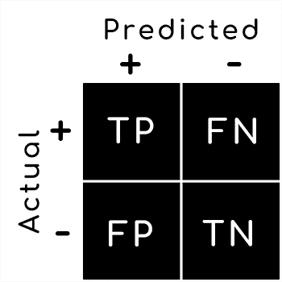
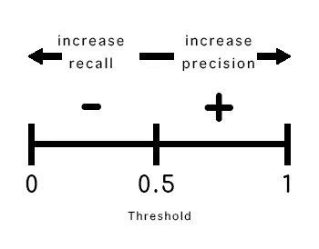
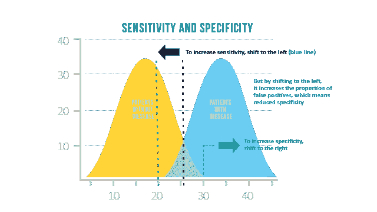

# 揭开困惑矩阵的神秘面纱

> 原文：<https://towardsdatascience.com/demystifying-the-confusion-matrix-d8ee2497da4d?source=collection_archive---------23----------------------->

## 不像名字暗示的那样令人困惑！

Photo by [Nicolas Gras](https://unsplash.com/@armgd?utm_source=medium&utm_medium=referral) on [Unsplash](https://unsplash.com?utm_source=medium&utm_medium=referral)

混淆矩阵广泛用于评估监督机器学习分类器。它为我们提供了一种方法来可视化模型在预测测试观察的类别方面的能力。它由实际标签与模型预测值的关联表组成。为了简单起见，假设我们正在评估的分类器是二元的，即只有两种可能的结果，阳性(+)或阴性(-)。

在二元分类器中，一个 ***的正确预测*** 可能以两种方式之一发生:

1.  正实例被模型预测为正( ***真正*** 或 ***TP*** )
2.  负实例被模型预测为负实例( ***真负*** 或 ***TN*** )

在这两种情况下，我们都对结果感到满意。毕竟，任何分类器的最终目标都是正确区分正例与反例，并相应地对它们进行标记。

同样，一个 ***误分类*** 可能以两种方式之一发生:

1.  正实例被模型预测为负实例( ***假阴性*** 或 ***FN*** )
2.  一个阴性实例被模型预测为阳性( ***假阳性*** 或 ***FP*** )

一个错误分类是 ***永远不会*** 在机器学习算法中可取的。根据数据集和正在研究的现象，一个 ***假阴性*** 或一个 ***假阳性*** 可能比另一个有更严重的影响。

下面的**混淆矩阵**总结了上述信息。在继续下面的解释之前，花点时间理解这个图表。

让我们来看看可能从混淆矩阵中导出的一些 ***度量*** 。

*   准确(性)
*   精确
*   回忆
*   特征
*   假阳性率
*   F1 分数

## 准确(性)

自然倾向于将 ***准确度*** 作为运行分类模型后的性能衡量标准。

***准确度=正确预测值/总观测值***

由于英语语法中单词 accuracy 的含义，当考虑分类器的性能时，很容易假设这是最佳度量。准确性衡量分类器“*t”获得正确的频率，作为与 ***总观察值*** 的比率。当数据集*不平衡时，准确性问题更加普遍，因为许多机器学习分类器偏向于 ***多数类*** 。在这些情况下，存在成为 ***准确性悖论*** 的牺牲品的风险。**

**想象一下，如果你愿意，一个试图识别欺诈案件的分类器。如果一个数据集有 ***10，000 个实例******欺诈发生率为 0.1%*** ，这些记录中只有 10 个会被肯定地标记为欺诈！根据定义，这被认为是一个高度不平衡的数据集。**

**如果该算法将每个案例标记为 ***正常*** (即没有欺诈)，我们得到以下准确度分数:**

**正确预测/总观察值= 9990/10000 =**99.9%****

****印象深刻！**但是，等等……如果我们要捕获的 ***TP*** 是:**

*   **存在癌症/疾病状态**
*   **骗税**
*   **罕见的天体现象**

**并且我们甚至无法捕获一个实例，那么部署这种模型将会是一个巨大的失败，尽管它具有近乎完美的准确性！**

## **精确**

**Precision 是对“*”准确性的度量，因为它查看正确预测的阳性与所有 ***预测的阳性*** 之间的比率。***

*****精度= TP / (TP + FP)*****

## **回忆(又名敏感度，真阳性率)**

**召回是对“ ***完整性*** ”的一种度量，因为它查看正确预测的阳性与所有 ***实际阳性*** 之间的比率。**

*****回忆= TP / (TP + FN)*****

**大多数分类问题都是在****回忆*** 之间的一个 ***权衡。通常增加一个会导致另一个的妥协。考虑工作中的垃圾邮件过滤器。******

*   **FP =标记为垃圾邮件的有效电子邮件**
*   **FN =发送到收件箱的垃圾邮件**

*****提高阈值*** 会降低电子邮件被标记为阳性(垃圾邮件)的概率。这也增加了精确度并降低了召回率，在这种情况下更可取，因为 FP 呈现出比 FN 更严重的 ***结果*** 。**

****

## **特异性(又名真阴性率)**

**同样，回忆是对正面结果的“*”完整性的度量，特异性对*值也是如此。我们看正确预测的否定和所有 ***实际否定*** 的比例。****

*****特异性= TN / (TN + FP)*****

**下面，你可以看到改变阈值对 ***回忆*** (记住这个和敏感度一样)和*的影响。***

******

***Graphic from [https://www.technologynetworks.com/](https://www.technologynetworks.com/)***

## ***假阳性率***

***这是特异性的补充。***

******假阳性率= FP / (FP + TN) = 1 -特异性******

*****假阳性率*** 和 ***假阴性率*** 形成受试者工作特性(***【ROC】***)曲线的坐标轴。这条曲线是另一个有用的工具，帮助我们找到两者之间的最佳平衡。ROC 曲线将在以后的文章中详细讨论。**

## **F1 分数**

**此外， ***F1 分数*** 是精确度和召回率的调和平均值，是两者之间平衡的最佳衡量标准:**

*****F1 得分= 2 x(精度 x 召回)/(精度+召回)*****

**混乱矩阵*不再混乱。我希望我已经澄清了你对这篇文章的一些误解。它是帮助我们评估分类器的一个非常好的工具。当我们理解了特定于所讨论的数据集的各个指标和含义时，我们就可以利用这个 2 x 2 信息矩阵的力量。最终，我们可以对我们的模型做出决策，并提高预测分析的价值。***

***让我们继续谈话。你可以在 [LinkedIn](http://www.linkedin.com/in/SiphuLangeni) 上找到我。***