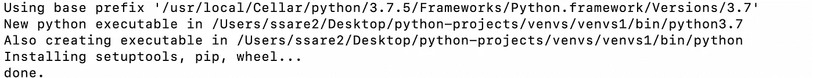

# 揭开 Python 中虚拟环境的神秘面纱

> 原文：<https://towardsdatascience.com/demystifying-virtual-environments-in-python-7c0a0b255928?source=collection_archive---------19----------------------->

## 为什么要使用虚拟环境和安装步骤

Photo by [João Silas](https://unsplash.com/@joaosilas?utm_source=unsplash&utm_medium=referral&utm_content=creditCopyText) on [Unsplash](https://unsplash.com/s/photos/mystery?utm_source=unsplash&utm_medium=referral&utm_content=creditCopyText)

自从我开始用 Python 编码以来，我一直在用 Jupyter Notebook 进行我所有的 Python 编码。它非常强大，可以一次测试一行代码，添加 markdown 注释，并且有一个很好的界面。

Python 包允许在编程时访问各种要实现的功能，因此是 Python 编程的日常部分。唉，导入已安装的软件包时确实会出现问题。

我最近遇到了一个问题，我安装了一个特定的包(`googletrans`)，但一个错误说这样的包不存在，不断弹出。

有几件事需要注意:

*   使用命令`which python`来确认您处于什么 Python 环境中。
*   Jupyter 笔记本中运行的 Python 内核版本必须与你在`site-packages`中安装包的版本相匹配。简而言之，您用来安装包的`pip`必须对应正确的 Python 内核(Python 2 或 Python 3)。**你应该使用 Python 3+,因此对所有安装命令使用**`**pip3**`**。**
*   **使用`sys.path`检查内核正在使用的所有当前路径，并确保考虑中的软件包下载文件夹的路径包括在内。**

**尽管如此，一个人可能会卡住。这些问题可能有很多潜在的原因。绕过他们的一种方法？ ***虚拟环境*。****

**默认情况下，所有的包和依赖项都下载到站点包的同一个目录中。因此，为了将每个项目的依赖性从系统中分离出来，并且相互分离，我们应该使用虚拟环境。**

## **使用`pip`:**

*   **确保你已经安装了`virtualenv`。如果没有，输入你的终端:`pip3 install virtualenv`。这将被下载到您的`python3.7`目录下的`site-packages`中。**
*   **接下来，`cd`到您想要创建虚拟环境的目录。建议在一个地方存储所有虚拟环境。**
*   **接下来，创建一个虚拟环境:`virtualenv name-of-virtualenv`**
*   **上述命令将设置虚拟环境并安装`lib`、`bin`和`include`文件夹。**

****

**Virtual environment installation**

*   **`cd`进入环境并激活:`source bin/activate`**
*   **现在输入`jupyter notebook`。在你想存放笔记本的文件夹中打开一个新的 Python3 笔记本。**
*   **要确认 Jupyter 内核使用的是什么 Python:**

1.  **在你的 Jupyter 笔记本上输入并执行`!which python`。该路径应该指向新创建的当前活动虚拟环境的 bin 中的 python。它应该是这样的:`/path/to/created/virtual/environment/name-of-virtualenv/bin/python`。**
2.  **您还可以使用`import os`和`os.getcwd()`来检查您当前的工作目录，并确保该路径与您的虚拟环境的路径相匹配。**

*   **使用`pip3`开始安装软件包，一切都准备好了！所有这些包都将在`name-of-virtualenv/lib/python3.7/site-packages`中安装**
*   **[EDIT]要导入已安装的包，我们必须将`site-packages`路径添加到系统路径列表中。
    `import sys`和`sys.path.insert(1, './lib/python3.7/site-packages')`。这将在索引“1”处插入路径，并确保在导入包时检查包的路径。`./`指向你当前的工作目录。请注意，每次内核重启时都必须执行这一步。**
*   **还要注意，一旦您关闭了 Jupyter 笔记本和`deactivate`您的虚拟环境(通过在终端中键入命令)，然后您在与上面相同的位置打开了一个 Jupyter 笔记本，`!which python`命令将返回 Python 的默认“全局”版本。**