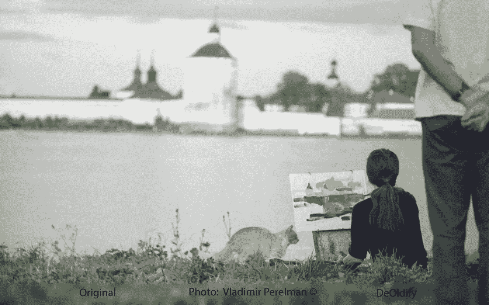
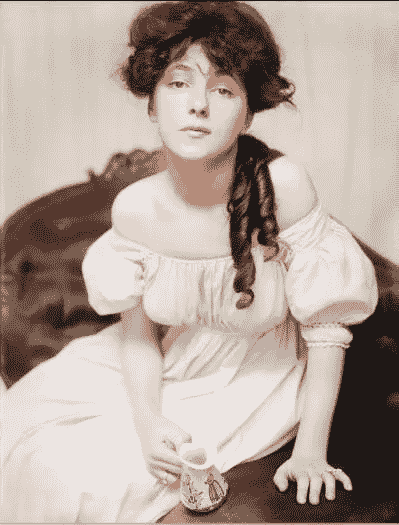

# 基于 GAN 的图像彩色化

> 原文：<https://towardsdatascience.com/deoldify-gan-based-image-colorization-d9592704a57d?source=collection_archive---------9----------------------->

## 找回丢失的颜色…

Photo by Vladimir Perelman (1975, Kirillo-Belozersk), colorized by DeOldify (2019)

  B   **缺乏和白色摄影承担其情感冲击。你摆脱了民粹主义的干扰或俗气的色彩刻板印象。天空是蓝色的，玫瑰是红色的。那是肯定的。很明显的事情。但是我们内心是什么呢？灯光，阴影，对比。**富裕的世界。这就是黑&白摄影直接表达的。在你的皮肤下，进入你的心和灵魂。"

这是我爸爸以前告诉我的。他更了解这一点，因为他一生都在拍照。他是心理照片肖像大师。然而，他记录了一切——从 20 世纪 50 年代到 20 世纪 90 年代，苏联的日常生活、文化和荒谬。

我同意 B&·w 的情感力量，但同时，我想知道，当他永远记住他的世界的对比和细微差别时，他的世界是什么样子的。幸运的是，深度学习可以有所帮助。

# #解密

这个模型是由 [Jason Antic](https://twitter.com/citnaj) 创造并发布的。他立即着手于 deol dify([GitHub](https://github.com/jantic/DeOldify))——带来了惊人的成果和伟大的使命:

> 这个项目的任务是着色和恢复旧图像和电影胶片。([来源](https://github.com/jantic/DeOldify))

DeOldify 正在使用**生成对抗网络**以及两个神经网络**生成器**和**鉴别器**之间的迭代相互作用(就像《T21》中的艺术培育者)。但与上一个模型不同的是，DeOldify 中的图像不会以它们的形式被修改或生成。甘的力量带来颜色——**生成器**将颜色应用到他训练过的已识别对象上，**鉴别器**尝试对颜色选择进行批评。DeOldify 基于 fast.ai 库——为深度学习开发者带来了更多的能力和优化。

> 在这种情况下，天空是蓝色的。玫瑰是红色的。(但也不尽然。“视情况而定”，正如 Discriminator 用来宣称的那样)。

Jason 在这个模型上工作了很长一段时间——有失败也有成功——这是一段充满情感高峰的个人旅程。令人惊叹的时刻。

在 Hacker Noon 的采访中，他讲述了他对模型结果的第一次影响，在这张解密照片中，他看到了 Evely Nesbit 手中的奖杯:

Source: [@citnaj](https://twitter.com/citnaj/status/1127972114542153728)

> 我承认这张照片有瑕疵。但看到这个之后，我知道我找到了一些东西。

所以他继续挖掘，这样他可以给老照片上色:

给画重新着色:

甚至为历史视频片段添加色彩:

对于研究人员来说，这是一个令人兴奋的功能，他们应该记住，结果不一定代表原始颜色。

给历史图像和视频带来色彩，给了我们一个以单色再现世界的绝佳机会。

你可以在 [GitHub](https://github.com/jantic/DeOldify) 中找到这个模型，也可以在两个笔记本中找到:图像( [Colab 笔记本](https://colab.research.google.com/github/jantic/DeOldify/blob/master/ImageColorizerColab.ipynb))和视频( [Colab 笔记本](https://colab.research.google.com/github/jantic/DeOldify/blob/master/VideoColorizerColab.ipynb))——试试吧！

以下是使用 DeOldify 笔记本的简短视频教程:

# B&W 还是色彩？

我有自己的惊叹时刻，给我父亲的黑白照片上色。看看这些花——它们颜色的多样性，在黑白照片中看不到:

在这篇文章标题的照片中，你也可以看到画上的颜色——用 AI 重新想象想象力。绿草——和女孩们画的画中修道院的颜色相呼应。

我仍然赞同黑白肖像的心理能量。但是从我个人的角度来说，我很感激 DeOldify 能让我们回到过去。我父亲记忆的重生。颜色总是很鲜艳。在我们的记忆中——现在，在过去的不朽文献中。借助深度学习。

在推特上关注杰森·安蒂奇的# deol dify-新闻和色彩:[https://twitter.com/citnaj/](https://twitter.com/citnaj/)

更新。

使用#DeOldify 和其他 ML 模型可以创造奇迹:

 [## 重现历史

### 正在使用的深度学习模型

towardsdatascience.com](/re-animated-history-6b5eb1a85efa)