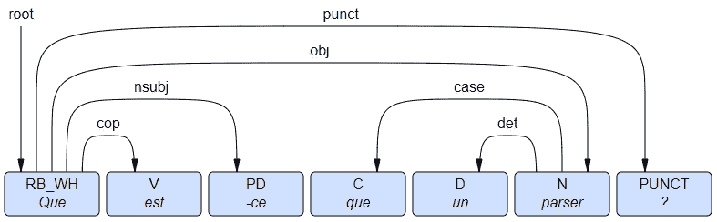
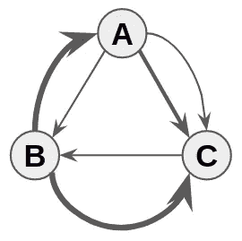
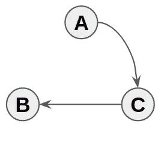
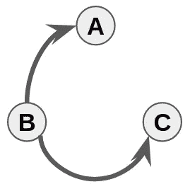
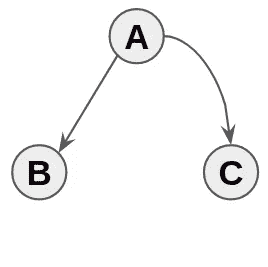

# 依存解析器或如何找到一个单词的语法邻居

> 原文：<https://towardsdatascience.com/dependency-parser-or-how-to-find-syntactic-neighbours-of-a-word-a9e7d17ffe8?source=collection_archive---------10----------------------->

本文将通过理论来揭开 NLP 中这一不为人知的部分。然后，在第二篇文章中，我们将推荐一些工具来帮助您理解如何轻松地实现依赖解析器。

当我们考虑一个单词的邻居时，我们可以把邻居看作是他们在句子中的位置，他们与其他单词的关系(主语，行列式，等等。)，称之为句法，或者称之为它们意义的相似性，称之为语义。这里我们感兴趣的是句法上的邻域。

# 词汇

首先，我们来定义一些词汇，让大家更清楚。

*   **语义学**是研究意义和解释的语言学和哲学领域。它非常依赖单词之间的联系来理解句子，并分析意思的变化。在编程中，语义是程序的预期输出。
*   **句法**是语言学领域的语法。它是对句子中单词模式规则的研究。众所周知，在编程中，语法错误通常会导致错误，因为规则通常比口头语言要严格得多。

# 什么是依赖解析器？

依存关系树是一种可以被定义为有向图的结构，具有对应于单词的|V|个节点(顶点),以及对应于它们之间的句法依存关系的|A|个弧。我们可能还想将标签归属于依赖关系，称为关系。这些关系给出了依赖类型的细节(如主语、直接宾语补足语、决定因素……)。你可以通过下面的链接找到所有来自通用依赖的关系:【https://universaldependencies.org/u/dep/index.html】T4。

Example of Dependency Tree : “What is a parser ?”

在弧 h → d 中，h 是**头**，d 是**从属**。中心是一个短语中最重要的节点，而**词根**是整个句子中最重要的节点:它直接或间接地是所有其他节点的中心。

依存解析器只是将一个句子转换成一棵依存树。

# 度量:如何识别一个好的解析器？

一个准确的依存解析器能够很好地识别单词之间的依存关系。两个度量(分数)对此是有用的:
-未标记的附件分数(UAS)，其对应于在可能性的数量上正确预测的依赖性的数量；
-标记的附件分数(LAS)，其对应于在可能性的数量上正确预测的依赖性和关系的数量。

LAS 始终小于或等于 UAS，因为不正确的依赖关系会导致次优的 UAS 和 LAS，而不正确的关系(或标注)只会导致 LAS 下降。

# 算法:它是如何工作的？

正如您可能已经想到的，我们可以通过语言学家开发的规则创建一个依赖解析器。这些解析器被称为**理性主义者**。它们一点也不高效，因为语言非常复杂，而且会随着时间而变化。语言的任何微小变化都会导致解析器的巨大变化。机器学习允许开发数据驱动的**经验**解析器。通过许多句子，可以得出依赖或关系的概率。语言学知识可能会用到，但没有定论，如果你像我一样忘记了小学的功课，这是一个很好的观点…

创建依赖解析器需要几个步骤。我们的输入是句子的单词及其**属性**(索引、词性标签、词条、特征)；然后，我们必须为句子中所有可能的弧线计算**特征**。由于这些特性，我们为每种可能性计算一个**分数**，最后用一个**解码器**解码分数。

**功能和评分**

句子中的每个单词都有一些属性，比如词性标签或词条。如果你已经读过 NLP，你可能知道他们。如果没有，您可以在这里查看:

*   [https://universaldependencies.org/u/pos/all.html](https://universaldependencies.org/u/pos/all.html)
*   [https://universaldependencies.org/u/feat/index.html](https://universaldependencies.org/u/feat/index.html)

利用这些特征，我们训练一个机器学习回归模型，该模型返回将被解码器利用的分数。

特征选择至关重要，一些模型允许我们通过深度学习部分绕过这一部分。我们将在下一节介绍的算法就是这种情况。

## 解码器

已经开发了许多不同的解码器。然而，我们可以将它们分为两类:基于转换的解码器和基于图的解码器。基于转换的解码器速度更快，解码乐谱需要的内存更少，但通常不如基于图形的解码器准确。在本文中，我将只介绍基于图的模型原理。

其他算法可以应用不同的过渡，但这一个允许我们理解主要的原理。

**基于图形的解码器**

要理解这些算法，需要处理图论。

图 G=(V，A)是表示记号的顶点 V(也称为节点)和弧(I，j)∈ A 的集合，其中 I，j ∈ V。弧表示两个单词之间的依赖关系。

在基于图的依赖解析器中，图是有向的，这意味着链接有不同的方向，节点之间可以有多条弧线，这被称为**多向图**。

Weighted Multi Directed Graph (G)

你可以注意到有些箭头比其他的粗。这代表弧的权重。弧线的权重越大，两个节点之间的联系就越紧密。我们可以把这解释为解析器的语法依赖性的强度。比如 C 和 A 看起来很依赖 B，但是 B 看起来不太依赖 C 和 A。

图 G 太连通了。为了得到依赖树，我们需要:

*   仅将每个单词与其从属词链接，而不是与所有单词链接。弧的总数应该等于节点数减 1 (|A| = |V|-1)。
*   保持相同的节点(或记号或单词)。
*   让它成为非循环的:我们不希望一个头依赖于它的一个从属(直接或间接)。

幸运的是，所有这些都已经有了名字:我们想要的是一棵生成树！

Example of Spanning Tree from the graph G

An other example of Spanning Tree

如果我清楚什么是生成树，你应该知道有多种可能性，因为我们只有几个条件来得到一个。这里有一个窍门:我们当然想要最好的，但是我们如何确定“最好”的呢？

这里有 3 个节点，我们想保留它们。然而，我们有 6 个弧，我们只想保留 2 个。“最佳”依赖树是具有最高权重的树:这被称为最大生成树(MST)。

Maximum Spanning Tree of G

Minimum Spanning Tree of G

这个最大生成树给了我们依赖树，我们将使用它来寻找句子中最接近的语法邻居。

# 结论

与不同的现有算法相比，这里给出的见解是非常轻的。然而，在开发依赖解析器时，这应该会提高您的直觉。