# 使用 Terraform 和 Ansible 部署 Kafka 集群

> 原文：<https://towardsdatascience.com/deploy-a-kafka-cluster-with-terraform-and-ansible-21bee1ee4fb?source=collection_archive---------3----------------------->

## 供应、部署和管理 Kafka 平台的简单方法


Photo by [Luca Bravo](https://unsplash.com/@lucabravo?utm_source=medium&utm_medium=referral) on [Unsplash](https://unsplash.com?utm_source=medium&utm_medium=referral)

# 概观

在我之前的[帖子——在 AWS 中的 Ubuntu 上安装 Kafka 集群](/install-a-kafka-cluster-on-ubuntu-in-aws-17c951287284)中，我已经详细描述了在 AWS 中手动设置消息传递主干的步骤。这是理解卡夫卡如何工作的伟大一步，但这需要很长时间，并且不可扩展。

一个 Kafka 集群有几个组件，如代理、动物园管理员、运行在多个实例上的工人，如下例所示。供应、部署和管理您的平台的最简单方法是使用可自动执行此任务的工具。

在这篇文章中，我将解释如何使用 Terraform 快速提供多个实例，然后使用 Ansible 在这些实例上安装 Kafka 来设置您的集群。

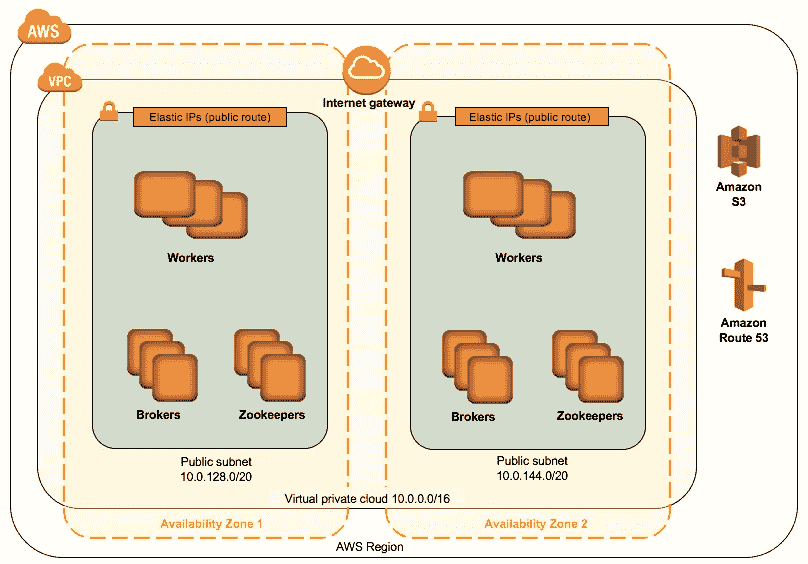

from AWS: [https://aws.amazon.com/quickstart/architecture/confluent-platform/](https://aws.amazon.com/quickstart/architecture/confluent-platform/)

首先，让我们从高层次的角度快速理解什么是 Terraform 和 Ansible

# 将（行星）地球化（以适合人类居住）

**Terraform** 是[开源](https://en.wikipedia.org/wiki/Open-source_software) [基础设施 as code](https://en.wikipedia.org/wiki/Infrastructure_as_code) 软件工具，由 [HashiCorp](https://en.wikipedia.org/wiki/HashiCorp) 打造。它使用户能够使用被称为 Hashicorp 配置语言(HCL)的高级配置语言或可选的 [JSON](https://en.wikipedia.org/wiki/JSON) 来定义和配置基础设施。

Terraform 支持许多云基础设施提供商，如[亚马逊网络服务](https://en.wikipedia.org/wiki/Amazon_Web_Services)、[谷歌云平台](https://en.wikipedia.org/wiki/Google_Cloud_Platform)、[微软 Azure](https://en.wikipedia.org/wiki/Microsoft_Azure) 。

Terraform 生成一个执行计划，描述它将做什么来达到期望的状态，然后执行它来构建所描述的基础设施。随着配置的变化，Terraform 能够确定发生了什么变化，并创建可以应用的增量执行计划。

使用高级配置语法来描述基础结构。这允许对数据中心的蓝图进行版本控制，并像对待任何其他代码一样对待它。此外，基础架构可以共享和重复使用。

# Ansible

Ansible 是一个非常简单的 IT 自动化平台，使您的应用程序和系统更容易部署。避免编写脚本或自定义代码来部署和更新您的应用程序——使用一种接近简单英语的语言，使用 SSH 来实现自动化，无需在远程系统上安装代理。

# 我们开始吧

首先，让我们安装 Terraform 和 Ansible

**地形**

您可以按照下面的说明进行操作，或者如果您使用的是 Mac，最简单的方法是使用 brew:

```
brew install terraform
```

[](https://learn.hashicorp.com/terraform/getting-started/install.html) [## 安装 Terraform

### Terraform 必须首先安装在您的机器上。Terraform 以二进制包的形式发布，适用于所有受支持的…

learn.hashicorp.com](https://learn.hashicorp.com/terraform/getting-started/install.html) 

确认 Terraform 正确安装了:

```
terraform -v
```


from: Marcos Lombog console Screenshot

可回答的

使用 pip [命令](https://crunchify.com/my-favorite-linux-commands-list-of-basic-linux-commands-and-cheat-sheet/)安装 Ansible。PIP 是 Python 包的一个`package manager`。 [macOS](https://crunchify.com/have-you-noticed-missing-library-folder-in-mac-os-x-lion/) 默认没有安装 pip。你必须先安装它。

```
sudo easy_install pip
```

使用 pip 安装 Ansible

```
sudo pip install ansible
```

让我们验证是否安装了 Ansible

```
ansible --version
```

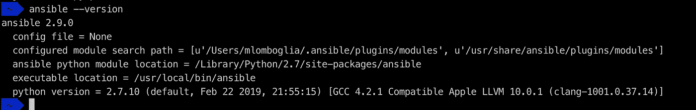

from: Marcos Lombog console Screenshot

对于其他操作系统，请使用下面的参考:

[](https://docs.ansible.com/ansible/latest/installation_guide/intro_installation.html) [## 安装指南-翻译文档

### 欢迎使用 Ansible 安装指南！默认情况下，Ansible 通过 SSH 协议管理机器。一旦 Ansible 是…

docs.ansible.com](https://docs.ansible.com/ansible/latest/installation_guide/intro_installation.html) 

恭喜你！安装完成！


# 使用 Terraform 调配您的基础架构

现在，让我们使用 Terraform HCL 构建 Kafka 基础架构。

该设置基于使用公共 VPC 和子网的企业汇合 Kafka。

所有代码都可以在[我的 GitHub](https://github.com/mlomboglia/kafka-cluster-infra) 中找到

```
git clone [git@github.com](mailto:git@github.com):mlomboglia/kafka-cluster-infra.git
```

在 terraform 文件夹中，有以下文件:

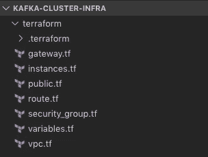

from: Marcos Lombog console Screenshot

**gateway.tf** →互联网网关创建。没有必要更改这个文件

**instances.tf** →要创建的实例。没有必要更改这个文件

有五种类型的实例在括号中有一个短名称:

*   Kafka Brokers (broker) →托管 Kafka broker 服务并维护主题数据
*   zookeeper(zookeeper)→托管定额管理服务并管理主题元数据
*   Kafka Connect REST API(Connect)→Kafka Connect 是 Kafka 的一个开源组件，是连接 Kafka 与数据库、键值存储、搜索索引、文件系统等外部系统的框架。
*   REST 代理(rest) → REST 和对附加融合平台服务的 HTTP/HTTPS 访问
*   KSQL 服务器 REST API (ksql) →KSQL 是支持实时数据处理的流 SQL 引擎
*   Schema Registry REST API(Schema)→Schema Registry REST 服务器使用请求和响应的内容类型来指示数据的序列化格式以及正在使用的 API 的版本
*   控制中心(control_center) →汇合控制中心是一个基于 web 的工具，用于管理和监控 Apache Kafka。控制中心有助于构建和监控生产数据管道和流式应用程序。

**public.tf** →子网创建。对于本例，我使用的是公共子网

**route.tf** →路由表信息

**security_group.tf** →允许必要的网络流量进入实例的安全组设置。对于这个例子，不需要修改这个文件。

请记住，ingress 允许 0.0.0.0/0，所以这是对公共互联网开放的。您需要将其限制在生产环境中使用。

**vpc.tf →** VPC 创作

**variables.tf** 包含我们的地形的参数。您可以对此进行修改。对于我的例子，我将在 AWS 中提供 7 个实例。

" rest " = 1
" connect " = 1
" ksql " = 1
" schema " = 1
" control _ center " = 1
" broker " = 1
" zookeeper " = 1

前缀为“staging”

实例类型“t2.small”。

重要提示:Confluent 推荐一个最小实例类型“t2.large”来运行 Kafka，因此如果您修改它，它将超出 AWS 免费层，并且会花费您的钱

**密钥对。**

您将需要一个 AWS 密钥对来创建您的实例。如果您还没有，请登录您的 AWS 帐户

**EC2 - >创建密钥对**

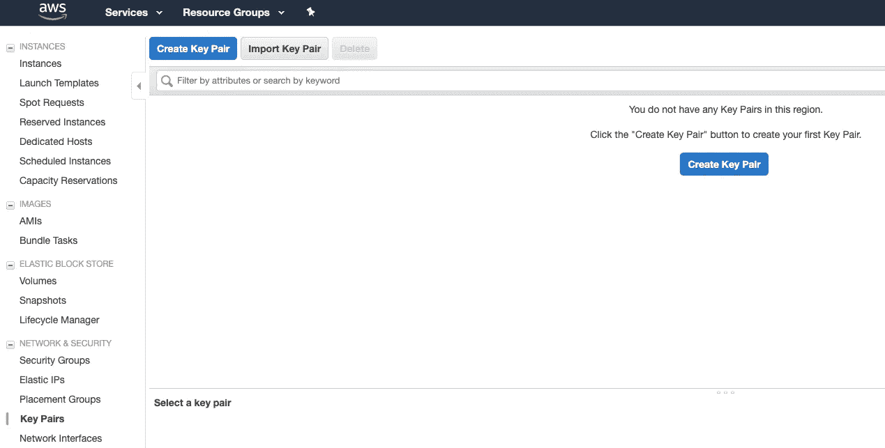

from: Marcos Lombog AWS

给一个名字，点击**创建。**

下载您的密钥，复制到安全文件夹并更新权限

```
chmod 400 ~/.ssh/<Key Name>.pem
```

用您的**键名**更新 **variables.tf** 下面的部分

```
variable "key_name" {
  description = "Key Pair"
  default     = "<Your Key Name>"
}
```

现在，我们可以走了。

Terraform init 将下载您的依赖项

```
cd kafka-cluster-infra
terraform init
```

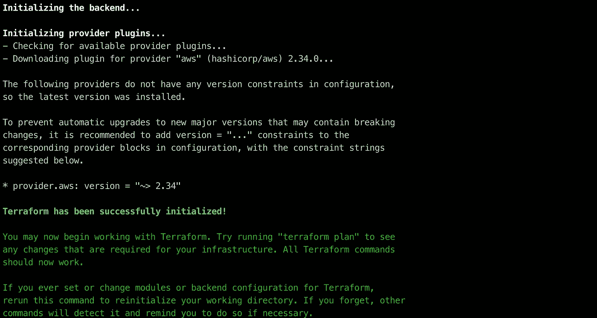

from: Marcos Lombog console Screenshot

Terraform plan 将创建您的部署计划

```
terraform plan
```

现在，小心下一步。根据您的配置，这将花费您一些钱。

```
terraform apply
```

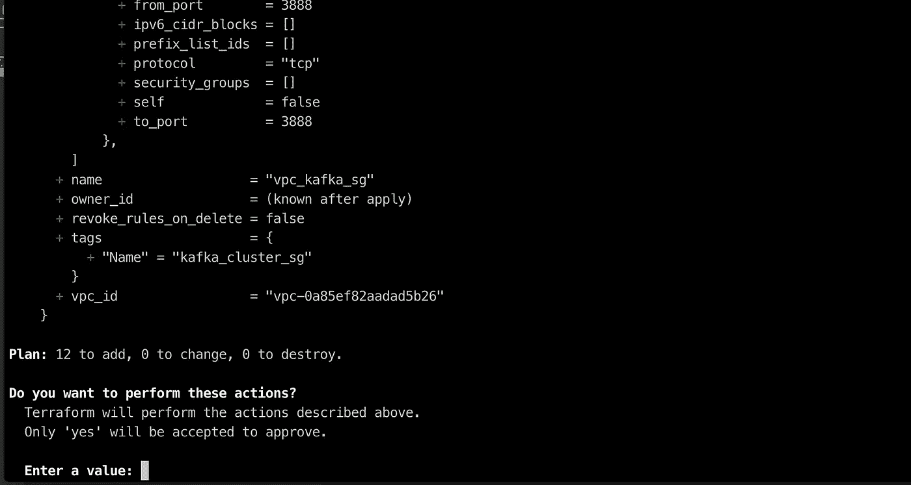

from: Marcos Lombog console Screenshot

用“是”确认

如果出现错误:找不到 ami，请转到 EC2 控制台，启动实例并使用最新的 ami 标签进行更新:

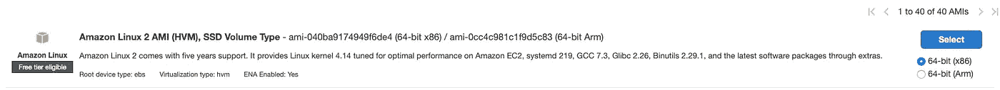

from: Marcos Lombog AWS

现在，您已经在 AWS 中提供了所有实例。

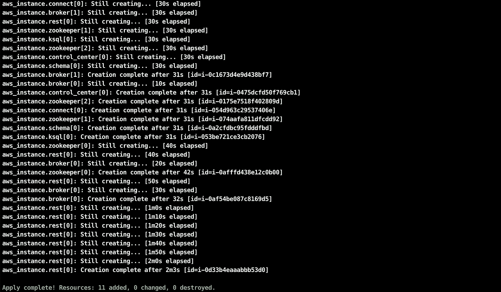

from: Marcos Lombog console Screenshot

进入 AWS，查看所有正在运行的实例，并记下每个实例的公共 DNS (IPv4)。在下一节中，您将需要用到它。

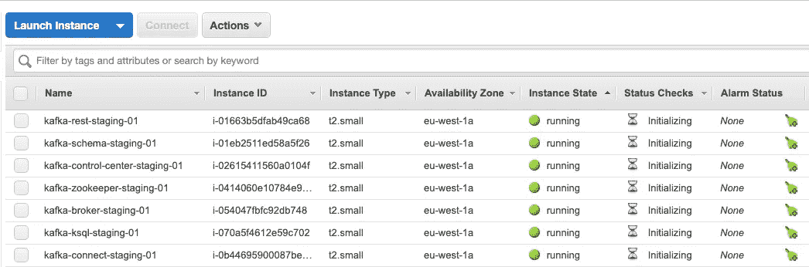

from: Marcos Lombog AWS

现在，让我们继续使用 Ansible 安装 Kafka

# 使用 Ansible 安装 Kafka

安装卡夫卡，我就用合流版。

1.创建一个`hosts_example.yml`文件的副本。

```
cd ..
cd cp**-**ansible

cp hosts_example**.**yml hosts**.**yml
```

2.使用您最喜欢的 IDE 并编辑 hosts.yml 文件，按照每个实例类型的标签，从上面的 AWS Terraform 安装中输入主机，看起来与您的公共 DNS 类似。

非常小心地在 YML 文件上使用正确的缩进:

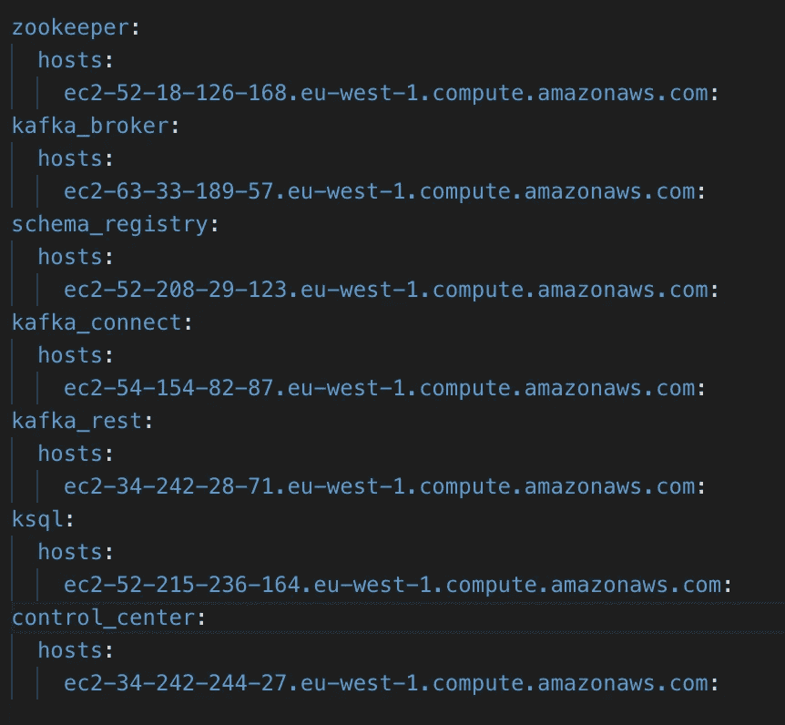

from: Marcos Lombog console Screenshot

取消 hosts.yml 文件中以下行的注释，添加您的密钥路径

```
ansible_ssh_private_key_file: '~/.ssh/<Key Path>.pem'
```

3.确认 Ansible 可以通过 SSH 连接

```
ansible **-**i hosts**.**yml all **-**m ping
```

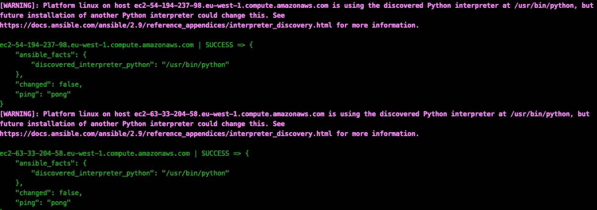

from: Marcos Lombog console Screenshot

键入“是”信任所有服务器。

如果连接到实例时出现问题，请尝试使用以下命令手动 SSH:

```
ssh -i <Key Path> [ec2-user@<](mailto:ec2-user@ec2-63-33-204-58.eu-west-1.compute.amazonaws.com)Instance Public DNS>
```

4.运行`all.yml`行动手册

```
ansible**-**playbook **-**i hosts**.**yml all**.**yml
```

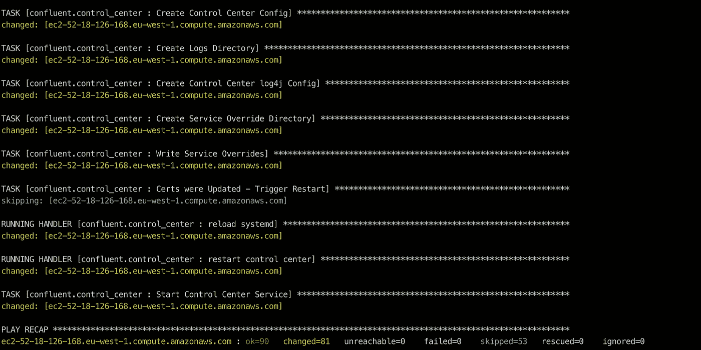

from: Marcos Lombog console Screenshot

Ansible playbook 将在您的所有实例上执行 Kafka 安装。

一段时间后，您应该会看到上面的这条消息。所有东西都装好了！

现在，让我们测试安装:

1.  您可以使用 SSH 连接到您的任何实例，以检查服务是否正在运行:

```
systemctl status confluent*
```

# 恭喜你！


要继续，你可以用我的另一篇文章构建你的第一个 Kafka 应用程序:

[](/your-first-kafka-application-9b1358ccb870) [## 你的第一个 Kafka 应用

### 创建您的第一个生产和消费消息的 Kafka 应用程序

towardsdatascience.com](/your-first-kafka-application-9b1358ccb870) 

# (可选)销毁集群

不要忘记销毁您的群集并终止您的实例，运行以下命令:

```
terraform destroy
```

快乐短信！