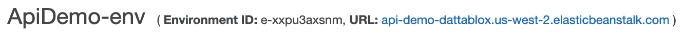

# 在 AWS Elastic Beanstalk 上部署一个机器学习模型作为 API

> 原文：<https://towardsdatascience.com/deploy-a-machine-learning-model-as-an-api-on-aws-43e92d08d05b?source=collection_archive---------8----------------------->

## [现实世界中的数据科学](https://medium.com/towards-data-science/data-science-in-the-real-world/home)

## 循序渐进的教程


Sorry, I don’t use Instagram, so I have to post pictures of my dog here.

每天都有几十篇很棒的文章和教程在讨论如何开发各种机器学习模型。但是，我很少看到解释如何将模型投入生产的文章。**如果你想让你的模型对现实世界产生影响，它需要对其他用户和应用程序是可访问的。**

这个分步指南将向您展示**如何将模型部署为 API。**为您的模型构建一个 API 是将您的工作集成到您公司系统中的一个很好的方式——其他开发人员只需要学习如何与您的 API 交互来使用您的模型。对于有抱负的数据科学家来说，这也是让他们的投资组合项目脱颖而出的绝佳方式。

本教程面向数据科学家和有抱负的数据科学家，他们在将应用程序和 API 部署到 web 方面没有什么经验。到最后，你会知道如何:

1.  使用 Python 的 web 微框架 Flask 开发一个模型 API。
2.  使用 Docker 将 API 容器化为微服务。
3.  使用 AWS Elastic Beanstalk 将模型 API 部署到 web 上。

# 为什么要构建 API？

在深入研究代码之前，让我们讨论一下为什么我们更喜欢这种方法，而不是将模型代码放在主应用程序中。构建一个可以被主应用程序调用的独立服务有几个优点:

*   更新更加简单，因为每个系统的开发人员不需要担心破坏其他系统。
*   更具弹性，因为主应用程序中的故障不会影响模型 API，反之亦然。
*   易于扩展(当对 API 使用微服务架构时)。
*   易于与多个系统集成，即网络和移动系统。

# 模型

如果你正在开发一个项目组合，最好使用不太传统的数据集来帮助你在雇主面前脱颖而出。然而，为了本教程，我将使用著名的[波士顿房价数据集](https://scikit-learn.org/stable/datasets/index.html#boston-dataset)。该数据集包含几个可用于预测 1980 年前后波士顿住宅价值的要素。

我选择使用[随机森林](https://scikit-learn.org/stable/modules/generated/sklearn.ensemble.RandomForestRegressor.html)来处理这个回归问题。我任意选择了一个特征子集来包含在模型中。如果我正在开发一个“真实世界”的模型，我会尝试许多不同的模型并仔细选择特性。

查看我的 GitHub [repo](https://github.com/brent-lemieux/model_api) 获取快速构建和保存模型的说明。跟着做，然后为您的建模项目构建一个 API！

# API

在`app/`目录下创建脚本`app.py`。如果你遵循了[回购](https://github.com/brent-lemieux/model_api)中的说明，这个目录也应该包含保存的模型(`model.pkl`)。

`app/app.py`中的前几行从 Flask、NumPy 和 pickle 导入了有用的功能。我们也从下面包含的`app/features.py`进口`FEATURES`。接下来，我们初始化应用程序并加载模型。

```
# app/app.py# Common python package imports.
from flask import Flask, jsonify, request, render_template
import pickle
import numpy as np# Import from app/features.py.
from features import FEATURES# Initialize the app and set a secret_key.
app = Flask(__name__)
app.secret_key = 'something_secret'# Load the pickled model.
MODEL = pickle.load(open('model.pkl', 'rb'))
```

## 特征

我将特性列表存储在一个单独的脚本中，以保证 API 中模型训练和预测的一致性。

```
# app/features.pyFEATURES = ['INDUS', 'RM', 'AGE', 'DIS', 'NOX', 'PTRATIO']
```

## 端点

我们的 Flask app 对象(上面定义为`app = Flask(__name__)`)有一个有用的 decorator 方法，使得定义端点`.route()`变得容易。在下面的代码中，`@app.route('/api')`告诉服务器每当 http://{your_ip_address}/api 接收到一个请求时，就执行直接在它下面定义的`api()`函数。

```
# app/app.py (continued)[@app](http://twitter.com/app).route('/api', methods=['GET'])
def api():
    """Handle request and output model score in json format."""
    # Handle empty requests.
    if not request.json:
        return jsonify({'error': 'no request received'}) # Parse request args into feature array for prediction.
    x_list, missing_data = parse_args(request.json)
    x_array = np.array([x_list]) # Predict on x_array and return JSON response.
    estimate = int(MODEL.predict(x_array)[0])
    response = dict(ESTIMATE=estimate, MISSING_DATA=missing_data) return jsonify(response)
```

## 解析请求

我们需要包含`parse_args()`函数来解析 JSON 请求中的特性。

```
# app/app.py (continued)def parse_args(request_dict):
    """Parse model features from incoming requests formatted in    
    JSON."""
    # Initialize missing_data as False.
    missing_data = False# Parse out the features from the request_dict.
    x_list = []
    for feature in FEATURES:
        value = request_dict.get(feature, None)
        if value:
            x_list.append(value)
        else:
            # Handle missing features.
            x_list.append(0)
            missing_data = True
    return x_list, missing_data
```

## 启动应用程序

最后，在 Flask 的开发服务器上运行应用程序，确保它能够正常工作。

```
# app/app.py (continued)if __name__ == '__main__':
    app.run(host='0.0.0.0', port=5000, debug=True)
```

用`$ python app.py`启动服务器。在另一个终端窗口中，使用`curl`向 API 发送请求。以 JSON 格式传递带有`--data`标志的特性。

```
$ curl -X GET "[http://0.0.0.0:5000/api](http://0.0.0.0:5000/api)" -H "Content-Type: application/json" --data '{"INDUS":"5.9", "RM":"4.7", "AGE":"80.5", "DIS":"3.7", "NOX":"0.7", "PTRATIO":"13.6"}'{
  "ESTIMATE": 18,
  "MISSING_DATA": false
}
```

## 生产 Web 堆栈

Flask 的开发 web 服务器非常适合测试，但是由于我不在这里讨论的原因，我们需要在其他地方寻找我们的生产栈。你可以在这里阅读更多关于这个[的内容](https://vsupalov.com/flask-web-server-in-production/)。我们将使用 Gunicorn 作为应用服务器，使用 Nginx 作为 web 服务器。幸运的是，AWS Elastic Beanstalk 默认为我们处理 Nginx 部分。要安装 Gunicorn，运行`$ pip install gunicorn`。创建脚本`app/wsgi.py`并添加两行:

```
# app/wsgi.pyfrom app import app
app.run()
```

现在，运行`$ gunicorn app:app --bind 0.0.0.0:5000`。您应该能够执行与上面相同的`curl`命令来从 API 获得响应。

```
$ curl -X GET "[http://0.0.0.0:5000/api](http://0.0.0.0:5000/api)" -H "Content-Type: application/json" --data '{"INDUS":"5.9", "RM":"4.7", "AGE":"80.5", "DIS":"3.7", "NOX":"0.7", "PTRATIO":"13.6"}'{
  "ESTIMATE": 18,
  "MISSING_DATA": false
}
```

# 码头工人

Docker 现在非常流行，关于它的好处已经写了很多。如果你有兴趣学习更多关于 Docker 的知识并获得更深入的介绍，请阅读这个。

对于本教程，您需要在您的计算机上设置 Docker，按照这里的说明[进行操作](https://docs.docker.com/install/)。你还需要一个 Docker Hub 账户。

一旦你都设置好了，让我们开始吧！构建 Docker 映像需要两个主要文件，`Dockerfile`和`requirements.txt`。

`Dockerfile`包括创建环境、安装依赖项和运行应用程序的说明。

```
# app/Dockerfile# Start with a base image
FROM python:3-onbuild# Copy our application code
WORKDIR /var/app
COPY . .
COPY requirements.txt .# Fetch app specific dependencies
RUN pip install --upgrade pip
RUN pip install -r requirements.txt# Expose port
EXPOSE 5000# Start the app
CMD ["gunicorn", "app:app", "--bind", "0.0.0.0:5000"]
```

`requirements.txt`包含我们的应用程序所需的所有 Python 包。

```
# app/requirements.txtFlask==1.0.2
itsdangerous==1.1.0
Jinja2==2.10.1
MarkupSafe==1.1.1
simplejson==3.16.0
Werkzeug==0.15.2
numpy==1.16.4
pandas==0.24.2
scikit-learn==0.19.1
scipy==1.0.0
requests==2.22.0
gunicorn==19.9.0
```

在`app/`目录中，运行:

```
$ docker build -t <your-dockerhub-username>/model_api .$ docker run -p 5000:5000 blemi/model_api
```

您的应用程序现在运行在 Docker 容器中。重新运行`curl`命令，会得到同样的输出！

```
$ curl -X GET "[http://0.0.0.0:5000/api](http://0.0.0.0:5000/api)" -H "Content-Type: application/json" --data '{"INDUS":"5.9", "RM":"4.7", "AGE":"80.5", "DIS":"3.7", "NOX":"0.7", "PTRATIO":"13.6"}'{
  "ESTIMATE": 18,
  "MISSING_DATA": false
}
```

运行`$ docker push <your-dockerhub-username>/model_api`将图像推送到您的 Docker Hub 帐户。在部署到 AWS Elastic Beanstalk 时，这最后一步会非常方便。

# AWS 弹性豆茎

是时候把我们的 API 放到网上了，这样我们的朋友和同事就可以访问它了！创建一个 [AWS 帐户](https://aws.amazon.com/)并登录控制台。 ***注意:您需要提供一张信用卡来创建您的帐户。如果您按照下面的说明操作，不修改任何选项，您的应用程序将符合自由层资格，并且成本将最低。一旦你启动了你的应用程序，导航到你的账单仪表板，在那里你可以看到你估计的每月费用。***

接下来，我们将创建一个文件，告诉 AWS 在哪里访问我们的图像。这叫`Dockerrun.aws.json`。这里的关键部分是“名称”值。我的 Docker Hub 用户名是“blemi ”,我将图像命名为“model_api ”,所以我将把`blemi/model_api:latest`作为“name”值。

```
{
  "AWSEBDockerrunVersion": "1",
  "Image": {
    "Name": "<your-dockerhub-username>/model_api:latest",
    "Update": "true"
  },
  "Ports": [
    {
      "ContainerPort": "5000"
    }
  ],
  "Logging": "/var/log/nginx"
}
```

在 AWS 控制台中，搜索“Elastic Beanstalk”并选择它。


选择右上角的“创建新应用程序”，为您的应用程序添加名称和描述，然后单击“创建”


点按“立即创建一个”


保持“Web 服务器环境”处于选中状态，然后单击“选择”继续。


如果愿意，为“域”和“描述”填写一个自定义值。对于“平台”，选择“预配置的平台”，并在下拉列表中选择“Docker”。对于“应用程序代码”，选择“上传您的代码”并单击“上传”按钮。


点击“选择文件”按钮，打开我们在上面创建的`Dockerrun.aws.json`文件。 ***注意:只有当你把你的 Docker 镜像推送到 Docker Hub 时，这个功能才会起作用。***


单击“上传”,然后单击“创建环境”来部署应用程序。

***注意:如果您正在创建一个生产级 API，在选择“创建环境”之前，您可能需要在这里选择“配置更多选项”——如果您有兴趣了解其他一些增强安全性和可伸缩性的选项，请联系我。我的信息在这篇文章的底部。***

该应用程序需要几分钟的时间来部署，但部署完成后，您可以通过屏幕顶部提供的 URL 进行访问:



现在，让我们在 web 上托管的 API 上运行`curl`命令。

```
$ curl -X GET "[http://api-demo-dattablox.us-west-2.elasticbeanstalk.com/api](http://api-demo-dattablox.us-west-2.elasticbeanstalk.com/api)" -H "Content-Type: application/json" --data '{"INDUS":"5.9", "RM":"4.7", "AGE":"80.5", "DIS":"3.7", "NOX":"0.7", "PTRATIO":"13.6"}'{"ESTIMATE":18,"MISSING_DATA":false}
```

# 总结和最终想法

我们用 Python Flask 构建了一个简单的模型 API，用 Docker 将其容器化，用 AWS Elastic Beanstalk 将其部署到 web 上。您现在可以利用这些知识为您的模型和项目开发 API 了！这使得与其他开发人员的合作变得更加容易。他们只需要学习如何使用你的 API 将你的模型集成到他们的应用和系统中。

要使这个 API 可以投入生产，还需要做更多的工作。在 AWS 和 Flask 应用程序本身中，您可以设置许多配置来增强安全性。如果使用量很大，还有许多选项可以帮助提高可伸缩性。Flask-RESTful 是一个 Flask 扩展，使得符合 REST API 最佳实践变得容易。如果你对使用 Flask-RESTful 感兴趣，可以看看这个伟大的[教程](/deploying-a-machine-learning-model-as-a-rest-api-4a03b865c166)。

# 取得联系

如果您有任何反馈或批评，请分享。如果您觉得本指南有用，请务必关注我，这样您就不会错过未来的文章。

如果你想联系，**在**[**LinkedIn**](https://www.linkedin.com/in/brent-lemieux/)上联系我。感谢阅读！