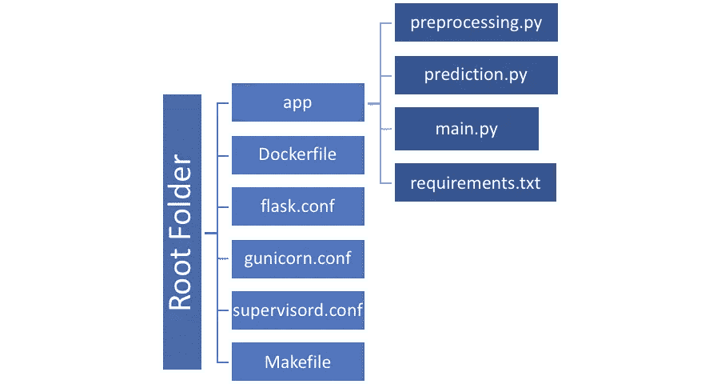
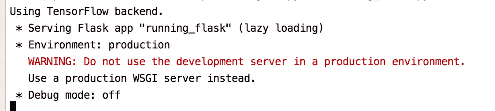
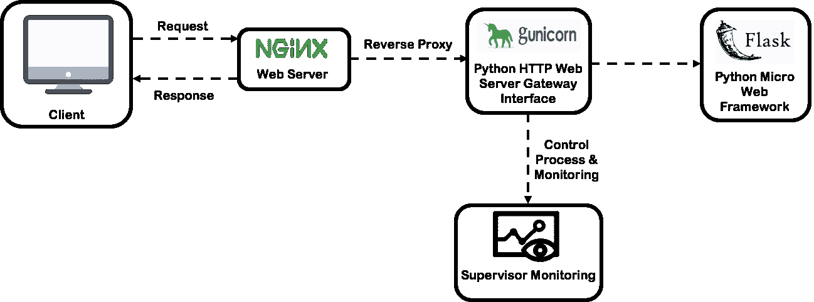

# 在 Python 中的 Kubernetes 上使用 NGINX 和 Docker 部署机器学习 Web API

> 原文：<https://towardsdatascience.com/deploy-machine-learning-web-api-using-nginx-and-docker-on-kubernetes-in-python-3abcf5c0026f?source=collection_archive---------14----------------------->


Photo by [Fotis Fotopoulos](https://unsplash.com/@ffstop?utm_source=medium&utm_medium=referral) on [Unsplash](https://unsplash.com?utm_source=medium&utm_medium=referral)

几天前，我正在谷歌云平台(GCP) Kubernetes 引擎上部署机器学习预测 web API，并浏览了许多技术博客来完成我的任务。因此，我想写一步一步的指南来部署任何机器学习预测 web API，使用 Flask，Gunicorn，NGINX 在 GCP Kubernetes 引擎上的 Docker 中封装。

**我把这个循序渐进的教程分成了 3 个部分:**

1.  在第 1 节中，我们将简要讨论 Flask、Gunicorn、NGINX、Docker 和 Kubernetes 等组件，以及项目搭建和在开发机器上的设置。
2.  在第 2 节中，我们将讨论 Gunicorn、supervisor、NGINX 的设置、Docker 文件的创建和 Docker 映像。
3.  在第 3 节中，我们将讨论 Kubernetes 并在 Google Kubernetes 引擎上部署 web API。

# 第一节:

# 组件描述

我假设读者对 Python，Flask，Gunicorn，NGINX，Docker，Kubernetes，最后但并非最不重要的机器学习有基本的了解。以下是本教程中使用的组件的基本介绍，有关更多详细信息，请参考嵌入的链接:

*   [**烧瓶**](https://opensource.com/article/18/4/flask) 是用 Python 写的一个微型 web 框架。它被归类为微框架，因为它不需要特殊的工具或库。它没有数据库抽象层、表单验证或任何其他组件，而现有的第三方库提供了通用功能。
*   [**Gunicorn**](https://www.fullstackpython.com/green-unicorn-gunicorn.html) 是众多 WSGI 服务器实现中的一个，是 web 应用部署的常用部分，为世界上一些最大的基于 Python 的 web 应用提供动力，如 Instagram。
*   [**NGINX**](https://www.fullstackpython.com/nginx.html) 常用作 web 服务器，为 web 浏览器客户端提供图片、CSS、JavaScript 等静态资产。NGINX 通常还被配置为反向代理，它将适当的传入 HTTP 请求传递给 WSGI 服务器。WSGI 服务器通过运行 Python 代码生成动态内容。当 WSGI 服务器传递它的响应(通常是 HTML、JSON 或 XML 格式)时，反向代理将结果响应给客户机。
*   [**Docker**](https://docker-curriculum.com/) 是一个开源项目，它通过在 Linux 上提供一个额外的抽象层和操作系统级虚拟化的自动化来自动化容器内软件应用程序的部署。
*   Kubernetes 是一个开源的容器编排系统，用于自动化部署、扩展和管理容器化的应用程序。它是一个可移植的、可扩展的平台，用于管理容器化的工作负载和服务，促进了声明式配置和自动化。

# 项目脚手架



Project folder structure to create a docker image

*   **app 文件夹:**主文件夹包含所有 python 代码，如:

a.机器学习逻辑，例如数据预处理、将保存的模型加载到存储器中以及机器学习模型预测。

b.requirement.txt 中所有必需的 python 包

c.main.py 中的所有 Flask 代码和路由

*   **Dockerfile:** 定义了容器内部环境中发生的事情。在此环境中，对网络接口和磁盘驱动器等资源的访问是虚拟化的，与系统的其他部分隔离开来，因此您需要将端口映射到外部世界，并明确要将哪些文件“复制”到该环境中。然而，这样做之后，您可以预期在 docker 文件中定义的应用程序的构建无论在哪里运行都是一样的。
*   这个配置文件将为机器学习 flask 应用程序定义一个服务器块。
*   **gunicorn.conf:** 这个配置文件将执行命令在后台运行 gunicorn 应用服务器。
*   **supervisord.conf:** 这个配置文件将照看 Gunicorn 进程，并确保它们在出现问题时重新启动，或者确保这些进程在引导时启动。
*   **Makefile:** 该 Makefile 将包含所有命令，如创建和运行 docker 映像、创建 Kubernetes 集群和部署 web API。

# 在开发机器上设置项目

*   **在开发机器上安装所需的包:**

```
$ sudo apt-get install -y python python-pip python-virtualenv nginx gunicorn supervisor
```

*   **创建并激活 Python 虚拟环境:**

Python 虚拟环境帮助我们用所需的 python 包创建特定于应用程序的环境。

安装虚拟环境包:

```
$ pip install virtualenv
```

创建虚拟环境:

```
$ virtualenv mypython
```

激活 Python 虚拟环境:

```
$ source mypython/bin/activate
```

*   **打造机器学习预测的 Flask app:**

安装 Flask 和其他依赖项:

```
$ pip install Flask
$ pip install -r requirements.txt
```

创建机器学习推理代码:

Flask 主要是为应用程序开发服务器创建的。我们可以在开发机器上测试 Flask API。

```
$ python main.py
```

不建议在生产环境中使用 Flask development server 来处理并发性和安全性。我们将使用 Gunicorn 作为 Python HTTP WSGI 服务器网关接口。



# 第二节



Architecture Diagram

*   **安装 Gunicorn Python 包:**

```
$ pip install gunicorn
```

配置 gunicorn.conf 文件以配置 Gunicorn web 服务器。

我们已经将 Gunicorn web 服务器配置为监听端口 5000，并从 app 目录运行 main.py 文件。

*   **配置 supervisord 为监控进程:**

Supervisord 允许用户在类似 UNIX 的操作系统上监视和控制几个进程。Supervisor 将负责 Gunicorn 进程，并确保它们在出现任何问题时重新启动，或者确保这些进程在引导时启动。

它将运行 NGINX 反向代理服务器，并在其上保持一个监视器。如果有任何失败，它会自动重启服务器并运行 NGINX 命令。

*   **设置 NGINX 服务器:**

打开一个服务器块，设置 NGINX 监听默认端口`80`。用户可以设置服务器名称来处理请求。

*   **创建 Dockerfile:**

我把 Dockerfile 分成了 5 个部分。让我们简单介绍一下每一部分:

1.  **创建一个 Ubuntu 环境。**安装 Ubuntu，更新必要的包。安装 python、pip、虚拟环境、NGINX、Gunicorn、supervisor。
2.  **设置烧瓶应用程序。**做一个目录“/deploy.app”。将所有文件从“app”文件夹复制到“/deploy/app”文件夹。安装所有需要的 python 包。
3.  **设置 NGINX。**删除默认 NGINX 配置。将烧瓶配置复制到 NGINX 配置。为 NGINX 烧瓶配置创建一个符号链接。
4.  **设置主管。**做一个目录“/var/log/supervisor”。将 Gunicorn 和 supervisord 配置复制到新创建的目录中。
5.  启动监控程序进行监控。

*   **构建并运行 docker 映像来测试生产就绪的 ML web API:**

我已经创建了一个 makefile 来运行所有的命令。

下面的 Makefile 执行两个操作:

1.  创建 docker 图像
2.  在端口 80 上运行 docker 映像

运行 Makefile:

```
deploy-local:#build docker image
docker build -t gcr.io/${project_id}/${image_name}:${version} .#run docker image
docker run -d --name ${image_name} -p $(port):$(port) gcr.io/${project_id}/${image_name}:${version}
```

*   在开发机器上使用 Postman 测试生产就绪的 web API，网址:[http://127 . 0 . 0 . 1/predict](http://127.0.0.1/predict)

在上一节中，我们已经学习了如何在开发机器上构建和运行 ML web API docker 映像。

# 第三节

在本节中，我们将学习如何在 GCP Kubernetes 引擎上部署这个容器化的 NGINX，并为生产环境公开 API。

1.  构建机器学习应用程序的容器映像，并对其进行标记以便上传

```
#Set variables value as per your project
$ docker build -t gcr.io/${project_id}/${image_name}:${version} .
```

2.使用 gcloud 命令行工具，安装 Kubernetes CLI。Kubectl 用于与 Kubernetes 通信，Kubernetes 是 GKE 集群的集群编排系统

```
$ gcloud components install kubectl
```

3.使用 gcloud 命令行工具，安装 Kubernetes CLI。Kubectl 用于与 Kubernetes 通信，Kubernetes 是 GKE 集群的集群编排系统

```
$ gcloud components install kubectl
```

4.配置 Docker 命令行工具以向容器注册表进行身份验证

```
$ gcloud auth configure-docker
```

5.使用 Docker 命令行工具将图像上传到容器注册中心

```
#Set variables value as per your project
$ docker push gcr.io/${project_id}/${image_name}:${version}
```

6.使用 gcloud 命令行工具并设置项目 id

```
$ gcloud config set project ${project_id}
```

7.使用 gcloud 命令行工具并设置区域

```
$ gcloud config set compute/zone ${zone}
```

8.在 GCP 上创建一个名为 ML-API-cluster-nginx 的单节点 Kubernetes 集群

```
$ gcloud container ${cluster_name} create machine-learning-api --num-nodes=1
```

9.部署机器学习应用程序，监听端口 80

```
$ kubectl run ${image_name} --image=gcr.io/${project_id}/${image_name}:v1 --port 80
```

10.将机器学习应用程序暴露给来自互联网的流量

```
$ kubectl expose deployment ${image_name} --type=LoadBalancer --port $(port) --target-port $(port)
```

使用 curl 命令或 Postman 测试部署的机器学习 Web API。

我希望这能给你一个说明性的指南，用 Python 在 Kubernetes 上使用 NGINX 和 Docker 部署机器学习 Web API。

**来源:**

1.  https://opensource.com/article/18/4/flask
2.  【https://www.fullstackpython.com/green-unicorn-gunicorn.html 
3.  [https://www.fullstackpython.com/nginx.html](https://www.fullstackpython.com/nginx.html)
4.  [https://docker-curriculum.com/](https://docker-curriculum.com/)
5.  [https://www . digital ocean . com/community/tutorials/an-introduction-to-kubernetes](https://www.digitalocean.com/community/tutorials/an-introduction-to-kubernetes)
6.  [https://cloud . Google . com/kubernetes-engine/docs/how-to/exposure-apps](https://cloud.google.com/kubernetes-engine/docs/how-to/exposing-apps)
7.  [https://cloud . Google . com/kubernetes-engine/docs/tutorials/hello-app](https://cloud.google.com/kubernetes-engine/docs/tutorials/hello-app)

**快乐学习！！！**