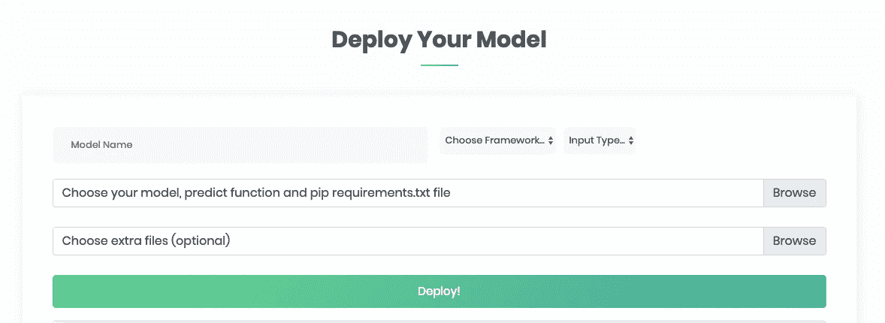
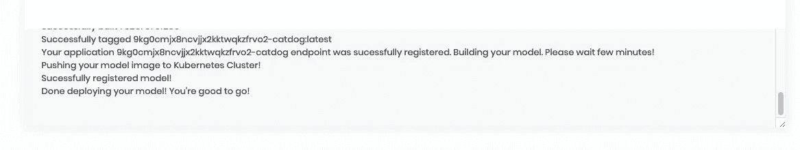
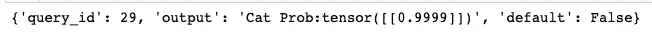
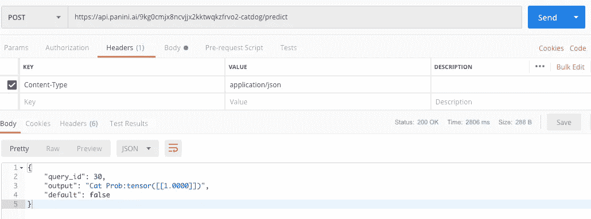

# 通过 Panini 将 ML/DL 模型部署到生产中

> 原文：<https://towardsdatascience.com/deploy-ml-dl-models-to-production-via-panini-3e0a6e9ef14?source=collection_archive---------14----------------------->

[https://paniniai.com](http://paniniai.com)是一个以低延迟为 ML/DL 模型提供服务的平台，可以将 ML 模型部署到生产环境的时间从几天缩短到几分钟。

# 帕尼尼是什么？

Panini 是一个以低延迟为 ML/DL 模型提供服务的平台，使 ML 模型从几天到几分钟内部署到生产环境。一旦部署在 Panini 的服务器中，它将为您提供一个 API 密钥来推断模型。Panini 查询引擎是用 C++开发的，它在模型推理过程中提供了非常低的延迟，Kubernetes 集群用于存储模型，因此它可扩展到多个节点。Panini 还负责在模型推断期间缓存和批处理输入。

我们目前支持 Python 中的框架，但是我们计划将来扩展到其他语言。我来演示一下上传经典迁移学习 Pytorch CNN 模型对狗和猫进行分类。源代码可从 https://github.com/avinregmi/Panini_Tutorial 的[获得。确保您安装了 Pytorch 1.0 和 Python 3.6。](https://github.com/avinregmi/Panini_Tutorial)

# 传统方法

传统的方法是将 Flask 和 Gunicorn 与 Nginx 一起使用，这需要大量的设置时间。此外，用 Flask 推断模型很慢，并且需要定制代码来进行缓存和批处理。使用烧瓶在多台机器中结垢也会导致许多复杂情况。
大多数人都在使用 Flask 向互联网公开 ML 模型并进行 API 调用。因为 Flask 不是服务于 ML 模型的合适平台。使用烧瓶的一些显著缺点包括:

1.  它不支持缓存和批处理。
2.  高延迟。有时需要预先计算预测。
3.  维护。
4.  难以在多个集群中扩展。

为了解决这些问题，我们开发了帕尼尼。

# **安装所需的包**

Panini 需要 **python 3.6** 所以确保安装了 3.6 的环境。另外，如果你使用 Pytorch，确保你已经安装了 **Pytorch 1.0** 。

# 部署经典的狗与猫

完整的源代码可以从

[https://github . com/avinregmi/Panini _ Tutorial/blob/master/py torch _ CNN _ Production/Panini _ Transfer _ Learning _ Demo _ YouTube . ipynb](https://github.com/avinregmi/Panini_Tutorial/blob/master/PyTorch_CNN_Production/Panini_Transfer_Learning_Demo_YouTube.ipynb)

我将使用迁移学习来修改 DenseNet 的最后一层。

保存模型时，确保只保存权重，而不是整个模型架构。推荐的方法是通过调用 state_dict()来保存权重。训练模型的代码非常简单，可以通过打开上面的链接来检索。我已经包括了 Jupyter 笔记本和一个 YouTube 教程。我已经预先训练了 DenseNet 模型来对狗和猫进行分类。我将权重保存为“last_layers.pth”

# 为帕尼尼准备文件

你需要上传至少三个文件到帕尼尼

*   **predict.py**
*   **requirements.txt**
*   **我们保存的模型权重(last_layers.pth)**

最重要的文件是 predict.py，这个文件告诉 Panini 加载您的模型并进行预测。如果您有额外的软件包，如 numpy 和 pandas，它可以通过在 requirements.txt 文件中指定 pip 软件包来安装。我们需要的最后一个文件是保存的权重模型。该文件可以命名为任何名称，但扩展名必须是. pth。

***Predict.py* 脚本里面需要有两个方法。它们是 load()和 predict()**

*   **load(path):** 当您的模型被加载到 Panini 的 Kubernetes 集群中时，第一次执行 load。它必须接受一个名为 path 的参数，并返回一个对模型的引用。您需要在这里指定您的模型架构，并将 weights.pth 文件加载回您的模型。在您的模型加载了预先训练的权重之后，它需要返回对您的模型的引用。
*   **predict(model，input_from_client):** 每次向 API 链接发送 POST 请求时，都会执行 predict。它需要模型和 input_from_client 的参数。第一个参数是由 load 函数返回的对模型的引用。下一个参数是客户端通过 POST 请求发送的数据。另外，input_from_client 是一个数组，所以我们必须使用 for 循环来访问每个图像。一旦我们有了每个图像，我们可以应用一些预处理，并将我们的图像转换成张量。一旦我们的图像被转换成张量，我们就可以输入到我们的模型中。我们的模型将返回一个对数概率，这也是一个列表，我们可以将它返回给我们的客户端。确保值 predict()返回一个数组。此外，数组的长度必须等于模型中最后一层的长度。我们用神经网络修改了上面模型的最后一层。线性(256，2)。因此，predict()需要返回一个长度为 2 的数组。

# 部署时间到了

登录[https://paniniai.com](http://paniniai.com)并创建一个账户。您可以使用 Google 帐户或 GitHub 登录。

Panini Dashboard

登录后，您将看到一个仪表板，并被要求填写一些信息。首先，给你的模型起个名字。名称必须少于或等于 10 个字符，并且只能是(a-z/0–9)。对于框架选择，PyTorch。目前，您有三种不同的选择。

*   **PyTorch** :如果需要使用深度学习。目前，我们支持 Pytorch 1.0
*   **Python 函数**:任意自定义 Python 函数。这包括 SciKit-Learn 和传统的机器学习，如 SVM 和回归。
*   **快速 AI** :如果你用的是快速 AI 库。

我们还需要指定模型期望的输入类型。因为我们将发送一张狗/猫的图片，并且将被编码为 base64 字节，所以让我们选择字节作为输入类型。点击浏览并选择你的三个文件。

*   **predict.py**
*   r **equirements.txt**
*   **last_layers.pth**

额外的文件是可选的，不是必需的。有些型号需要额外的文件，如用于 RNNs 的 vocab 到整数映射 pickle 文件。在我们的例子中，我们没有额外的文件，所以我们可以把它留为空白。

选择三个文件后，单击“部署！”并等待文件上传达到 100%。目前，模型大小限制为 2GB。如果您的型号超过 2GB，请给我们发电子邮件。

# 日志输出

一旦页面显示 100%,您可以刷新页面以查看最新的日志输出。

最后的日志输出应该是“完成部署您的模型！你可以走了！”出现此消息后，您应该会在控制台上方看到一个 API 链接。

# 如何使用我们的 API 进行推断？

我们将对一只可爱的猫的图片进行 base64 编码，并发送给帕尼尼进行预测。

Let’s send this cute picture to Panini for Prediction.

现在，我们需要做的就是向我们的 API URL 发送一个 POST 请求。要发送图像，我们需要用 base64 编码，并用 JSON 格式包装。此外，关键标签应该是“输入”，值将是我们的图像的 base64 编码字节格式。

Prediction result from Panini

**我们也可以使用邮递员**

# 最后

我们已经使用 Panini 成功地将 DL 模型部署到生产中。随着我们模型的流量增加，panini 会自动将其复制到几个节点中。如果我们想将它合并到 web 应用程序中，我们可以从 javascript/NodeJs 发出 POST 请求。我们可以专注于开发我们的模型，而不用担心 DevOps。如果您在上传模型时遇到问题，请发送电子邮件给我们！

*YouTube 教程:*[https://www.youtube.com/watch?v=tCz-fi_NheE&t =](https://www.youtube.com/watch?v=tCz-fi_NheE&t=)

*源代码:【https://github.com/avinregmi/Panini_Tutorial】*