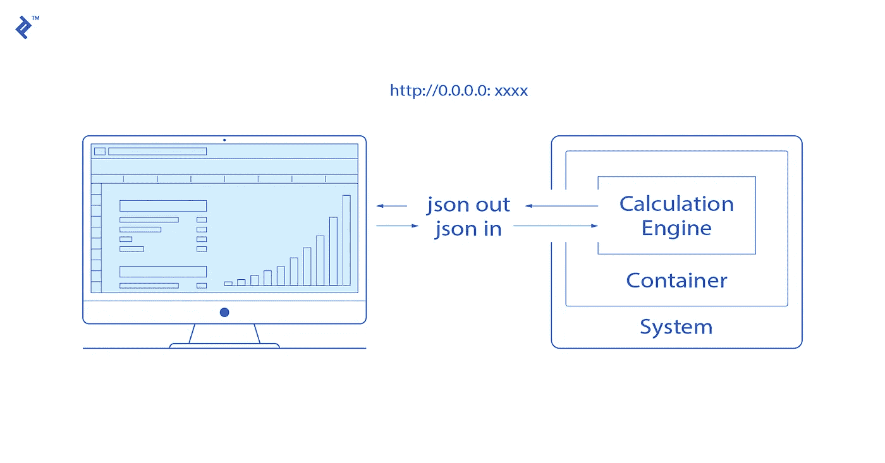
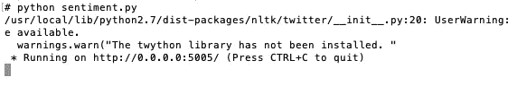
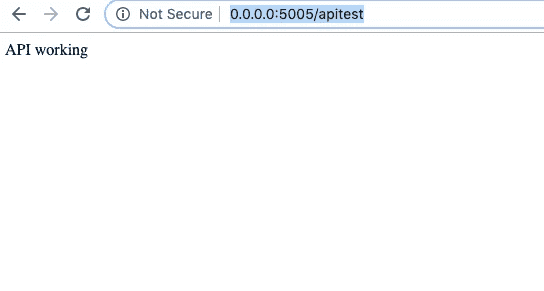

# 大规模部署 ML 模型

> 原文：<https://towardsdatascience.com/deploy-ml-models-at-scale-151204549f41?source=collection_archive---------6----------------------->

## 第 1 部分:ML 模型的 API 服务



ML Model Deployment ([Source](https://www.toptal.com/python/python-machine-learning-flask-example))

让我们假设您已经构建了一个 ML 模型，并且您对它的性能感到满意。然后下一步是将模型部署到生产中。在这个博客系列中，我将介绍如何使用 AWS 和 docker 容器服务在可扩展的基础设施中部署大规模消费模型。

在这篇博客中，我将从构建 ML 模型的 API 框架的第一步开始，并在您的本地机器上运行它。出于这篇博客的目的，让我们考虑在这里建立[的情感分类模型。为了部署该模型，我们将遵循以下步骤:](/sentiment-analysis-for-text-with-deep-learning-2f0a0c6472b5)

1.  将模型转换成 ***.hdf5*** 文件或 ***。pkl*** 文件
2.  实现 Flask API
3.  运行 API

## 将模型转换成" ***.hdf5"*** 文件或'。“pkl”文件

如果模型是基于 sklearn 构建的，最好将其保存为。“pkl”文件。或者，如果它是深度学习模型，那么建议将模型保存为“HDF”文件。'之间的主要区别。pkl '和'。“hdf”是，pickle 需要大量的内存来保存数据结构到磁盘，而 HDF 是为了有效地存储大型数据集而设计的。

**将模型保存在泡菜中(。pkl):**

```
from sklearn.externals import joblib  *# Save to file*# Fit the model (example of a model in sklearn)
model = LogisticRegression()
model.fit(X_train, Y_train)#*working directory* joblib_file = "best_model.pkl"   
joblib.dump(model, joblib_file)
```

**在 HDF 保存模型(. hdf5):**

一旦在 keras 或 tensorflow 中训练了深度学习模型，就可以使用. hdf5 文件系统保存模型架构及其权重。

```
# save the best model and early stoppingsaveBestModel = keras.callbacks.ModelCheckpoint('/best_model.hdf5', monitor='val_acc', verbose=0, save_best_only=True, save_weights_only=False, mode='auto', period=1)
```

## 实现 Flask API

**步骤 1:** 根据文件类型，通过以下方法之一加载保存的模型(根据上一节)，即“hdf5”或“pkl”。

**HDF5:**

```
from keras.models import load_model
import h5py
prd_model = load_model('best_model.hdf5')
```

PKL:

```
from sklearn.externals import joblib
loaded_model = joblib.load('best_model.pkl')
```

**第二步:**导入 flask，创建 flask 应用对象，如下图所示:

```
from flask import Flask, url_for, requestapp = Flask(__name__)
```

**步骤 3:** 下一步是构建一个测试 API 函数，它返回“ *API working”字符串。*这可以用来确保 API 在生产中部署时的健康。这里我们使用' @app.route '，这是一个 python 装饰器(*装饰器是一个函数，它接受另一个函数并扩展后一个函数的行为，而不显式修改它)*

```
[@app](http://twitter.com/app).route(‘/apitest')
def apitest():
    return ‘API working’
```

**步骤 4:** 下一步是构建一个“POST”请求 api，用于处理对我们的情感模型的请求。我们使用的是路径名“/情绪”。该函数读取 json 输入并将其转换为 pandas 数据帧。它从 json 中提取相关字段，并调用“get _ opinion _ DL”函数进行处理。“get _ opinion _ DL”函数包含已通过“hdf5”文件加载的训练模型。它最终将以 json result 的形式返回模型的结果。

```
# main API code
[@app](http://twitter.com/app).route(‘/sentiment’, methods=[‘POST’])
def sentiment():
   if request.method == ‘POST’:
   text_data = pd.DataFrame(request.json)
   text_out = get_sentiment_DL(prd_model, text_data, word_idx)

   text_out = text_out[[‘ref’,’Sentiment_Score’]] #Convert df to dict and then to Json
   text_out_dict = text_out.to_dict(orient=’records’)
   text_out_json = json.dumps(text_out_dict, ensure_ascii=False) return text_out_json
```

**第五步**:详细的模型处理步骤将由“get _ sensation _ DL”函数执行。在我们的深度学习情感模型中，我们通过了:

1.  best_model:加载的模型

2.text_data:用于情感分类的输入文本

3.word_idx:手套文件中的 word 索引(型号详情[此处](/sentiment-analysis-for-text-with-deep-learning-2f0a0c6472b5))。

```
def get_sentiment_DL(best_model, text_data, word_idx):'''Modle Processing''' return sentiment_score
```

**第 6 步:**添加下面的部分来运行应用程序。这里**主机**被设置为“0.0.0.0 ”,因为我们在本地服务器上托管。但是，您可以根据您的网络设置对其进行配置。**调试**可以在构建 API 功能时设置为真。**端口**设置为 5005，但是这可以根据您的要求进行配置。

```
if __name__ == “__main__”:
  app.run(host=”0.0.0.0", debug=False, port=5005)
```

## 运行 API

要运行 API，请打开命令行窗口并转到存储代码的目录。通过运行下面的命令*来运行 python 脚本(“情绪. py”是上面的 API 实现的文件名)。*

```
python sentiment.py
```

运行上述命令时，您将能够在命令行窗口中看到以下结果:



API 运行后，您可以在浏览器中输入“0.0.0.0:5005/apitest”来测试 API。你将会在你的浏览器中得到下面的结果。



Browser — API Test

现在，您可以使用 python 将任何数据传递给 API，如下所示。我们这里的地址是“[http://0 . 0 . 0 . 0:5005/情操](https://www.seelabs.app/face_rec_train')”。模型的结果将被返回并存储在“响应”字段中。

```
import requests
import json
import urllib.parsedata_json = '''{"ref":[1], "text":["I am well"]}'''head= {“Content-type”: “application/json”}response = requests.post(‘[http://0.0.0.0:5005/sentiment'](https://www.seelabs.app/face_rec_train'), json = data_json, headers = head)result = response.content.decode(‘utf8’)
```

## 结论

总之，我们已经介绍了将模型部署到本地计算机的 api 服务中的步骤。

下一步是将它作为微服务部署在云服务器中。在接下来的博客中，我将介绍 docker 等容器服务的使用，并在 AWS 中部署它。