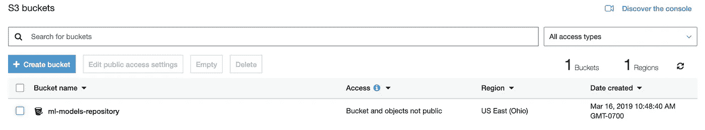

# 在 Kubernetes 上使用 Istio 部署 TensorFlow 模型

> 原文：<https://towardsdatascience.com/deploy-tensorflow-models-with-istio-on-kubernetes-dd0b2bd3e388?source=collection_archive---------10----------------------->


部署、版本控制、扩展和监控的典型云应用需求也是机器学习(ML)服务的常见运营挑战。

这篇文章将关注于构建一个 ML *服务基础设施*来持续更新、版本化和部署模型。

# 基础设施堆栈

在构建我们的 ML 服务基础设施时，我们将在云环境中设置一个 Kubernetes 集群，并利用 Istio 来处理服务级别操作。接下来，我们将使用 TensorFlow Serving 来部署和服务托管在 S3 存储桶上的 ResNet 模型。最后，我们将看看如何执行新模型版本的阶段性 canary 部署，并最终使用 Flagger 自动化部署过程。

概括地说，我们的基础架构包括:

*   [**Kubernetes**](https://kubernetes.io/) :面向应用基础设施和管理的开源容器编排系统。
*   [**Istio**](https://istio.io/) :开源“service-mesh”实现分布式环境下微服务的运营管理。
*   [**tensor flow Serving**](https://www.tensorflow.org/tfx/guide/serving):开源的高性能 ML 模型服务系统。
*   [**S3 存储**](https://aws.amazon.com/s3/) : AWS 云对象存储。
*   [**Flagger**](https://docs.flagger.app/) :作为 Kubernetes 操作员的开源自动化金丝雀部署管理器。

# 库伯内特星团

Kubernetes 在重塑云基础架构格局方面创造了奇迹。多种环境都支持构建集群，几乎所有主要的云提供商都提供托管 Kubernetes 作为托管解决方案。

在这篇文章中，我们将借此机会测试一个最新的解决方案，DigitalOcean 的托管 Kubernetes 解决方案。首先在选定的数据中心和节点池配置上创建一个新的 [DigitalOcean Kubernetes](https://www.digitalocean.com/docs/kubernetes/quickstart/) 集群。


下载配置文件并将其添加到 bash 会话中。

```
export KUBECONFIG=k8s-1-13-5-do-1-sfo2-1555861262145-kubeconfig.yaml
```

检查节点的状态，并验证它是否运行正常，是否准备好接受工作负载。

```
kubectl get nodesNAME                                        STATUS    ROLES     AGE       VERSIONk8s-1-13-5-do-1-sfo2-1555861262145-1-msa8   Ready     <none>    57s       v1.13.5
```

# 伊斯迪奥

Istio 是一个开源的“服务网格”,它将自己透明地分层到现有的分布式基础设施上。

“服务网格”是相互连接的服务相互交互的抽象。这种抽象有助于降低分布式环境中管理应用程序的连接性、安全性和可观察性的复杂性。

Istio 通过提供一个完整的解决方案来帮助解决这些问题，该解决方案对“网格”内的连接服务进行洞察和操作控制。Istio 的一些核心功能包括:

*   HTTP、gRPC、TCP 连接上的负载平衡
*   具有路由、重试和故障转移功能的流量管理控制
*   包括度量、跟踪和可观察性组件的监控基础架构
*   端到端 TLS 安全性

在现有的 Kubernetes 集群上安装 Istio 非常简单。关于安装指南，看看 [@nethminiromina](https://medium.com/@nethminiromina) 的这篇精彩帖子:

[](https://medium.com/devopslinks/istio-step-by-step-part-02-getting-started-with-istio-c24ed8137741) [## Istio 分步指南第 2 部分—开始使用 Istio

### 嗨！欢迎来到我的 Istio 循序渐进教程系列。通过这个教程，我会告诉你如何安装 Istio 在…

medium.com](https://medium.com/devopslinks/istio-step-by-step-part-02-getting-started-with-istio-c24ed8137741) 

从下载的 Istio 包目录创建自定义资源定义(CRD ):

```
kubectl apply -f install/kubernetes/helm/istio/templates/crds.yaml
```

接下来，从打包的“一体化”清单中将 Istio 运营商资源部署到集群:

```
kubectl apply -f install/kubernetes/istio-demo.yaml
```

部署完成后，我们应该会在`istio-system`名称空间中看到以下服务列表:


确保所有吊舱都处于`Running`状态，并且上述服务可用。根据安装设置，启用对`default`名称空间的侧车注入:

```
kubectl label namespace default istio-injection=enabled --overwrite
```

## **Istio 交通管理**

Istio 提供简单的规则和流量路由配置来设置服务级别属性，如断路器、超时和重试，以及部署级别任务，如 A/B 测试、canary 部署和分阶段部署。

Istio 交通管理的核心是[飞行员](https://istio.io/docs/concepts/what-is-istio/#pilot)和[特使](https://istio.io/docs/concepts/what-is-istio/#envoy)。Pilot 是管理服务发现和所有服务之间的智能流量路由的中心运营商，它通过翻译高级路由规则并将它们传播到必要的特使侧车代理。


Envoy 是一个高性能代理，用于协调网格中服务的所有入站和出站流量。它被部署为一个侧车集装箱，所有 Kubernetes 豆荚都在网格内。Envoy 的一些内置功能包括:

*   服务发现
*   负载平衡
*   HTTP 和 gRPC 代理
*   基于%流量分割的分阶段部署
*   丰富的指标
*   TLS 终端、断路器、故障注入等等！

我们将使用 Istio 的流量管理和遥测功能在我们的集群中部署、服务和监控 ML 模型。

## 出口和入口

Istio 通过简单的规则配置将流量管理从基础设施中分离出来，以管理和控制服务之间的流量。


为了让流量流入和流出我们的“网格”,我们必须设置以下 Istio 配置资源:

*   `Gateway`:在“网格”边缘运行的负载均衡器，处理传入或传出的 HTTP/TCP 连接。
*   `VirtualService`:管理“网格”内 Kubernetes 服务之间流量路由的配置。
*   `DestinationRule`:路由后服务的策略定义。
*   `ServiceEntry`:内部服务配置附加条目；可以为内部或外部端点指定。

**配置出口**

默认情况下，支持 Istio 的应用程序无法访问集群外部的 URL。由于我们将使用 S3 存储桶来托管我们的 ML 模型，我们需要设置一个 [ServiceEntry](https://istio.io/docs/reference/config/networking/v1alpha3/service-entry/) 来允许从我们的 Tensorflow 服务部署到 S3 端点的出站流量:

创建`ServiceEntry`规则以允许出站流量通过定义的端口到达 S3 端点:

```
kubectl apply -f resnet_egress.yamlserviceentry "aws-s3" created
```

**配置入口**

为了允许传入流量进入我们的“网格”，我们需要[设置一个入口](https://istio.io/docs/tasks/traffic-management/ingress/#configuring-ingress-using-an-istio-gateway) `[Gateway](https://istio.io/docs/tasks/traffic-management/ingress/#configuring-ingress-using-an-istio-gateway)`。我们的`Gateway`将通过公开端口`31400`接收流量来充当负载平衡代理:

通过指定标签选择器`istio=ingressgateway`使用 Istio 默认控制器，这样我们的入口网关 Pod 将是接收该网关配置并最终公开端口的设备。

创建我们上面定义的`Gateway`资源:

```
kubectl apply -f resnet_gateway.yamlgateway "resnet-serving-gateway" created
```

# 张量流服务

Tensorflow 服务提供灵活的 ML 服务架构，旨在为 gRPC/REST 端点上的 ML 模型提供服务。

在这篇文章中，我们将使用一个预先训练好的、导出的 [ResNet 模型](https://github.com/tensorflow/models/tree/master/official/resnet#pre-trained-model)作为我们在服务基础设施上部署的例子。

## S3 模型库

为了访问 ML 模型，Tensorflow Serving 将任意文件系统路径的*加载器*抽象为接口，并提供 GCS 和 S3 云存储文件系统的开箱即用实现。

使用 [AWS 控制台](https://s3.console.aws.amazon.com/s3/home)创建`ml-models-repository` S3 桶，在桶上设置 IAM 用户和角色。



将*NHWC*模型架构上传到`ml-models-repository`桶中，目录结构如下:

```
resnet/  
  1/
    saved_model.pb
    variables/
      variables.data-00000-of-00001
      variables.index
```

为了安全地从我们的桶中读取，使用 S3 访问凭证创建一个 Kubernetes 秘密:

```
kubectl create secret generic s3-storage-creds \
  --from-literal=access_id=$AWS_ACCESS_KEY_ID \
  --from-literal=access_key=$AWS_SECRET_ACCESS_KEYsecret "s3-storage-creds" created
```

## Kubernetes 部署

以下清单将 Tensorflow 定义为 Kubernetes `Deployment`，以`Service`为前端，以公开服务器的 gRPC 和 REST 端点:

上面清单定义中的一些要点需要注意:

*   展开有两个标签`app=resnet-serving`和`version=v1`。
*   该服务选择并公开 gRPC 端口`9000`和 REST 端口`9001`的`app=resnet-serving`标签上的部署。
*   ConfigMap 中的`model_config_list` [protobuf](https://github.com/tensorflow/serving/blob/master/tensorflow_serving/config/model_server_config.proto#L19) 可用于定义模型路径和版本策略；在我们的例子中，我们已经将模型固定在版本`1`上进行加载。

将 Tensorflow 服务资源部署到集群中:

```
kubectl apply -f resnet_serving_v1.yamldeployment "resnet-serving" created
service "resnet-serving" created
configmap "tf-serving-models-config" created NAME                              READY     STATUS    RESTARTS   AGE
resnet-serving-65b954c449-6s8kc   2/2       Running   0          11s
```

正如所料，Pod 应显示有两个集装箱在其中运行，主`tensorflow-serving`集装箱和`istio-proxy`侧车。

检查 Pod 中的`tensorflow-serving`容器日志，以验证服务器正在运行，并且已经成功加载了从我们的 S3 存储库中指定的模型:

```
kubectl logs resnet-serving-65b954c449-6s8kc -c tensorflow-serving2019-03-30 22:31:23.741392: I external/org_tensorflow/tensorflow/contrib/session_bundle/bundle_shim.cc:363] **Attempting to load native SavedModelBundle in bundle-shim from: s3://ml-models-repository/resnet/1**2019-03-30 22:31:23.741528: I external/org_tensorflow/tensorflow/cc/saved_model/reader.cc:31] **Reading SavedModel from: s3://ml-models-repository/resnet/1**2019-03-30 22:31:33.864215: I external/org_tensorflow/tensorflow/cc/saved_model/loader.cc:285] **SavedModel load for tags { serve }; Status: success. Took 10122668 microseconds.**2019-03-30 22:31:37.616382: I tensorflow_serving/core/loader_harness.cc:86] **Successfully loaded servable version {name: resnet version: 1}**2019-03-30 22:31:37.622848: I tensorflow_serving/model_servers/server.cc:313] **Running gRPC ModelServer at 0.0.0.0:9000 ...**2019-03-30 22:31:37.626888: I tensorflow_serving/model_servers/server.cc:333] **Exporting HTTP/REST API at:localhost:9001 ...**
```

> Tensorflow 服务中 S3 客户端的[错误导致大量垃圾警告日志。这可以通过设置`*TF_CPP_MIN_LOG_LEVEL=3*`环境变量来关闭。](https://github.com/tensorflow/serving/issues/789)

# 模型部署和 Canary 推广

到目前为止，我们已经用 Kubernetes、Istio 和 Tensorflow 服务建立了我们的基础设施。现在，我们可以开始对我们的模型进行版本控制，设置到指定部署的路由，然后利用 Istio 的流量分割规则执行模型服务器部署的阶段性 canary 部署。


## 设置 V1 路由

我们需要设置流量规则，以便`Gateway`在接收请求时知道路由到什么服务。

该规则由一个`VirtualService`定义，它允许路由到目的地“网状”服务，而无需了解基础设施中的底层部署。下面的`VirtualService`连接到我们之前定义的`Gateway`上，将 100%的流量路由到端口`9000.`上`v1`子集的`resnet-serving`。`DestinationRule`资源用于定义`VirtualService`的路由策略。

应用以下`VirtualService`和`DestinationRule`清单:

```
kubectl apply -f resnet_v1_routing.yamlvirtualservice "resnet-serving" created
destinationrule "resnet-serving" created
```

在这篇文章中，我们没有公开任何公共负载平衡器或者在我们的集群上设置 TLS。因此，目前可以在端口转发网关端口上发送测试流量:

```
kubectl -n istio-system port-forward istio-ingressgateway-5b64fffc9f-xh9lg 31400:31400Forwarding from 127.0.0.1:31400 -> 31400
```

使用以下 Tensorflow 服务 [python gRPC 客户端](https://gist.github.com/masroorhasan/5db291a6d1f7651758600873bc09ad37)对输入图像进行预测请求:

```
python tf_serving_client.py --port=31400 --image=images/001.jpgname: "resnet"
version {
  value: 1
}
signature_name: "serving_default"dtype: DT_INT64
tensor_shape {
  dim {
    size: 1
  }
}
int64_val: 228
```

运行一个小负载测试，并在 Istio Mesh Grafana dashboard 上观察 p50、p90 和 p99 服务器端延迟:


这种延迟时间非常糟糕，原因有几个:

*   (相对)低计算配置文件—每个节点 2 个 CPU。
*   Vanilla Tensorflow 服务二进制文件未针对底层 CPU 平台进行优化。

在我们的 [Mux 工程博客](https://mux.com/blog/)的以下帖子中，解释了构建 CPU 优化 Tensorflow 服务二进制的技术，以及针对延迟/吞吐量的性能调整。

[](https://mux.com/blog/tuning-performance-of-tensorflow-serving-pipeline/) [## 我们如何将 Tensorflow 服务性能提高 70%以上

### Tensorflow 已经发展成为事实上的 ML 平台，在行业和研究领域都很受欢迎。需求和支持…

mux.com](https://mux.com/blog/tuning-performance-of-tensorflow-serving-pipeline/) 

## 模型部署 V2

比方说，我们的`v1`模型表现不佳，我们希望部署新的模型版本以及优化的 TensorFlow 服务二进制文件。对模型部署的更改应该始终以迭代的方式进行，以便新模型的行为和性能可以在作为 GA 推广到所有客户端之前得到适当的测试和验证。

我们的新模型部署将使用新的`Resnet-50 v2`模型和更新的 CPU 优化 Tensorflow 服务映像。

将`ResNet-50 v2` [保存的模型](https://github.com/tensorflow/models/tree/master/official/resnet#pre-trained-model)上传到`resnet/2/`路径下的 S3 桶中，目录层次与之前相同。然后，创建一个新的部署和配置图，它将加载并提供`resent`模型的`2`版本。

与以前的清单相比，更改如下:

```
diff --git a/tf_serving.yaml b/tf_serving_v2.yaml
index 90d133d..05047a3 100644
**--- a/tf_serving.yaml
+++ b/tf_serving_v2.yaml**@@ -1,10 +1,10 @@
apiVersion: extensions/v1beta1
kind: Deployment
metadata:
**-  name: resnet-serving
+  name: resnet-serving-v2**
@@ -13,7 +13,7 @@ spec:
   metadata:
     labels:
       app: resnet-serving
**-        version: v1
+        version: v2** spec:
      containers:
       - name: tensorflow-serving
**-        image: tensorflow/serving:latest
+        image: masroorhasan/tensorflow-serving:cpu**@@ -55,32 +55,15 @@ spec:
       volumes:
       - name: tf-serving-models-config
         configMap:
**-          name: tf-serving-models-config
+          name: tf-serving-models-config-v2**
___
apiVersion: v1
kind: ConfigMap
metadata:
**-  name: tf-serving-models-config
+  name: tf-serving-models-config-v2**
@@ -90,19 +73,8 @@ data:
         model_platform: "tensorflow",
         model_version_policy: {
           specific: {
**-            versions: 1
+            versions: 2**
```

在这里可以找到`v2`部署和配置图的完整清单[。这里需要注意一些重要部分:](https://gist.github.com/masroorhasan/664948b1521df2a59f92833b776851ce)

*   新部署更新了版本标签`version=v2`。
*   更新 Docker 镜像`masroorhasan/tensorflow-serving:cpu` 是预建的 CPU 优化二进制。
*   ConfigMap 还与新版本策略相冲突，以专门获取模型的版本`2`。

将部署应用到群集:

```
kubectl apply -f resnet_serving_v2.yamldeployment "resnet-serving-v2" created
configmap "tf-serving-models-config-v2" created
```

请注意，我们不需要更新`resnet-serving`服务，它在标签选择器`app=resnet-serving`上位于两个部署的前面。

## 设置 V2 金丝雀路由

现在我们已经有了新的模型部署，我们希望逐步向一部分用户推广它。

这可以通过更新我们的`VirtualService`来实现，将一小部分流量路由到`v2`子集。

我们将保持谨慎，更新我们的`VirtualService`以将 30%的传入请求路由到`v2`模型部署:

```
kubectl replace -f resnet_v2_canary.yamlvirtualservice "resnet-serving" replaced
destinationrule "resnet-serving" replaced
```

运行另一个负载测试，观察 Istio Mesh 仪表板，了解两个版本的`resnet-serving`工作负载的延迟指标。


按目的地划分的请求显示了类似的模式，流量在`resnet-serving`和`resnet-serving-v2`部署之间分流。


## 设置 V2 路由

一旦 canary 版本满足模型行为和性能阈值，部署就可以升级为面向所有用户的 GA。下面的`VirtualService`和`DestinationRule`被配置为将 100%的流量路由到我们的模型部署的`v2`。

更新路由规则，以将`v2`提升为所有传入流量的 GA:

```
kubectl replace -f resnet_v2_routing.yamlvirtualservice "resnet-serving" replaced
destinationrule "resnet-serving" replaced
```

当一个负载测试正在运行时，网格仪表板将显示流量完全从`v1`转移，而是流入我们部署的`v2`。


# 自动化金丝雀释放

到目前为止，我们已经对集群监控的模型性能进行了新模型版本的逐步、分阶段部署。然而，手动更新流量规则不符合操作可扩展性的精神。

Istio 流量路由配置可用于通过编程调整下游服务版本之间流量的相对权重来执行 canary 发布。在本节中，我们将使用 Weaveworks 的开源渐进式金丝雀部署工具来自动化金丝雀部署: [Flagger](https://docs.flagger.app/) 。

Flagger 是一家 Kubernetes 运营商，它使用 Istio 和 App Mesh 流量路由功能，基于自定义的 Prometheus 指标，自动迭代部署和推广 canary 版本。


让我们克隆 Flagger 存储库并创建服务帐户、CRD 和 Flagger 操作员:

```
git clone git@github.com:weaveworks/flagger.git
```

按照以下顺序创建服务帐户、CRDs 和操作员:

```
# service accounts
kubectl apply -f flagger/artifacts/flagger/account.yaml# CRD
kubectl apply -f flagger/artifacts/flagger/crd.yaml# Deployment
kubectl apply -f flagger/artifacts/flagger/deployment.yaml
```

应该在`istio-system`名称空间中创建 Flagger 部署。这是将对标有`kind: Canary`的客户资源进行操作的主要操作员。

Flagger 采用了 Kubernetes 部署，如`resnet-serving`，并创建了一系列资源，包括 Kubernetes 部署(初级 vs 金丝雀)、`ClusterIP`服务和 Istio 虚拟服务。

由于大量手动流量路由服务将由 Flagger 运营商负责，我们需要清理之前 Istio 流量路由相关资源和`v2`服务部署的集群。

```
# clean up routing
kubectl delete -f resnet_v1_routing.yaml
kubectl delete -f resnet_serving_v2.yaml
kubectl delete -f resnet_v2_routing.yaml# clean up svc
kubectl delete svc/resnet-serving
```

定义一个将引用我们的`resnet-serving`模型部署的 Flagger Canary 定制资源:

应用清单来创建 Canary 资源:

```
kubectl apply -f flagger_canary.yamlcanary "resnet-serving" created
```

如上所述，这将在创建一系列 Kubernetes 资源的同时初始化金丝雀。


要触发自动 canary 升级，请通过更新容器映像来触发部署:

```
kubectl set image deployment/resnet-serving \
  tensorflow-serving=masroorhasan/tensorflow-serving:cpu
```

此时，Flagger 操作员将检测到部署修订中的更改，并对新的部署进行排队:


当 canary 部署升级为 GA 时，Flagger 将自动缩减旧部署。在部署期间应用对部署的更改将触发 Flagger 重新开始分析和重新部署。

# 包扎

在这篇文章中，我们通过在 Kubernetes 基础设施上部署 TensorFlow 服务来构建一个 ML 服务环境。然后，我们利用 Istio 的智能流量路由功能，以分阶段部署的方式管理模型部署。最后，我们在集群上部署了 Flagger operator，以自动化分阶段部署 canary 的过程。

虽然我们选择关注 ML 模型的*服务*方面，但是有许多框架和工具可以帮助整合端到端的 ML 管道。其中一些包括(除其他外):

*   [Kubeflow](http://kubeflow.org/) :在 Kubernetes 上提供内聚培训和服务基础设施的工具和框架的集合。
*   [SeldonCore](https://www.seldon.io/) :提供一个运行时 ML 图形引擎来管理 Kubernetes 上的服务 ML 模型。
*   Clipper :一个预测服务系统，供数据科学家在 Docker-only 或 Kubernetes 环境中使用。
*   [Pipeline.ai](https://pipeline.ai/) :汇集了许多流行的开源工具来构建、实验端到端的机器学习管道。
*   云 ML 服务: [Google ML 引擎](https://cloud.google.com/ml-engine/\)、 [AWS SageMaker](https://docs.aws.amazon.com/sagemaker/latest/dg/how-it-works-mlconcepts.html) 和 [Azure ML 服务](https://azure.microsoft.com/en-us/services/machine-learning-service/)

感谢您的阅读，我希望这篇文章有助于在 Kubernetes 上构建 TensorFlow 模型部署。我很想听听你对 ML 服务基础设施的设置——请随意联系 Twitter。感谢阅读！

**参考文献**

[](https://www.digitalocean.com/products/kubernetes/) [## 数字海洋上的 Kubernetes

### 在云中部署和管理容器工作负载的最简单方式。

www.digitalocean.com](https://www.digitalocean.com/products/kubernetes/)  [## 服务模型| TFX | TensorFlow

### TensorFlow 服务是一个灵活、高性能的机器学习模型服务系统，专为生产…

www.tensorflow.org](https://www.tensorflow.org/tfx/guide/serving) [](https://istio.io/) [## 伊斯迪奥

### 连接、保护、控制和观察服务。

istio.io](https://istio.io/) [](https://aws.amazon.com/s3/) [## 云对象存储|随处存储和检索数据|亚马逊简单存储服务

### 亚马逊简单存储服务(亚马逊 S3)是一种对象存储服务，提供行业领先的可扩展性、数据…

aws.amazon.com](https://aws.amazon.com/s3/) [](https://mux.com/blog/tuning-performance-of-tensorflow-serving-pipeline/) [## 将 Tensorflow 性能提高 70%

### Tensorflow 已经发展成为事实上的 ML 平台，在行业和研究领域都很受欢迎。需求和支持…

mux.com](https://mux.com/blog/tuning-performance-of-tensorflow-serving-pipeline/) [](https://docs.flagger.app) [## 介绍

### Flagger 是一家渐进式交付 Kubernetes 运营商

docs.flagger.app](https://docs.flagger.app)